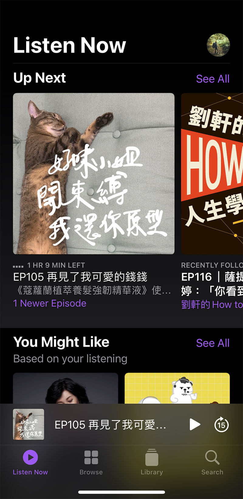
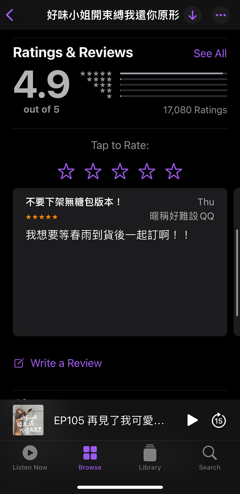
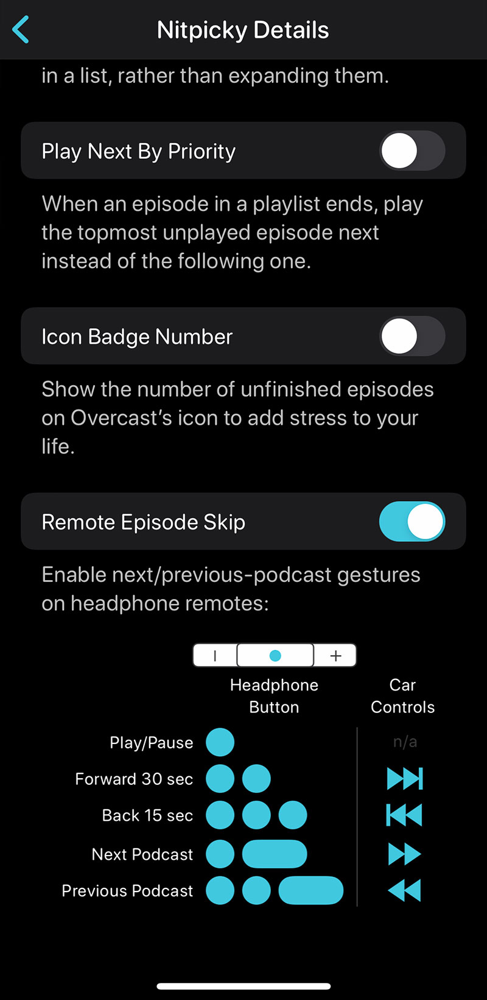

[Pocket Casts官方網站](https://www.pocketcasts.com/)



## 為什麼會開始聽podcast？

##### 學英文、不想一直滑手機

我開始收聽的podcast的時間說不上非常早，但應該可以稱得上稍微資深。

跟大多數人一樣，一開始當然都是為了學英文。哈哈哈哈。台灣好流行學英文，不管幾歲，英文永遠是很熱門的新年新希望。

我大概大約在2018年底左右，突然點開手機裡的podcast app，那時台灣的節目數量還非常稀少，幾乎沒幾個選擇，知名的代表包括現在還是榜上有名的[百靈果](https://podcasts.apple.com/tw/podcast/%E7%99%BE%E9%9D%88%E6%9E%9C-news/id1106847606)、長青樹代表[馬力歐陪你喝一杯](https://podcasts.apple.com/tw/podcast/%E9%A6%AC%E5%8A%9B%E6%AD%90%E9%99%AA%E4%BD%A0%E5%96%9D%E4%B8%80%E6%9D%AF/id1192212072)，還有由周清華主持的[科技島讀](https://podcasts.apple.com/tw/podcast/%E7%A7%91%E6%8A%80%E5%B3%B6%E8%AE%80/id1264391007)。其中科技島讀已經在2021年中時停更，另外兩者都還是非常多人收聽的知名節目。

所以當時的我大部分還是訂閱國外的節目，CNN、BBC、NPR等都有不錯的優質節目，配合上下班通勤時間，選擇比較輕巧的節目長度。會收聽podcast的原因之一也是不想要在通勤時還一直盯著螢幕，看越多越容易對資訊感到焦慮。養成習慣後，不定時就會瀏覽apple podcast有什麼新節目上架。



##### 解放雙手、陪伴感

久了之後，不只通勤，連走路、運動、煮飯、打掃等，我都習慣有podcast的陪伴。加上後來買了無線藍牙耳機，少了電線的束縛，podcast完全可以解放雙手，再進行一些不需要高專注力的事情時，還能同時吸收資訊，可以很有效的利用時間。

但我覺得收聽podcast獲得的資訊，並不會讓人對於資訊感到焦慮，不會有FOMO(Fear Of Missing Out)的感覺。Podcast更像是陪伴，在你忙碌、運動的時候，有一個聲音在旁邊，可能說一些新聞、小知識，或者純閒聊等，不專注的時候也會漏掉內容，但無傷大雅，主要是喜歡一個人做事時的陪伴感。



如果是iphone使用者，可能podcast入門的app都是內建的apple podcast，我一開始也是。後來接觸到overcast後，發現跳過空白時間、語速設定等功能對於收聽體驗有很大的加分後，便積極往外尋找更接近我需求的app，試用過幾個app之後，目前穩定使用pocketcasts這個軟體，我覺得非常好用！



以下就以我使用的順序做簡單的介紹與比較。



## Apple Podcast
[App Store 連結](https://apps.apple.com/tw/app/apple-podcasts/id525463029)

首先是幾乎所有人的入門選擇：apple podcast。

| 優點                                   | 缺點                                                                    |
| :------------------------------------- | :---------------------------------------------------------------------- |
| 1. iOS內建                             | 1. 語速調整只有0.5/1/1.25/1.5/2選擇                                     |
| 2. 有排行榜，方便發掘新節目            | 2. 無法設定開頭或片尾固定跳過時間                                       |
| 3. 留言評論                            | 3. 介面有點混亂                                                         |
| 4. 分享方便，幾乎人人都有apple podcast | 4. 沒有playlist的介面，可以將單及加入下一個播放貯列，但看不到他們的順序 |
| 5. 有節目頻道和單集的排行榜            |                                                                         |







apple podcast最大的優勢就是市占率，只要是iOS的使用者，手機直接內建，是最方便的入門app。2020年左右好像有一波大改版，但至今他的介面還是有很多我看不懂的地方，例如在Library，Followed和All差異是什麼？






### 語速調整功能(X)

apple podcast有提供幾種語速，一旦選擇，就會套用到所有播放內容，但不同節目需要的設定不會完全一樣，如此一來我就得在播放到主持人語速偏快的節目時，特地拿出手機來調整語速回1倍，然後在學英文的時候調回0.5倍速，但有時候0.5倍又覺得太慢了。不夠彈性的語速調整、一鍵全適用功能也讓我很困擾。








### 無法針對節目設定首尾略過秒數(X)

有些節目的片頭和片尾會固定播放jingle，對於不是初次收聽的聽眾來說是可以忽略的片段。

以違章女生來說，片頭片尾可跳過的段落長達55秒（對不起宜農，你寫的旋律很好聽，但我不需要每次都收聽這麼完整😂 ），不能設定的話，我就得按好幾次快轉，一不小心還會跳過頭。我收聽podcast的情境通常是通勤、做家事、煮飯或者運動等雙手不太方便的時候，要為此特地空出手來調整很麻煩。



### 評論功能與排行榜(O)

這兩項應該是我唯一會打開apple podcast的理由了。傳聞podcast節目的排行與評論星星數有關，因此當聽到很愛很愛的節目時，我會特地去留言推薦，希望能提升該節目的排名與曝光。排行榜則是我挖掘新節目的重要來源，看看現在的人流行聽什麼、有什麼新節目。












## Overcast
[Overcast官網](https://overcast.fm/)
\
[App Store 連結](https://apps.apple.com/tw/app/overcast/id888422857)



| 優點                                                      | 缺點                    |
| :-------------------------------------------------------- | :---------------------- |
| 1. 智慧動態調整語速                                       | 1.太小眾啦              |
| 2. Auto Resume-暫停後回溯一點點，幫助回憶前情提要         | 2. 不能選擇是否自動下載 |
| 3. 在情況允許之下會試圖從字跟字中間的無聲段落開始繼續播放 | 3. 介面傳統             |
| 4. 有客製化播放清單的功能                                 |                         |
| 5. 可以手動加入URL                                        |                         |
| 6. 可設定耳機手勢                                         |                         |
| 7. 快轉/回轉秒數可自訂                                    |                         |
| 8. 可從其他App匯入清單                                    |                         |


離開原生apple podcast之後，第一個接觸的是overcast，才發現原來語速可以調整，而且還有自動跳過空白段落的功能！從此之後這兩個功能就變成我尋找新App的重要指標。






### (O)可針對節目調整語速

可以針對節目調整播放速度的好處難以言語，只能說用過就回不去了！

有的主持人語速偏慢，調整到1.2或1.3倍速可能都覺得剛好，而有的節目主持人本來講話速度就很快，或者節目上架時就已經調整過速度，如好味小姐，就不需要調整，有的節目雖然語速不快，但他就需要緩緩地聽才清楚。這個語速調整的功能可以針對節目調整，並不是一致適用到所有節目，apple podcast的速度只能全部適用，這樣當播到不同節目的時候，還得拿出手機個別調整，很不友善。







### (O)Auto Resume

當暫停一段時間後繼續收聽，會智慧的回溯一點點段落幫助銜接前情提要。這項功能在只是被打斷幾秒鐘的時候感受不大，但比如說節目聽到一半就抵達目的地，等活動結束後繼續播放是數個小時後的事情，此時auto resume就很有感。他回溯的時間不長，大概幾秒鐘，且會智慧的從句子或單字的空隙中間開始。簡單的幾秒鐘，就能幫助回憶早上暫停的段落，很快速地回到節目主題中。







### (O)手動加入URL

如果搜尋結果找不到節目，overcast提供很貼心的服務，只要到其他平台複製欲追蹤的節目URL就能加入追蹤清單，這很好用！因為有時候不知道什麼原因，平台可能沒有抓到節目，但已經習慣使用overcast，不想因為一、兩個節目無法收聽就換app。






### (O)客製化播放清單

我覺得這是Overcast最強大的優勢與功能，在其他app非常少見。

每個人選擇podcast的節目可能都會根據情境有所不同。可能上班上學途中想聽新聞消息，就可以把固定收聽的新聞節目加入A清單；運動的時候想聽點輕鬆無壓力的，就可以把這類節目加入B清單；或者有的父母會有給孩子聽得睡前床邊故事集，也可以製作成一個清單。只要依據當下需求選擇播放清單，就不會打亂收聽順序，也不需要一直手動調整順序。更詳細的設定可以參考以下截圖。









其他還有一些很不錯的功能，包括可以設定耳機的控制手勢，例如輕點三下可以倒轉15秒，一短一長可以跳到下個節目等，不用時時拿出手機控制非常方便。








### 放棄原因

說了這麼多好話，最後還是沒有持續使用的最大原因就是介面。overcast的介面我實在沒有很喜歡，不醜也不難用，但就是覺得不夠順眼。還有一個缺點是，只要被我加入追蹤清單的節目單集，一律會自動下載，但有時候我只是追蹤起來放，沒有打算每一集都加入待播清單，可能等到有喜歡的內容，或想轉換口味的時候才會找來聽，一種搜集資料庫、按讚的概念。

