> ##### 本篇內容：
>
> [- 工作空間和設定 Space & Profile](#工作空間和設定-space--profile)   [- 善用鍵盤快捷鍵操作更流暢](#善用鍵盤快捷鍵操作更流暢)  [- 設定連結開啟的目標工作空間](#設定連結開啟的目標工作空間)   [- 團隊資訊透明、積極接觸，造就使用者對產品的信任](#團隊資訊透明積極接觸造就使用者對產品的信任)  

2022 年 12 月，Arc 還未正式對外公開發佈的時候，我就先透過朋友邀請的方式開始使用這個新瀏覽器，至今已使用快滿一年。2023 年 7 月 25 日，Arc 正式公開，不需邀請碼，所有人都可以免費下載，但目前只有 Mac 和 iphone 版本，Windows 的版本正在努力開發中。

公司名稱很直接，就叫做[The Browser Company](http://thebrowser.company/)，致力於創造市面上最好用的瀏覽器。他們認為，人們每天花很多時間使用瀏覽器，但卻沒有人在乎它夠不夠好，因此想要創造一個滿意的產品。






說說幾個我自己很喜歡 Arc 的地方：


...

### 工作空間和設定 Space & Profile

Space 和 Profile 是 Arc 最大的特色之一，這也是轉換到 Arc 初期，最需要適應的操作習慣。可以先透過以下兩個影片，快速理解 Space 和 Profile 的功能，以及如何實際應用。




##### - 區分登入狀態、Cookies 紀錄、搜尋歷史、擴充功能

Space 可以簡單理解成工作空間，通常會搭配 Profile 一起使用（Profile 我有點不知道如何翻譯比較適合，類似設定的概念）可以將瀏覽歷史、cookies、登入狀態、搜尋紀錄、擴充功能、開啟的分頁等等分開。

比如工作上常造訪的網頁可能是公司帳號的 email、行事曆、相關頁面，不會是個人帳號的社群或 Youtube、Netflix 等頁面，透過工作空間的設定，可以將網頁清楚分開，不會在工作用的分頁中參雜個人正在看的資訊。

假如你也是分頁開很多的人，或許曾經遇過下列這個狀態：無論在工作或者個人生活中，與人討論事情，要移動到欲討論的頁面時，在分頁點來點去才找到，中間可能閃過水電費帳單查詢頁面、個人銀行帳戶、有興趣進一步了解的音樂節資訊、關注的新聞議題、內容農場文章等，雖然只有短暫不到一秒，但那個瞬間就足夠讓人認識你的其他事了。

假如我瞥見同事正在查看「月經沒來怎麼辦」的文章，我可能會覺得她是不是懷孕或是內分泌有狀況。

假如我瞥見不是很熟的朋友的電費帳單，偷看到他們的數字，覺得：哎唷他家好享受啊夏天開冷氣可以吹到三萬塊！

假如閃過一個遊行活動的相關頁面，可能會默默在心底替對方貼上一個標籤。

短暫 0.5 秒，某種程度就透露了個人的私生活。

認真說起來這也不是多嚴重的事情，只是我個人蠻在意隱私空間，這些閃爍的短暫時刻，會讓我感到有一點點不自在，如果你也是這樣的人，Space 加上 profile 的設定就很適合你。

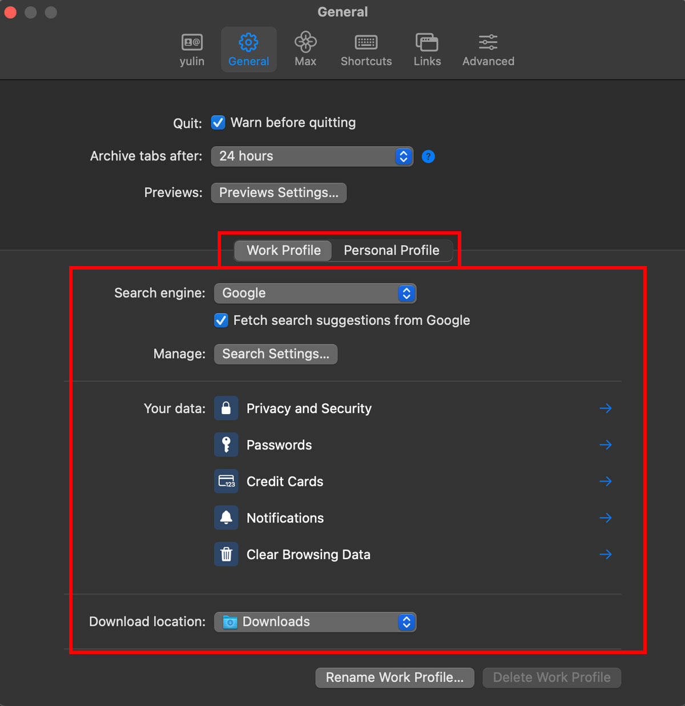



除此之外，連登入狀態、cookie、搜尋紀錄、擴充功能等也會被完整切開，再也不需要先登出再登入 email 帳號。

可以把 space 想像成一個存在於網路的個人分身：工作的我、耍廢的我、兼職的我等等。

工作時的我會做的事情、需要的工具、常瀏覽的網頁，通通集中在代表工作的我；個人生活的所有社群、影音等，通通集中在私生活的我。如果有其他面向需求，可以依興趣或技能再分出作為新手媽媽、演員、食譜、動漫、象棋等工作空間，只要在 sidebar 上以雙指左右滑動，就可以快速切換工作空間，切換角色。

比較麻煩的是每當剛建立新的工作空間時，一些通用的功能都得重複設定。像我無論在哪個工作空間，都需要螢幕截圖的擴充功能，有幾個工作空間，就得重複幾次下載同個擴充功能的動作。



##### - 客製化工作空間

除了實際功能的區分，也可以在外觀上做不同設定。

首先是為這個空間命名，並選一個代表性的 icon。下圖左下方的 icon 就是我為目前已經建立的兩個 space icon，左邊是工作用，中間青蘋果是個人空間。（右邊的點點代表我正創建中的新空間）

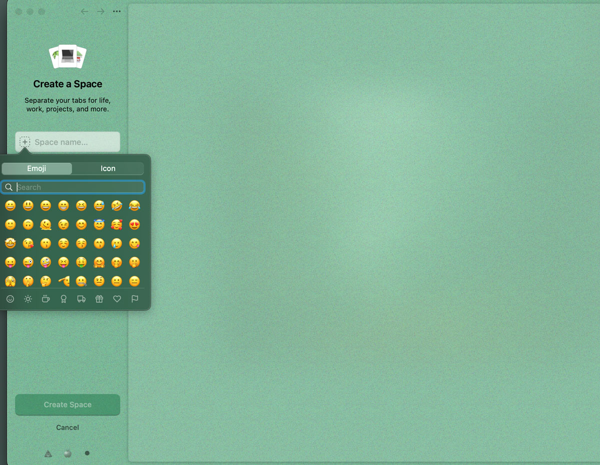

接著可以指定該空間要套用哪個 profile 設定，即登入狀態、cookies、搜尋紀錄等。

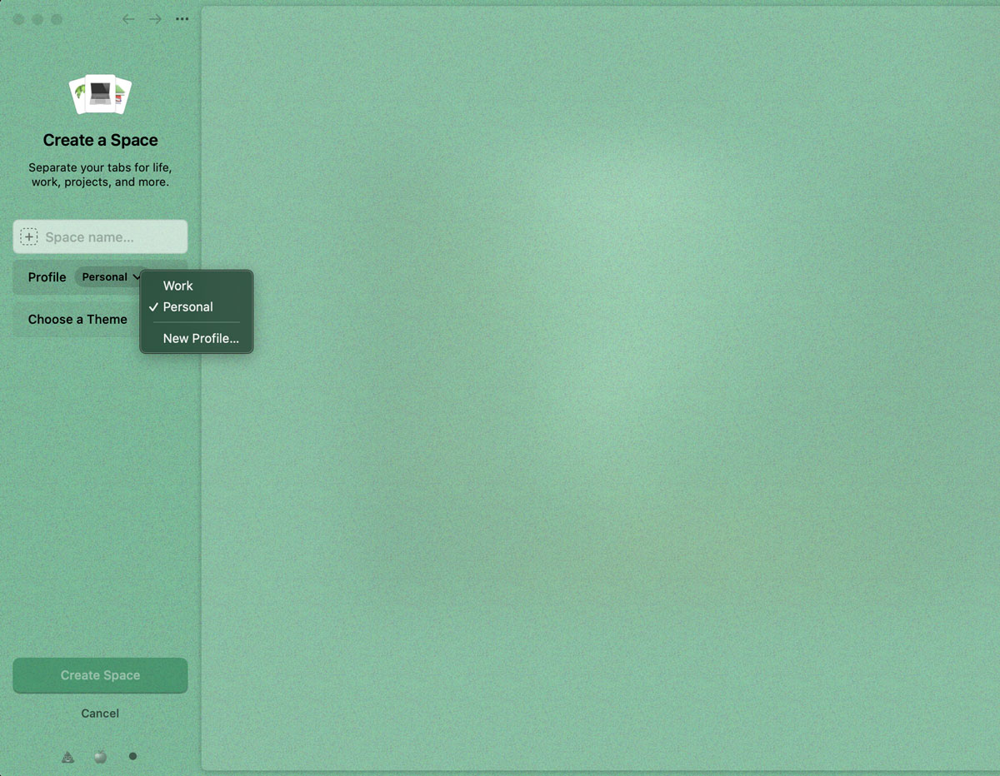

當然一定要有的是外觀，包含主題顏色、亮暗模式、色彩亮度、是否加入噪點等，可以調整自己喜歡的外觀，日後也可以在側欄 side bar 上按右鍵修改。

透過外觀的設定，在切換工作空間時，可直覺性的透過視覺更換，快速判斷目前所在的工作空間。
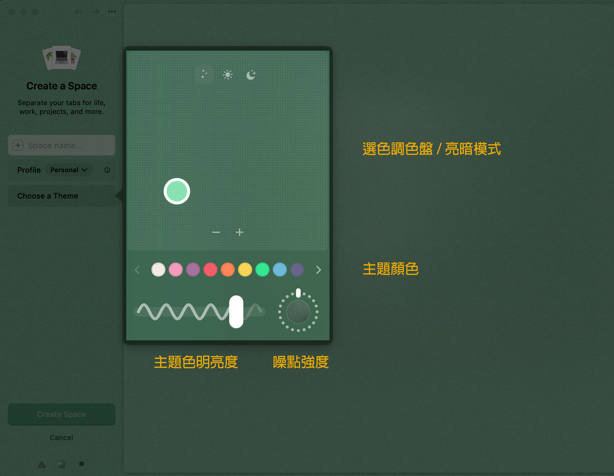



...

### 善用鍵盤快捷鍵，操作更流暢

先自首，快捷鍵這件事在其他瀏覽器也有，之前我都不知道他有這麼好用，直到使用 Arc 才開始學習，所以這並不是 Arc 獨有的。

但自從在 Arc 開始比較常使用快捷功能後，我覺得這一點對於 MacBook 操作者非常友善。Mac 的觸控板十分強大，多點控處的功能幾乎可以完成所有事情，可以不需要再外接滑鼠，我甚至可以只用觸控板操作 Photoshop，去背也沒有問題，雙手會一直在鍵盤的熱門使用範圍附近活動。



##### - Cmd+T：呼叫命令列，開新分頁、執行瀏覽器功能

當我要開新分頁，只要按下 cmd+t 就可以輸入關鍵字直接搜尋，不需要再將目光滑到視窗上方 → 找到分頁們的最尾端 → 在網址列直接輸入關鍵字，或是先抵達搜尋引擎首頁再輸入。

意思是，每次使用的分頁隊伍長度不一樣，有時很少，有時很多，「＋」的位置不會每次都在同一個地方。有點像排一場熱門活動一樣，要先找到站在尾端舉牌的工作人員。

輸入關鍵字的同時，如果有正在使用的相關分頁，或是常訪問的網頁，也會優先顯示在最上面。

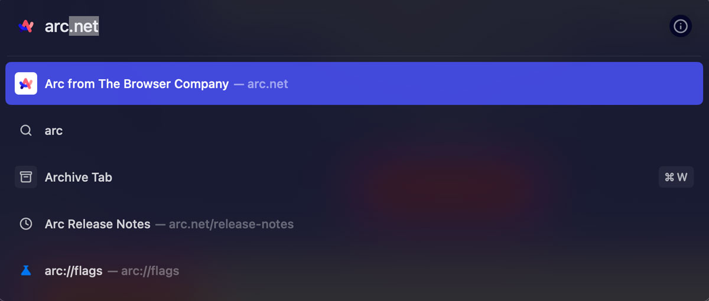


Cmd+T 的命令列不僅可以搜尋關鍵字，也可以快速執行一些瀏覽器本身的功能，也就是工具列的內容，需要稍微記一下分類路徑，詳情可以參考官方文件的[說明](https://resources.arc.net/en/articles/6586207-command-bar-actions-do-any-action-with-just-your-keyboard)

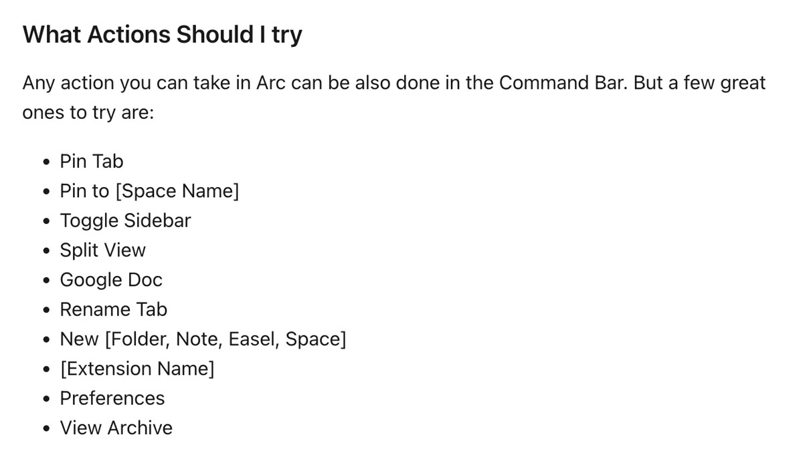



##### - Cmd+W：關閉視窗

喜歡的理由跟前一項一樣，視線不用再去找到這個分頁在分頁列的位置，再動手點掉。

我注意到身邊不少人把分頁功能都當成「稍後再看」，當下沒想看著的就暫時放著，有一天、有一刻會回去看他（但以我自己來說機率是很少啦），分頁列擁擠到看不見標題。有這個快捷鍵，就可以立刻處理，咻！掰掰。



##### - Cmd+Shift+C：複製網址

看到有趣的內容想分享給適合的朋友，游標不需要移動到網址列，無論是透過鍵盤全選後複製，或是以游標選取後按再下複製，都不需要移動游標到網址列。噢，有夠方便。這種流暢感用過一次之後就再也無法回去了。

更棒的是，很多電子信或連結會帶有 utm 追蹤碼，廣告商需要追蹤連結點擊的成效，如果使用者透過這樣的網址進入頁面，在複製網址的同時，Arc 會聰明的幫忙移除這些追蹤用的數字，給朋友的連結就會是乾乾淨淨的原始網址，也不會造成對話框出現長到不行的英數組合，形成長網址攻擊 (ﾟ Д ﾟ)< ============O))








##### - Cmd+S：可摺疊側欄 Side Bar

在轉換到 Arc 之前，我已經先從 Chrome 跳槽 Edge 一陣子，Edge 即有讓分頁列顯示在左側的選項，因此我對於這個排版不算陌生。Edge 雖然也有收合側欄的功能，但 Arc 的迷人之處就在於它的完整收合，只要按下 cmd+S 就能輕鬆開關側欄，當需要大一點的閱讀範圍，就能迅速收起。

而這個功能在具有儲存功能的網頁時，比如使用瀏覽器開啟雲端檔案，就需要多按一次才會執行，第一次的 Cmd+S 會執行文件的儲存功能，但別擔心，Arc 會在右上角貼心提醒你。

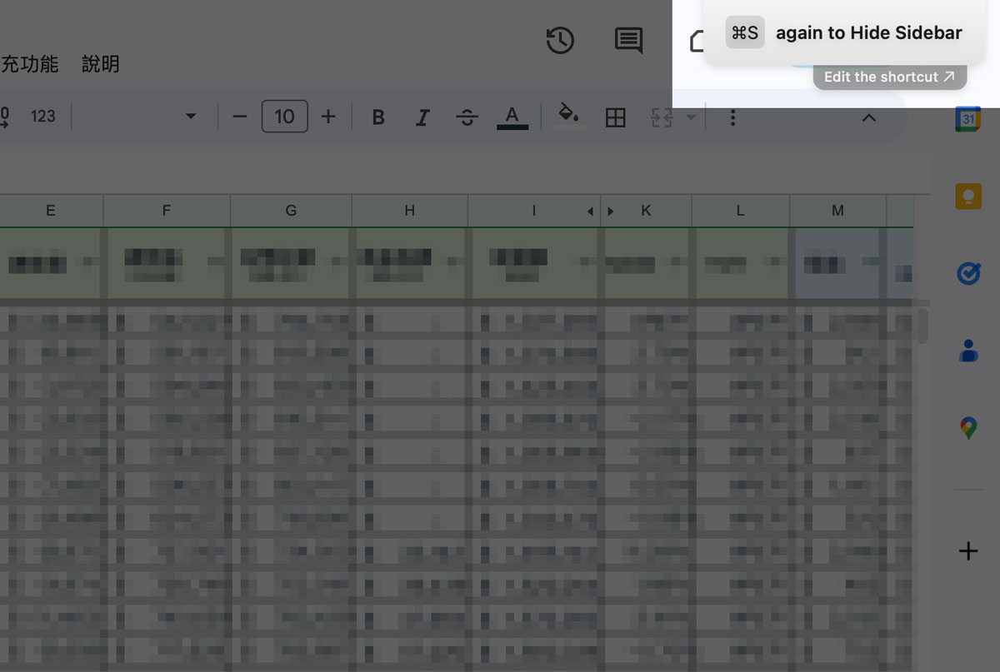



Arc 把快捷鍵使用到非常極致，除了上述我最常用的四個功能外，還有很多、很多，並且都可以改成自己習慣的手勢，若能靈活運用，在操作過程會非常流暢，好到你忘記其實是要先點這邊再按那個。

不是有人說好的體驗設計就是讓你幾乎感受不到他的存在嗎 🙂












...

### 設定連結開啟的目標工作空間

建立好工作空間和 profile 設定後，就可以指定連結開啟的空間位置，不論在哪個空間點選連結，只要網址符合設定條件，就會在指定的工作空間開啟。

當我指定網址包含 instagram、facebook、youtube、twitter 等關鍵字時，只能在 personal 的空間開啟，因為我希望將個人生活帳號與工作分開。

當我指定網址包含 meet.google.com 的時候，就在我最近使用的空間開啟。有時候會用 google meet 開工作會議，參與一些線上活動，工作和個人生活都可能用到，所以我不特別指定開啟空間。

這也很適合有內網、公司專屬空間的情況，可以設定在工作的空間開啟包含特定關鍵字的網址，減少登入或認證等動作。

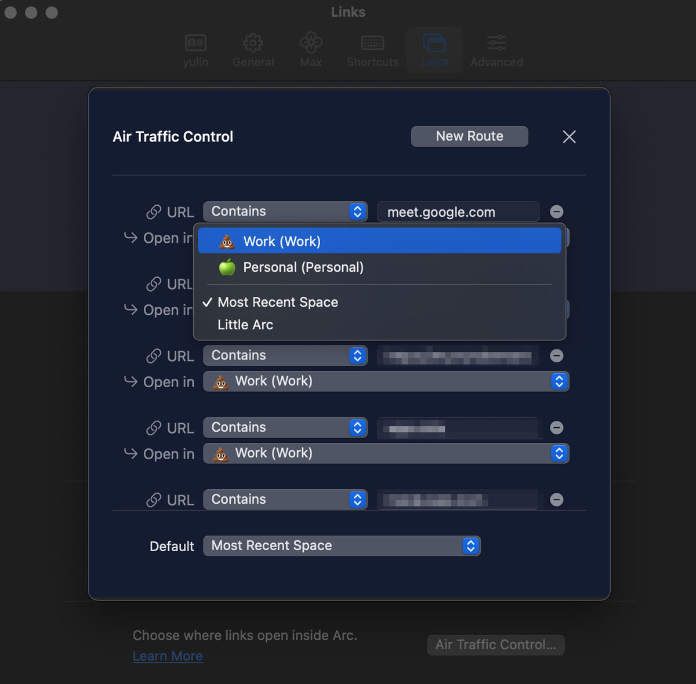



...

### 團隊資訊透明、積極接觸，造就使用者對產品的信任

除了具體功能以外，這是我個人最最最最最喜歡 Arc 的一點。



##### - 開發進度透明，連 bug 處理進度都會報告

在尚未公開的封測時期，大約每兩週會有一次小更新，隨著每一次更新，都會釋出一份更新筆記，告訴使用者這次更新的內容、開發進度等，團隊現況非常透明的讓使用者知道。

此外，開發團隊也鼓勵使用者回報 bug，每隔一段時間，就會在更新筆記裡看到「你們的意見很重要！」。

筆記最後會條列出正在處理的 bug 進度。如果比想像中棘手，也會很誠實的說明「我們碰到了一些狀況，要再請大家稍等啊」。

像是下方右側圖片，可以看到第一點的 Spring 被劃掉改成 Summer，告訴使用者改善進度比預期的晚了一些，他大可以直接刪去改寫，但卻選擇保留前一次寫下的 Spring，這麼小的細節，也保留給使用者知的權利。








##### - 積極聆聽使用者意見

在產品開發過程中，使用者的情緒反饋是最需要優先被處理的項目之一。

要改變使用者過去使用競品的習慣、接受新產品，很容易出現不愉快的摩擦，如果找不到解決方法，好不容易吸引上門試用的使用者很容易就會放棄，無論問題是否可以立即解決，情緒如果能得到紓解，就能提升使用者留下的意願，開發團隊在每一次的更新筆記中，保留很大的一塊空間給這個功能，這樣的排版可以大大提升資訊被看到的機會。






最近（2023 年 10 月），團隊邀請大家填寫一份關於「傳送或接收他人分享連結時希望有的功能」的問卷。絕對不是只有複製貼上這麼簡單！他們想得遠遠超過我認為我需要的，我想這就是一個有熱情、具挑戰精神的創新團隊，會想出來的選項吧。








##### - 積極聆聽使用者意見

更新筆記中，會由該功能的負責人署名寫下簡短的兩句話，功能教學影片也會由相關負責人親自錄製說明。看到真實角色現身，會拉近使用者與團隊的距離，也會有種熟識的感覺。讓人隔著網路也可以感受到背後確實存在著一群積極的開發者，正在為了各個功能傷腦筋。我覺得這是非常加分的小細節！

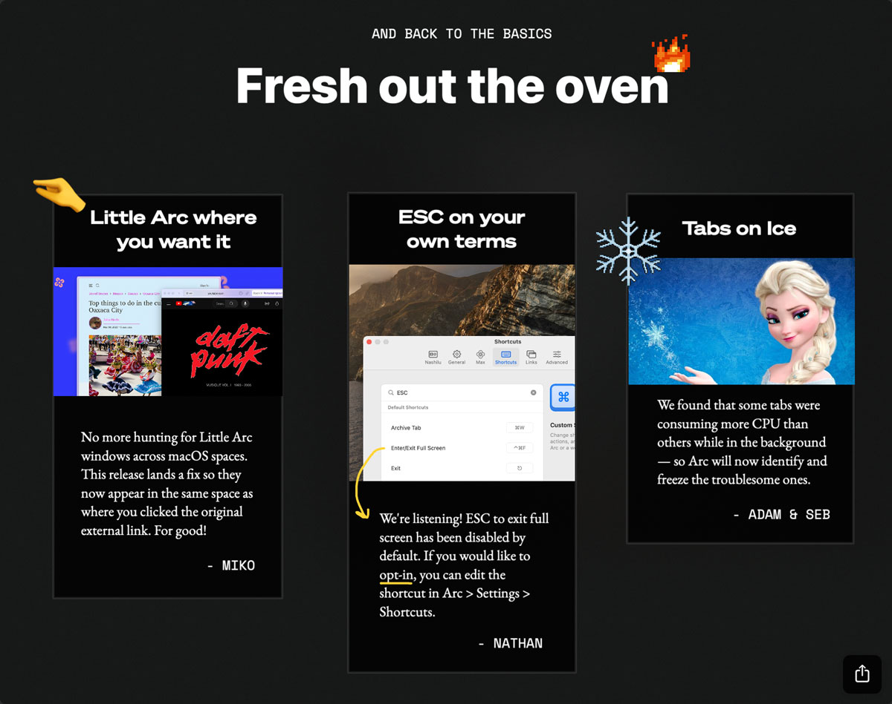



##### - 聯絡管道

使用者與團隊唯一的聯繫方式就是透過網路，依據功能別不同，團隊分別建立不同的社群管道，例如官方 youtube 頻道、公司（The Browser Company）社群、產品（Arc）社群、官網、行銷用的 tiktok 等，讓使用者知道什麼時候要去哪個管道找相關資訊。

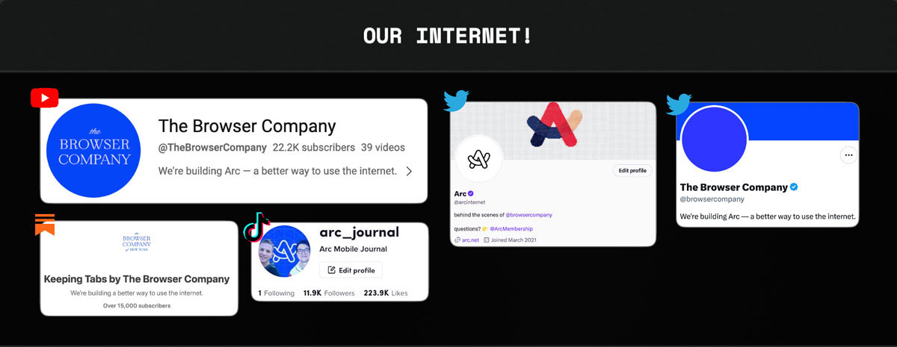



...

### Arc Max - 結合 AI 人工智慧



說到將 AI 引入瀏覽器的這版大更新，團隊也給予我意想不到的創新，不只停留於文字輸入、你問我答，他們一共替使用者想到五種加分的使用情境：

1. 游標停在搜尋結果連結上，自動產生頁面的圖文簡述
2. 將分頁移動到 pinned 區域時，智慧產生成簡短易懂的名稱
3. 有些下載檔案的檔名可能是亂碼，AI 會在下載完成的同時，將檔名自動換成有意義的文字
4. 在頁面中請 AI 給予頁面的簡述，或者問他頁面的問題——這個用法就比較像原始的 ChatGPT 操作方式，適合用在內容很長、想迅速找到答案或關鍵重點的狀況
5. 讓 ChatGPT 住進 Arc 的命令列 command bar： Cmd+T 叫出命令列，輸入 ChatGPT 並按下 Tab 鍵，可以直接在命令列輸入想問的問題，不需要先抵達 ChatGPT 的頁面。



這裡也有 Arc 於 2023 年發表大會直播上，介紹 Max 功能的影片。

順帶一提，也可以從這支影片看出團隊的創意與活潑，用新聞台一對一採訪的方式，讓負責人報告產品目前的狀態與更新。



...

以上簡短分享了我在 Arc 中最喜歡的功能，除了表面的操作功能外，還有很多效能、資源上的優勢，其他還有一些實用方便的功能，例如：

- 將瀏覽器分割成左右/上下畫面，方便比較或收集資料
- 一定時間後自動封存頁面避免分頁列過長
- 不會被封存的固定頁面
- 小視窗（little Arc）的應用
- 離開當前頁面時，正在播放的影片縮小在螢幕下方
- 客製化部分網頁的 CSS 外觀樣式，並且有分享交流的平台，可直接使用他人設定好的外觀



一般的產品公司，與市場的聲音總是有段距離，不是很確定消費者/使用者的使用感受、需求，只能透過大數據判斷（猜測？）使用者可能的想法。大家都說經營社群帳號可以更貼近消費者，除了有趣的梗圖和行銷外，好像比較少看到因為經營社群而更了解使用者在想什麼的案例。（可能也是我關注的對象不夠廣）

負責人透過文字或影像親自說明、定期寄送電子信、使用平易近人的語言（而不是宣布式般上對下的冰冷文字）、分享遇到的難關與挑戰等，種種細節讓我對團隊產生信任感，對產品感到安心，相信產品是可靠的。他們不僅想到我沒想過的可能性，如果遇上任何問題，我也知道他們會聆聽。就像是 podcast 聽久了，會覺得我跟主持人好親近好熟悉的感覺。這麼可愛認真的團隊，加上產品本身真的很不錯，好難不喜歡啊。

總之，非常推薦嘗試使用看看，部分功能確實和過去使用習慣不同，需要一段時間適應，尤其是書籤（我的最愛），因為版面規劃的關係，書籤排序可能會需要調整。不過一段時間熟悉之後，就會漸漸瞭解到這些功能的方便性。就像 iPhone 一樣，產品本身具有許多聰明的設計，我們要做的是花一些時間學習、認識，然後應用，這樣才能發揮他們的價值，也才能真正成為替我們生活加分的生產力工具。



> - Arc 是免費的喔，Arc Max 也是！一直好在意他們要怎麼賺錢 (́◉◞౪◟◉‵)
>
> - Arc 使用 chromium 為基礎，預設搜尋引擎為 Google，擴充功能都可以使用
>
> - Arc 也有手機版，會同步電腦與手機的頁面開啟狀態



說了這麼多，好像一直沒有展示 Arc 完整的長相，最後來瞧一瞧：

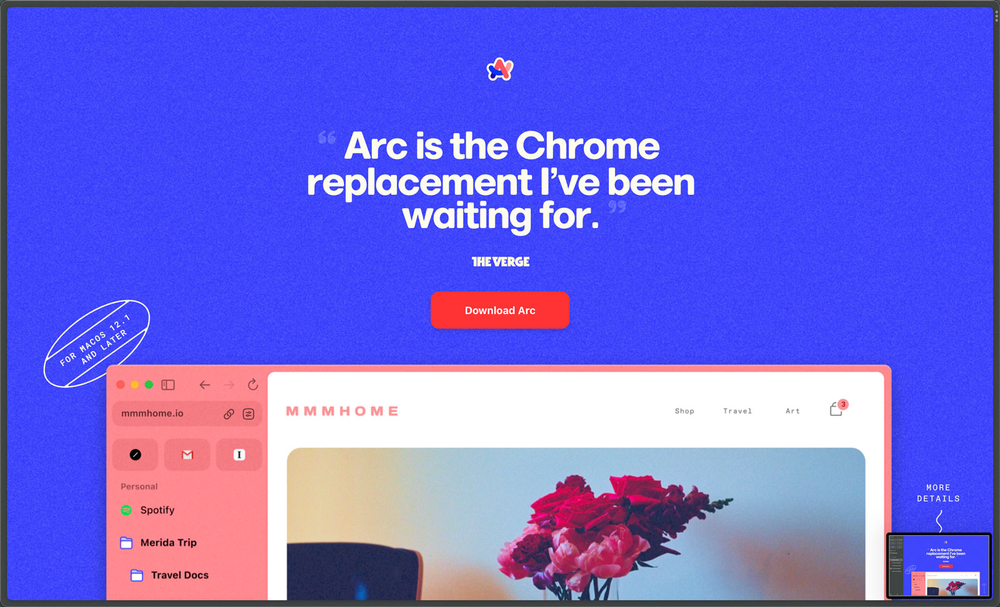
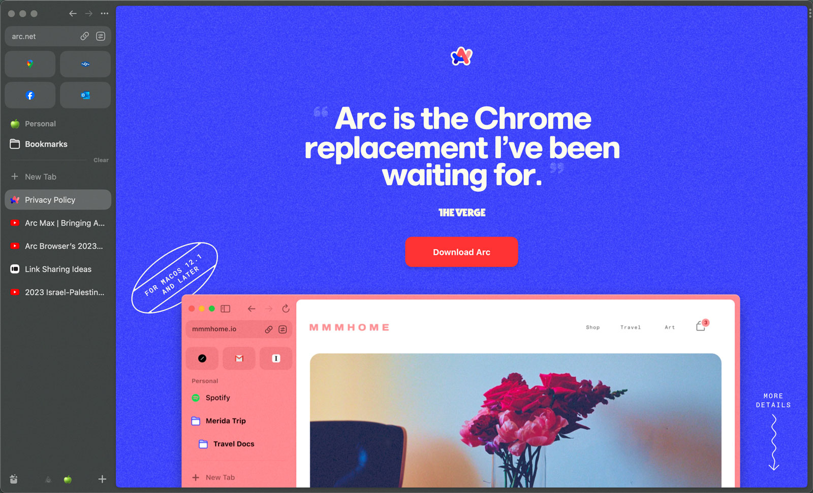



