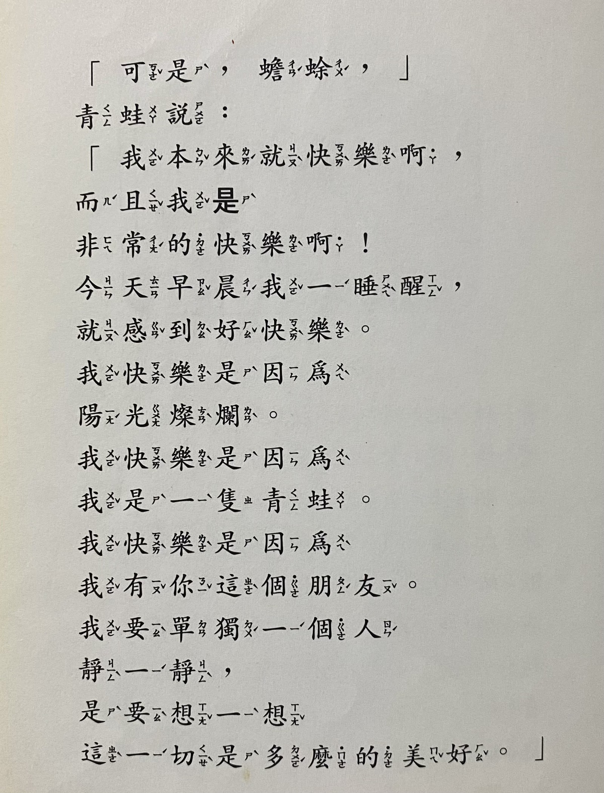
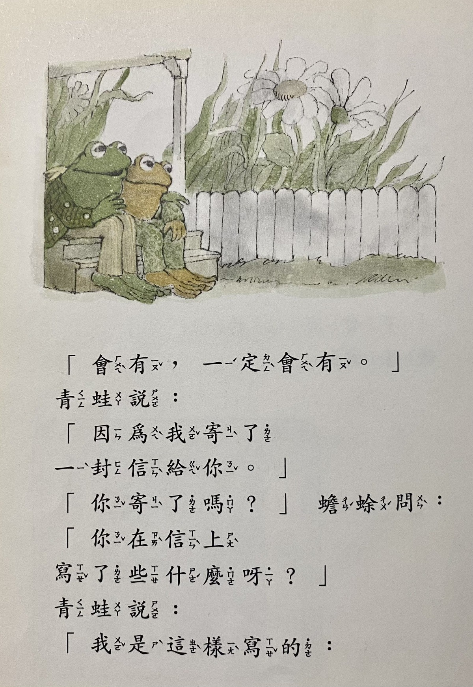
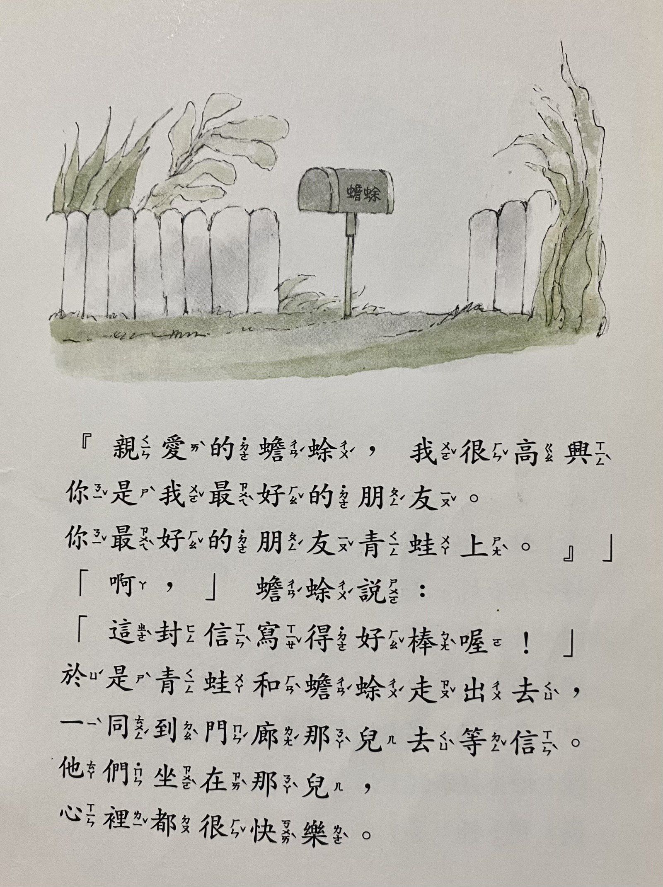
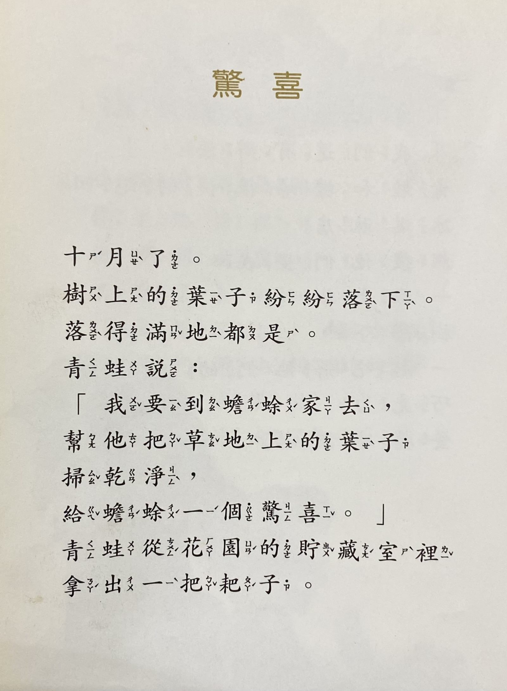
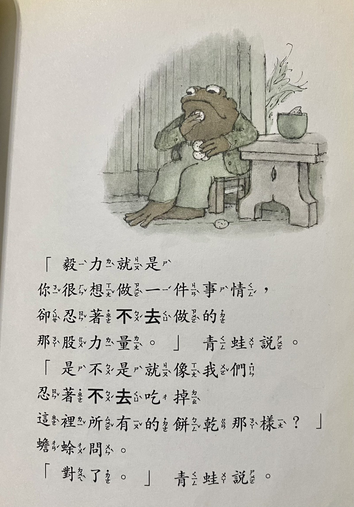
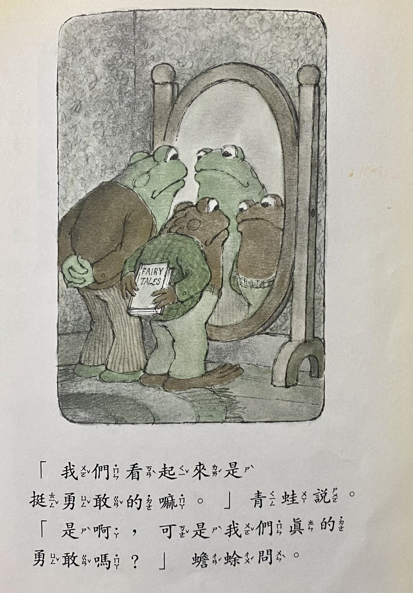
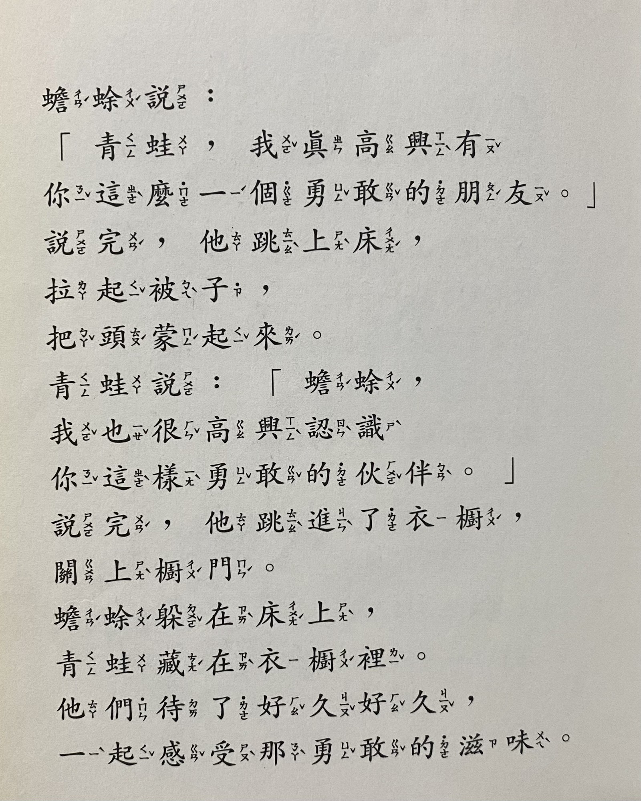
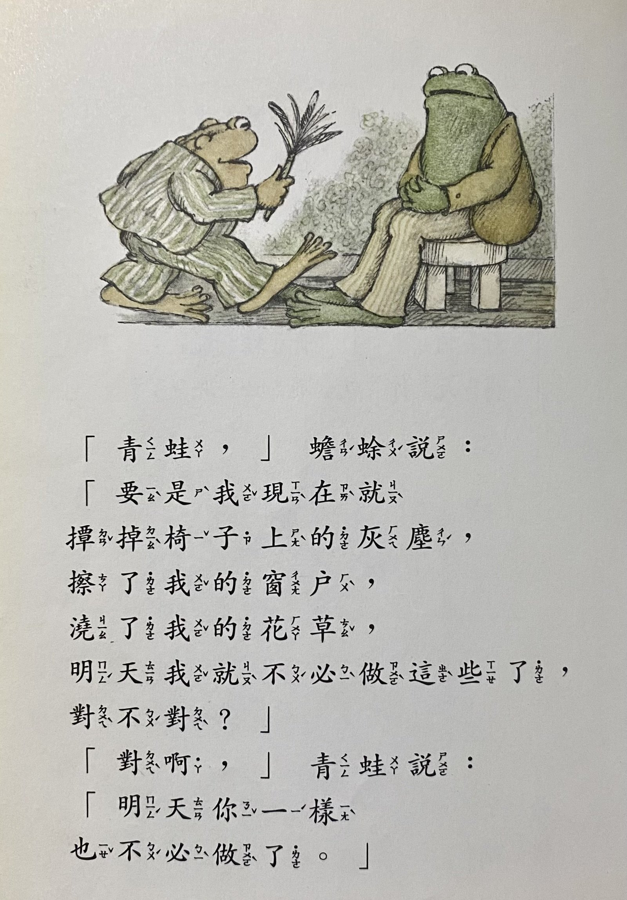





書名：《青蛙和蟾蜍》
\
出版社：上誼文化公司
\
出版日期：2018/08/01

博客來：《青蛙和蟾蜍》

---


過年假期閱讀了[N/A 不適用](https://www.books.com.tw/products/0010971307)，書中提到這部知名的繪本系列，作者以青蛙和蟾蜍的友誼為例，表達自己嚮往的簡單人際關係。好奇之下，我便從圖書館借來閱讀。

這系列共有四冊，每冊包含五個小故事。

主角是一隻樂觀活潑的青蛙與一隻悲觀迷糊的蟾蜍。故事圍繞著他們的日常生活：一起放風箏、青蛙試圖喚醒冬眠的蟾蜍以共同享受春天、為了克制吃餅乾練習毅力等。故事情節簡單可愛，有些純粹描述兩人的友誼，有些則帶著天真的哲思。




### 〈單獨一人〉

我特別喜歡〈單獨一人〉中兩人的互動。

故事裡，蟾蜍到青蛙家拜訪，卻看見門上貼著一張寫給他的字條，說青蛙出門了，想單獨一個人靜一靜。蟾蜍頓時緊張起來，心想：「青蛙已經有我這個朋友了，為什麼還想要『單獨』一個人靜一靜？」他四處尋找青蛙，終於在河中小島上發現青蛙獨自坐著的背影。蟾蜍以為青蛙心情不好，趕緊跑回家準備三明治和冰紅茶，再回到河邊對著青蛙的背影揮手喊話，但青蛙始終沒有回應。蟾蜍著急了，以為自己做錯事惹青蛙不高興，大聲喊道：「我為自己所做的一切傻事向你道歉。我為自己所說的一切傻話向你道歉。求求你再做我的朋友吧。」

青蛙這才聽見了，說道：「我本來就很快樂啊！我快樂是因為我是一隻青蛙，也因為有你這個朋友。我要單獨一個人靜一靜，是想要好好想想這一切有多美好。」

最後蟾蜍終於明白了，兩人便快樂地「單獨」坐著，享受這份時光。



當我們聽到朋友說想「一個人」時，往往會像蟾蜍一樣擔心對方是否心情不好，或是自己是否做錯了什麼。但有時候，想要一個人就只是單純地想要一個人的時間，沒有負面情緒，沒有人際糾葛。青蛙和蟾蜍的互動，提醒了我生活中確實存在這樣純粹的事。




### 〈等信〉

〈等信〉這則故事同樣傳達了友誼最純粹的美好。

某天，蟾蜍鬱鬱寡歡地坐在門前，因為他從未收到過一封信。他很期待收到信，但信箱總是空空如也。青蛙聽後，突然說有事要回家一趟。

青蛙回到家，立刻拿出紙筆寫了一封《給蟾蜍的信》，請蝸牛送到蟾蜍的信箱。接著青蛙急忙跑回蟾蜍家，想要陪他一起等信。

盼呀盼、盼呀盼，兩人等了許久。青蛙不時暗示：「也許今天就有人會寄信給你了」，但習慣失望的蟾蜍並不相信信箱會有信件。最後青蛙忍不住告訴蟾蜍：「因為我寄了一封信給你」。兩人便開心地走到門廊一起等信，四天後終於等到蝸牛送達。



多麼純真可愛的友情！青蛙不忍見蟾蜍天天失望，便悄悄策劃了這個驚喜，希望讓蟾蜍體會收到信的快樂。這不就像我們聽說朋友心情不好時，想陪伴對方聊天、吃飯的心情嗎？

有時候我會做得更簡單些，不一定要預訂餐廳或酒吧，只是在逛街時看到可愛的卡片，便隨興寫幾句話給朋友。因為我也很喜歡在非特定日子被記得的感覺，所以想要傳達「看到這使我想到你喔」的心情給我所愛的人。在生日、紀念日、升遷加薪等值得慶祝的時刻想起對方似乎理所當然，而在平凡日子裡被記得，彷彿自己是很重要的人，感覺格外溫暖。




### 〈驚喜〉

〈驚喜〉這則短篇也展現了類似的體貼。

十月入秋，樹葉紛飛落滿地。青蛙看見後心想：我要到蟾蜍家幫他把草地上的落葉掃乾淨，給他一個驚喜。巧的是，蟾蜍也想到了青蛙。兩人都繞了遠路，避開平常的路線以免被對方發現。抵達對方家時，都暗自竊喜著：回家時對方一定會感到驚喜。

> 「他絕對想不到是誰把他的葉子掃光的。」

兩人努力掃著落葉，把葉子掃成一堆後開心地回家。沒想到一陣風吹來，把整理好的落葉堆吹散，又是滿地的落葉。青蛙和蟾蜍各自回到家，沒有收到對方準備的驚喜，看見滿地落葉卻也不覺得懊惱，只是平靜地說：「明天我該把自己家草地上的葉子掃一掃了。」

故事就此結束。兩人都不知道對方曾偷偷到自己家門前打掃，也不知道自己的付出最後被風吹散。沒有驚喜，卻也不失落，只有單純想給對方驚喜的心意，以及認真做好分內事的態度。




青蛙和蟾蜍的每個小故事都如此純粹，純粹得讓我們意識到已經太久沒有這種「真的就是這麼簡單」的感受了。現在的我們是為了獲取利益嗎？還是為了在生存競爭中勝出？做事似乎總得有個積極的目的，或是具備商業價值，否則很難向他人承認自己不夠努力。

閱讀青蛙和蟾蜍的故事時，我常覺得結局來得突然，好像少了些什麼。但回歸本質，友誼確實就是由這些單純的相互體諒、同理、玩笑，和分享奇思妙想所構成。我們與青蛙和蟾蜍並無不同，每天能與懂你的人分享喜怒哀樂，或是會心一笑的諧音梗，這些都是生活中不起眼卻珍貴的寶石。




---

其他一些可愛的對話：
毅力就是你很想做是一件事情卻忍著不去做的那股力量。

\
「我們看起來是挺勇敢的嘛」

蟾蜍躲在床上，青蛙藏在衣櫥。
\
他們待了好久好久，一起感受那勇敢的滋味。

\
「要是我現在就撢掉椅子上的灰塵，擦了我的窗戶，澆了我的花草，明天我就不必做這些了，對不對？」
\
「對啊，明天你一樣也不必做了。」



---


