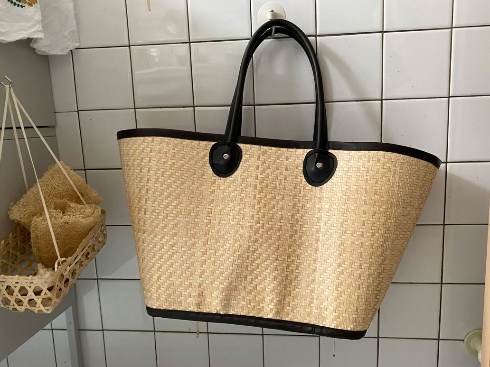





書名：《療癒廚房3 家的進行式！今天也有心愛的道具與靈魂好食相伴》
\
出版社：麥浩斯
\
出版日期：2019/07/04

博客來：《療癒廚房3 家的進行式！今天也有心愛的道具與靈魂好食相伴》
《療癒廚房3》（一）家的模樣，生活的模樣
《療癒廚房3》（二）廚房裡，餐桌上

---



第二部分是吃貨的口袋名單，大部分是作者私藏推薦的美食名單，從麵包及他的好夥伴（烤網、奶油、奶油刀等）、食材、食物、調味料、加工肉品、常備好糧、甜點鹹點、現成熟食等方方面面都有，可以滿足煮婦的各種場合需求，在此就不一一列出了，喜歡作者品味的人，非常推薦把這本書找來看。

因作者住在北部，活動範圍以雙北市為主，因此推薦的店家、來源也多以台北能取得居多。



以下舉幾個各項目的代表例子：



##### 麵包與他的好夥伴
1. 雨人麵包餐館的麵包，以及綜合莓果和紅心芭樂果醬
2. 辻和金網的烤網
3. 蒸籠


##### 食材、食物
1. 主婦聯盟合作社的善糧放牧雞蛋
2. 紅豆鹽奶油


#### 嚴選調味料
1. 玉泰白醬油膏
2. 泰國Megachef魚露
3. 我愛你學田市集的櫻桃鴨鴨油
4. 日本邊銀食堂的石垣島辣油（激辛）
5. 喜願行的麻鈣鮮台灣涼麵醬


#### 常備好糧
1. 台北南門市場小六子水餃
2. 宜蘭市北館市場一香飲食店的餛飩
3. 源順的雞絲麵
4. 源順的雞絲麵
5. 新竹中央市場內90號樹林食品號的貢丸，無招牌


#### 鹹甜點
1. 台北小魯豫山東大餅的大餅
2. 新店簡實新村的老麵饅頭
3. 明星西點咖啡的俄羅斯軟糖
4. 林氏滋養的銅鑼燒、各式小點
5. 新竹淵明餅舖的素綠豆椪


#### 現成熟食
1. 科技大樓站的大連風味館
2. 永樂市場林合發

---

### 我的發酵生活

作者特地將發酵寫成一個章節，顯見其對於發酵食物的喜愛。

作者是從四川泡菜水開始栽入發酵的世界，之後櫥櫃便常存有手作味噌、豆腐乳、蔭鳳梨、柿子醋，還有泡菜老滷水、米糠漬床、酸豆等等。

而我是從梅酒開始。



#### i. 淺漬梅酒

三年前（2020）看了索艾克的[淺漬梅酒](https://www.youtube.com/watch?v=Iy_vnhCEPho&ab_channel=%E7%B4%A2%E8%89%BE%E5%85%8B)影片後，手癢的我在四月初的某個週末清晨，特地跑到濱江市場買青梅。那年釀梅酒的風氣還沒有很盛行，青梅這東西除了網路訂購外只有批發市場有，且一次只能買十斤那麼多。張羅完梅子之後，還跑到北車後站太原路找玻璃瓶，購入一大一小的桃太郎罐，有點忘記實際的公升數，大的可以裝4-5瓶600ml的酒，小的大約是1瓶600ml的酒（含梅子體積）。

但十斤的梅子實在太多，光這兩罐根本用不完，於是我到處問朋友要不要釀梅酒，只要提供酒就好，剩下的梅子、罐子以及人工我出，成功說服了兩位愛酒的朋友，消耗掉了一些梅子。



但還是不夠。



梅酒不需要用到這麼多梅子啊啊啊！眼看天氣一天天暖和，青梅越來越黃也不是辦法，最後我走投無路，只好嘗試做脆梅。

光看食譜就被嚇到，步驟之多、之麻煩，要先用粗鹽殺青、泡水風乾多次以去除梅子的澀味，最後還要浸泡至少三回的糖水，讓味道吃進去，依照各家做法的不同，整個時程至少要三到五天起跳。（而且粗鹽這東西超難買，最後我是在傳統的南北雜貨店找到）

才做到一半我已投降，之後看到市面上的脆梅Q梅或是蜜餞，多少錢都值得，整個過程沒有全心投入真的太困難，沒有人邊上班邊做脆梅的啦。當然最後我的脆梅以失敗告終，去菁不夠徹底，澀水沒有完全逼出，變成只有糖水味道的難吃梅子，長得四不像。










#### ii. 台式泡菜、梅子果醬
第二年冬天，高麗菜價格崩跌，到處都有便宜的高麗菜，清炒高麗菜、高麗菜肉卷、高麗菜煎餅、大阪燒、火鍋等各種料理都嚐遍了之後，心血來潮決定嘗試做台式泡菜，於是開啟了我醃漬料理的第二條路。從那之後，不管是木耳、白蘿蔔、紅蘿蔔、小黃瓜、甜椒等，當有餘裕的時候，就會醃一小罐放冰箱。

前一年的梅酒喝完後，剩下的梅子加入糖後再熬煮成果醬，送給同事。


















今年（2022），索艾克成功帶起了淺漬梅酒的魅力，連我家附近的小市場都開始賣青梅，雖然還是十斤裝，至少可以不用大老遠跑到濱江市場。逛家樂福的時候也能看見釀梅酒專區，將大容量玻璃瓶跟青梅放在一起，並貼出淺漬梅酒的作法，邀請大家一起參與青梅的季節。

一樣買了十斤青梅，早在開釀前許久，我就在朋友圈放消息，宣傳梅酒季即將開始，請準備好酒我幫你釀。有了之前的經驗，清楚知道自己只釀兩罐消化不了這麼多青梅，另外加買兩三罐玻璃瓶，再加上朋友的份，希望可以盡量減少剩下的青梅。












除了基本款清酒以外，今年（2022）另外選了韓國燒酒、蘭姆酒、琴酒還有米酒頭。每到買酒的時候，我都覺得我像個酒鬼一樣，一次購入五六七八支。倒完的瓶子之後還得成堆的拿去回收，玻璃瓶在袋子裡相互碰撞，這不就是酒鬼的家的垃圾才會有的聲音嗎！

還是消化不完。

今年也沒有人與我分梅子，在批踢踢貼文也銷不出去，可惡！梅子一直在成熟老去，不能浪費去年因為雨水豐富今年長得圓滾飽滿的小傢伙啊！於是我再度購入了三四個一公升的玻璃瓶，並買了好幾支酒（為省荷包，以價格選）。我現在可是玻璃罐富翁啊，兩口人的家裡居然有快十個一公升以上的玻璃罐。

既然都要釀這麼多支，除了酒以外，這次來試試黑糖吧，期待開封的那一天。




我其實沒有那麼愛喝酒，純粹是因為喜歡玻璃瓶的質感才栽入梅酒的世界。

當放入青梅、糖粒、酒水，酒從玻璃瓶波波波流出的聲音，以及糖浸在酒水中，慢慢一點一點溶化而造成液體上下層密度不同的質地，還有微小氣泡從梅子絨毛表面慢慢上升的畫面，在在讓我百看不膩，每個角度都拍上二十張還意猶未盡。



淺漬梅酒數個禮拜就可以開來喝，放得越久梅子味越明顯，我非愛酒人，釀酒只是為了欣賞玻璃與物體之間的質地變化，往往是快到次年的梅子季節，為了再釀一波，才會分批分次帶到公司招呼同事，或邀請朋友來家裡聚會，以喝酒之名行消化之實。




多釀了四五瓶，可 是 今 年 還 是 用 不 完 (;´༎ຶД༎ຶ`)



不管了，青梅一直老去，剩下最後一小批，今年就再嘗試一次脆梅吧！






我沒有拍下最後的結果畫面，簡單說還是半失敗了。

殺青時不知道力道要輕柔，誤以為用力才能將澀水逼出，讓好多顆梅子受傷變軟，只能淘汰丟棄，到了浸泡糖水的階段才知道這件事，白白浪費了好幾顆梅子。除此之外，比第一年嘗試少了更多澀味，另外糖水泡得不夠久，甜味不夠，但口感夠脆，連著糖水一起冷藏幾小時後，滋味沁涼消暑，終於有一點點成就感啦！




#### iii. 野酵麵包

第二年（2021）的時候還有一個小插曲，可以說是發酵料理的第三個分支。

因為剩太多梅子了，最後一小把不曉得可以怎麼處理，一直泡在裝水的罐子中，每幾天加點糖，心想應該會釀成梅子醋或是什麼東西吧。
\
就這樣擺著一兩週之後，某天突然看到用天然酵母做麵包的文章，決定不如拿這罐梅子就來養天然酵母做麵包吧！

天真的我，完全不知道這是一條等級更高的路。












買書、上網找資料，越看我越覺得這是個深不見底的世界。

養酵母需要投入時間觀察成長及變化，讀懂氣泡長相與氣味變化的意義，判斷酵母目前成長的階段，什麼時候要餵養麵粉？什麼時候可以製作？麵粉量足夠酵母吃嗎？如果酵母長到可以做麵包的階段但時間上不允許該怎麼辦？



當開始製作麵團後，手法、計量和步驟與使用商業酵母不一樣。天然酵母本身由麵粉和水組成，成分要扣除其中的佔比使用量，還要考量打算做含水量多少的麵包？天然酵母在麵團的佔比也會影響發酵的時間，以及製作過程中的基本發酵、二發階段，要觀察麵團的變，折疊手法和次數會影響麵團組織。還有烤箱溫度的設定、使用鑄鐵鍋或石板維持麵團溫度等等，每個步驟都有非常科學的基礎，不是簡單按照食譜就能成功烤出好麵包。

但使用天然酵母烤出的麵包香氣，是一般商業酵母遠遠不及的。如果商業酵母的麵包香氣是1的話，天然酵母麵包的香氣大概是200，社交距離1.5公尺的同事拿出麵包都能聞到的程度，真 的 很 香 。



天然酵母這個詞其實不夠精確，不管是自己養的還是超市購入的商業速發酵母，酵母是生物，當然都是天然天，只是商業的酵母通常只有單一菌種，活性、穩定性較好，適合大量繁殖，而自己養的酵母菌種比較多，烤出來的麵包風味變化多，但也因此發酵過程更難控制。

除了第一次誤打誤撞烤出勉強可說是成功的天然酵母麵包外，我後面烤的十幾個包都說不上及格。

那時候剛好疫情嚴峻，維持第三級警戒（2022年），在家遠端工作了三個月，我才有辦法邊工作邊照顧這些麵粉大食怪。但即便如此，我還是養的沒有很好。天然酵母需要投入好多好多的心力，與環境溫度、濕度、手法都有關係，沒有一定成功的SOP，即便這次成果滿意，也無法保證下次能烤出一樣的麵包，僅能從一次次的過程中觀察各項條件、累積經驗，花時間嘗試，才有辦法烤出一顆好包。

研究野酵麵包的臉書社團總說，至少要烤二十顆以後才能勉強稱得上是野酵麵包的初手。

野酵麵包這個坑真的是太深太廣了，我現在沒那個屁股鑽研，但我覺得會將此作為一個長遠目標來挑戰的。










好多顆長得像粿的麵包，完完全全的失敗( ´•̥̥̥ω•̥̥̥` )




#### iv. 天然釀造荔枝酒

嘗試了淺漬之後，決定嘗試真正的釀酒過程。

六月時趁著荔枝盛產季節，參考Carol的[自然釀造食譜](https://caroleasylife.blogspot.com/2013/06/blog-post_26.html)，僅需要荔枝、糖兩種原料，自然產生酵母。要等三個月，最快九月底才能開封，到時候再試喝看看味道如何。









---

### 衣裝與身支度

來到了衣物的領域，作者多選擇天然材質、舒服、耐看的款式，此外她也舉了三項不離身的隨身三寶。



#### 1. 手帕

說起手帕這個配件，我也是這半年才明顯感受到他的好。

幾年前男友到日本旅遊時，替他自己和我各買了一條手帕，一面是毛巾材質，一面為紗巾。在還不習慣使用手帕以前，每次上完廁所總是甩兩下就離開，手未完全乾，可能行走路上還會滴個一兩滴，如果要拿東西、開門，還會把門把或物品碰濕。身邊多數人也是這樣，不覺得有什麼不好。

公司的廁所有提供擦手紙巾，好幾次我留意到其他使用者洗完手後一口氣抽個三五張，我大吃一驚，想說是有多濕，一雙手有需要出動這麼多張紙巾，使用不到三秒就進到垃圾桶，看清潔阿姨整理垃圾時都會嚇到。明明就有烘手機，但大家不知道為什麼就是不愛用，寧可使用拋棄式紙巾。

我本來就不使用一次性擦手巾，但為了不想回辦公室時用未全乾的手推門，留下尷尬的水漬，我開始練習自備手帕擦手。



第二個明顯的好處是擦掉夏天的汗。

我不是漂亮女生，在濕黏的海島夏天可以讓長髮垂肩還保持乾爽輕盈，我很怕熱，容易流汗，尤其現在口罩已是必須配件，夏天時嘴巴周圍很容易悶出汗，攜帶手帕可以隨時優雅地將嘴巴、髮際等部位擦去汗水，保持臉部整潔舒適。

最有感是夏天某日剛走進百貨公司，汗水還在臉上，我一邊擦汗一邊與服務人員對話，那瞬間突然覺得拿著手帕的自己優雅禮儀加了好多分。比起汗涔涔的狼狽臉頰，或者拿面紙擦拭後不小心留下的紙屑，手帕優雅許多。選擇材質舒服、印花可愛的款式，也會讓人更樂意使用。




#### 2. 圍巾

這點我目前還沒有經驗可以分享，我怕熱😂




#### 3. 隨身水瓶

多虧了環保署祭出「自備環保杯優惠五元」優惠，讓消費者對於選擇環保的消費模式明顯有感，促使更多人願意重複使用自己的環保杯。

我不太喝茶飲咖啡，一直以來出門都很習慣自己帶水瓶，隨時可以補充水分。有時候飢餓的感覺並不是真的餓，而是缺水的警訊。自從聽聞這件事之後，每當我嘴饞想吃零食，就會提醒自己先灌一口水，確定是不是口渴。
\
而且說回生物層面，多喝水有益新陳代謝，排出身體廢物，對皮膚也好，比起研究琳瑯滿目的保養品成分，簡單治根的「多喝水」更適合懶婦在下👽



---


### 包包

我不愛買包包，最常拿的是上市場用的買菜籃。

和作者一樣，我也非常討厭塑膠袋，一來不環保，二來醜，三則是不好提，稍微重一點的商品，很容易在手上勒出痕跡。

兩年前左右我在大稻埕買了一個籐編提籃當作我上市場的買菜籃，款式典雅低調，光是拿著就有好心情。我也被路人問過兩三次哪裡買，我將之視為對我的品味肯定😇 但可惜底面積不寬，若是買肉或是體積較大的水果就撐不太住。其負重也有限，把手處的纖維容易斷裂，我已經拿絕緣膠帶補了好幾回。最後真的是用他提了太多次重物，被我摧殘到僅剩一條藤編藕斷絲連的連著，只好請他退休。






後來我又再去買了一個新的，這次特別挑選提把處加強的款式，也是一個提在手上心情很好的加分配件。




---

看這本書的時候，幾乎每個段落都有想和作者擊掌的衝動，頻頻點頭同意她對生活的堅持、對物品的取捨，不適合的就該果斷捨棄，猶豫只會讓自己不好做事。雖然對生活的大方向理念相近，但在細節執行上，還有很多我需要學習改進的部分，比如冰箱的收納、採買食材前應該先做規劃、是否要選擇天然有機的洗沐產品等等，這些得慢慢熟練，才能成為對生活美感細節有條有理的主婦。

最近的作息調整為清晨起來做便當，剛起床的心神很適合專注，腦子不會因為工作或與人的對話胡思亂想。如果是下班之後才煮飯，運轉一天的腦袋沒辦法立刻緩下來，會一直分心想著剛才路上看到的怪人、與同事的對話，或者被各種訊息打擾。下班後的時間不算短，若要認真投入某件事，或許長時間下來可以有所成就，但我覺得最困難的地方在於心境、情緒上的轉換。讓自己從某的狀態過渡到另一個狀態，在紛亂躁動的思緒下，無法好好閱讀一本書，思考一件事，這是我每天都在努力克服練習的。

---

博客來：《療癒廚房3 家的進行式！今天也有心愛的道具與靈魂好食相伴》
