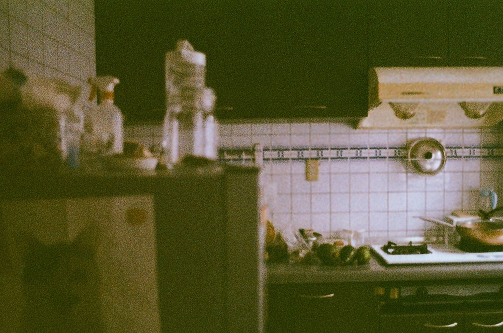
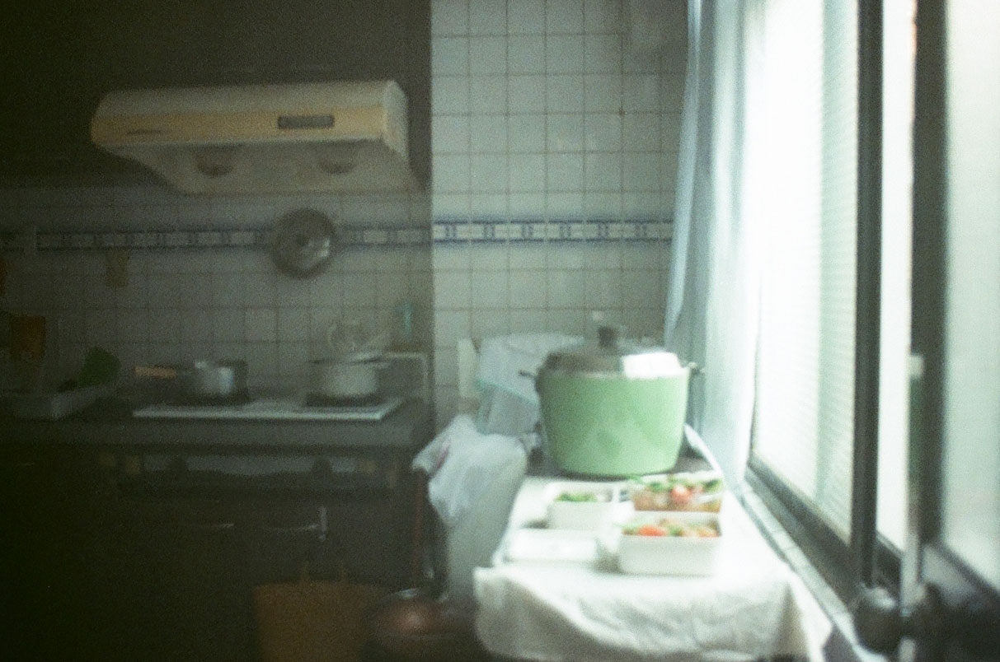





書名：《療癒廚房3 家的進行式！今天也有心愛的道具與靈魂好食相伴》
\
出版社：麥浩斯
\
出版日期：2019/07/04

博客來：《療癒廚房3 家的進行式！今天也有心愛的道具與靈魂好食相伴》

---



我很喜歡看家事整理、收納的書。

幾年前崇拜林姓主婦，從她的收納分享中學到了整理物品的基本法則，不斷練習並落實在生活中。最近則是深深受到暴躁兔女王的這三本系列書的吸引。

這三本都不算新書，很多基本的料理知識我都會了，但我從暴躁兔女王的文筆中，看見她喜愛生活的樣子，與我這兩年的生活心得很像，每一句話都想用力握手點頭，我覺得我好像找到一位好朋友。



我一直覺得家事和生活都是需要學習的，當家事做得越多，感受越深。而且做越多，會漸漸訓練出對季節、對天氣的敏銳度，能從皮膚感受到濕度變化，好天氣的日子就適合打開窗戶讓空氣進來，潮濕凝結的角落需要活絡氣息。

以前的我很排斥清潔眼睛看不到的角落，比如櫥櫃下方縫隙、馬桶下緣與後側、房間牆壁、浴室天花板等，但當我看到一些主婦分享家事清潔的vlog後，我也開始留意這些總被我忽略的角落，正式面對他、清掃他、放下他，喔不，我放下的是我自己。親手整理後，對角落的厭惡排斥，變成了眼睛瞇瞇笑的欣慰接受，可以很清楚點明家的每一個角落都是有我認真清掃的痕跡，不知不覺就從中長出了自信。
\
是真的啦，家事既零碎又繁瑣，是維持生活的重要基礎，其實需要有條理的規劃。



一邊閱讀這本書，一邊紀錄我的生活感想。

這邊只是第一個段落：家與生活的模樣。


> 生活是日復一日的重複積累，而家事是建立生活必要的元素，沒有人能置身事外。



---

### 乾抹布的用處

> 在廚房和浴室都個放幾條乾抹布備用，每天晚餐後收拾完廚房以及洗完澡後，必定用乾抹布把用水區域的水滴盡量擦乾，水龍頭亮晶晶我的心情就歡心。

看到這個做法後，我也開始練習每天在洗完澡之後，把浴室洗臉台的上的水珠用乾抹布擦拭掉。之前頂多只會將地板與牆壁上的水用刮刀刮除，沒有注意到洗臉台上的水珠，常常兩三天後就會出現水垢，放置牙刷、洗臉皂的檯面也很容易積水，看了心情很啊雜，原來只要一條乾抹布就可以解決了！



---

### 順便做的家事小聰明

作者很少「專程」打掃，大都是利用零碎時間、順手順便做的。例如刷牙等待熱水的時候順手刷一下馬桶，前段的冷水接起沖馬桶，既省時又省水，且每天順手做，馬桶沒有結垢發臭變髒的機會。又如晚上洗澡時，也是在等熱水的一兩分鐘刷洗臉台。

看過幾本收納、整理的書之後，我也漸漸養成這種順便的習慣。但我覺得這種「順便」其實需要依照每個人的生活習慣做調整，你要先知道自己的生活動線、習慣是什麼。

例如我很重視地板的整潔，最不希望廚房因為油煙產生粘膩的感覺，因此每次使用完廚房後，我一定會好好把檯面、地板都擦拭過一遍才休息吃飯。每次只花兩三分鐘，比起半年一年累積出黃黃的污垢讓人反感、排斥靠近廚房來的好。而且保持整潔，最大的受益人是自己，每天煮飯都亮晶晶的，多好。

廚房本來就該是療癒身心的地方。



---

### 停止專用清潔液的瓶瓶罐罐生活

作者說，小時候奶奶打掃家裡一律只使用熱水、肥皂和抹布，不像今天廣告宣傳，馬桶需要一瓶清潔劑、廚房磁磚一瓶、浴室地板一瓶、玻璃一瓶、除霉一瓶等等。

簡化下來，其實就是各種污垢，由油煙、灰塵或水形成的。買這麼多瓶，先不說傷荷包，要找地方收納就很令人頭痛，打掃不同地方還得拿出不同瓶罐，每個包裝又繽紛華麗的讓人皺眉。回歸到打掃的根本，利用最基本的天然除垢原料，不僅唾手可得，還可以以一擋百，適用各種場域，好管理、好簡單。

> 把打掃回歸到最簡單，捨棄那些專用清潔劑，端看清潔工作發生在哪裡，就用那裡的清潔用品。
打掃浴室，就用浴室裡那塊肥皂和刷子；打掃廚房，要是熱水不夠利就用廚房裡那塊家事皂或小蘇打粉；至於擦地板擦玻璃，都是用熱水就夠。

我也崇尚家裡的東西越簡單越好，能通用的就全體適用，不要分你我。家事是要替自己找到最省時方便的做法，不要被廣告輕易洗腦，覺得市面上有什麼商品，就只能用那個方法。

你擁有自己的主導權啊。

--
> 我把家事看作是主婦的修行，透過每一日的固定家事，像存硬幣到撲滿小豬裡，累積自己對持家的自信和能力，只要願意多用心想一想或改變作法試試看，家事其實能有比較輕鬆有效率的做法，還能從中獲得穩定自己的能量。

我覺得這一段文字與[杏子媽媽](https://www.youtube.com/channel/UCZYAiIODaIUDDX-PqPnMM8A)認為「家事是一種禪」有異曲同工之妙。做家事的時間心無旁騖，很專注在物品、整理、將狀態回歸到原廠設定上，將大掃除拆分為每日的零碎打掃，讓人在日常間養成「順手整理」的習慣，日復一日，就像在修心一樣。而且很神奇的，這種簡單的身體勞動，會讓看多網路資訊的大腦擺脫難以察覺的焦慮感，使心情沈澱放鬆。

認真對待物品、對待角落、對待自己的家，換得的是舒適的生活與充實的心。



---

### 追逐風，追逐太陽

>等夫君退休後，要搬到台東去蓋一間自己的小平房。不是透天厝唷！是只要一層樓的平房就好，我要在院子裡種花種菜種一棵檸檬樹，把衣服晾在白花花的太陽下，和太平洋來的風一起曬蘿蔔乾。
>我夢想中的理想生活，實在就是親近大自然的生活啊！
>但現在的我，仍然必須居住在城市的高樓裡生活著工作著，可我並沒有放棄唷，我要在這高樓裡，過著一四季變換、追逐風追逐太陽的日子。

我一直覺得夏天流汗是正常的事情，可冷氣實在太方便了，讓人只要有微微的燥熱感，有時甚至不到會出汗的程度，就按下遙控器享受涼風。

四月以後，走在房屋密集的台北市區，很容易聽到壓縮機運轉的聲音，還有感受到那陣陣襲來的機械工作的熱氣。可能還是初夏的季節，或只是乍寒還暖的季節交替，就能觀察到有很多家庭已經開始開冷氣。那些日子，都是我覺得晚上吹電扇可能還會微微感到涼意的時候。

我的意思並不是不能開冷氣，當氣溫高到受不了時，我也會投入冷氣的懷抱。只是我覺得，夏天身上帶著汗就是這個季節的日常。

尤其這兩年，因為疫情的關係，到哪都得戴著口罩，即便我已經避開最熱的中午時段出門，買菜只會在早上九點前、下午五點後進行，走沒幾個路口，口罩內的口鼻就已汗如雨下。

我是容易流汗的體質，我多希望夏天永遠消失，但我會盡量只看夏天的可愛之處，調整自己的心態，去欣賞每個季節的特色。比如我非常喜歡夏天的旺盛生命力，（我說的不是蟲，蟲蟲可怕，蟲蟲走開）光是夏天的陽光，就讓人覺得好有活力啊！那股直率、直接、毫無保留的力道，像個孩子般，彷彿體力永遠用不完。大概下午四點後的陽光還非常飽滿，但看得出來殺傷力略減，從此時一直到傍晚前的時段，最適合觀察光，最美的雲影往往會再次此時出現，且從起床後活動了半天，到這個時段，也很適合暫時按下暫停鍵放鬆身心，排空大腦的思緒。我最喜歡這個時候的光線，我用底片機拍了好多張不同的角落。

我們要做的，是跟著季節過日子。工商業社會固然方便，要冷氣暖氣都唾手可得，但如果少了季節的訊息，總覺得那樣的日子很乏味。



矮唷，總之我覺得，能感受自然條件的變換，調整日常生活的步調，就是日復一日的浪漫情調。

有什麼日常生活好調整？有啊！夏天我家的後陽台在下午時段可以直接照射到陽光，怕曬的植物們中午前得記得移動位置免得曬傷，或是整個夏天得直接換個棲息地；夏天水氣蒸發快，植物怕枯萎，空氣鳳梨們得兩日就澆一次水，冬天則可以三、四天再觀察，澆水頻率不同，親近他們的時間就不一樣。

夏天多午後雷陣雨，但衣服也乾得快，往往早上晾的衣服，中午左右就能收進家裡，不用擔心雷陣雨的二次攻擊。冬天就沒這麼好命，連日的陰雨天，可能得將衣物直接進移室內開除濕機，我在後陽台的活動次數就會完全不一樣。

再說到季節盛產的食物，夏天多涼拌，許多料理川燙過後就能快速調味上桌；秋冬適合燉煮暖身，廚房食事的背景樂多是咕嘟咕嘟的湯水沸騰聲。而且冬天裡，整個城市、整個街道都會寧靜許多，天冷大家少出門，外頭的躁動度會大大減少，真的，下次你注意看看。

> 濕答答的雨天還要出門總讓人感到厭世，這時不妨穿上心愛的雨靴，撐著喜歡的雨傘，踩著水花出門去吧！讓自己心儀的物品陪伴度過煩人的壞天氣，再等著迎接之後到來的好天氣。

上回為了爬加羅湖，我才終於買入雨鞋，總算感受到在台灣北部擁有雨鞋是一件多方便的事情。

之前還住在中部時，完全不能理解北部朋友為什麼要購入雨鞋，現在住在冬天多雨的台灣北部四五年，終於體會到有雨鞋出門是件多方便的事情。

台灣北部的冬天，常常一下就是連續多日的雨，有雨鞋後，完全不用害怕踩到水坑，撐傘時不必特意顧及雨來的方向，盡量減少鞋面和雨接觸的機會，光是鞋子的不同，對「雨天出門」的心情變完全不一樣，甚至可以說變得有所期待，因為我知道回家時雙腳是乾爽的（轉圈圈）。



---

> 有冷有熱，有晴有雨，有著春夏秋冬的四季，這樣的生活，挺好。

開頭時有提到，其實我覺得，家事和生活都是需要學習的，不要小看這些賺不了錢的家務活啊！

怎麼打掃、怎麼收納、怎麼計畫三餐、怎麼買菜，買回來的菜怎麼處理、垃圾怎麼丟、廚餘如何利用、怎麼減少生活必要的處置等等，我自己是經過多次練習，學習了許多人的做法後，慢慢找出自己的步調。


以垃圾怎麼丟這件事為例，我居住的地方沒有公共垃圾場，要倒垃圾只能自己追垃圾車，因此我們家的垃圾得有計劃性的安排。

沒錯，為垃圾安排計畫。

通常經過一個週末，廚餘的量會特別多，因此星期一幾乎得固定丟廚餘。

超市的包裝總是有一個保麗龍盒，得在回收立體類的日子處理掉，所以處理垃圾這件事，會間接影響到我買肉品的計畫。為了買肉肉，我額外獲得了一個保鮮膜、一個保麗龍盒，可能還有一片吸血水的臭棉紙，我只需要四件物品中的一件，卻得分類處理另外三件項目，煩啊！所以能不買我就盡量不買。（最近我已下定決心不再買肉了，肉品保存時間短，又油，每次摸完都要仔細清洗手部和擦拭料理的道具，懶婦決定躺平放棄，順便減碳減塑）。

此外每次丟垃圾前我都會盡量巡視家裡的角落，那些放置一段時間的包裝、零食的承裝盒等，盡量在同一天處理，畢竟丟垃圾這件事也需佔據一定時間，前後的事情都得排開來。


丟垃圾一件事，可以影響到這麼多層面。或者反過來說，垃圾處理這件事，居然被這麼多方面影響。



---

這本書讀得很慢，因為過程中我有好多共鳴想記下來。

嗚嗚，隔著書本我終於找到知音了。好少人會把家事當作一件認真的事情看待，這種從家事中獲得的微小充實感可以找誰說。跟同事或朋友講「我週末擦拭了我家的大門喔」、「洗完澡我會順手把水珠都擦拭掉維持乾爽」、「我搶在雷陣雨下來的前一刻剛好把衣服都收進來了呢」會讓對方感到困擾的吧。

可是我就是好喜歡這種用力做了也賺不了錢的事啊。




博客來：《療癒廚房3 家的進行式！今天也有心愛的道具與靈魂好食相伴》
