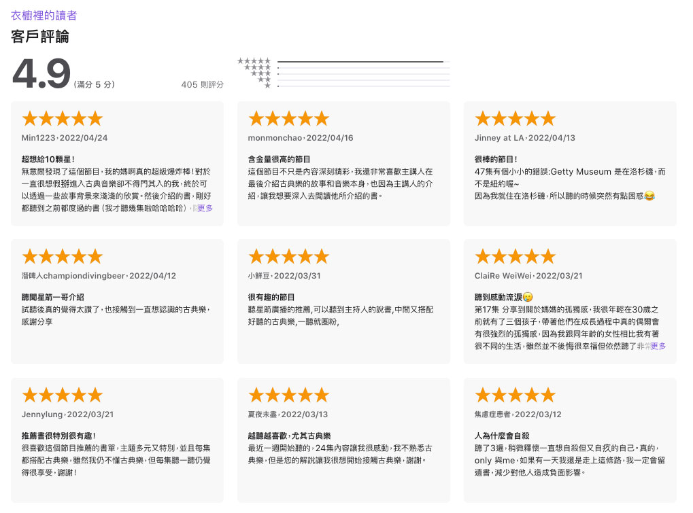

## [Apple podcast《衣櫥裡的讀者》](https://podcasts.apple.com/tw/podcast/%E8%A1%A3%E6%AB%A5%E8%A3%A1%E7%9A%84%E8%AE%80%E8%80%85/id1553436127)

###### 知識．文化．音樂．閱讀．讀書．聽書．說書
###### 每週一本書，一起成為更好的讀者。


<iframe title="衣櫥裡的讀者" allow="autoplay *; encrypted-media *; fullscreen *" frameborder="0" height="450" style="width:100%;max-width:660px;overflow:hidden;background:transparent;" sandbox="allow-forms allow-popups allow-same-origin allow-scripts allow-storage-access-by-user-activation allow-top-navigation-by-user-activation" src="https://embed.podcasts.apple.com/tw/podcast/%E8%A1%A3%E6%AB%A5%E8%A3%A1%E7%9A%84%E8%AE%80%E8%80%85/id1553436127"></iframe>


- 節目長度約一小時左右。特色是節目最後會分享一首與當日選書有關的古典樂曲。

- 節目名稱來自於主持人一開始真的是在家中衣櫥錄的音，因為那是家裡夠安靜、最沒有回音、收音最單純的環境。

- 選書方向較偏向文學、藝術。自己觀察其他說書節目，很多的選書方向都是以工具書、理財、心靈成長類為主，衣櫥裡的讀者的選書方向在市面上是較少見的。

- 主持人住在花蓮，聲音很有吸引力。

- 語速比剛好再慢一些些，且會注意每一個字的發音，非咬文嚼字，但很清晰。光用聽的，不借助字幕，也可以很清楚知道整個句子長什麼樣子，唸詩的時候更是清楚。



##### 推薦單集
  - [30集問答：讀書最重要的，不是建立自己的觀點，而是拆毀自己的觀點]()\
    除了簡單認識主持人的背景外，從聽眾的問答中，可以體會到閱讀大量書籍的人謙卑、求知若渴的氣質，也破除我對於「閱讀」這件事情必須從中獲得什麼的刻板認識。

  - [44.【關於詩】詩能夠阻擋坦克嗎？｜《玫瑰是沒有理由的開放》](https://podcasts.apple.com/tw/podcast/44-%E9%97%9C%E6%96%BC%E8%A9%A9-%E8%A9%A9%E8%83%BD%E5%A4%A0%E9%98%BB%E6%93%8B%E5%9D%A6%E5%85%8B%E5%97%8E-%E7%8E%AB%E7%91%B0%E6%98%AF%E6%B2%92%E6%9C%89%E7%90%86%E7%94%B1%E7%9A%84%E9%96%8B%E6%94%BE/id1553436127?i=1000553106941)\
    這集節目建立在2022烏俄戰爭剛爆發不久，透過讀詩的，讓我們從簡短的文字當中描繪一幅畫面。本集節目一共選了五首詩，最後以波蘭詩人辛波絲卡的〈結束與開始〉做結尾，在爆發如此殘酷現實的當下，詩讓我們心靈保持安靜，也給予了我們對現實的不同觀點與反思。這集節目也能特別感受到主持人星樺行版語速的優點，即便眼前沒有詩，光透過耳朵聆聽，也能讀進一首詩。

  - [39.【文學】一部重新發明了聖誕節的小說｜《聖誕頌歌》｜A Christmas Carol](https://podcasts.apple.com/tw/podcast/39-%E6%96%87%E5%AD%B8-%E4%B8%80%E9%83%A8%E9%87%8D%E6%96%B0%E7%99%BC%E6%98%8E%E4%BA%86%E8%81%96%E8%AA%95%E7%AF%80%E7%9A%84%E5%B0%8F%E8%AA%AA-%E8%81%96%E8%AA%95%E9%A0%8C%E6%AD%8C-a-christmas-carol/id1553436127?i=1000546178667)\
    透過一本與聖誕節有關的書籍讓我們對這個節日有更立體的認識，選擇與大眾生活都有關聯的書籍，也讓閱讀不那麼難以親近，像是聽床邊故事一般，是很平易的入門單集。





我非常喜歡[《衣櫥裡的讀者》](https://podcasts.apple.com/tw/podcast/%E8%A1%A3%E6%AB%A5%E8%A3%A1%E7%9A%84%E8%AE%80%E8%80%85/id1553436127)，第一是因為聲音和語速和緩但不慢，咬字清楚，每一個字都好好的念，不急躁。即便當我在煮飯、做家事的同時收聽，都還是很清楚句子的樣貌。

第二是因為他的選書方向。
\
打開書店熱銷排行榜，幾乎全是理財、工具書、職場勵志、心靈療癒等書籍的天下，社群上討論度最高的也是這幾種類型，總在告訴你要怎麼成為成功的人。這種書如果在不對的時間看，或者沒有目的地盲目攝取，很容易感到疲乏。在這種情況下，衣櫥裡的讀者選書對我來說顯得很突出，每一集內容都可以毫無壓力收聽。

主持人星樺的選書、口條等，在在讓人感受到他的博學，偏偏讀了這麼多書的人，講話方式仍非常謙卑（雖然他強調自己讀的書真的不多）。在每一集的最後，他都會提醒聽眾自己並非任何領域的專家，可能有敘述不周或者錯誤的地方，很歡迎大家留言指正建議。會特別點出這件事情，表示他很重視每一句話的可靠性，也很尊重所有領域的專業知識。

博學而謙遜、氣質且內斂，都是讓我非常喜歡這個節目的原因。

節目一週更新一次，我總是捨不得聽，擔心一聽完就沒東西了。但最近我開始會重聽過去的集數，他的節目就像是一本本的好書，只聽一遍不一定能完全吸收，第二次、第三次收聽的感覺都不相同，很值得多聽幾遍。



Apple podcast連結：
Apple podcast《衣櫥裡的讀者》



