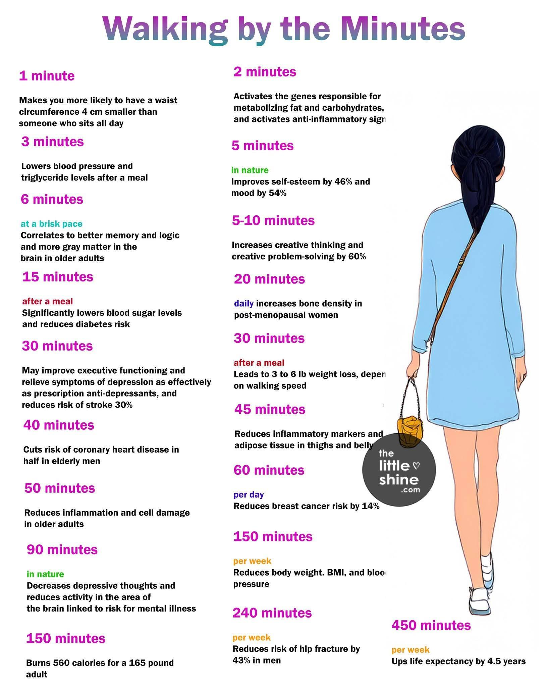




<blockquote class="twitter-tweet" data-theme="dark">
Go on more walks. Walk for no reason. Walk to solve a problem. Walk to blow off steam. Walk to get outside. Walk to listen, read, and learn. Walk to escape distractions. Walk to improve your health. Walk to think. A simple walking habit can change absolutely everything.
— DAN KOE (@thedankoe) <a href="https://twitter.com/thedankoe/status/1860673473749909984?ref_src=twsrc^tfw">November 24, 2024</a></blockquote> 



我一直很喜歡走路。

只要不趕時間，我可以走過好幾個捷運站，走上一整個下午。 
常常我還會為了聽 podcast 而出門走路。



不要看地圖，不要看導航，不要走大馬路。 
走進巷子，憑直覺轉彎，哪裡看起來吸引你，就往哪裡走。



在台北讀大學的時候，我很喜歡在公館、師大一帶的巷子裡亂走。 
看每個陽台的長相打扮，想像住戶的品味。


在台中工作的那陣子，我會到勤美附近，往沒什麼店家的巷子鑽，好奇住在這裡的人房子都長什麼樣子。



如果是在人口密度比較低的鄉下，就看植物。 
看樹的姿態，看當季開什麼花，看草叢有什麼昆蟲。



如果是旅遊，我也喜歡特地留一大段沒有目的的空白，走我可能只來這一次的巷弄。 
（或是利用探訪景點前後的時間，故意在附近繞一段路）



與人約會，我習慣早到，提早幾站下車，或把機車停在遠一點的地方，前往目的地的過程，會有好幾種路線可以選擇。 
即便是熟悉的城市、商圈，一定也有不曾注意過的店家或風景。
 
這種行程的走路，其實不會花太多時間，繞一小圈街區，也不過五分鐘。



天氣晴朗的日子，我會特地挑選一個不怎麼熟悉的地點，漫步每一條藏著未知的小路，然後一路走回家。（可能需要走上四個小時）
 
人的平均行走速度，十五分鐘可以走一公里，大約是一個捷運站的距離。 
在車水馬龍的城市，紅燈多又長，有時候中短程距離，騎車、搭車未必快到哪裡去。 
評估過後，走路與搭車的差距若只在十五分鐘至半小時以內，我可能更傾向選擇走路。



散步使人處於不斷變化的風景裡，霎時，原本坐在書桌前的煩惱神奇的全都消失了，速度慢的適合發現有趣的小店，慢的適合享受天氣，慢的適合思考，慢的適合開啟一場深度對話，慢的適合認識自己。
 
未必需要科學數據證實你才有出門的動機，只要出發一次，親身感受，就能明白。

> 熟悉周圍的景物需要時間，就像交朋友。前方的高山，會隨著你一步一步接近而改變樣貌，等到你抵達時，就會像你熟悉的好朋友。你的眼睛、耳朵、鼻子、肩膀、腹部和雙腿，都在對山說話，山也一路回應著你。時間隨之拉長，超越了小時和分鐘。
>
> —— 厄凌．卡格《就是走路：一次一步，風景朝你迎面而來》




---

### 散步對健康帶來的好處

在社群上看到一張以分鐘計算列出散步對健康帶來的好處：



###### 散步 1 分鐘

讓你的腰圍比整天坐著不動的人平均少四公分。



###### 散步 2 分鐘

讓代謝脂肪和碳水化合物的基因更加活躍，並開始發揮抗發炎作用。



###### 散步 3 分鐘

能降低飯後血壓與三酸甘油脂的濃度



###### （在大自然中）散步 5 分鐘

提高 46% 的自尊心，改善 54% 的心情。



###### （快走）散步 6 分鐘

有助於提升記憶力和邏輯思考能力，並使年長者擁有更多的大腦灰質。

> \*大腦灰質是大腦中的一種組織，主要負責處理資訊與認知功能，如思考、記憶、決策、感官處理等。隨著年齡增長，灰質會逐漸減少，可能導致認知退化、記憶力變差，甚至增加阿茲海默症風險。擁有更多的灰質與較佳的認知功能、記憶力及情緒控制能力有關。



###### 散步 5~10 分鐘

提升創意思維，並提高 60%創意解決問題的能力。



###### （飯後）散步 15 分鐘

明顯降低血糖，減少罹患糖尿病的風險。

> 降低罹患糖尿病，間接也降低了洗腎的機率。



###### （每日）散步 20 分鐘

有助於更年期女性增加骨質密度。



###### 散步 30 分鐘

改善生理功能，有效減緩憂鬱症狀，可與抗憂鬱藥相當，並降低 30% 中風風險。



###### （飯後）散步 30 分鐘

幫助減重 3~6 磅（大約等於 1.4~2.7 公斤），實際效果與步行速度有關。



###### 散步 40 分鐘

老年人罹患冠狀動脈心臟病的風險減半。



###### 散步 45 分鐘

減少發炎，並降低大腿與腹部的脂肪堆積。



###### 散步 50 分鐘

減少發炎反應，減少細胞損傷，對年長者特別有幫助。



###### （每日）散步 60 分鐘

可降低 14%罹患乳癌的風險。



###### （在大自然中）散步 90 分鐘

減少憂鬱情緒，並降低與心理疾病相關的大腦區域活躍性。



###### （每週）散步 150 分鐘

幫助減少體重、身體質量指數（BMI）和血壓。



###### 散步 150 分鐘

對體重 75 公斤（約 165 磅）的成人來說，可以燃燒 560 卡路里的熱量。



###### （每週）散步 240 分鐘

減少男性髖部骨折的風險達 43%。



###### （每週）散步 450 分鐘

預期壽命可增加 4.5 年。




