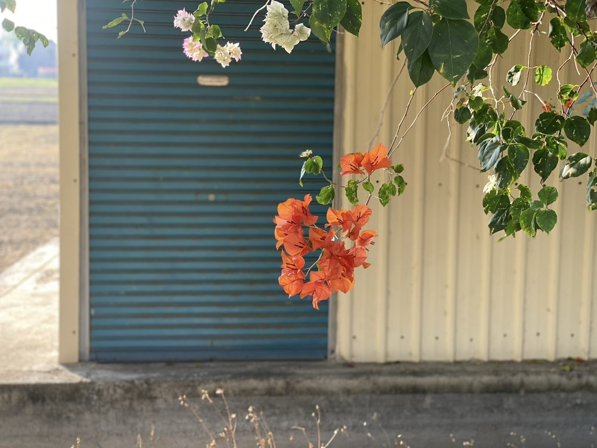




<blockquote class="twitter-tweet" data-theme="dark">
Go on more walks. Walk for no reason. Walk to solve a problem. Walk to blow off steam. Walk to get outside. Walk to listen, read, and learn. Walk to escape distractions. Walk to improve your health. Walk to think. A simple walking habit can change absolutely everything.
— DAN KOE (@thedankoe) <a href="https://twitter.com/thedankoe/status/1860673473749909984?ref_src=twsrc^tfw">November 24, 2024</a></blockquote> 



我一直很喜歡走路。

只要不趕時間，我可以走過好幾個捷運站，走上一整個下午。 
常常我還會為了聽 podcast 而出門走路。



不要看地圖，不要看導航，不要走大馬路。 
走進巷子，憑直覺轉彎，哪裡看起來吸引你，就往哪裡走。



在台北讀大學的時候，我很喜歡在公館、師大一帶的巷子裡亂走。 
看每個陽台的長相打扮，想像住戶的品味。


在台中工作的那陣子，我會到勤美附近，往沒什麼店家的巷子鑽，好奇住在這裡的人房子都長什麼樣子。



如果是在人口密度比較低的鄉下，就看植物。 
看樹的姿態，看當季開什麼花，看草叢有什麼昆蟲。



如果是旅遊，我也喜歡特地留一大段沒有目的的空白，走我可能只來這一次的巷弄。 
（或是利用探訪景點前後的時間，故意在附近繞一段路）



與人約會，我習慣早到，提早幾站下車，或把機車停在遠一點的地方，前往目的地的過程，會有好幾種路線可以選擇。 
即便是熟悉的城市、商圈，一定也有不曾注意過的店家或風景。
 
這種行程的走路，其實不會花太多時間，繞一小圈街區，也不過五分鐘。



天氣晴朗的日子，我會特地挑選一個不怎麼熟悉的地點，漫步每一條藏著未知的小路，然後一路走回家。（可能需要走上四個小時）
 
人的平均行走速度，十五分鐘可以走一公里，大約是一個捷運站的距離。 
在車水馬龍的城市，紅燈多又長，有時候中短程距離，騎車、搭車未必快到哪裡去。 
評估過後，走路與搭車的差距若只在十五分鐘至半小時以內，我可能更傾向選擇走路。



散步使人處於不斷變化的風景裡，霎時，原本坐在書桌前的煩惱神奇的全都消失了，速度慢的適合發現有趣的小店，慢的適合享受天氣，慢的適合思考，慢的適合開啟一場深度對話，慢的適合認識自己。
 
未必需要科學數據證實你才有出門的動機，只要出發一次，親身感受，就能明白。

> 熟悉周圍的景物需要時間，就像交朋友。前方的高山，會隨著你一步一步接近而改變樣貌，等到你抵達時，就會像你熟悉的好朋友。你的眼睛、耳朵、鼻子、肩膀、腹部和雙腿，都在對山說話，山也一路回應著你。時間隨之拉長，超越了小時和分鐘。
>
> —— 厄凌．卡格《就是走路：一次一步，風景朝你迎面而來》



