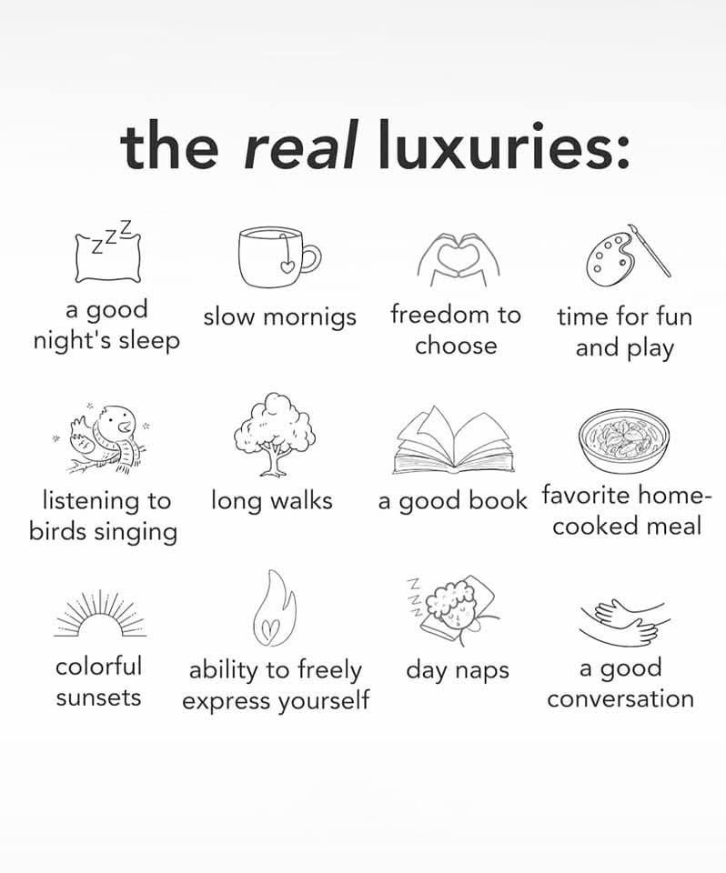

### 真正的奢侈品

- 良好的睡眠
- 慢慢享受早晨
- 擁有選擇的自由
- 享受娛樂和玩樂的時間
- 聆聽鳥鳴
- 漫漫散步
- 閱讀一本好書
- 享受家常美食
- 欣賞繽紛日落
- 自由表達自我
- 午睡
- 與人共創一場良好的交流互動



...




如果你曾經歷過以上列出的任何一項，或許就能體會這張圖想傳達的所謂「真正的奢侈」，是有錢也未必能交換到的。




因為台積電、輝達等公司的關係，感覺整個台灣整座島的人民很熱衷於追逐最新科技，以及其所帶來的可觀的錢財，以至於整個社會氣氛都沈浸在追逐更好的物質生活競賽。



賺錢 -> 投資 -> 買房



我一直對於這股熱潮感到不知所措。



必須競爭、必須跟上、必須加入，人群間的話題也總擺脫不了年薪、職位、購屋等，但除了這些以外，難道沒有其他話題嗎？

我們可以聊春天開的花，可以聊市場上的菜，可以聊你的快樂，聊讓我們感到溫暖純真的時刻。



[違章女生的podcast](https://open.spotify.com/episode/3a4KhyTF8Lcpc3KDmZhN4N?si=66f05be8116644c4)提到：

>「如果我們衡量人生的標準只有金錢，那麼你所有的選擇都是賺最多錢我就去做，就遺忘了人所有開心、愉快、幸福的感覺。他完全不在意這些所有精神上的，無法觸碰的、文化層面的東西，那我們這個社會就會是一個巨大的工廠。
因為你只想著產出，你只想著賺錢。」



金錢沒有不好，但是當整個社會只剩下錢是唯一的追逐目標的時候，總覺得生活變得好單一好扁平。美好的事物並不全是只要有錢就能達到，就像良好的品味並不是跟賺大錢畫上等號，你未必會欣賞一位大公司大老闆的選物品味，但可能會嚮往一位氣質路人的打扮。



「選擇金錢」是一個很快速簡單暴力的評量標準，短期內可以感到安心，但中長期來說，還是需要點別的東西來陶冶看不見的氣質吧？



<iframe style="border-radius:12px" src="https://open.spotify.com/embed/episode/3a4KhyTF8Lcpc3KDmZhN4N?utm_source=generator&theme=0&t=2073" width="100%" height="152" frameBorder="0" allowfullscreen="" allow="autoplay; clipboard-write; encrypted-media; fullscreen; picture-in-picture" loading="lazy"></iframe>




