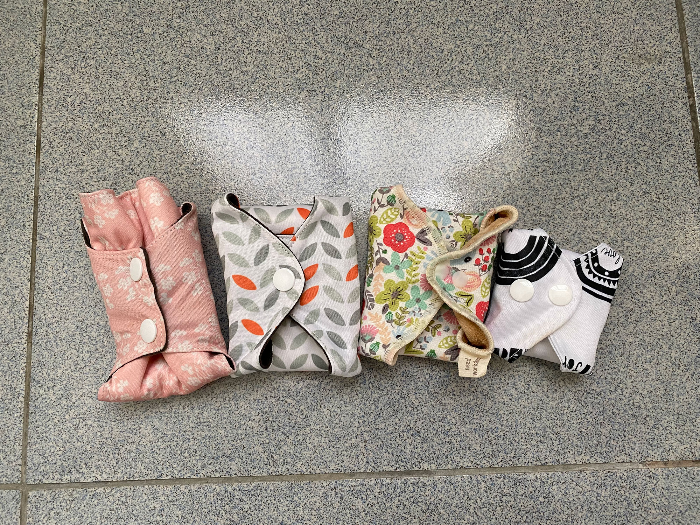

一直以來都知道除了拋棄式衛生棉以外有許多選擇，試用過棉條，但實在很難上手，失敗幾次之後就暫且放下。一直到 2020 年買了布衛生棉後，終於在三級警戒期間開始試用。

事前查找了許多資料，參考眾網友們的使用心得，先對產品與使用情境有初步的了解。當時令我最不安心的是不曉得布衛生棉的防水效果如何，以及到底會不會透。於是趁著居家工作期間改用布棉，不需擔心找廁所、換洗的問題，大大降低進入的門檻。\
用了之後發現，其實與拋棄式的衛生棉使用習慣沒有差很多。不僅一開始最擔心的防水問題完全沒有發生，其他習慣就如往常一樣，更換的頻率也差不多，量多時約二至三小時，量中量少時可以四小時再更換。




### 優點

##### 1. 氣味
過去都覺得經血很臭、很髒，但有看過相關討論說，經血本身其實沒有味道，會覺得臭，除了本身飲食衛生習慣造成之外，大部分是拋棄式衛生棉中，為了加強吸收性或增添香氣所額外添加的化學物質，當吸收了經血之後總合產生的異味。改用布衛生棉後，至少我自己覺得不再有過去那種味道出現。
\
曾看過一個網友分享，她說因為上班換包包的關係，某次偶然發現前一次經期使用完忘記洗的衛生棉還躺在包包裡，驚訝之餘也間接證實了經血真的沒有異味。如果會臭的話，應該很早就會被發現了吧。

##### 2. 舒適

通常布衛生棉的材質都是純天然的棉布，相比起拋棄式衛生棉，與身體的接觸面柔和許多，不會有那麼強的摩擦感。
\
我目前使用過[正合我憶](https://shopee.tw/needworkshop?categoryId=100001&itemId=466702290)的純棉衛生棉和[布棉不羞](https://shopee.tw/chalk1100?categoryId=100001&itemId=7135964398)的竹炭衛生棉，在吸收性上我覺得都很不錯。後者的布料會比較厚，夏天使用起來會比前者稍微悶一些些，但都在可接受的範圍。

##### 3. 不太會位移

如果是使用拋棄式衛生棉，大家應該都經歷在過量多的夜晚，除了使用夜用型加長衛生棉外，還要這邊補那邊捕，防止晚上睡覺外漏的情形吧 😂 我猜測可能是摩擦力的關係，即使布衛生棉沒有背膠，不太容易位移。量多的夜晚，單獨使用加長型的就夠了，不需要另外墊衛生紙或護墊防漏。
\
 但這個狀況在使用護墊的時候就沒那麼一定了，護墊好像比較容易位移，可能是尺寸的關係，也可能是與底褲布料的摩擦力不夠。
\
 所以這點似乎還是要看每個人的量，或者視布料而定。但以我自己的經驗來說，確實不再需要多抽衛生紙防漏。

##### 4. 觀察身體的變化
這可能不太算是優點。
\
 在每一次清潔衛生棉的時候，會很明顯地注意到經血的狀態，有沒有血塊、血量有沒有改變、顏色的變化等等，過去使用拋棄式衛生棉時，不太會留意到這部分。因為布棉得徹底清潔，在沖洗的時候很難不注意到血色與狀態，從此終於開始好好觀察自己身體的變化。

##### 5. 垃圾減量、廁所無異味、小蟲
這是另一項最有感的改變。
\
拋棄式的衛生棉如果沒有即刻處理，很容易產生異味，你也一定在夏天的公共廁所垃圾桶看過有小蟲在飛的畫面。

我工作的城市在台北，垃圾隨袋徵收，不是隨時想丟就能丟的。使用過的衛生棉，體積和量都沒有大到可以裝滿一個最小的三公升垃圾袋，若想累積一個週期的垃圾量一起丟，到那個時候氣味應該很驚人。不管從哪個角度想，這些垃圾都很難處理。換了布衛生棉後，完全不需要煩惱後面處理流程，勤勞一點洗乾淨、曬太陽就好了！

---
### 缺點

##### 1. 清潔
使用布衛生棉最大最大的阻礙，應該就是清潔了吧 XD\
白天替換下來的布衛生棉，我會拿一個小袋子裝起來，晚上回家洗澡時再一起清洗。由於平時貼身衣物我就都是每天手洗，所以對我來說不會不習慣，只是清洗的衣物量會變多。而如果一整天都待在家，替換下來的衛生棉我會立刻用冷水先將經血沖洗乾淨，再拿小臉盆加少許中性清潔劑浸泡，累積兩、三片後再一次洗起來。越早能把經血沖洗掉，就越能避免經血附著的問題。但其實至今為止，我還沒有遇過難纏到需要出動小蘇打粉或過碳酸鈉的情況。

##### 2. 外出麻煩
如果有外出需求，都要攜帶拋棄式或布衛生棉，不一樣的是使用過的布衛生棉，還得帶回家清洗，因此還得隨身攜帶一個小袋子，裝替換下來的布衛生棉。

##### 3. 成本
布衛生棉的成本主要集中在第一次購買的時候，依據品牌和布料的不同，一片單價可能落在 100 至 300 元不等，付錢的感受比一包 14 片只要 70 元的拋棄式衛生棉要心痛得多。但若能養成良好的使用習慣，布衛生棉的壽命可能數年，長期計算下來可能與一般衛生棉差不多。


### 怎麼清潔

使用過的布衛生棉，一定要用冷水沖洗，如果接觸到熱水，經血會容易被布料吸收變得更難清洗。我的習慣通常是先用冷水輕輕搓揉，把經血盡量沖掉，直至目測不太有明顯的血色時，用中性清潔劑浸泡至少五分鐘之後再手洗，最後輕輕擰乾並日曬晾乾。

記得千萬不能大力扭轉，不然可能會傷害布料，降低使用年限。

### 一次經期要準備多少片？

按照個人的血量和使用習慣，量多時一天可能需要 4、5 片，輪替下來一個週期至少需要 10 到 12 片替換，另外可再視需要購入少量夜用型或護墊即可。

### 我適不適合使用布衛生棉？要怎麼開始？

要改變衛生棉的使用習慣我覺得需要一定的決心，因為牽涉到身處當下的環境方不方便、願不願意勤勞一點手洗清潔等。如果你是有點好奇想嘗試的人，我會建議先購買少量，約兩、三片日用型，選在經期的第三、四天，量沒那麼多的時候嘗試看看。如果情況允許，最好選在一個一整天都在家的時候，至少不要是會讓你情緒緊繃的場合，比如公司，或整天在外、不方便尋找廁所的活動日。讓進入的門檻降到最低，任何時候感到不自在，就去廁所檢查，他沒那麼難相處，只是你們需要一些時間熟悉彼此。等到大致上手之後，再購入需要的數量和尺寸。

### 心得

我覺得布衛生棉是非常好入門的一個產品，當然比起棉條或月亮杯，在日常活動上還是會有所限制。但從環保的角度來看，布衛生棉是最親民的選項，因為使用情境和習慣，與我們最熟悉的一般衛生棉沒有太多差異，只要能戰勝懶惰這個最大的敵人，就已經成功一大半了 😂

我是一個在環保上很願意犧牲生活便利性的人，因此這些「麻煩」對我來說，都不是很大的問題。畢竟所有環保的行為就是和便利相互矛盾。在環境保護的議題上，我很不喜歡被人情緒勒索，好像我不跟著一起做就是罪大惡極等等，所以我也不喜歡用「為了環保」為理由強迫他人。

我覺得環保是要依據每個人的生活狀態與條件調整，而且不需要一次做到最好，可以由生活細節開始，可能只是今天少用一雙免洗筷，甚至是重複使用一個塑膠袋都可以，有任何一點小小的調整就很棒了。
