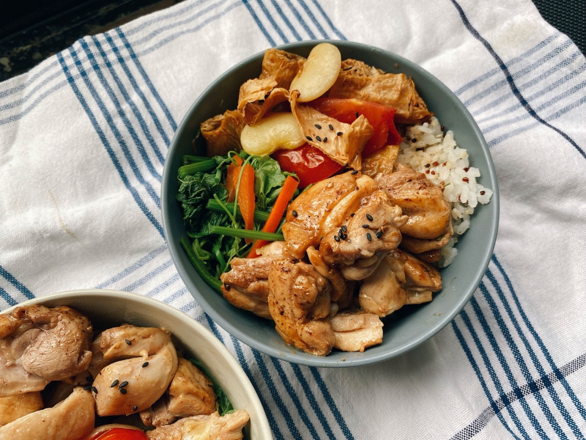

清炒麻油雞、龍鬚菜、腐竹炒皇帝豆



三顆蒜球剝皮，放進玻璃瓶，
\
倒入淹沒過大蒜的食用油，
\
進烤箱以100度低溫烘烤一小時，


放冷後就是常備料理的大蒜油了。
\
爆香快速，不用再切蒜，也是保存大蒜的一個好方法。



從剝蒜頭開始整個廚房就飄著淡淡的蒜香味，
\
從一開始較刺激的生蒜味漸漸轉為溫和的蒜油味，
\
很淡很淡，不是剛吃完蒜頭炒飯時嘴裡那種熏死人的氣味。



剝蒜需要點時間與細心，腦袋很自然的漸漸開始放空，
\
曾看過一個日本主婦分享，她覺得做家事的過程，也像是一種禪，
\
你會很專注於眼前的事，不會胡思亂想，幫助大腦排除混亂的思緒。

