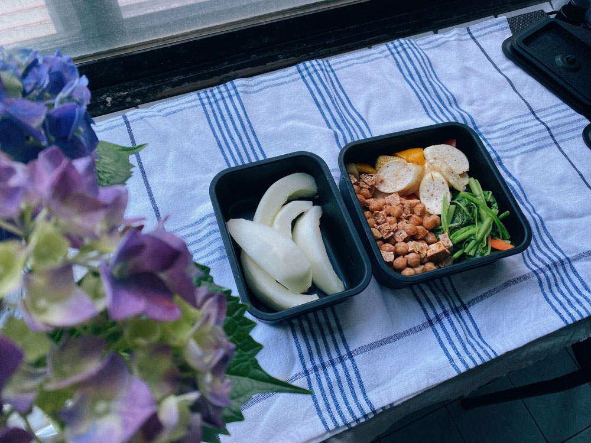




20220530 Mon



五香鷹嘴豆炒板豆腐、甜椒炒皎白筍、蒜炒莧菜、香瓜

男友回中部一個禮拜，本週吃飯人數只剩下我一張嘴，
\
因此幾乎每天都是簡單的清燙水煮解決，有點乏味的一週午間食光(｡ŏ_ŏ)



週末遇到鄰居，他熱情的從家裡拿出當天從陽明山摘回來的繡球花束送給我們，
\
還有一支我喊不出名字的藍色小花，
\
我的天哪太美麗了！

我喜歡家裡有鮮花的樣子(❛◡❛✿)




---

20220524 Tue


五香鷹嘴豆炒板豆腐、甜椒炒皎白筍、蒜炒莧菜、鳳梨與芭樂

跟昨天一模模一樣樣。
\
沒辦法啊剩一個人，一盤菜得多天才吃得完，
\
天氣逐漸步入炎夏，懶得餐餐特別設計菜單，盡量少量開火，
\
能煮一餐抵兩餐當然好_(:3 」∠ )_
\
畢竟鄙人還是有正職要做，每天還是有八小時以上得折腰。

嗚嗚但是也好久沒有認真煮菜了。




---

20220601 Wed


豬肉卷玉米筍、炒空心菜、醬炒豆乾、鳳梨

昨天去市場補貨，最近鳳梨大出，攤販幾乎都能貼心去皮，多買多買！







前陣子連續下雨，很久沒觀察陽台上的盆栽，
\
今天發現許多正準備長出新葉子了！

小紅鶴的花也綻放了，迷你，可愛

準備迎接盛夏的旺盛生命力！




---

20220602 Thu


地瓜、豬肉卷金針菇玉米筍、炒空心菜、醬炒豆乾、鳳梨

同盤菜的第二天。
\
再上班一天就放假了！

已經到了太陽下山後出門走路會微微出汗的時刻了，
\
炎夏正式來臨前的每一天我都心懷感恩，
\
濕濕黏黏的暴躁季節就在門口，能越晚迎接越好。
\
雖然萬物茂盛，生命充滿各種可能，卻是我願意拿「一輩子只剩冬天」來交換的厭惡濕黏季節。




---

20220603 Fri


地瓜、甜豆炒甜椒、芭樂與鳳梨

沒上班的簡單午餐。



我很著迷於光與影。

很久很久以前，在我還很會用instagram的時候，
\
進行了一個catch the light的觀察練習。

我們家的客廳，到了夏天的時候，早上太陽會照進來。
\
冬天看不見，是夏天限定。
\
（你看，太陽的角度真的會隨季節改變）

經過玻璃、窗簾抵達地板時，帶有一條條的線，
\
我總是百看不厭，看一百次還是會拍一百次。

如果有風輕輕吹動窗簾，
\
光影的變化會更多更迷人。
\
要怎麼才能把它收藏起來啊。

