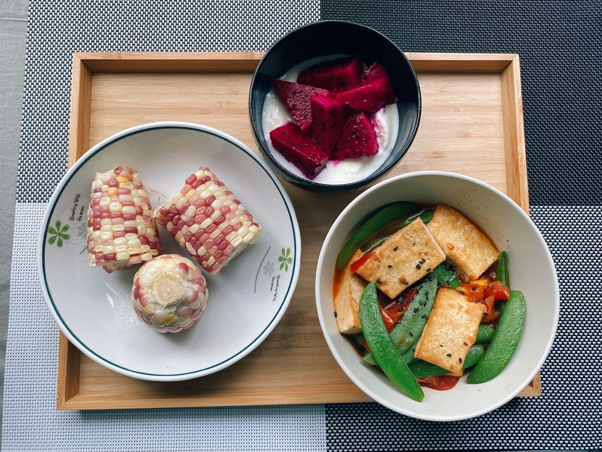
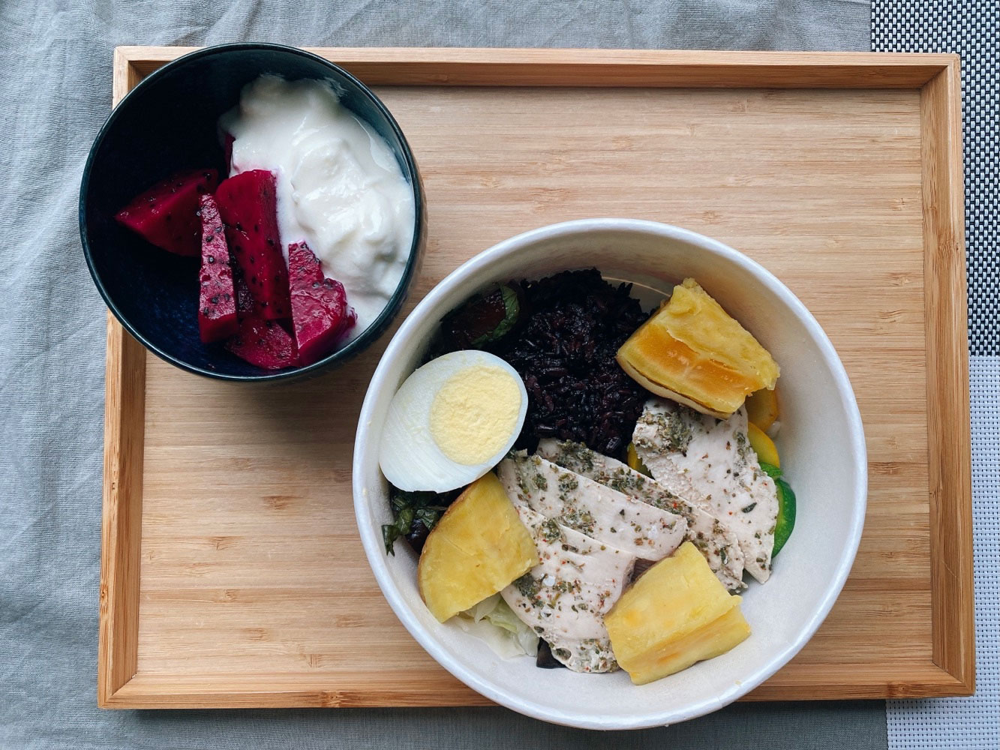
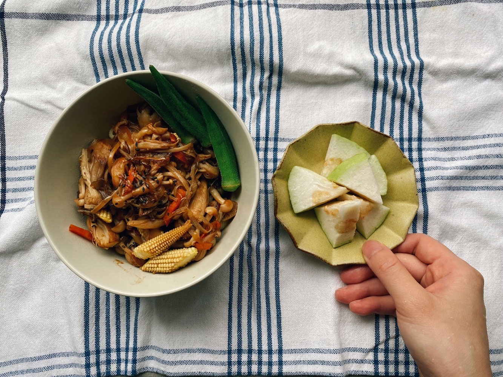
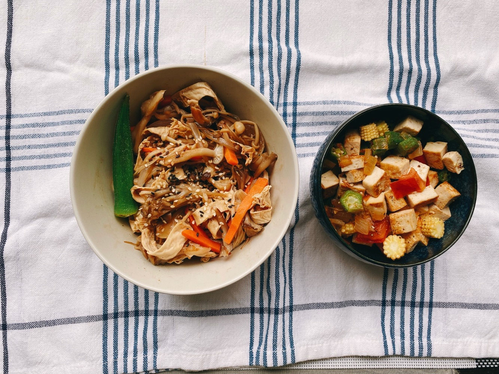
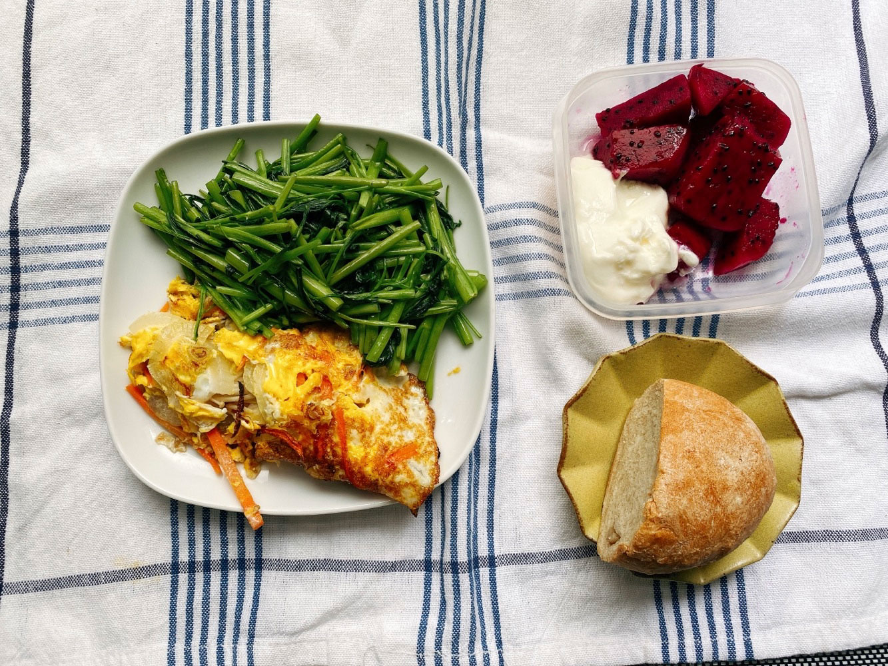




20220606 Mon



茄汁豆腐煲、糯米玉米、火龍果優格

本週是加長一週的一口午餐時間，越煮越簡單了。
\
設計菜單蠻需要腦力的，等上班時間接近午休再想時，往往就沒力氣了( ´•̥̥̥ω•̥̥̥` )



一開始是從牛肉開始。

有意識的不吃牛肉已經兩年了。
\
看了很多環境相關的紀錄片，牛隻的溫室氣體排放、碳足跡等都是前段班，
\
既然只要少吃就能間接影響環境，當然好。
\
原本日常就很少吃，改掉這個習慣並不困難，
\
我可是很願意為了環保讓自己不方便的人呢。

然後時間快轉我就變成一個以蔬食為主的人了。
\
（中間是否省略太多！）

經過幾年的調整，現在優先選擇無肉、天然、原型、調味剛好的食物。

從市場上的選擇來說，素食類的餐廳比較符合我的飲食，
\
但我很不喜歡素食的過度加工品及過多的油炸烹調方式，
\
少吃肉的出發點非宗教因素，而這類餐廳很多會正能量滿到有時令人害怕😂
\
害怕是因為覺得自己道行沒那麼高，也沒打算修行成為高人，
\
若接觸過多的正能量，就會不自覺地檢討批評自己，太負擔😂
\
只能在身心狀況一百分的日子輕鬆面對。

幸好這幾年「蔬食」風氣漸起，終於找到我的歸屬了。




---

20220607 Tue


健檢便當盒、火龍果優格

早上去做了健康檢查，附贈的健康餐於是成為了我的午餐。

這天好像意外遇到詩人徐珮芬，失禮地向她搭了話，
\
過一小時後才發現剛剛搭話的路人是文人作家！
\
難怪氣質這麼好，散發出來的感覺與他人完全不同。




---

20220608 Wed


醬炒無限菇菇拌飯、芭樂

時不時會來個菇類大集合。

冰箱同時有鴻禧菇、雪白菇、舞菇、金針菇，
\
各取一小部分，乾鍋煸炒直到出水有香味，取出備用，
\
另倒入適量大蒜油，投入洋蔥絲炒香，然後加入玉米筍、紅蘿蔔絲，
\
食材炒軟後，加入剛剛的菇菇快炒至熟即可。

菇類有一種強烈的氣味，不排斥的人，這道菜蠻適合做成常備菜，
\
與白飯搭配就是很簡單又快速的蔬食餐，也可加入一點水、打入一顆蛋就變成滑蛋菇菇。




---

20220609 Thu


和風涼拌腐竹菇菇、蔬食豆腐丁

腐竹泡水軟化後切絲，過滾水燙熟後取出。
\
另外熱鍋，投入喜歡的菇類，乾煸至軟化出水後取出，加入剛才燙好的腐竹絲，
\
調味可依個人喜好隨性，加入一點香油、醬油、鹽巴、少許白胡椒就是台味；
\
也可以加入咖哩粉、五香粉等，就是日式咖哩味；
\
喜甜者加入味醂、醬油、砂糖等做成照燒風味；
\
倒入烏醋、醬油、少許鹽巴，則適合夏天開胃。
\
我做菜時調味都很隨興，看到什麼就加什麼。



另外一道菜很適合清冰箱，
\
將板豆腐、洋蔥切丁，秋葵、玉米筍切小口，
\
熱鍋、放油，先下洋蔥丁炒至香味飄出後，
\
投入豆腐丁，煎至表面微焦，然後加入剩下的秋葵、玉米筍，
\
輕輕翻炒至食材熟透後即可。

也是一道簡單快速的蔬食料理，
\
調味同上一道菜，隨興。
\
這邊我加入半顆蕃茄丁，就有清爽夏日風味，




---

20220610 Fri


洋蔥金針菇煎蛋、蒜炒空心菜、全麥麵包、火龍果優格

麵包是之前自己揉的，剛好冰箱澱粉吃完，成為本日澱粉擔當。






這天做了暴躁兔女王的黑糖糕食譜，參考自[《療癒廚房》](https://www.books.com.tw/products/0010698348?sloc=main)，
\
原料很簡單，只需要低筋麵粉、黑糖、牛奶（我換成無糖豆漿）、無鋁泡打粉、少許鹽巴，步驟超簡單。

1. 先將黑糖與牛奶拌勻，如果黑糖顆粒偏大，可以微微加熱方便糖粒融化。

2. 倒入過篩的低筋麵粉、無鋁泡打粉與鹽巴，輕輕拌勻。

3. 表面撒上少許黑芝麻，將以上混合的食材倒入鋪有烘焙紙的耐熱容器。
\
（容器可覆蓋一層布巾，防止水珠滴落，影響成品表面平整）

4. 放入電鍋或已經燒熱的蒸籠，蒸10~15分鐘，竹籤戳入後不沾黏即完成。



這是少數我想收藏的食譜書。

我其實很少看食譜，因為我很介意排版跟食譜內容。
\
大多數食譜看得出來排版比較快速，食物顏色已經很豐富，內容如果有畫重點用的顏色，就會顯得整本書視覺感太滿。

還有視覺動線，
\
這本書是要讓人學習做菜用的嗎？是邊做邊看？還是主要會在書房閱讀，當作收藏？
\
不同使用目的會造成不一樣的排版。
\
有的只放一張完成品主視覺，有的會每個步驟都有小圖片輔助說明，
\
細碎的步驟拆分適合初學者，對於熟悉廚房的老屁股歐巴桑來說，
\
只需要知道食材、大致的步驟即可，有時甚至只要看圖片就能猜到作法，
\
舒服的調色和排版比較重要。

還有編入書中的料理選擇，
\
不用多，太基本的、換湯不換藥的暫不需要，
\
大略翻看一下就能感受到作者的氣質、做菜風格和目的，頻率不對的很快就會闔上放下。

對於走市場比走百貨公司還熟稔的歐巴桑來說，
\
很需要靈光一閃，跳脫日常習慣的菜色，參考他人餐桌。



這本療癒廚房在基本的道具、手法介紹上篇幅不多，
\
大部分是非操作面上的一些提醒或習慣分享，
\
比如家中常備的調味料有哪些、料理酒是什麼品牌、喜歡的抹布、開立菜單的方式、採購的習慣等（我也一樣很討厭塑膠袋！寧可自備好看的籐編提籃），
\
並穿插一些料理習慣，如何清潔整理分類收納等，並分享了她購物補貨的愛店，
\
適合中級廚房玩家，練習煮的優雅。
\
就算是很熟悉廚房瑣事的主婦，也要日新月新，學習更精簡聰明的方法。



一不小心就推薦起書來了，收納控就是喜歡這種乾淨快速的小撇步

博客來《療癒廚房 我家的舒適食、常備菜、料理的基本與廚房裡的大小事》
