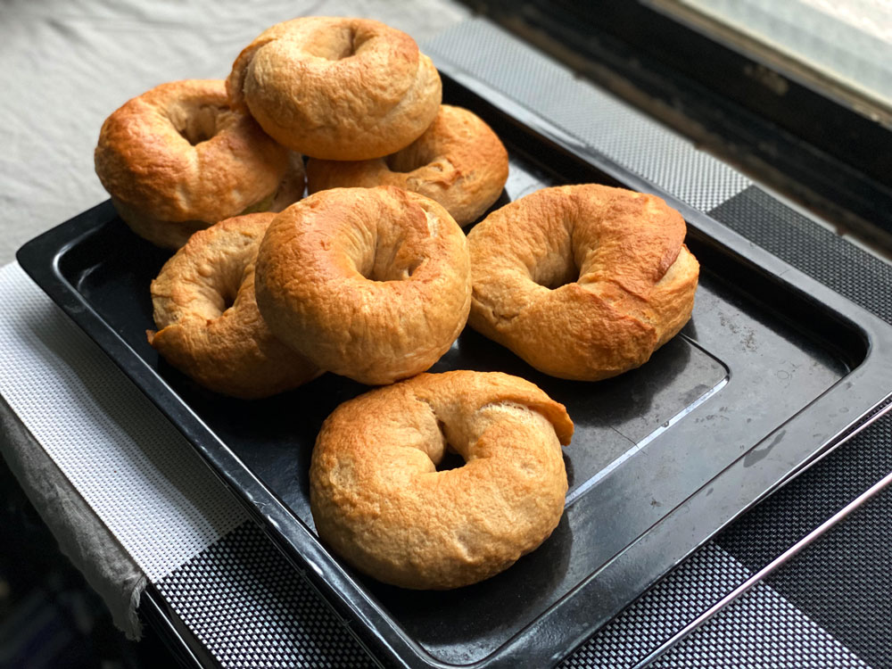
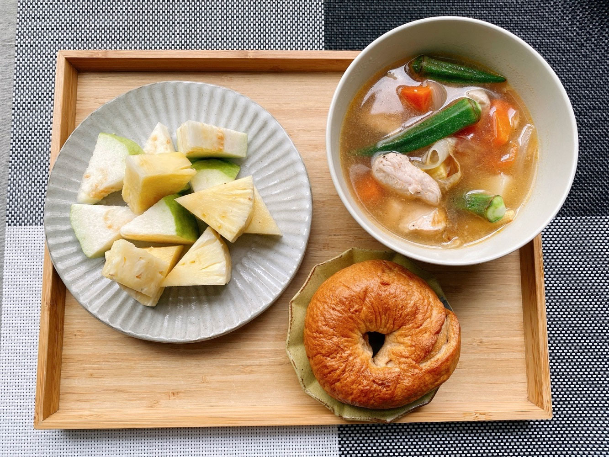
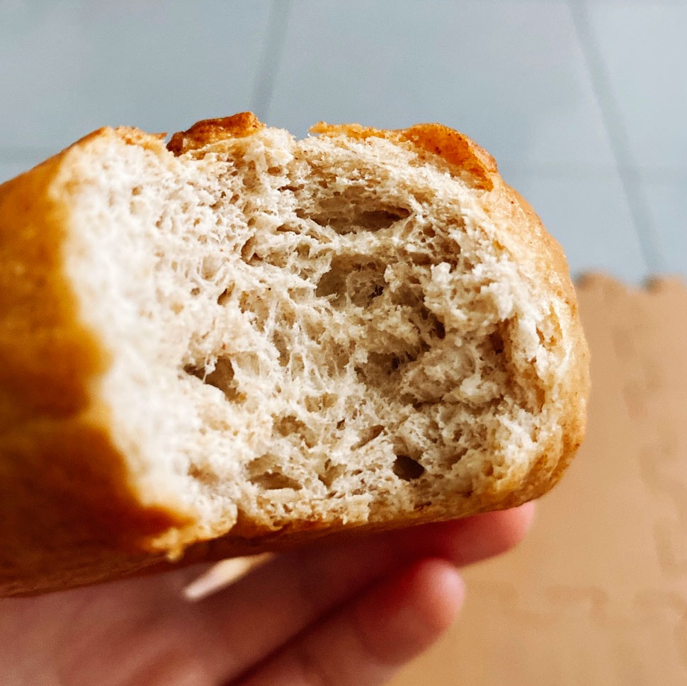
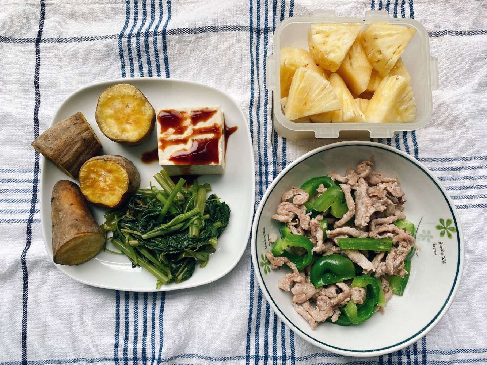
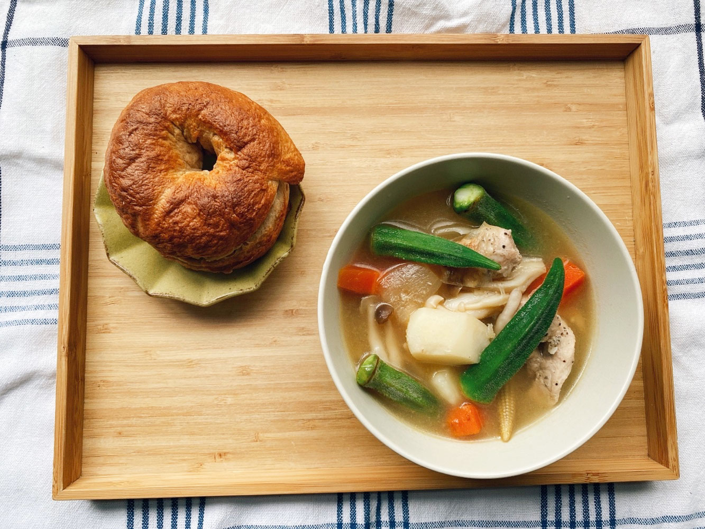
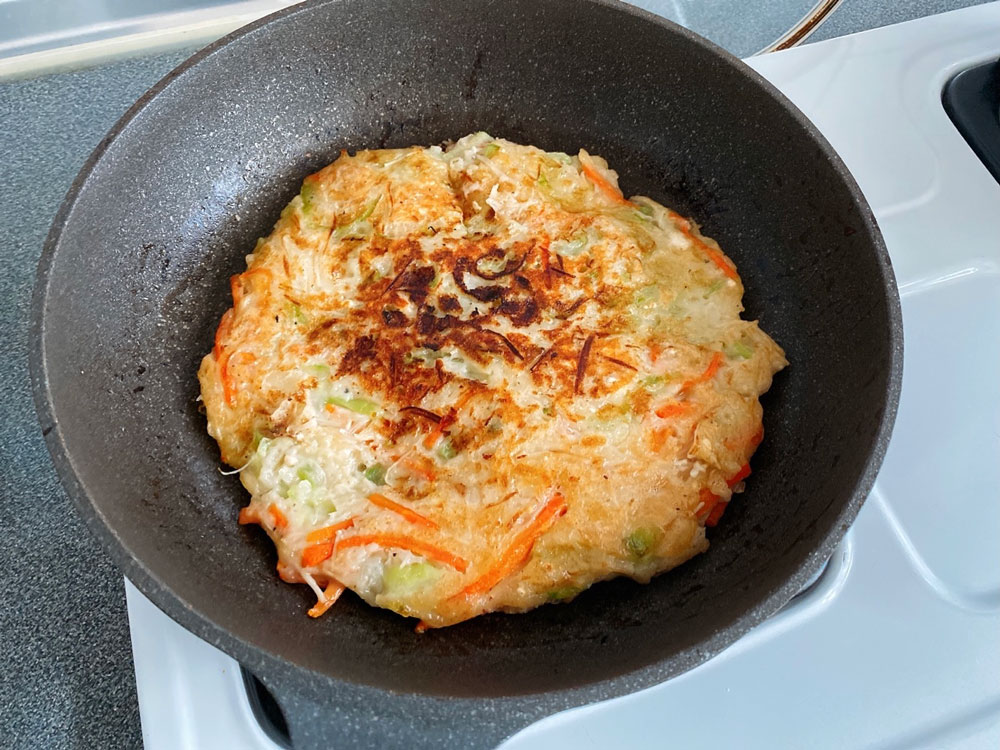
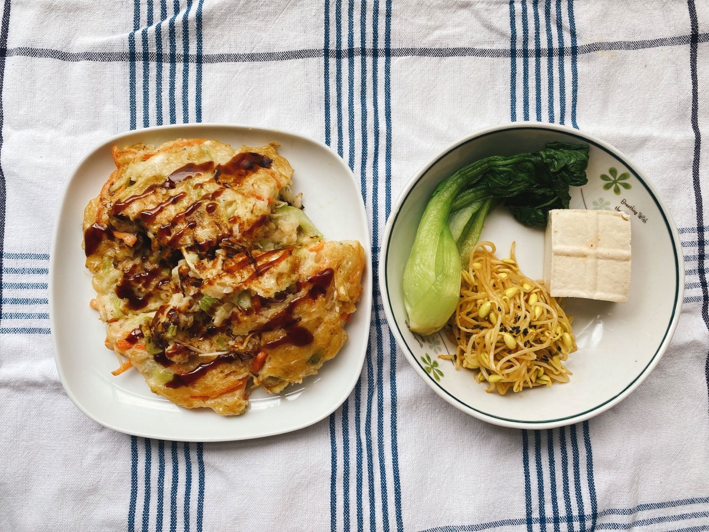
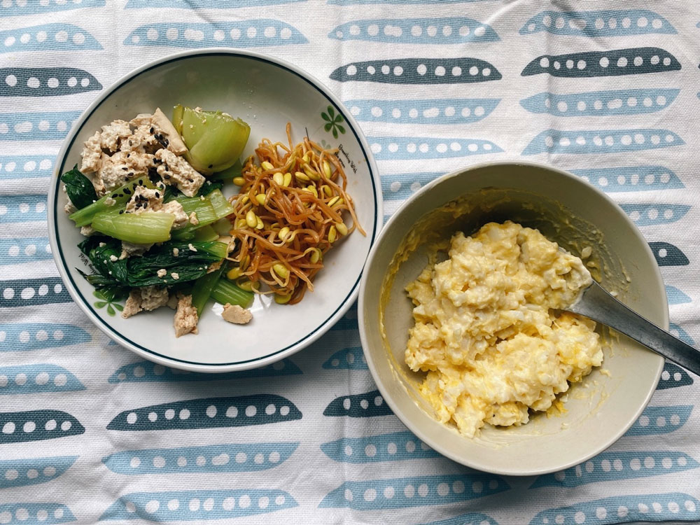
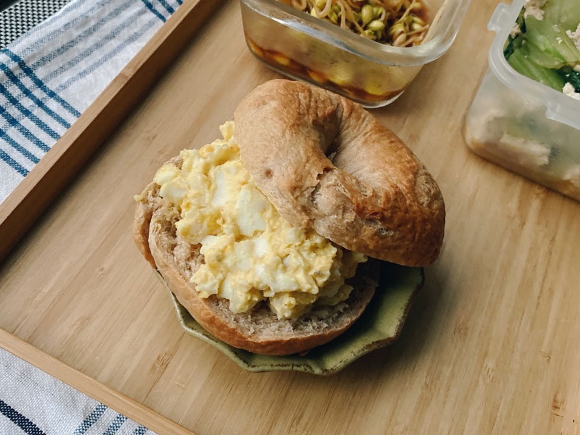




20220612 Sun


優格貝果





好久沒揉麵團了，剛好冰箱有一些優格，我打算取代原始成份裡的水，增添風味。
\
還有一小盒地瓜泥，那就來包幾顆有餡料的吧。

這次的成品表面皺巴巴，收口也不是很好，不太上相，
\
之前沒這麼醜的啊😂真的是太久沒做了。




---

20220613 Mon



番茄馬鈴薯燉肉、芭樂、金鑽鳳梨、優格貝果

雖然這批貝果長得不可愛，但咬起來有直衝腦門的超濃優格味，
\
好像真的在吃優格一樣，
\
是不計成本自家廚房出品才有的d(`･∀･)b

用鑄鐵鍋煮的馬鈴薯塊形狀完整，
\
一咬下就在口中化開，
\
鐵鍋保溫性非常好，不用久燉，關火後靠著鍋子的餘溫也會慢慢入味。




---

20220614 Tue


烤地瓜、炒空心菜、涼拌豆腐、青椒炒肉絲、金鑽鳳梨




---

20220615 Wed


味噌菇菇馬鈴薯燉肉、優格貝果（地瓜餡）

週一燉的一大鍋馬鈴薯燉肉，今天加一點雪白菇、鴻禧菇，再加入一大匙味噌，
\
就是一道新菜色。

如果加入咖哩塊就會變日式咖哩，
\
加入鮮奶油、牛奶、高麗菜，就可以變奶油燉菜，
\
馬鈴薯燉肉是很好變化的基本燉菜選擇。

因為有番茄和洋蔥、紅蘿蔔，
\
喝起來是很清淡、鮮甜、無負擔的湯頭，
\
只需要一點點鹽巴就可以上桌。

吃習慣添加物少的料理，嘴巴很容易就能滿足，
\
也會不知不覺降低想吃零食、甜食的慾望。
\
反而吃久了重口味外食便當，身體會想要更多味覺來平衡。




---

20220616 Thu


絲瓜煎餅、麻油涼拌黃豆芽、豆腐

第一次嘗試用絲瓜做煎餅，過去都是直接快炒。

絲瓜、紅蘿蔔、金針菇切絲後，鍋中放少許油先下鍋炒軟，
\
絲瓜水分很多，途中會出很多水，不需要再另外加。

炒軟後盛起，稍微放涼後可打入一顆蛋，加入少許鹽巴、白胡椒調味（看個人口味），
\
再加入適量的麵粉（中筋或低筋皆可），調配至麵糊狀的黏稠度。
\
（我切了半條絲瓜約260克，共加入110克的低筋麵粉，雞蛋可省略。）

鍋內倒入足夠的油，煎餅需要多一點點油才會夠香，
\
然後將麵糊倒入，先將一面煎熟，（用鍋鏟輕推煎餅不再黏鍋時即可翻面）
\
翻面也煎至金黃色後即可起鍋。




---

20220617 Fri


青江菜拌豆腐、麻油涼拌黃豆芽、馬鈴薯蛋沙拉

週末要回台中，今天的任務是清冰箱，

板豆腐燙熟起鍋，拿一個略重的物品壓在上面，去除水分然後分成小塊，
\
與青江菜拌在一起，撒上芝麻，快速完成。

剩下一小盒馬鈴薯泥，與水煮蛋壓碎後拌勻，以少許鹽巴、黑胡椒、美乃滋調味，
\
（放奶油、牛奶、鮮奶油會更濃郁滑順，但我想吃清爽一點的口味）
\
夾在親手做的貝果裡，從頭到尾都是自家出品的輕食餐(๑´ڡ`๑)





你有看過我家阿龜嗎，沒有的話讓你看看～


龜背芋是去年（2021）四月時買的，那時候只有四片小葉子，
\
經過一年多已經長成這麼大株，今天發現又冒出新葉子了。

巡陽台時發現新芽是養植物最驚喜的時候，
\
然後開始每天觀察生長進度，就像新手媽媽會每天為寶寶拍照一樣。

買這棵龜背芋原本打算放在客廳，
\
但因為我們家與鄰居棟距太近，客廳的窗簾幾乎全年得拉上，使得室內光線和通風不是很完美，
\
只好請他暫時委身在後陽台，想念的時候晃過來看他幾眼。

喔我還會幫他擦葉子！
\
都市落塵很多，要定時擦去頁面灰塵，才不會影響光合作用。

擦葉子的時候動作要很輕，小心不要扯傷植株，
\
要很慢、很柔，過程好像在跟植物說話一樣，你會知道他過得好不好，
\
精神飽滿的植物，葉子會呈現彈性、有活力，你一定看得出來。

我想阿龜應該過得還不錯吧。

