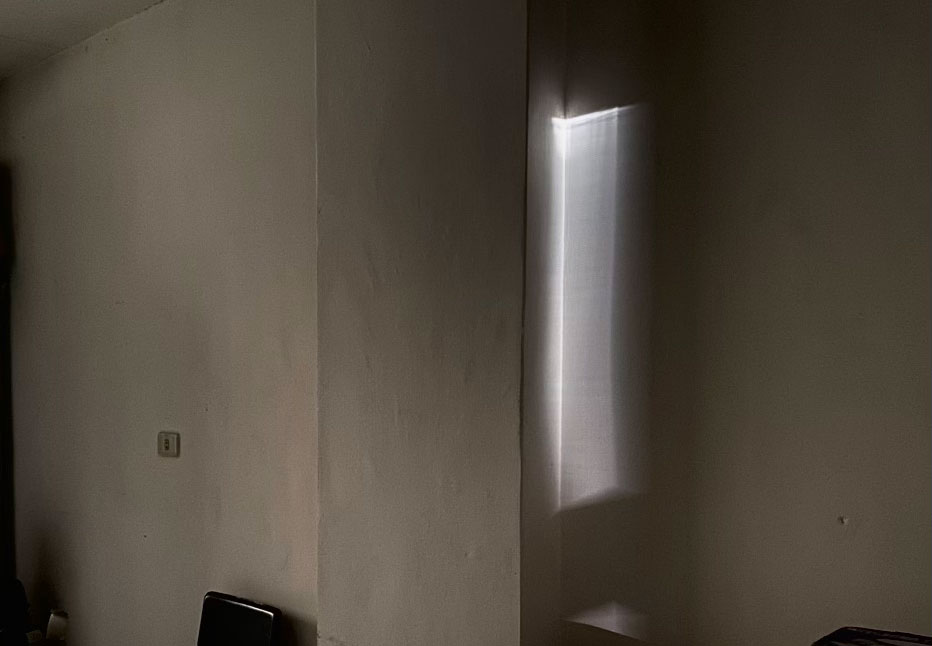
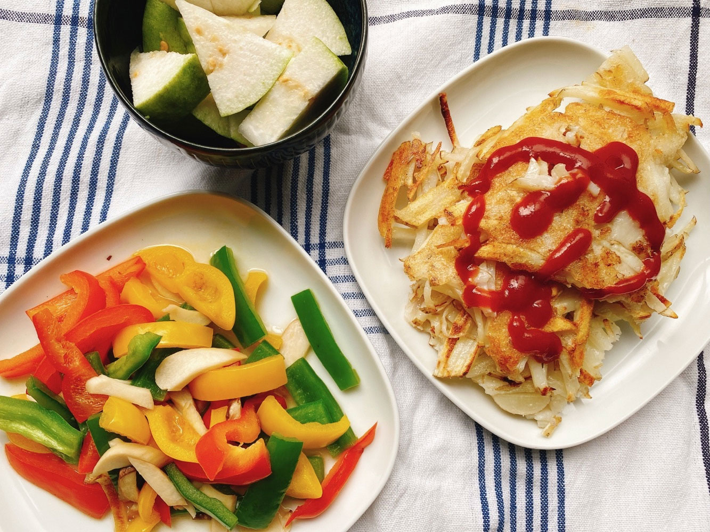
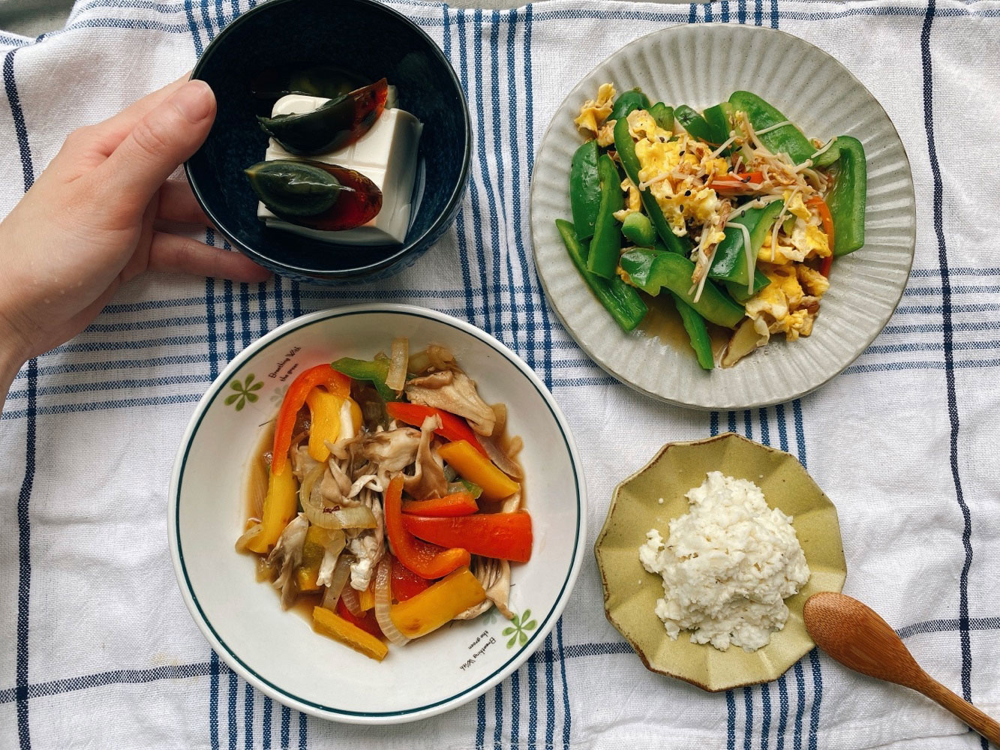
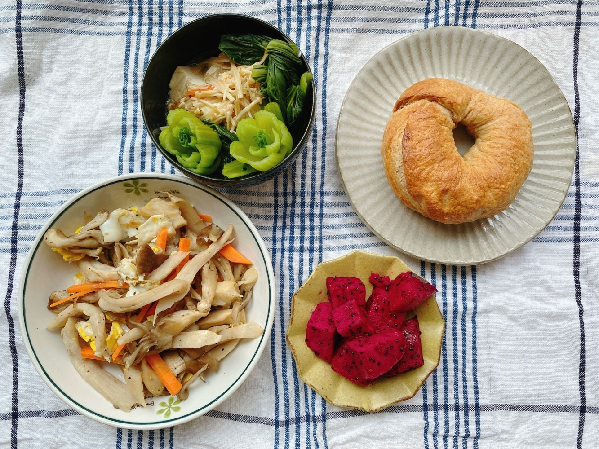
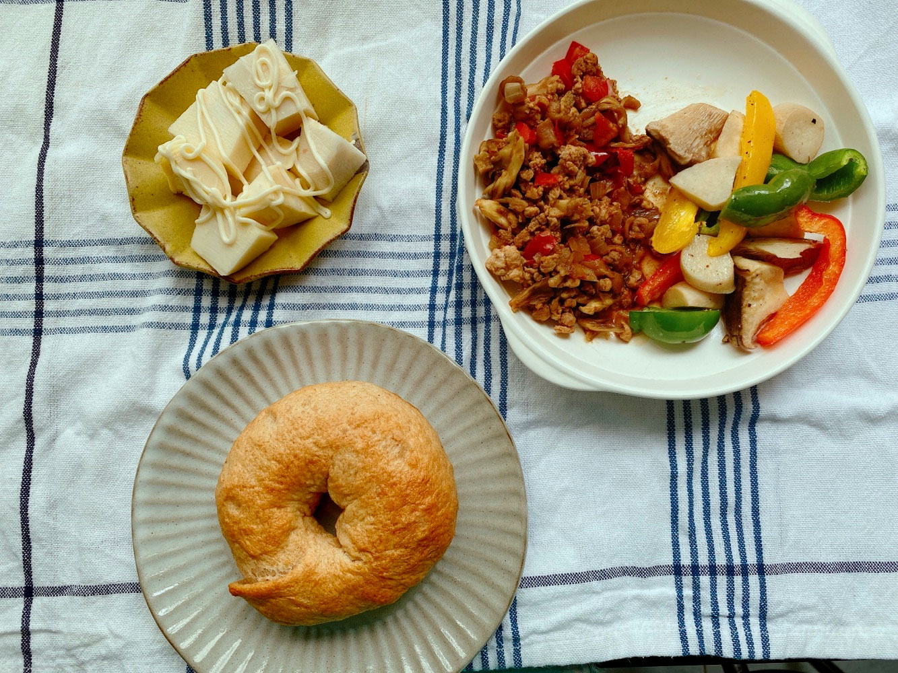
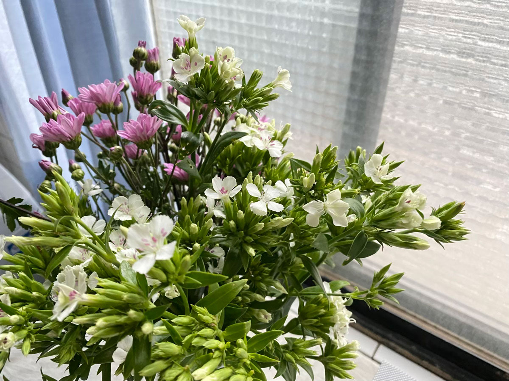




20220620 Mon



我度過了一個快樂的週末。



每次回到台中，都有一種很舒坦的寬心感。

那些原本對事情的執著、對習慣的堅持、對人的防備心、對時間的焦慮、對細節的吹毛求疵等，在火車的兩個小時中，都會逐漸鬆綁。

我不確定出現這種放鬆感的原因為何，是因為回家後我不用張羅家事嗎？可以不用睜開眼就在腦袋中快速安排家事順序與三餐內容嗎？還是回家我就可以專心當一個小孩？或是純粹只是離開都市、離開工作環境的自然反應？



那是一種很自然的狀態轉變。



這個地方我很熟悉，即使我的生活圈早在多年前就已經轉移，很多店家早就換人經營而我卻不知道。相較起居時間超過90%以上的台北租屋處，一年回來不到十次的房間，卻能給我更踏實的安全感。被子、枕頭、衣櫥等，都停留在學生時代的我的品味，現在的我的選擇一定不會是這樣，可是好安心喔。躺在地上午休沒關係，追劇看動畫也沒關係，肚子餓就去冰箱找食物（因為不是我的冰箱，我背不出裡面有什麼）。

對耶，一回到家，無法追劇的症狀居然好轉了。



媽媽的廚房和爸爸的收納習慣有一些我忍不住想插手整理的部分，我會很願意花大把時間清潔媽媽無暇照顧的瓦斯爐平台角落，或者規劃某櫃子的擺放方式，然後大肆採購收納盒回來整理。（雖然下一次再回來的時候，又變回原本的樣子，那是爸爸的收納習慣）

但我又很清楚的知道，與家人同居一段日子之後，生活習慣和價值觀的衝突矛盾會漸漸浮現，拓寬的心又會開始變得醜陋又狹隘，所以我得把持好自己的控制欲，在受不了出手之前，就要北上。



在有爸爸媽媽的家多好。

媽媽還是把我當小孩一樣，出門工作前會在冰箱留菜給我，等我起床後再用LINE告訴我中午吃什麼。在外地自己住久了，更能強烈感受到所謂主婦、家事主理人一天的忙碌為何，都是很瑣碎的小事，可以很敷衍地做，也可以很謹慎的安排。做的好並不容易，但家裡一旦少了這個張羅家事細節的角色，家就不能是家了。



喔還有洗衣精的味道。

穿回台北的衣服，有媽媽慣用的洗衣精的味道，可以把我對家的喜歡多延長幾天，提醒我不要常常皺眉，可是好難喔。



我好喜歡看稻田




---

20220621 Tue



馬鈴薯煎餅、甜椒炒杏鮑菇、芭樂、綠豆湯






回台北第一件事先到陽台關心植物，夏天日照強，水分容易蒸發，
\
發現上週還捲捲的新葉子已經展開了！







房子快要被太陽曬暖，去年冬天以來累積的屋內涼爽感即將消失，
\
這種天氣很適合煮綠豆湯，放入冰箱，下午的時候盛一小碗就能快速消除熱氣與倦意。









---

20220622 Wed


薯泥沙拉、青椒炒蛋、舞菇炒甜椒、皮蛋豆腐




---

20220623 Thu


優格地瓜餡貝果、雙菇炒蛋、青江菜、豆腐金針菇、火龍果

Um...對，我的冰箱有好多菇和甜椒，我有點倦了。




---

20220624 Fri


舞菇蕃茄乾咖哩、烤甜椒、涼筍沙拉、優格地瓜餡貝果

買了今年第一根竹筍！




---

20220625 Sat







今早跑到內湖花市，那邊鮮花應該比較多，一直很想要買鮮花放在家裡。
\
之前習慣去建國花市，但那邊盆栽、觀葉植物比較多，鮮花的話還是內湖花市選擇多。

光是邊走邊看各種鮮花，心情就能得到療癒。我喜歡桔梗、雛菊、小向日葵、鬱金香，尤其是鬱金香，他好優雅！
\
但現在好像不是鬱金香的季節，我想避免買進口的花，只是要妝點家裡，選當季、碳足跡少的就好。

菜鳥如我第一次認真買花，對花況尚不熟悉，
\
最後帶了一把粉菊和深山櫻回來，都是小朵的花，
\
一部份放在廚房，剩下一點點放在電腦旁，
\
他們都還有許多未綻放的花苞，期待再過幾天他們慢慢綻放的姿態。

家裡一旦有了花，視線、氣氛立即柔和了起來。



我知道我喜歡植物、喜歡花，但沒有固定買花的習慣，通常是上市場剛好看到才順手帶一把。
\
前幾週買了一束繡球花，又從鄰居手中獲贈一把陽明山採回來的鮮花，
\
那幾個日子，只要視線瞥到花朵上，心情立刻晴朗放鬆了起來(⁎⁍̴̛ᴗ⁍̴̛⁎)
\
不斷嚷嚷著家裡有花真好，我選的花真美～

唉唷我怎麼從來不知道讓心情愉快是這麼簡單的事。

兩三年前我開始有意識的練習，在某些方面順應自己的直覺做選擇，
\
就像植物和花，過去總嫌麻煩、難處理，往往看了就走，沒想過要擺在家中，
\
但他明明是確定能讓我更喜歡生活的小傢伙。



最近在看暴躁兔女王的[《療癒廚房3》](https://www.books.com.tw/products/0010825354)，從書中得知安徒生曾說：
> 光是生存著是不夠的，要活著，你必須有陽光和自由，以及一朵摯愛的小花。

現在我有陽光，我有可貴的自由，剩下的就是買束喜歡的小花了 \*ଘ(੭\*ˊᵕˋ)੭\* ੈ✩‧₊˚

