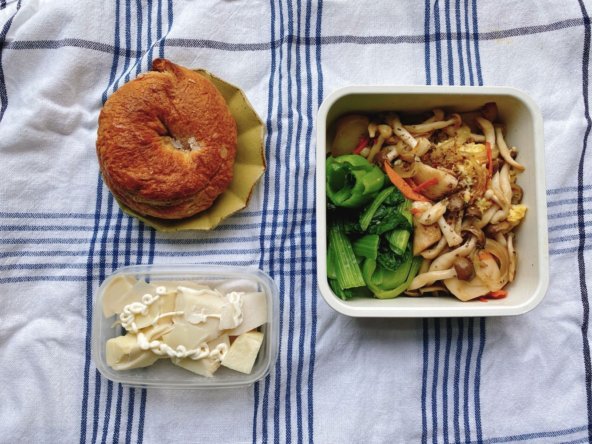
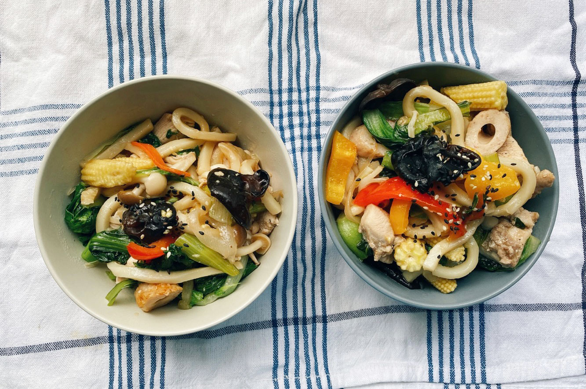
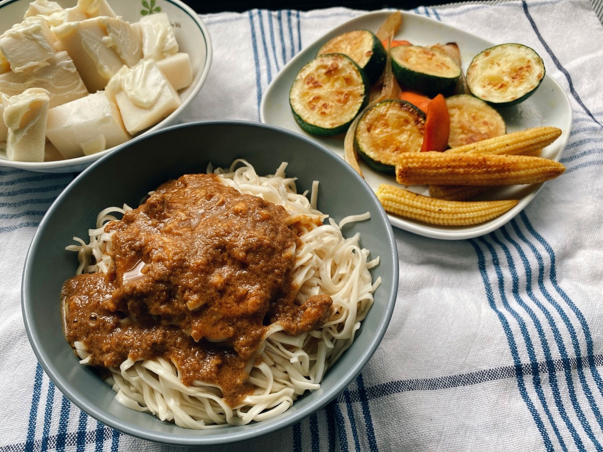
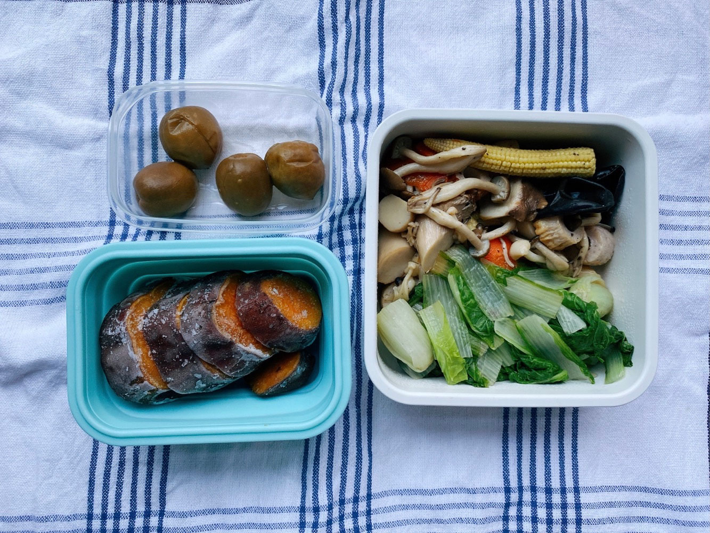
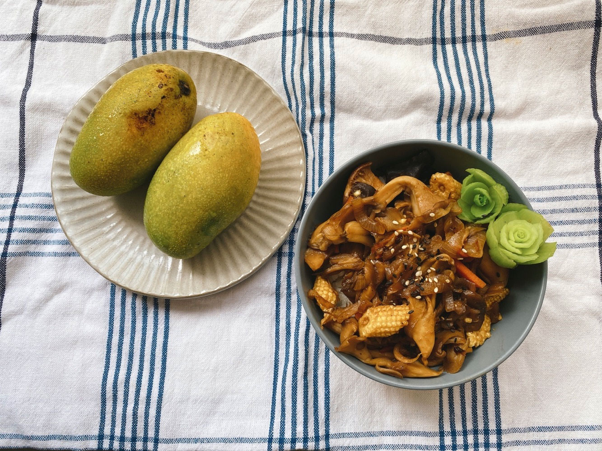




20220626 Sun








荔枝開始出沒。

四月梅子季釀的意猶未盡，當時就下定決心今年還要嘗試荔枝酒。

我參考了[Carol](https://caroleasylife.blogspot.com/2013/06/blog-post_26.html)的食譜，
\
採用天然釀造的方法，只用冰糖和去殼去籽的荔枝果肉製作，
\
要等待三個月，大概中秋節前後就可以喝了！




---

20220627 Mon



優格貝果、義式菇菇炒蛋、青江菜、涼拌竹筍

週末和朋友吃飯敘舊，吃到一盤美味的早午餐，
\
其中的菇菇炒蛋味道讓我印象深刻，決定自己嘗試復刻，
\
果然技術還是差太多，除了義式香料及菇菇本人以外的部分都比不上。






荔枝酒觀察：
\
才一天就已經開始有汁液了。




---

20220628 Tue



日式炒烏龍






荔枝酒觀察：
\
出現好多泡泡，應該是開始產出二氧化碳了。




---

20220629 Wed


家常麻醬麵、烤蔬菜、涼拌竹筍

自己調的麻醬，加入一點點的花生醬會非常提味，
\
如果在家做的話可以試試看！









---

20220630 Thu


冷凍地瓜、什錦炒菇菇、小白菜、脆梅

四月釀梅酒剩下一點點梅子，嘗試做了一小批脆梅。

相比起製作梅酒的輕鬆快活（因為可以邊想著開封暢飲的那天），脆梅這東西麻煩上百倍，
\
要脫水、要殺青、要去澀、要多次浸泡糖液，太耗時，
\
以後看到賣脆梅話梅Q梅的職人小農，都要對他表達十萬分的敬佩。






荔枝酒觀察：
\
經過不到一週的發酵，容量已經剩不到一半，原來水果酒如此珍貴！

不過顏色一直讓我想到可爾必思喔，好適合夏天。




---

20220701 Fri


洋蔥雙菇蓋飯、土芒果










吐司麵團的發酵變化紀錄。
\
真的有長大吧。








