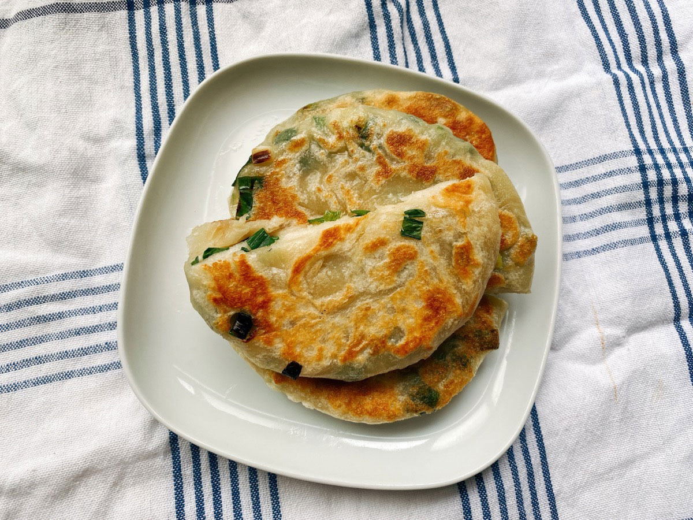
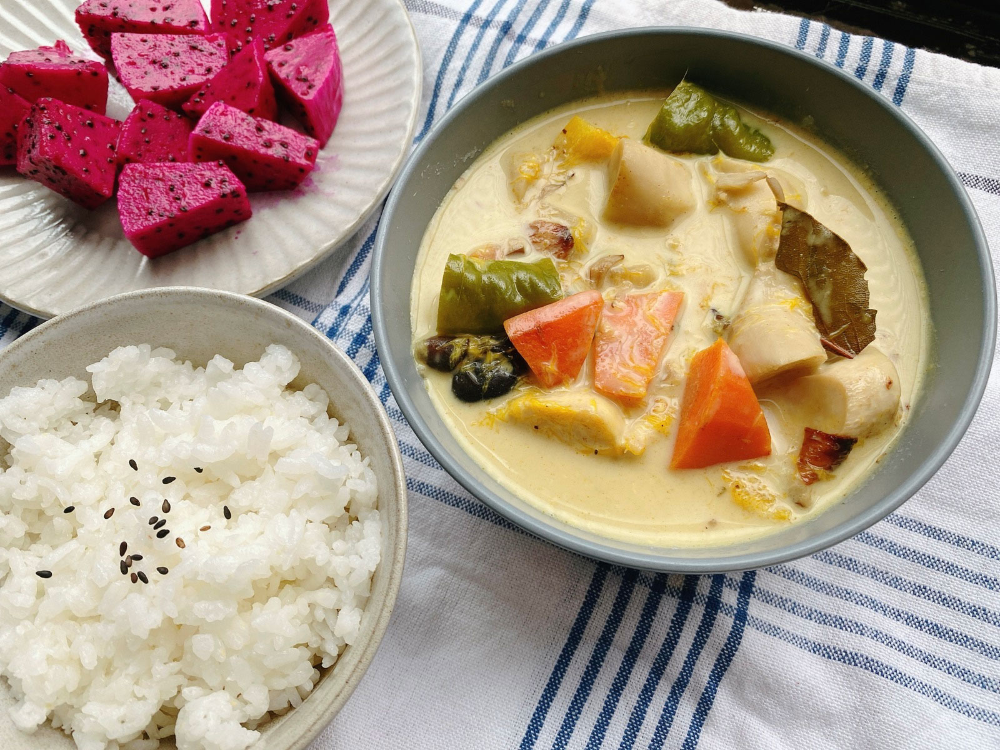
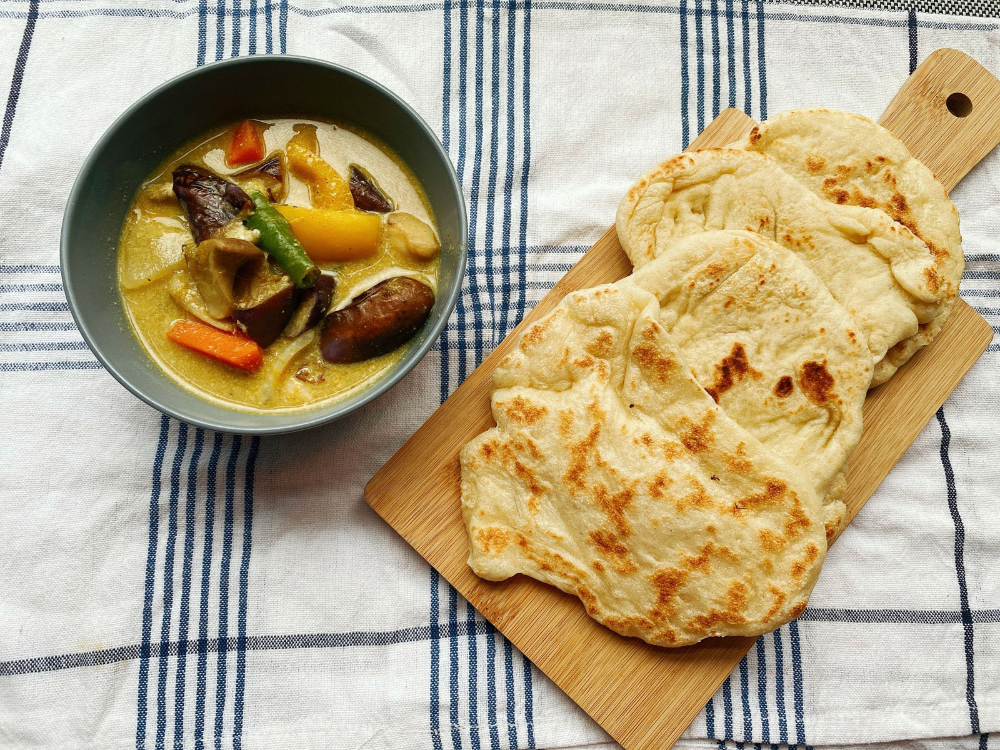
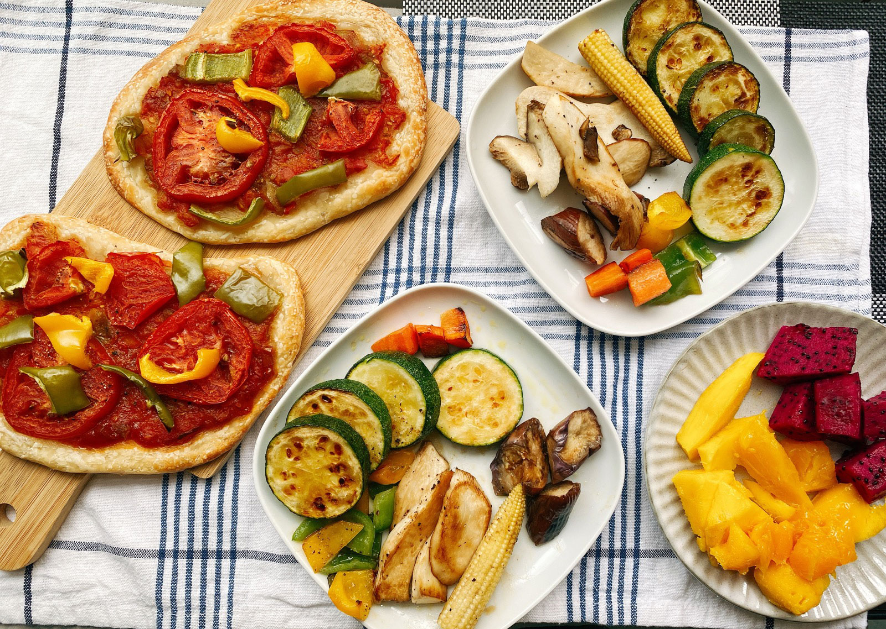
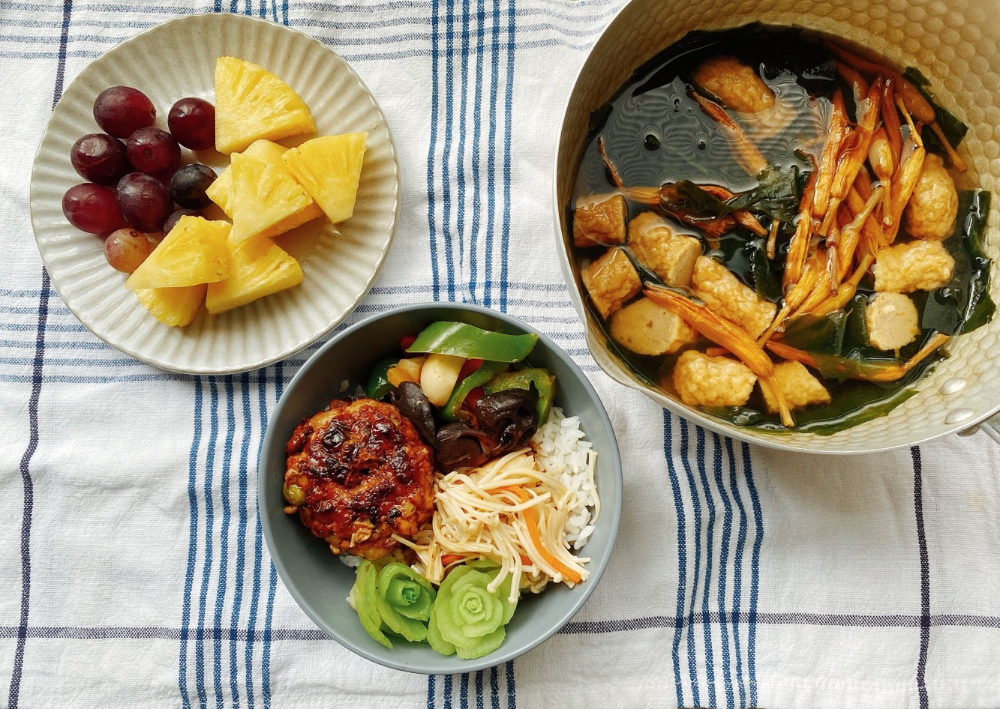




20220703 Sun













早上在市場看到一大把蔥60元，半把30元。
\
今天是假日，好，買個半把來做蔥油餅吧。

自己做就是蔥量加爆，已經加到包不起來，但怎麼成品看起來蔥量還是好少？


家裡還有幾顆牛番茄和黑柿蕃茄，
\
參考暴躁兔女王的食譜，打算作成蕃茄糊，延長保存，同時當個常備菜。

若有食物調理機，可直接將蕃茄洗淨去蒂頭後打碎、熬煮，
\
我沒有食物處理機，只能一顆一顆手工切成碎，
\
其中皮和籽都保留，那是營養來源之一。

加入蕃茄重量1%的鹽巴，以中大火燉煮，當水分漸少時，要適時以鍋鏟攪動，避免粘鍋，
\
直至鍋中的蕃茄漸成糊狀即可關火，稍微放涼後就可以倒入器皿中冷藏保存。

幾天之後我用這碗自製的蕃茄糊考了披薩，沒有額外添加物，只有鹽巴和糖，很清爽！




---

20220704 Mon



椰汁芒果蔬菜咖哩






冰箱芒果堆積成患，一天一顆也不是辦法，乾脆拿來入菜，與椰漿一起做成蔬食咖哩。




---

20220705 Tue



椰汁咖哩、印度烤餅











昨天沒吃完的咖哩，今天改搭配印度烤餅。

烤餅的麵團比較濕，非常黏手，要請時間幫忙，讓麵筋自動形成，減少用手揉麵的時間。
\
我沒有大石板，只能用一方小鐵鍋，將鍋子燒至高溫後，將餅一片一片放入，小心翼翼的烙。
\
從成品的顏色看起來鍋還是不夠熱，沒有形成泡泡，
\
但已經夠香Q，即便不搭配咖哩都可以直接吃完。

這餐我要賣$180，哈哈哈哈哈哈哈哈。

哪有人上班日中午還有現場手作烤餅吃的•_ゝ•



---

20220706 Wed


手工披薩（自製蕃茄糊）、烤蔬菜






週末做好的蕃茄糊，原本就計畫要拿來做披薩。
\
幸好冰箱還有之前做好的披薩麵團，不用連兩日早上就在揉麵團。

除了蕃茄糊以外，只有加一點點番茄醬打底，上面只鋪了青椒、甜椒、蕃茄片就滿了，
\
不放起司是因為平時料理太少用到，不想專程準備，少放也少一點熱量。

今天算吃得很正常了，之前的披薩我都當成清冰箱料理，有什麼料放什麼，
\
有放過米血與花生粉、照燒菇菇、奶醬蝦仁與青豆系列，放什麼都蠻搭的。
\
如果說炒飯是中式料理的清冰箱大王，那麼披薩應該可以說是西式的好夥伴了。



---

20220708 Fri


照燒漢堡排、佃煮金針菇、杏鮑菇炒青椒、豆芽黑輪金針湯、鳳梨與葡萄

WFH的最後一天，下週起就不能吃到現煮的午餐了，
\
出門前大腦就要清楚判斷晚上要煮什麼、要退冰什麼、什麼要下班繞去買的日子，

很神奇欸，雖然只是工作場域的轉變，卻會影響到很多事情的行進與規劃方式，
\
回到辦公室後，買菜煮飯就會變得像打仗一樣分秒必爭了。










上週末買了幾顆檸檬想做冬瓜檸檬，但檸檬本人保存日期有限，一次也用不完一整顆，
\
那就先做成糖漬檸檬，不僅延長存放日期，使用上也更方便彈性。



