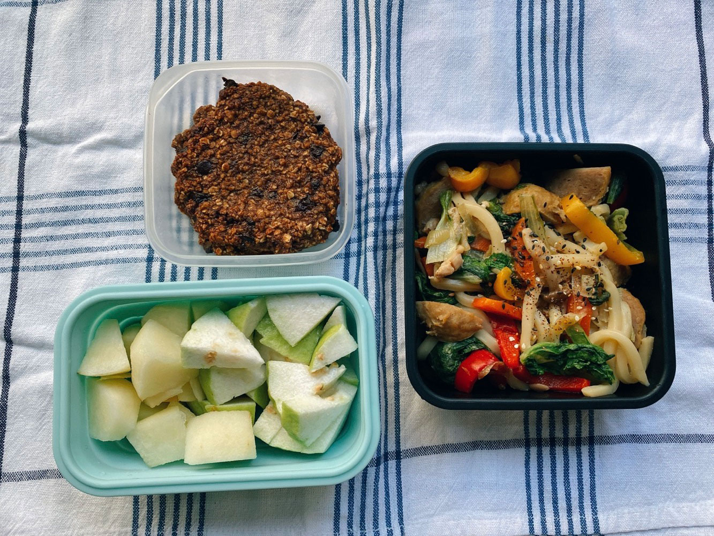
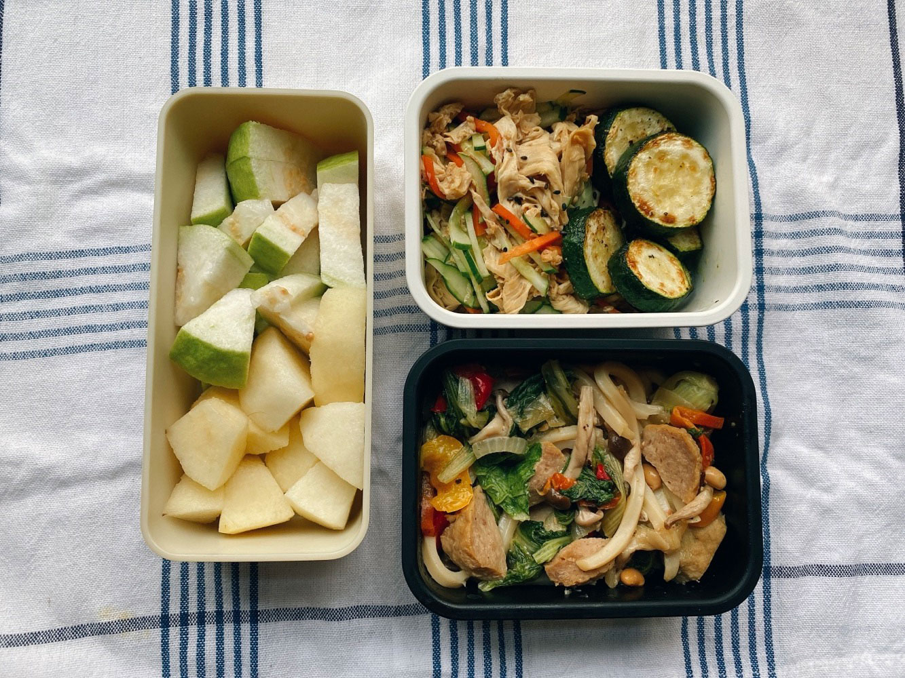
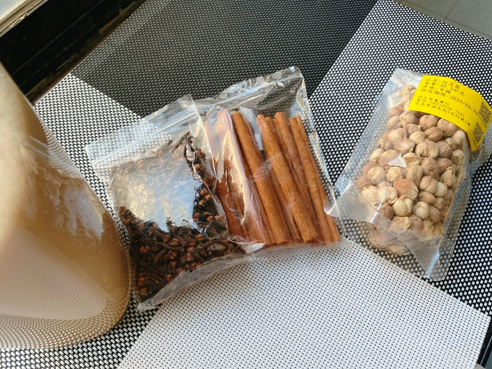
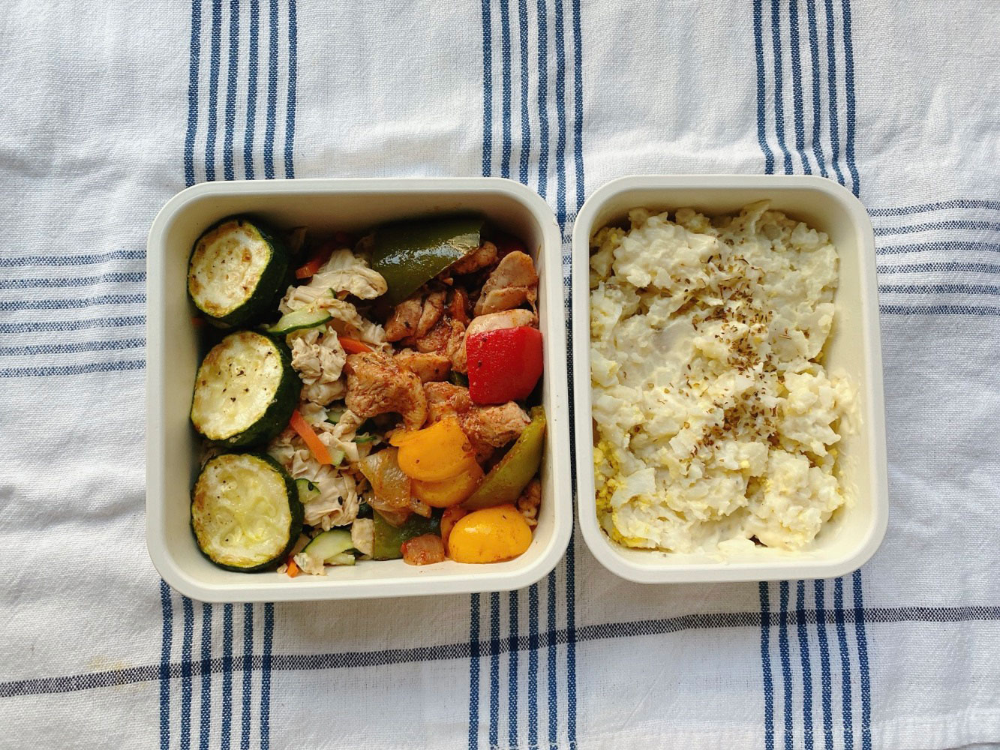
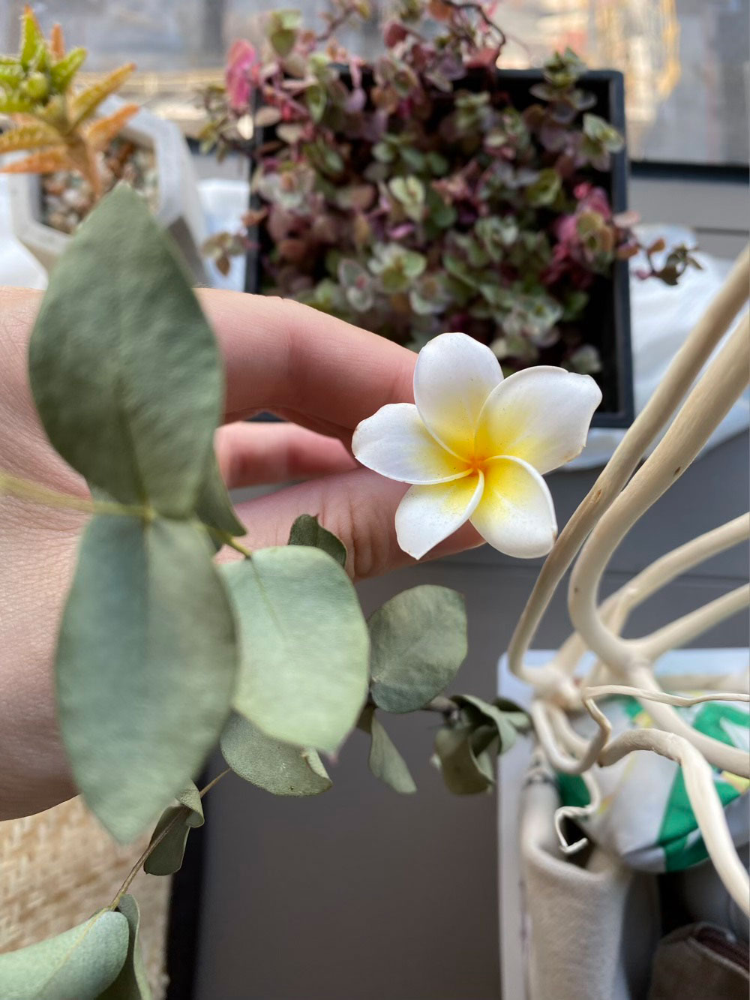
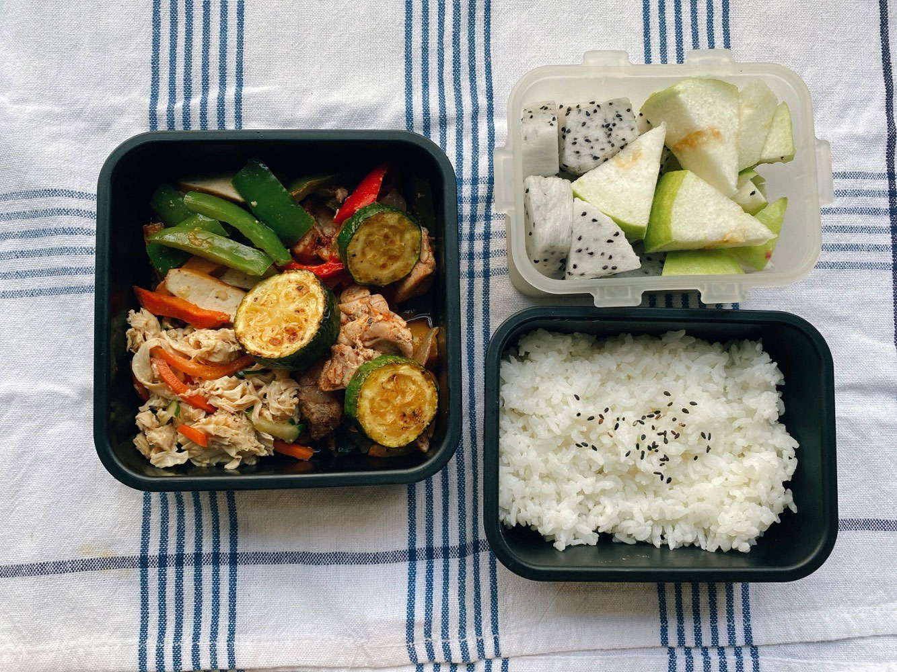
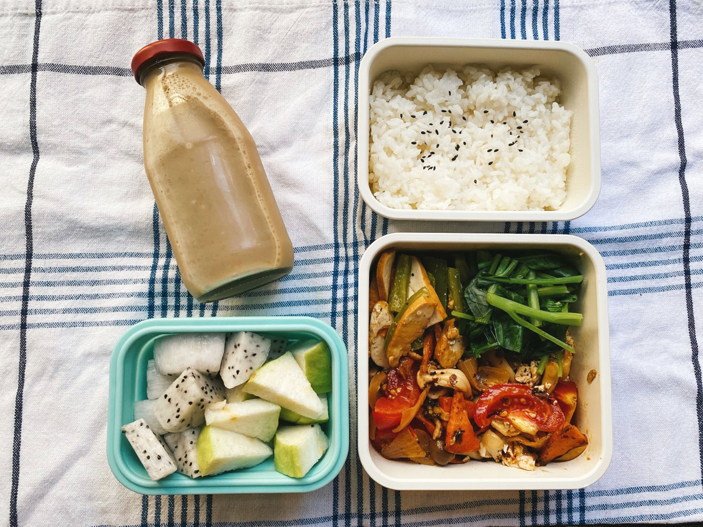




20220821 Sun



來台北好久，爬過幾次七星山，小油坑、冷水坑的路線都走過，這次終於把第三條苗圃的路線收集到手。

即便海拔一千左右的陽明山，在夏季太陽出來後，高溫還是很炎熱，所以這個季節的爬山，我都會盡量在六點前出門。

從苗圃起登的路線樹蔭很多，三分之二以上的路線都免去曝曬的痛苦，減少體力流失，只有最後面接近山頂的一段路都是劍竹林，沒有遮蔽。




---

20220822 Mon

日式炒烏龍、芭樂、水梨、香蕉燕麥巧克力餅乾

上週同事送我一串香蕉，過了一個週末迅速熟化，於是拿來加工做成餅乾，今天帶了最後僅存的一片給原主人吃。
，我得費盡心力才能用左手按住右手不要把餅乾全部吃完，想說最少最少得留一片給食物供應者，用產品說服她我可以處理。

她吃了之後給了我肯定的微笑，不管是不是場面會、社交辭令，我都收下了，哈哈哈。




---

20220823 Tue



白味噌炒烏龍、香煎櫛瓜、涼拌豆包絲、芭樂、水梨

我有一個持續累積的音樂播放清單，只要感覺到疲憊，或是剛經過一場認真交心的對話，心靈感到滿足愉快就會聽。而每次聽，都有療癒放鬆的感覺，把緊繃的神經，快速運轉的大腦調整回行板般的速度，就像激烈運動過後身體需要一個冷卻的時間一樣。這個清單永遠可以幫助我精神回到平穩沈靜的狀態。

就像comfort food一樣，也可以整理一份comfort music，脆弱疲倦的時候，讓耳朵有個安全放心的去處。



<iframe title="Mary's Theme" style="border-radius:12px" src="https://open.spotify.com/embed/track/0zbwFtTdUek8ug8RwVqi2L?utm_source=generator&theme=0" width="100%" height="380" frameBorder="0" allowfullscreen="" allow="autoplay; clipboard-write; encrypted-media; fullscreen; picture-in-picture"></iframe>




上次露營時朋友煮了一鍋印度香料奶茶（Masala Tea），覺得驚人的好喝！讓我這個不常喝飲料的老人決定購入材料自己煮。

我參考一些[食譜](https://www.google.com/url?sa=t&rct=j&q=&esrc=s&source=web&cd=&cad=rja&uact=8&ved=2ahUKEwjp8qKS0e35AhUjJaYKHUaDAewQFnoECBwQAQ&url=http%3A%2F%2Fsoacliu.blogspot.com%2F2016%2F10%2Frecipe-masala-tea.html&usg=AOvVaw1ejlNl2Y6YUivo5trTJLpH)，用豆漿取代牛奶，自己去大稻埕買了丁香、肉桂棒和小荳蔻等香料，自己調味。道地的香料奶茶沒有固定的配方，各家有個家的比例，就像咖哩一樣。

我還不太熟悉各種香料的香氣濃度與特色，可能還要多練習幾次才能掌握好喝的配方。




---

20220824 Wed



薯泥蛋沙拉、彩椒香料炒雞丁、香煎櫛瓜

上班前在公司門口前撿到一朵完整的mini size雞蛋花(❛◡❛✿)




---

20220825 Thu



彩椒香料炒雞丁、香煎櫛瓜、青椒炒豆乾、涼拌豆包絲、芭樂、火龍果




---

20220826 Fri



番茄蕈菇豆腐煲、青椒炒豆乾、炒小松菜、芭樂、火龍果

晚上參加報導者podcast二週年線上活動，去年一週年時的線上活動我也有參加，去年還有阿爆、達努巴克老師、鄭竹梅當嘉賓，氣氛是既歡樂又感人，笑中帶淚。第二年聲音編制上有些變動，不再只有致昕當主持人，依當期節目內容不同，加入了雪莉姐、惠君、婉如等為節目主持（但久久聽到一次致昕的聲音還是覺得很撫慰）。



報導者一直以來都做著很專業有深度的報導，篇幅很長，我幾乎都讀不完，不僅如此，他們也有許多即時性的短新聞，例如疫情初始緊緊跟著每日防疫記者會快速整理重要數據，速度快但又不博眼球，報導事實，看數據說話。

這半年來podcast新推出了十多分鐘的「今天來敲婉」，由婉如整理當週重要新聞，佐以相關數據、資料說明，可以讓人在很短的時間，有脈絡地掌握重要消息。

不管是深度、短篇報導，主流、非主流、慢新聞、長期追蹤，甚至是想都沒想過的議題，報導者都有所參與。比如中年失智，我從未想過失智這件事情是有機率發生在中壯年的人身上；又或是因為疫情限制出國觀光，使更多人上山，間接造成發生許多山難事件的相關系列[報導](https://www.twreporter.org/a/climbing-security-post-covid-issue)等。



從某方面來說也是個大新聞的是，約莫半年前，從轉角國際離開後，立刻被雪莉姐延攬的鎮宏，在聽眾間引起了一股討論(⁰▿⁰)




每當和別人提起報導者，都覺得因為他們的專業文字使自己的質感提升了一個層級。

讀報導者、聽報導者的我，跟過去只看電視新聞、滿是行車器錄器或爆料公社的我不一樣了呢（微微發光）。



<iframe title="報導者Podcast-The Real Story 44歲的我，忘了怎麼工作：從發病到重新創業，一個年輕型失智症家庭的告白" allow="autoplay *; encrypted-media *; fullscreen *; clipboard-write" frameborder="0" height="175" style="width:100%;max-width:660px;overflow:hidden;background:transparent;" sandbox="allow-forms allow-popups allow-same-origin allow-scripts allow-storage-access-by-user-activation allow-top-navigation-by-user-activation" src="https://embed.podcasts.apple.com/tw/podcast/44歲的我-忘了怎麼工作-從發病到重新創業-一個年輕型失智症家庭的告白/id1525816185?i=1000569878015"></iframe>




---
