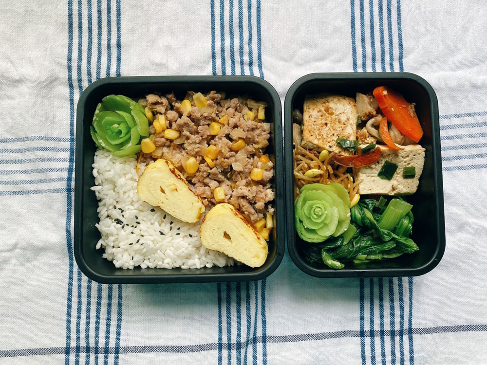
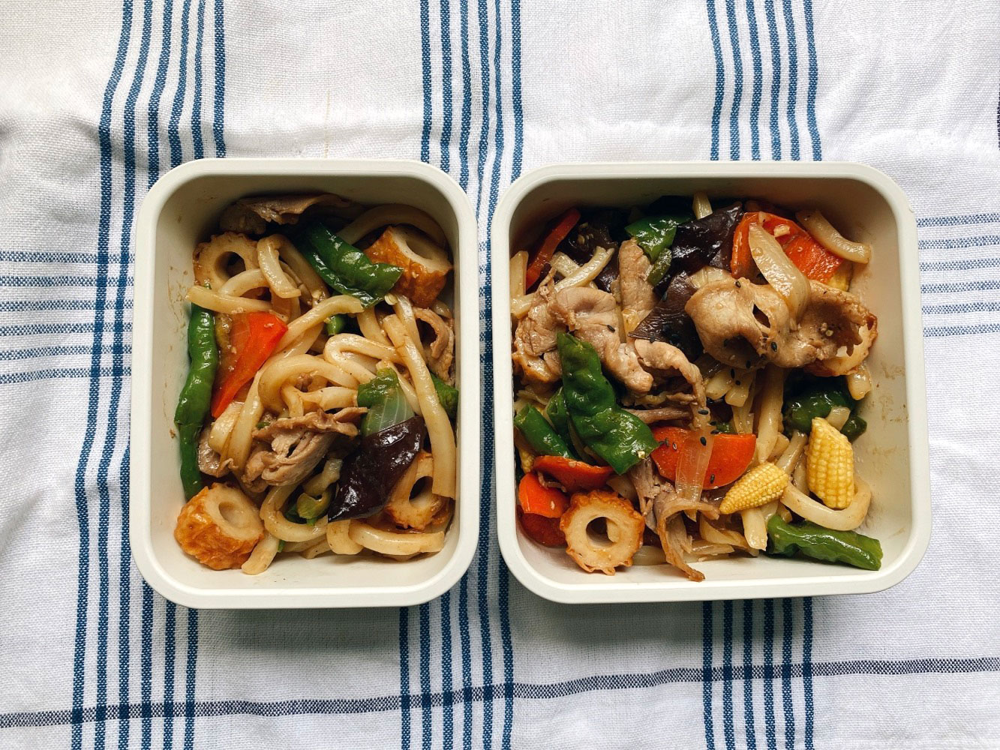
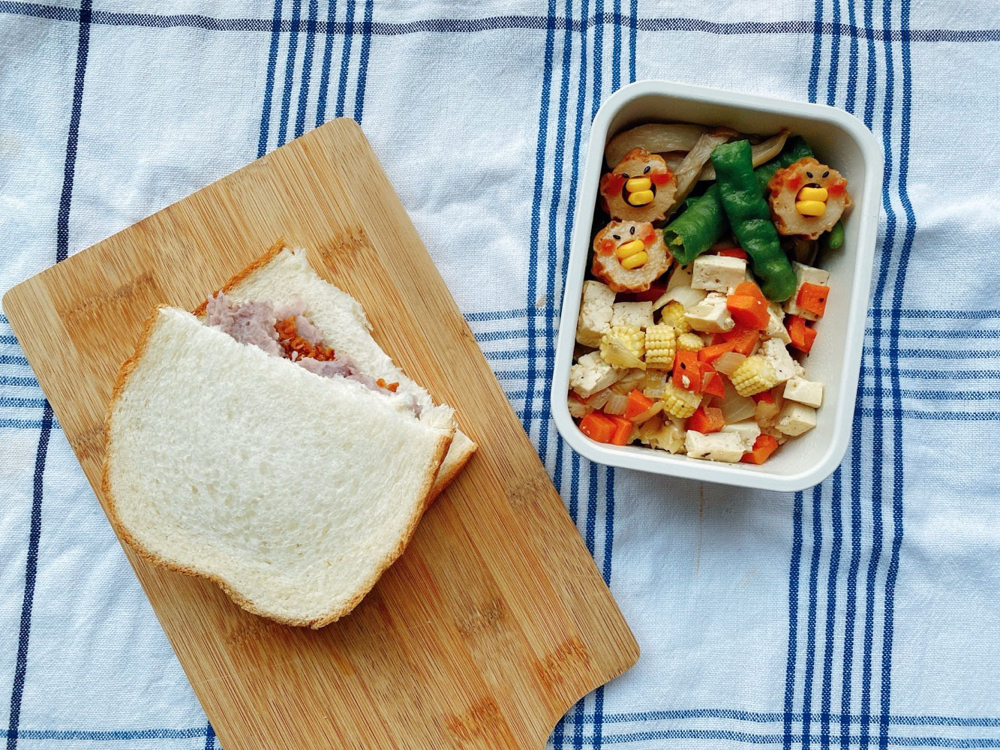
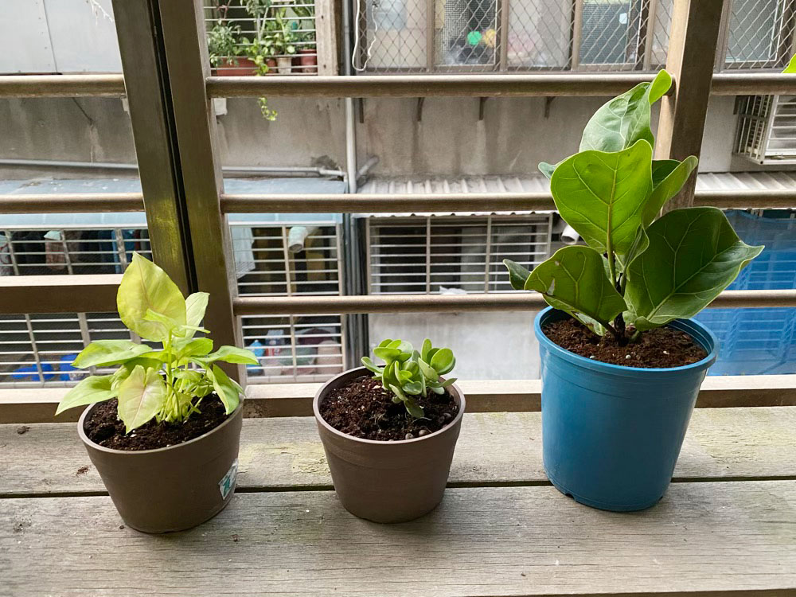




20220912 Mon



玉米味噌炒肉末、玉子燒、蒜炒青江菜、蔥燒板豆腐、涼拌黃豆芽



---

20220913 Tue



蔓越莓全麥麵包





今天是官方的解隔日期，一早我就興奮的出門買菜散步，戶外的日常看起來特別美好。

雖然依照官方的說法，確診滿七天後傳染力就已經明顯減弱，
\
但我快篩還是有淡淡的第二條線，為了他人的感受，姑且還是先遠端工作。



---

20220914 Wed



法式派皮麵團





兩年前曾心血來潮做過國王派，從派皮開始的那種，胡亂嘗試意外獲得同事好評，但遲遲沒有第二次，因為自己揉派皮實在太麻煩（但我又不願意妥協偷懶用現成的）。

趁今天比較有幹勁再次挑戰，做了法式派皮麵團，先冷凍保存，等哪天感覺對了，只要調好內餡就可以快速進行了。



---

20220915 Thu



日式炒烏龍

不知道是不是我的錯覺，解隔後體力大大下滑，連一般走路活動很快就累了，加上戴著口罩，好像更容易喘。關七天的影響有這麼大嗎？

與同事聊過之後，發現大家都明顯感覺容易疲倦，確診那幾天體重也都有稍稍下降，但在康復之後很快就回來了。
\
目前我的胃容量還有點小，普通一餐的份量可以吃完，但是顯德有點勉強，會有一點點反胃的感覺。

是不是應該維持目前的食量就好呢(ㆆᴗㆆ)



---

20220916 Fri



芋泥素鬆三明治、糯米椒炒杏鮑菇、玉米筍炒豆腐丁






儘管太陽還是很熱烈，中午的溫度還是能高達32度，但至少不那麼令人窒息，
\
且襲來的風都是涼的，不需要開冷氣的日子讓人好舒服。



不知道為什麼，當天氣轉涼，特別想與植物、食材相處，想花更多時間在自然、在廚房裡。



---

20220917 Sat










前幾週稍微整理了陽台，處理掉一些空盆廢土，之前買的一些植物沒能健康地存活😭

我們家陽台的光線有點不太會整握掌握，儘管遵照每個照顧指南說的「土乾再澆水」，但就是有些活了有些則無，我想我應該看清現實，承認自己是個「灰手指」。

我猜有可能是我澆水太勤勞，每天太喜歡去看盆栽，看著看著就想與他們互動、澆個水，不小心就爛根了。

炎夏應該已經過去，初秋的陽光少了暴戾之氣，此時的植物應該比較好照料。
\
午後去花市購入幾盆小植栽，經過前面慘烈的教訓，希望這次能讓他們住的快樂自在。（左手努力壓住想澆水的右手）



最近收聽的podcast節目有點洗牌，一些固定收聽的節目失去興趣，漸漸淡出佇列，而一些訂閱很久但一直沒收聽的，意外發現很適合現在狀態的自己。

前陣子居隔在家，更密集的收聽podcast，當日常習慣的節目都聽得差不多後，就會開始挖寶、尋找新的節目。[《世代登出》](https://podcasts.apple.com/tw/podcast/%E4%B8%96%E4%BB%A3%E7%99%BB%E5%87%BA-%E6%83%85%E7%B7%92%E7%AF%87/id1491104125)一直在我的訂閱清單，但幾乎沒有收聽，我發現他們的題目是我蠻有興趣的。

目前節目好像處於第二季，第一階段的主題是科技，而第二季是情緒，主要圍繞這些題目，從各種角度、切入點探討它們與人的關係。兩位主持人各自提出自己對題目的想法然後交流、互相整理歸納，一點點深度、帶點哲學的在剖析自己。目前我只聽了三集，都很喜歡。一集長度大約一個小時左右，且蠻燒腦的，收聽的同時也會反思自己的想法，我在其中找到蠻多共鳴。

好像有了一點點的人生經驗後，對很多事情會開始有感悟、體會，只是很少有機會有系統的把自己這些感想整理出來，都是碰到才會意識到自己是這樣想的。

比如我剛聽完一集，再討論金錢與自己的關係，他們提到「極簡主義」並不是白白的牆壁搭配一張桌子這麼表面而已，極簡應該是你能明確指出每一件物品與你的關係、故事，而不是沒有理由的囤積、購入，我覺得很認同。練習了很多年的斷捨離，我雖做不到極簡人物代表的那麼極致，但每當我逛街、逛網拍時看到有一點喜歡的東西，或是「價格不貴、但買來應該很不錯」的東西時，我幾乎不會真的下單，因為我知道若我沒有足夠心動的感覺，有點衝動的買回家後，它只會被我放在角落積灰塵。我希望我與物品的關係是積極友好的，我希望我是真心喜歡、享受每個物品。衣服不是買流行，而是買價值，要能與我一起生活夠久，它要能服務（節目中使用的詞）我，在日常裡能讓我感到正面、有幫助，對我來說才是有價值有意義的消費。說起來很玄，舉個最簡單的例子就是，不再只選最便宜的單品，要選質感好、能長久使用、且外觀有一定美感的商品。單看價格便宜的一定最吸引人，但當加入了使用年限、外觀搭配、順手度、對環境的傷害程度等，未必就是價低者勝。若要與人分享這個過程會蠻赤裸的，因為得誠實訴說自己過去的消費態度。

大部分是類似這樣的內容，可能會有一點哲學、深入，得赤裸的分析自己，但我蠻喜歡這樣的意見交流。

再讓我多聽幾集，有更多心得後，會再整理成一篇介紹文章(◍•ᴗ•◍)ゝ




---
