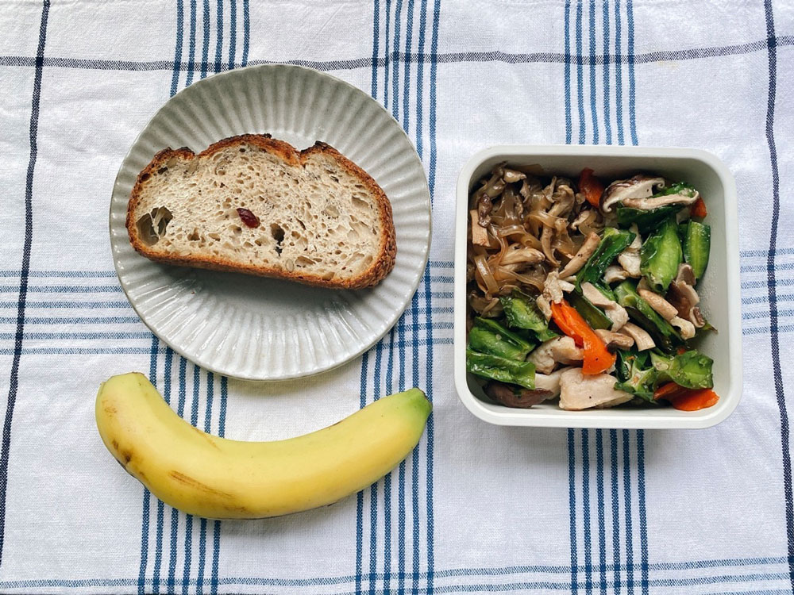




20220925 Sun



路過一個展覽，介紹都介紹台灣的都市再生、都市更新。其中有一面牆，模擬房地產的廣告，細看發現其中的文案都很有巧思又幽默。

- 家樂福尼亞
- 漲聲/響不起來
- 為什麼蛞蝓和蝸牛只差一個「殼」可愛度就差那麼多？即刻入住/馬上變可愛
- 年紀輕輕/三房兩廳/說話才會有人聽
- 懂小姐/愛上一匹野馬/但你家就有草原
- 你終究都要買透天/為何不一開始就買
- 新座專家/台灣首創十二星座概念宅/即日起預約看房/免費算流年星盤（市價1,688元）







---

20220926 Mon



舞菇丼飯、花椰菜、芭樂



---

20220927 Tue



照燒鯛魚、蕈菇炒豆腐、薯泥蛋沙拉、和風秋葵、芭樂



---

20220928 Wed















最近訂閱了很多中國的podcast節目，長度幾乎都在一小時左右，主題大部分圍繞在科技與人文，但每個節目的切角不盡相同，相比起台灣主流的節目，取向可以說很不一樣，對我來說有拓寬視野的感覺。他們的show notes會清楚描述該集內容討論的大綱、來賓背景的簡介（就像書封內頁的作者簡介欄一樣扼要）還有time code標示重點分鐘數。我後來才發現有標註時間對於決定要不要收聽很有幫助，有的題目看上去有興趣，但細節探討的角度可能不是我有興趣的，就不用花時間邊聽邊猶豫是否要放棄。有的甚至將節目裡提到的音樂、書籍、電視節目等相關資料列出來，資訊越詳細，越能提升收聽的意願。

雖然說的都是中文，但在口音、用詞上還是需要適應。例如在表示贊同的時候，他們很習慣講「是的」，還有天然的捲舌音，並不是刻意在發音時將舌頭捲起就好，感覺他們的舌頭很靈活，捲度可隨時調整XD



### 大俗小雅

主要是由在不同國家的朋友們交流生活，剛聽三、四集，覺得閒聊的成分偏多，氣氛較輕鬆。

<iframe title="大俗小雅" allow="autoplay *; encrypted-media *; fullscreen *; clipboard-write" frameborder="0" height="450" style="width:100%;max-width:660px;overflow:hidden;background:transparent;" sandbox="allow-forms allow-popups allow-same-origin allow-scripts allow-storage-access-by-user-activation allow-top-navigation-by-user-activation" src="https://embed.podcasts.apple.com/sg/podcast/%E5%A4%A7%E4%BF%97%E5%B0%8F%E9%9B%85/id1541026151"></iframe>




### 知行小酒館

主題圍繞人在金錢、投資方面的行為與觀念，也有比較實際應用面的切入，比如退休養老金的準備、開餐廳的困難等。
<iframe title="知行小酒馆" allow="autoplay *; encrypted-media *; fullscreen *; clipboard-write" frameborder="0" height="450" style="width:100%;max-width:660px;overflow:hidden;background:transparent;" sandbox="allow-forms allow-popups allow-same-origin allow-scripts allow-storage-access-by-user-activation allow-top-navigation-by-user-activation" src="https://embed.podcasts.apple.com/tw/podcast/%E7%9F%A5%E8%A1%8C%E5%B0%8F%E9%85%92%E9%A6%86/id1559695855"></iframe>




### 你吃香菜吗

目前我只了聽一集，他們的主題方向我覺得是「很認真的討論一件不重要/不可能的小事」，像我就是被〈[EP10：比奇堡房产中介开业上新，热门房产该如何投资？](https://podcasts.apple.com/hk/podcast/ep10-%E6%AF%94%E5%A5%87%E5%A0%A1%E6%88%BF%E4%BA%A7%E4%B8%AD%E4%BB%8B%E5%BC%80%E4%B8%9A%E4%B8%8A%E6%96%B0-%E7%83%AD%E9%97%A8%E6%88%BF%E4%BA%A7%E8%AF%A5%E5%A6%82%E4%BD%95%E6%8A%95%E8%B5%84/id1641074021?i=1000579253164)〉這個題目吸引。討論假如在海綿寶寶世界裡你會買誰的房子，節目長度有一小時，他們是真的很認真地從各種角度討論，後半段還必須立場交換，假如必須選那個你沒選的房子，你會怎麼看。
<iframe title="你吃香菜吗" allow="autoplay *; encrypted-media *; fullscreen *; clipboard-write" frameborder="0" height="450" style="width:100%;max-width:660px;overflow:hidden;background:transparent;" sandbox="allow-forms allow-popups allow-same-origin allow-scripts allow-storage-access-by-user-activation allow-top-navigation-by-user-activation" src="https://embed.podcasts.apple.com/us/podcast/%E4%BD%A0%E5%90%83%E9%A6%99%E8%8F%9C%E5%90%97/id1641074021"></iframe>




### 声动早咖啡

這個比較像每天的商業資訊快訊，更新速度較快，節目長度約在十五分鐘左右，快速摘要近期的科技話題，蠻適合每日收聽。中間會穿插一小段他們宣傳訂閱的廣告，短短的。
<iframe title="声动早咖啡" allow="autoplay *; encrypted-media *; fullscreen *; clipboard-write" frameborder="0" height="450" style="width:100%;max-width:660px;overflow:hidden;background:transparent;" sandbox="allow-forms allow-popups allow-same-origin allow-scripts allow-storage-access-by-user-activation allow-top-navigation-by-user-activation" src="https://embed.podcasts.apple.com/us/podcast/%E4%BD%A0%E5%90%83%E9%A6%99%E8%8F%9C%E5%90%97/id1641074021"></iframe>




### 读库立体声

這個我目前也只聽一集，我聽的是〈[读库立体声 | 我们身边的大自然 - 欧阳婷×周玮×吴肸](https://podcasts.apple.com/tw/podcast/%E8%AF%BB%E5%BA%93%E7%AB%8B%E4%BD%93%E5%A3%B0-%E6%88%91%E4%BB%AC%E8%BA%AB%E8%BE%B9%E7%9A%84%E5%A4%A7%E8%87%AA%E7%84%B6-%E6%AC%A7%E9%98%B3%E5%A9%B7-%E5%91%A8%E7%8E%AE-%E5%90%B4%E8%82%B8/id1613486499?i=1000577914378)〉，談的是自然寫作，我覺得收穫很多。邀請的來賓也是生長在都市的人（大部分的人應該都是），她們分享自己怎麼開始接觸自然寫作、怎麼開始重視自然與生活的關係，怎麼學習觀察辨認植物，分享進入生活中有植物的日常後，是怎麼改變她們的思維。最明顯的改變之一，應該是自發性的學到更多理科知識。原本只是單純寫作，沈浸在文字的世界，為了辨識植物、紀錄與自然環境的互動、感受，不得不增加生物、物理等的知識，也是另一種拓展自己的道路。
<iframe title="读库立体声" allow="autoplay *; encrypted-media *; fullscreen *; clipboard-write" frameborder="0" height="450" style="width:100%;max-width:660px;overflow:hidden;background:transparent;" sandbox="allow-forms allow-popups allow-same-origin allow-scripts allow-storage-access-by-user-activation allow-top-navigation-by-user-activation" src="https://embed.podcasts.apple.com/tw/podcast/%E8%AF%BB%E5%BA%93%E7%AB%8B%E4%BD%93%E5%A3%B0/id1613486499"></iframe>


還有很多已訂閱但還沒收聽的，時間不夠啊！已經大大擠壓到原本習慣收聽的節目了😂

要分享這些節目我其實有些猶豫，因為每個人政治傾向不同，可能會下意識地遠離中國相關的所有資訊。就目前我收聽下來的心得，這幾個節目蠻專注在談論人文或科技等主題，純就內容的話我覺得還不錯，帶給我很多收穫。



---

20220929 Thu



麻醬雞絲麵、香炒翼豆、蕈菇炒冬粉、芭樂

山蘇葉是上週花藝課的花材。
\
之前只看過餐桌上的山蘇，沒看過本人，認真看山蘇本人蠻美的耶，（一直喚起口感的記憶），背面還有很迷人的線條。


















---

20220930 Fri



酸種麵包、雞胸炒翼豆、蕈菇炒冬粉、香蕉

早起打壁球，七點到場開始練習。

上了兩個月左右的壁球課，基本動作一直做不好，每回上課調整的都是動作的細節。擊球點、站位、揮拍動作等，到目前為止的心得就是：基本動作真的是一切。比賽就是考驗一連串的基本動作：判斷球的落點、跑到距離球剛好的位置、在球開始落下的時間點揮拍、揮拍前的拉拍預備位置、揮拍時的拍面角度、擊球點等，一連串都得做的漂亮，或者至少及格，才能成就一擊漂亮的球。對超級初心者的我來說，只要這些動作都做到位就很滿意了，什麼策略、假動作等，是更高階層有辦法思考的事。

上課時老師示範動作的球打在牆上的聲音很響亮，很帥的聲音。真的可以用「帥」來形容，很有魅力，光聽那個聲音整個人都醒了。



---

20221001 Fri



這天要去爬桃源谷。早上四點多起床，搭五點半的火車出發前往宜蘭大里車站。

當火車繞過東北角，窗戶出現海平線的時候，身上的重擔轉眼間就消散而去。
\
大海怎麼有這麼神奇的力量，我甚至連海浪聲都還沒聽到。








兩年多前曾經去過一次桃源谷，也是芒草季前，那天天氣不是很好，雲層很厚，隱約飄著一些細雨，因此人不多。走在海邊稜線上，感受襲來的海風，好像獨享了這條步道。

這次去天氣非常好，前幾週才在疑惑怎麼今年秋天來的這麼順暢，完全沒有秋老虎的痕跡，這週就來了一個如夏日般的大晴天。也好也好，入冬之後天氣更不穩定，爬山的機會更少，還能有這般好天氣就要把握。

桃源谷有幾種走法，最輕鬆的是內寮線，自行開車抵達登山口後，步行約半小時即可到達，但對於沒有車的人來說，大眾交通會比較難抵達。另外可以選擇從大溪或大里站附近出發，或是從草嶺古道接過來。上次和這次我們都是選擇大溪出發，只是上回我們意志堅強，一路走到草嶺古道入口，再從草嶺登山口走回福隆車站，早上七點多開爬，回到福隆時都已經三點了，這次不想走那麼遠，選擇大溪上大里下的路線，但最後其實也走了七個多小時啦。








對於爬山我總是覺得能早就早，才會選擇最早的火車班次。
\
秋冬可能還好，夏天到了八點左右，太陽就非常毒，絕對不會想中午時間待在紫外線底下太久的。

從大溪火車站到登山步道大約900公尺，步行約15-20分鐘。

我們七點半左右起登，前半段是石階，最高的蕃薯寮山海拔約四百多公尺，不算困難。部分步道路段林蔭很多，石階上長滿青苔有點滑，經過時要小心。










抵達桃源谷的半面山大約花了兩個小時，路程約4.5公里。我們在還未抵達番薯寮山三角點前早已全身汗，衣服和擦汗的小方巾都濕透了，背包與背接觸的那一面與背帶也被汗滲透，想著回家後要趕快洗包包。

每次爬山我其實內心都很矛盾，一方面很期待山上的風景，一方面又覺得好痛苦好熱好臭好想躺在家裡廢喔。



我們在半面山的涼亭散熱吹風休息，等衣服稍微不那麼濕再繼續走。

桃源谷的路徑是臨海的山稜路徑，海風很大，因此沒什麼樹蔭，紫外線很強。龜山島全程都在旁邊，視野非常遼闊，海面上還有作業的點點漁船。一邊是東北角的廣袤海面，一邊是遼闊的草原，看得到福隆海水浴場和核電廠，還有雲的影子清晰落在大地上，平常在都市很難意識到雲的影子的存在，因為都被建築分割了，走起來真的很舒坦。只是有蠻多高峰，上上下下的，對體力是蠻大的考驗，水一定要帶足。




有時會看見雲霧飄上的樣子，彷彿仙境一般。



大里火車站。海平面。
