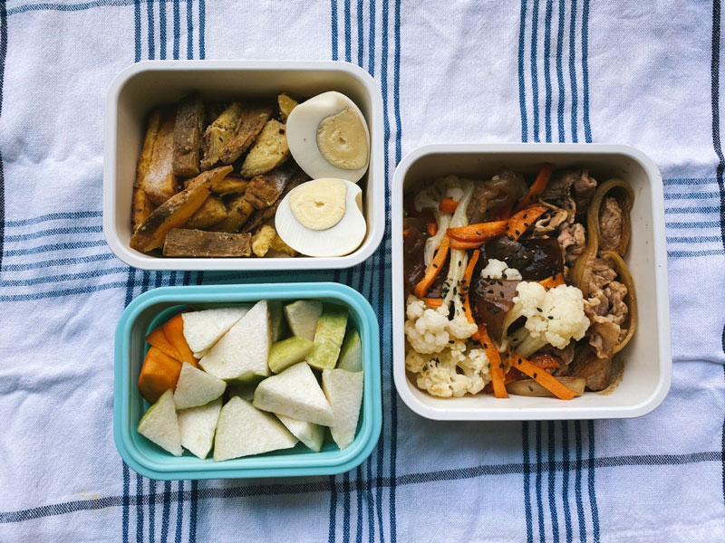
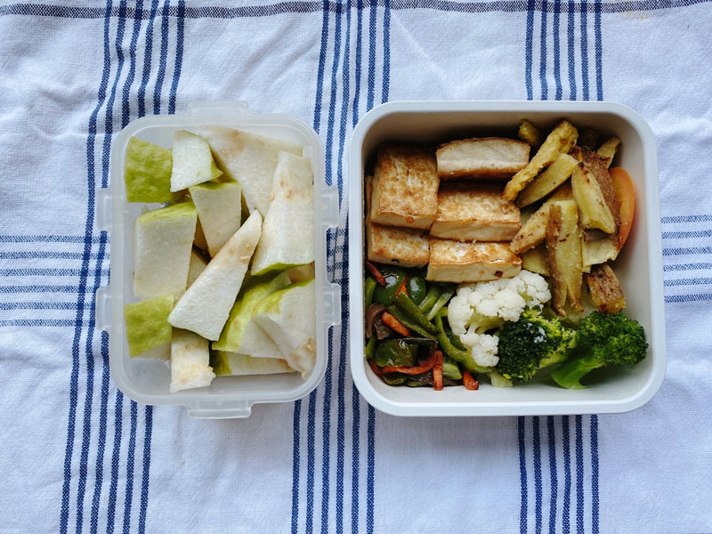
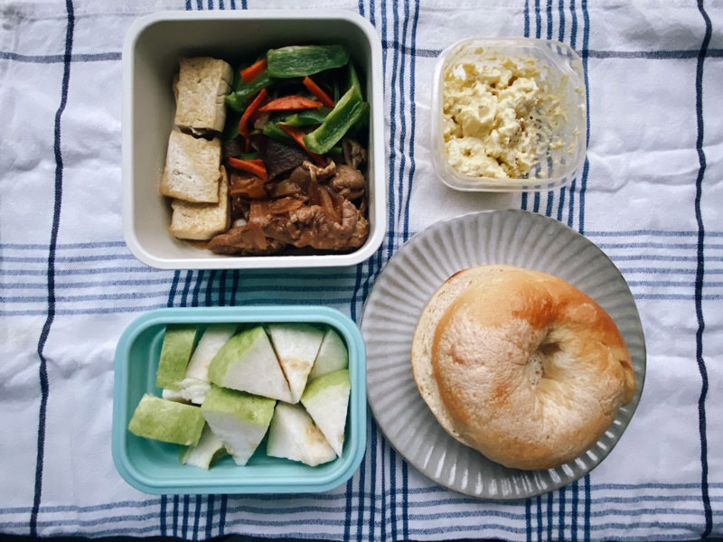




20221023 Sun








正是台灣欒樹開花結果的季節，一整排路樹一齊變色，非常有秋天的感覺。



---

20221024 Mon








週末回台中，這樣一碗料滿到快看不到湯汁的豆花只要35，物價的美好啊！



---

20221025 Tue








收到一顆黃金果，沒吃過的水果。

黃金果是原產於中南美洲的熱帶水果，果肉富含膠質與水溶性纖維，呈現果凍狀。可以向奇異果一樣，切半後以小湯匙挖著吃，或者像柳丁，先切成小瓣再取食果肉。

我覺得他的口感有點難形容，無法對應到我們熟悉的任何一種水果。他類似荔枝那樣飽含水分，但吃起來更柔軟，像是更軟的果凍，不會留下明確的齒痕。



---

20221026 Wed



奶油蒜香地瓜薯條、水煮蛋、照燒豬肉片、炒花椰菜、芭樂與柿子






早餐-和風蔥蛋開放式烤土司：
\
打一顆蛋、撒上蔥花、蓋上吐司，盛盤後擠上些許美乃滋，再灑點柴魚片

Do Re Mi Sol~

就變成章魚燒風味了



---

20221027 Thu



奶油蒜香地瓜薯條、木耳炒青椒、鐵板燒豆腐、花椰菜、芭樂








我很喜歡鑽小巷，同樣的目標會找不一樣的路走，這天恰巧經過鄭南榕基金會的辦公位置。陽台的窗戶都換新，但可以看出鄭南榕自囚的現場還保留當時的狀態，鐵窗上還有一些斑駁的痕跡。我經過的那天風光明媚，氣溫剛好，看到這左右兩個窗戶的對比，心情頓時變得沈重。1989年，歷史上還是同一代的事情而已，如果對鄭南榕的事件有一點認識的話，應該不會覺得言論自由是天上掉下來的禮物。不到一個月後就要舉行地方行政首長與民意代表的選舉，近期對於選舉人的道德、財產、政策、背景進行高規格檢視滿天飛，社群媒體上滿是討論批評的針鋒相對，不管是否有人刻意在帶風向，當看到這面鐵窗，這些八卦碎嘴的文字都得退到一百公尺後 面九十度敬禮吧。



---

20221028 Fri



自製優格貝果、蛋沙拉、香煎板豆腐、照燒豬肉、青椒炒木耳、芭樂













今日散步紀錄：

1. 汽車引擎蓋上的葉子痕跡，優雅。

2. 店家門前的植物——提琴葉。
\
因為之前插花課認識了這個小可愛，如果遇到有種觀葉植物的店家我都會駐足多看兩眼。當學習到一件事情之後，身邊突然處處都是相關的事物，開始接觸植物後，才注意到許多住家都有種植物的習慣。家裡有新生命的人會發現路上帶小孩的媽媽變多了，開始吃蔬食的人會發現常去的店家也有蔬食選擇，但其實這些東西一直都在，只是眼睛有沒有看到而已。



---

20221029 Sat



ESG課程Week 2。

原來「永續」這個概念是五十年前才正式在聯合國的場合被提出，在這之前，人類一直習慣線性的經濟模式，生產、製造、拋棄，不斷追求收益創新，沒有想過能留下什麼給下一代。一直到1987年，出現「Our Common Future」的概念，將永續發展定義為「能滿足當代需求，同時不損及後代子孫滿足需求的發展」，因此我們的生產、商業等行為，得開始想更遠了。

學到了一些打破我刻板印象的事實，比如雨水其實很乾淨，下雨剛開始十分鐘的水確實可能夾帶著一些空氣雜質，但在那之後的水質幾乎跟自來水差不多，甚至更乾淨。又比如海水淡化的成本並沒有想像中高，只是過程需要使用化學物品，成本受到原油價格波動比較大，整個製造過程的碳排足跡也高。

了解一些國際衡量指標後，我開始比較仔細閱讀企業的ESG報告書，

台泥很早就開始執行ESG轉型，因為產業的關係，他們是最早受到群眾監視眼光的企業。我知道台泥有在做環境保護、產業轉型，但沒想到他們已經做了[這麼多](https://media.taiwancement.com/web_tcc/tw/report/csr/report_2021_all.pdf?t=1667265412695)。


