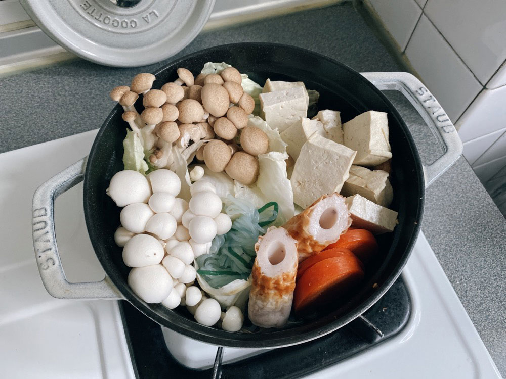
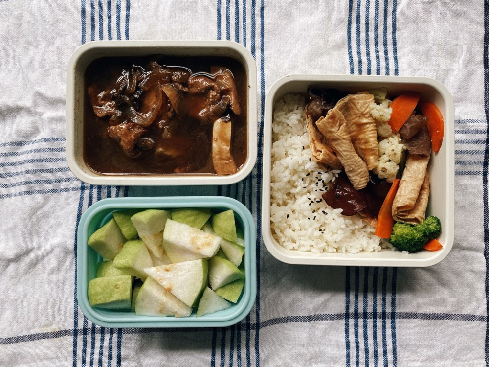
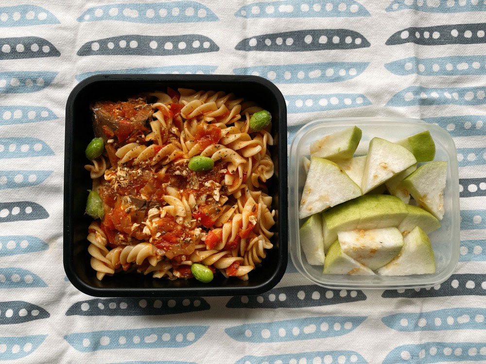
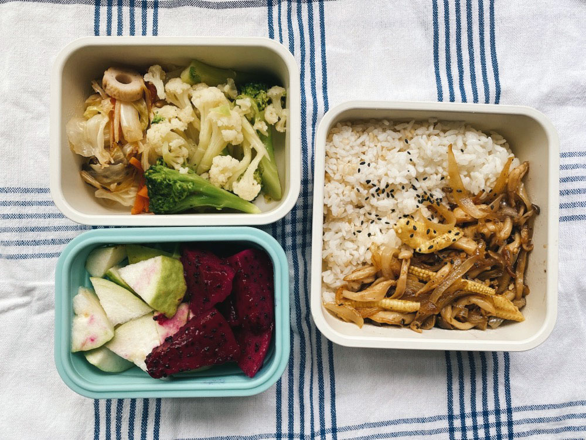
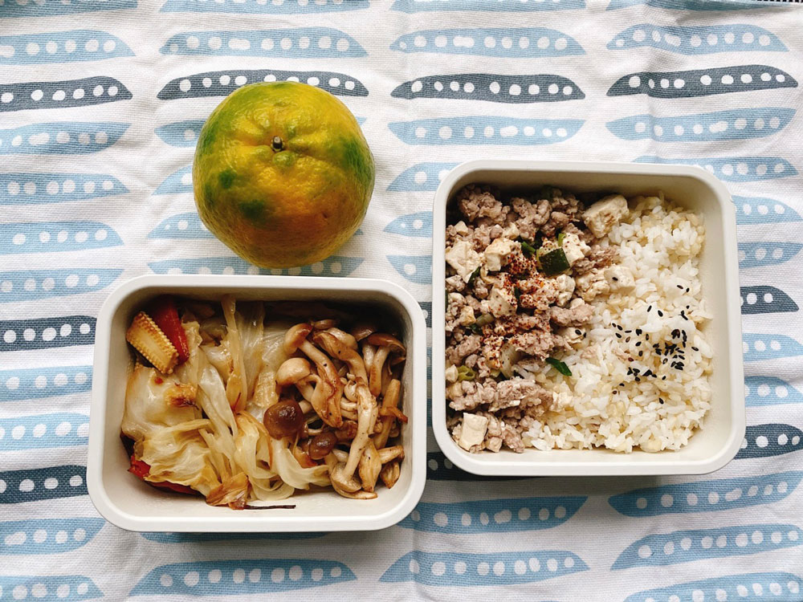
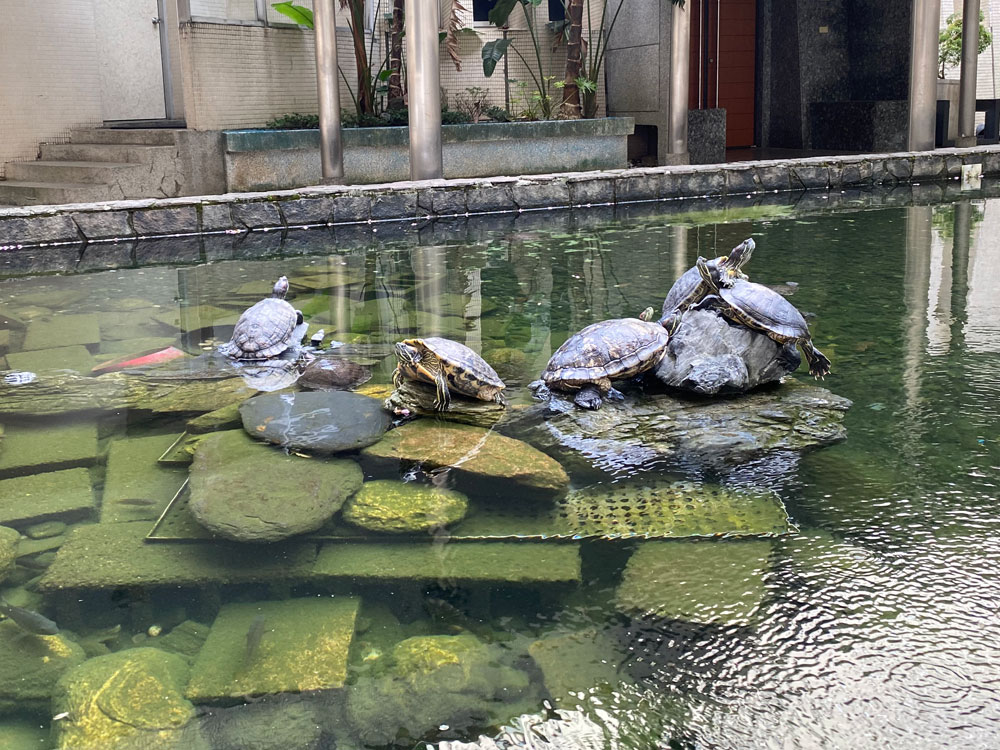




20221031 Mon



壽喜燒、芭樂



燕麥奶核桃麵包













---

20221101 Tue



壽喜燒便當、花椰菜炒腐皮

今早聽蔣勳老師繼續講悉達多，老師和阿佑討論到「流浪」這件事。

流浪未必得是具體的行為，比如背上一個背包到某個陌生的地方，流浪應該比較像是一種心理狀態，不將自己侷限在某些角色裡。沒有人說只能用父親的角色與孩子互動，沒有人說你只能是兒子女兒，你可以隨時抽離刻板的身份，用彈性一點的心胸與他人相處。或者流浪應該是可以說走就走，不被工作、食衣住行綁住日常行為。我可以今天臨時想出國就訂明天的機票，不要總是一個月前就開始把工作排開。隨性一點、自由一點。

聽到這邊我覺得我好像已經擁有了一點點流浪的能力，像上次國慶連假我就真的做到了說走就走、不提前規劃。

有時候安排好的旅行計劃會被臨時打亂，或者真的到出發前我還能有100%享受的情緒嗎？如果想到就能出發，那個心情會不會更順暢完整呢？


<iframe title="蔣勳_美的沉思 回來認識自己-談流浪者之歌-悉達多｜年少時的自己" allow="autoplay *; encrypted-media *; fullscreen *; clipboard-write" frameborder="0" height="175" style="width:100%;max-width:660px;overflow:hidden;background:transparent;" sandbox="allow-forms allow-popups allow-same-origin allow-scripts allow-storage-access-by-user-activation allow-top-navigation-by-user-activation" src="https://embed.podcasts.apple.com/tw/podcast/ep52-%E8%AB%87%E6%B5%81%E6%B5%AA%E8%80%85%E4%B9%8B%E6%AD%8C-%E6%82%89%E9%81%94%E5%A4%9A-%E5%B9%B4%E5%B0%91%E6%99%82%E7%9A%84%E8%87%AA%E5%B7%B1/id1587317578?i=1000584210692"></iframe>




---

20221102 Wed



番茄鯖魚豆腐義大利麵、芭樂

義大利麵裡加入一些些的嫩豆腐，讓口感變得滑順柔軟許多，蠻喜歡的。












身為都市的上班族，上班途中很有機會經過正在接收同樣身為上班族爸媽托育孩童的幼兒園。

每次看到幾隻小朋友同時出現在視線裡都覺得好可愛，目光忍不住想多停留幾秒，有時會想拿起手機偷拍這些可愛的畫面，但這個動作太敏感，旁人怎麼看都會提高警覺防範這位變態阿姨，且基於尊重小朋友的隱私，我還是會壓抑這股觀察紀錄的衝動，在不打擾、不侵犯的原則下偷偷欣賞小小人們以及迷你版的物品。



之前到日本旅遊時，也曾看過幼兒園老師帶小朋友出門，會用一個小拖車，比美式賣場會賣的那種再大一些，裡面可以同時放置四到六名兒童。他們會穿著圍兜兜、戴上小帽，遠遠看會是五六個藍色或橘色的點點，背景是乾淨整潔的日本街道，整個畫面太舒服療癒了(⁎⁍̴̛ᴗ⁍̴̛⁎)



---

20221103 Thu



野菇蓋飯、炒高麗菜、雙色花椰菜、芭樂與火龍果








遇見一顆很秋天的樹，黃色的落葉掉滿地。



---

20221104 Fri



鹽味麻婆豆腐、炒高麗菜、鐵板炒菇菇、椪柑



---

20221105 Sat



ESG課程Week 3。



這禮拜的ESG課程練習如何碳盤查，例題是一個環保的洗衣粉。整個產品的生命流程中，每一步、每一個元素動作都要精準計算，從原物料階段開始、製造、配送、包裝，乃至於使用者使用情境、最後的廢棄物處理等，都要預設一個平均情境計算碳排量。

前半段在工廠端的部分還算好理解，使用哪些原物料、製造過程機具使用的能源、配送車輛的行程距離車輛和噸位大小、包裝使用到的紙盒、棧板、工業塑膠膜等，還有很容易被忽略的廠區內的空調冷氣運轉了多久、包裝好的產品在工廠內需要被堆高機移動，這部分也有使用到汽柴油作為動力。



使用者端的情境是最難掌握的，由於每人使用習慣不同，只能盡量透過問卷收集實際狀況，找到一個平均值。

以此案例來說，大約能計算出一盒洗衣粉可被使用幾回、每回需要使用多少水量、洗衣的時間長度影響使用電量、使用哪種能效的洗衣機，這些全部轉化成二氧化碳當量後加總，就是該產品完整生命週期的碳排量。



算式不難，只要把各單位的碳排量呈上生產數量後全部加總就好，困難的是資料與數據的搜集，這也是目前所有企業最苦惱的地方。



以這個練習案例來看，洗衣粉的生命週期裡，最大部份的碳排是在使用端（超過一半），而其中又以電力為最大佔比，遠遠高於水的碳排。對於這個結果我很驚訝，班級上大家幽默地說要改用手洗了，或是少洗衣服（然後買更多快時尚衣服？😂）。老師則提醒我們，這正是政府極力推動一級能效家電補助的重要原因，如果能將一個老舊、耗能的舊洗衣機，換成更有效率的洗衣機，減少運轉時間長度，就能減少電力使用，進而減少碳排量。


