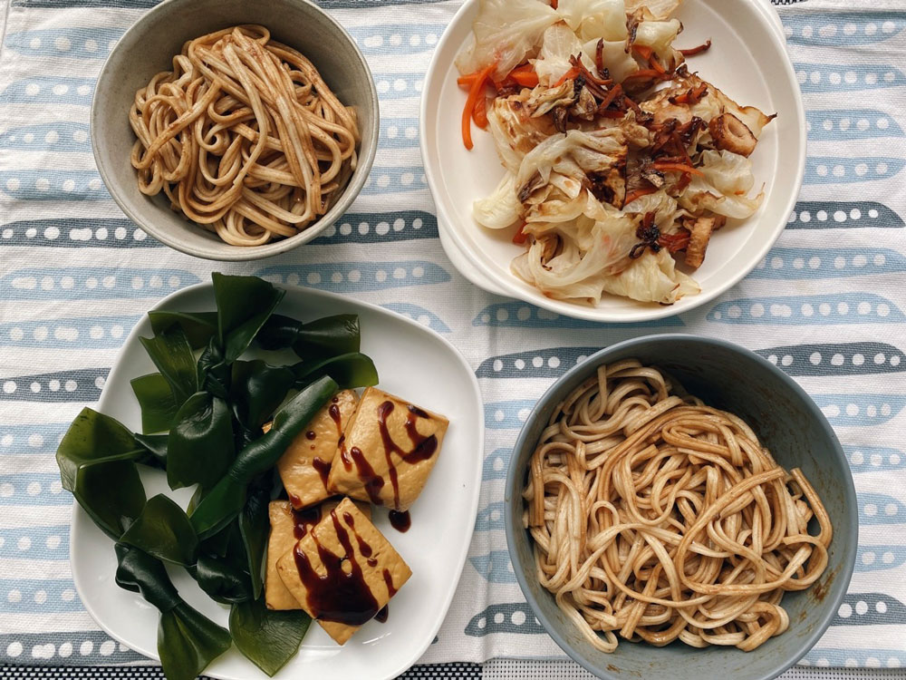
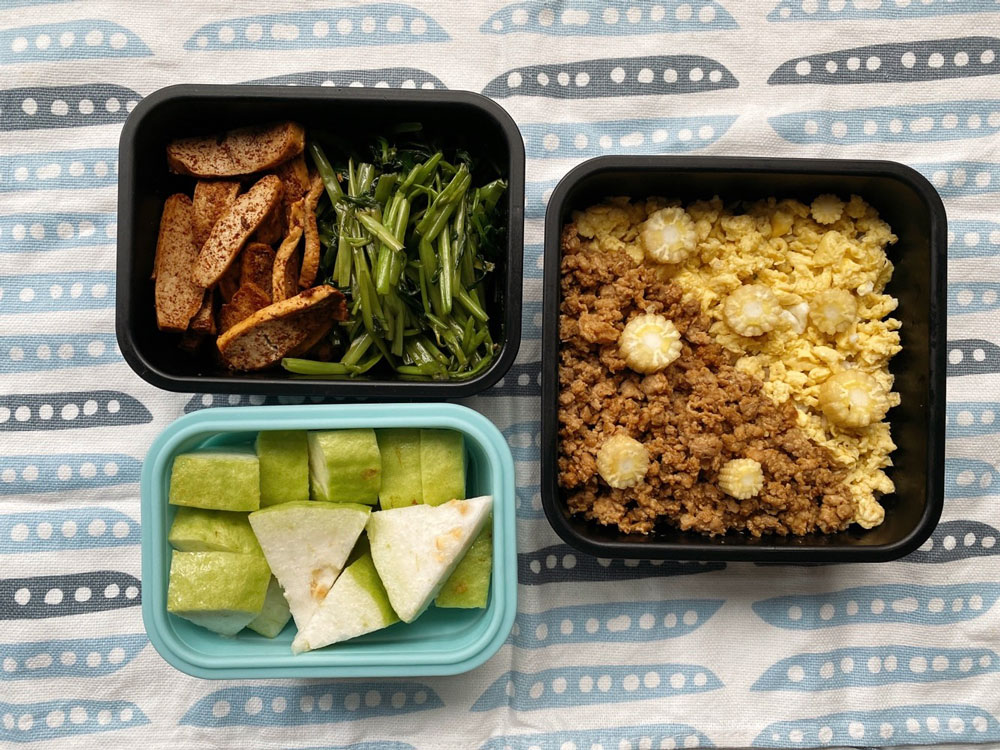
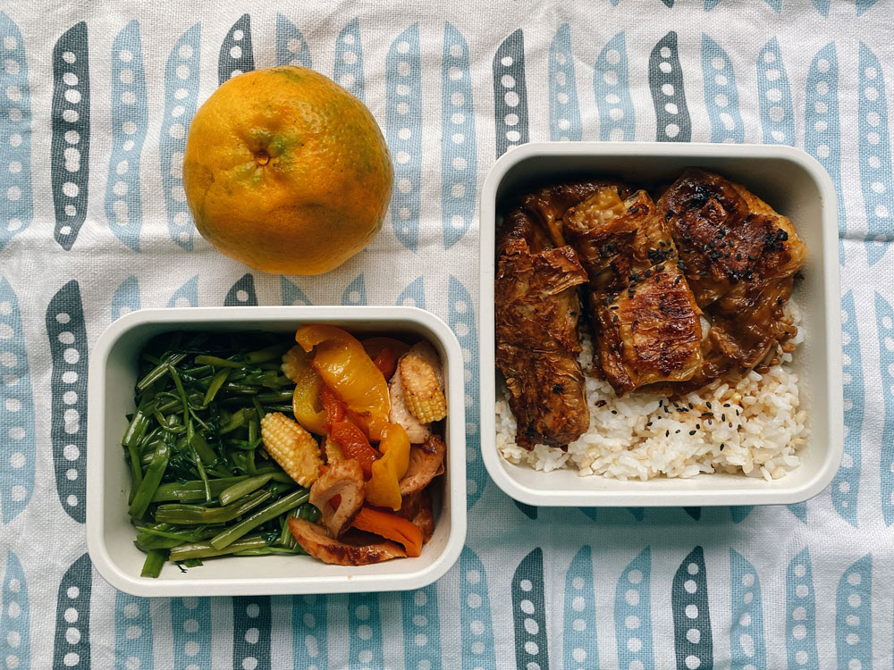
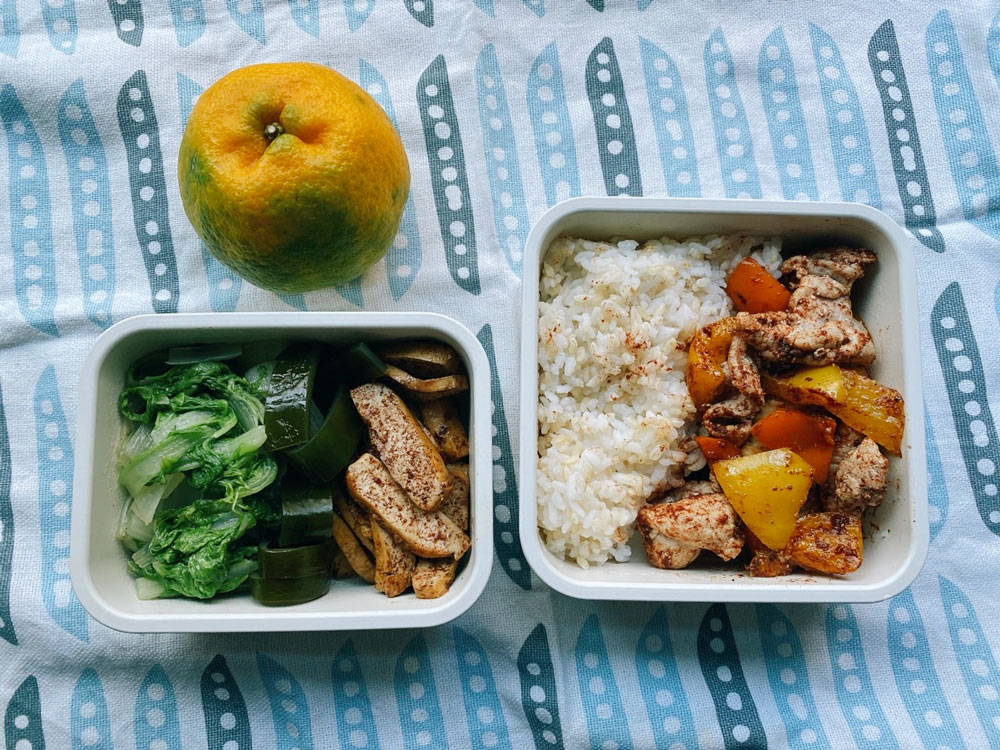
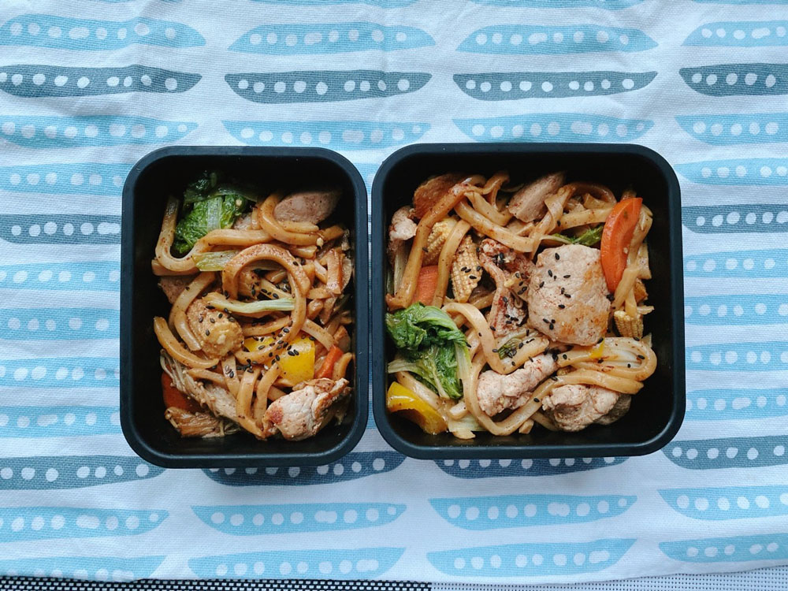
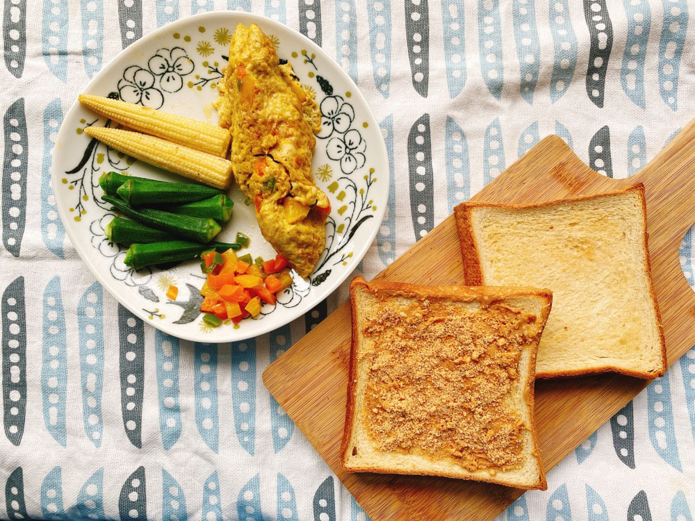




20221106 Sun



麻醬麵、炒高麗菜、涼拌豆乾與海帶



一些日常風景：






晚上看了Netflix的紀錄片[《奶牛陰謀》](https://www.netflix.com/tw/title/80033772)，是2014年的影片，距今也有八年的時間了。

紀錄片主要敘述各大環團對於畜牧業才是「排放二氧化碳的最大元兇」這個事實避而不談，影片中參考聯合國發佈的某篇報告，顯示有超過一半以上的二氧化碳排放來自於畜牧業，但我搜尋時看到的數字大約只有18%。該紀錄片的[官網](https://www.cowspiracy.com/facts)也說，報告數據不斷變化，他們會持續追蹤並更新。

撇除數字到底是18%或超過50%，我想影片最重要的目的是提醒大家，其實畜牧業在溫室氣體的排放量是需要被關注的。



我們很容易觀察到石化能源的排放污染，汽機車、飛機、船隻等等，因為這些交通工具是我們日常直接會接觸到的，但畜牧業卻不是，我們與畜牧業的關係是間接的。我們不會直接看到牛羊豬雞怎麼被飼養、對待，我們看不見他們排放的甲烷，我們看不見要成為他們飼料/草需要使用多少水灌溉，而這些水量或土地又將消耗多少的碳排放。

記得國中生物有學到，食物鏈每往上一層，只會有10%的能量能被傳遞，假設草地上有一百隻野鼠，便只能讓十隻狐狸生存。實際以畜牧業來說，為了供應人類的食肉需求，必須豢養極大量的牲畜，除了牠們本身製造的溫室氣體，位於食物鏈前一層的飼料或草地數量得乘以十倍，其所需的灌溉水分等資源也會以倍數成長，若再加上牛奶、優格等乳製品的需求，牲口的需求數量將會更多。因為這個生物塔的關係，使得溫室氣體量大到難以處理，所以紀錄片提出一個觀點，有沒有可能大家減少對肉品的需求，改成吃素呢？

根據聯合國的[估算](https://www.un.org/en/actnow/facts-and-figures)，吃素可以減少50~70%的溫室氣體碳排量，更現實的狀況是，這是一個很簡單的改變，不需要號招、遊說別人，自己就能決定要不要做，難度也不是很高的事情，少吃肉多吃菜甚至也對於[身體健康](https://wedocs.unep.org/bitstream/handle/20.500.11822/39972/Lifestyles_climate.pdf?sequence=6&isAllowed=y)有所幫助。



我覺得這部紀錄片可能有一些想要引導的方向，我覺得並不是情緒勒索叫大家一率改吃素不吃肉，但身為消費者，我們是不是可以在每一次消費前，多花三秒思考這個行為背後那龐大的結構鏈、生產關係。


每當談到環境議題，很容易因為距離太遠、影響太慢而覺得無感。確實，比起大型企業、產業活動等，個人的影響微乎其微，看了這麼多科學數據之後，會很驚訝於人類活動對環境的負面影響如此劇烈。人的存在就是會消耗能源，不需要極端的因而感到無望，我們還是可以和平與地球共處，在取用資源與永續發展中找到平衡。

> We are using the equivalent of 1.6 Earths to maintain our current way of life, and [ecosystems cannot keep up](https://wedocs.unep.org/bitstream/handle/20.500.11822/36252/ERPNC_KMEN.pdf) with our demands.
>
> — [UN](https://www.un.org/en/actnow/facts-and-figures)
>



---

20221107 Mon


雙色丼飯（咖哩豬肉鬆、雞蛋鬆）、炒空心菜、五香炒豆乾




---

20221108 Tue



照燒金針豆皮卷、蒜炒空心菜、甜椒炒黑輪、椪柑

今天在聽全球串連的新聞時，有人分享全球樂施會的一篇[文章](https://www.oxfamamerica.org/explore/research-publications/carbon-billionaires-the-investment-emissions-of-the-worlds-richest-people/)指出，全球前125名富人的人均一年排碳量，是一般人的一百萬倍，且其中只有一位富人真的有投資相關的企業。

一百萬！

其中有人可能曾經在某些場合會受訪情境中表示自己是關心環境的，然而從實際的行動或數字來看，可能並不是這麼回事。

在clubhouse的聊天室裡大家因此開始討論起環保的議題，就像上週末我看完奶牛陰謀的心得一樣，把環保看得有一點重量的人，都很願意犧牲一點點不便來減緩對環境的負擔，儘管我們的影響力薄弱，還是會堅持這些微小的行動。

另外我也在聊天串裡得知由看守台灣這個NGO組織製作的的podcast節目[《環保的品味》](https://podcasts.apple.com/tw/podcast/%E7%92%B0%E4%BF%9D%E7%9A%84%E5%93%81%E5%91%B3/id1583739051)。試聽了一兩集，基本的音質、節奏、剪輯都有不錯的水準，內容上會先以一點點簡單的聲音劇場開頭，簡單的故事背景設計、人物對話、適當的旁白、裝飾音效等為開場，帶領聽眾進入一個想像的情境，然後一段過場，才進入到由主持人敘述主題的介紹內容。全長只有十五分鐘左右，但內容輕巧而紮實，可以學到一些與我們生活息息相關的環境小知識，從「單純使用產品」以外的角度觀看同一件事物，會有完全不一樣的認識。



<iframe title="看守台灣Podcast《環保的品味》" allow="autoplay *; encrypted-media *; fullscreen *; clipboard-write" frameborder="0" height="450" style="width:100%;max-width:660px;overflow:hidden;background:transparent;" sandbox="allow-forms allow-popups allow-same-origin allow-scripts allow-storage-access-by-user-activation allow-top-navigation-by-user-activation" src="https://embed.podcasts.apple.com/tw/podcast/%E7%92%B0%E4%BF%9D%E7%9A%84%E5%93%81%E5%91%B3/id1583739051"></iframe>

一些日常風景：












---

20221109 Wed


香料彩椒炒豬里肌、小白菜、海帶、五香豆乾

今天聽了法律白話文與歐巴桑聯盟的podcast訪談。

歐巴桑聯盟是一個從小民開始的政黨，最早由一群與兒童共讀的家長所組成，主要關心兒童的人權、平權，把小孩當成一般的大人對待，不干涉、指導他們的行為，頂多只會引導、翻譯成小孩能懂的句子，但所有行為的決策都尊重小孩本身，並且回答所有小孩的問題。

促成他們組成政黨、參與政治的契機，就是有孩子問「公園的遊具消失之後，什麼時候會再回來呢？」問了相關單位後，卻得到「這是機密，不可透露」的回覆。從此開始，他們認知到主動參政才有可能從體制上影響全民的生活。



他們關注所有生活裡真的有感的小事，比如不讓身障人士感到麻煩的環境才是友善的馬路，比如所有與小孩有關的人的權益、困難都應該被看見，包括家長、老師、育兒園等，唯有一層一層剝開問題，解決其中一個一個的小障礙，才是有效改善少子化的治本之道。補貼只是萬千手段中的其中之一，有更多環節需要處理，這些改變可能需要花上好幾年的時間，一兩個任期無法看到結果，但這才是真正會影響我們生活的所在。

聽到這裡我就知道我喜歡他們。

累積許久的問題，從來就不是喊喊口號、發發錢就能輕鬆解決，目前主流的選舉文化幾乎只停留於表面。現實一點來說，反正下一屆會不會選上也不知道，短期內能吸引目光與選票比較重要。


<iframe  title="法客電台 BY 法律白話文運動-政治歸政治#81｜歐巴桑憑什麼選舉 ft. 歐巴桑聯盟" allow="autoplay *; encrypted-media *; fullscreen *; clipboard-write" frameborder="0" height="175" style="width:100%;max-width:660px;overflow:hidden;background:transparent;" sandbox="allow-forms allow-popups allow-same-origin allow-scripts allow-storage-access-by-user-activation allow-top-navigation-by-user-activation" src="https://embed.podcasts.apple.com/tw/podcast/政治歸政治-81-歐巴桑憑什麼選舉-ft-歐巴桑聯盟/id1482463498?i=1000583808262"></iframe>






後來我看到這兩支公視影片，發現想要抵抗、改變現有選舉文化的人比想像中還多，而且他們真的身體力行去執行。

隨著年齡增長，我對於政治的期待原本已經快歸零，但這兩支影片讓我覺得還是要相信認真的事情，還是有人想好好做事，而不是指博取媒體版面。








---

20221110 Thu



日式豬肉炒烏龍




---

20221111 Fri



花生烤土司、彩椒醜蛋、秋葵、玉米筍












---

20221105 Sat



ESG課程Week 4。



今天的ESG是由勤業眾信風險管理的副總James和資深經理Alex授課，是這個課程開班以來第一次由業界的老師直接教學，從現場的角度分享產業面臨的實際狀況，覺得很有臨場感！



主要的切入點都是從金融業出發，因為金融可以說是幾乎所有公司都會接觸到的起點，投資、融資都會碰到，因此從金融業開始規範，能從根本面帶領整體社會逐漸轉型。



金融業的三項責任分別為：風險控管、資金引導及促進社會福祉（普惠金融）。




我想永續這件事對所有產業和消費者來說最明顯的轉變應該是「外部成本內部化」。

至目前為止，工商業高度全球化，資源、人力都往最便宜的地方去，一切以最低成本考量，跨國境不是問題，船運、飛機、路上交通可以串起所有據點——我們都忽視了環境的成本，揮霍太多地球資源，以至於今日我們必須趕快就此打住，甚至補償更多，在2050年前達到淨零碳排的目標，才能阻止日益嚴重的極端氣候變化。翻譯成生活畫面就是，過去買東西我們習慣找最便宜的商品，但現在不能只看價格，還要考量碳足跡、環境成本、社會正義等。如果看不出來沒關係，因為這些將來都會被國家或地區課稅、要求繳費，成本會轉嫁到消費者身上，簡單說，一切看不見的成本，都將變成看得見的金錢。



經過這堂課，我對永續的認知更立體了。

永續管理要考量的是更遠的未來，任何企劃、開發都要做長遠的風險評估，除了基本的可行性、投資報酬以外，也要考慮在氣候變遷下，這個決策有什麼環境風險？比如豪雨乾旱會不會影響生產製造或物流運輸？如果海平面上升，工廠是否就不能選在可能被淹沒的範圍？假如極端天氣造成重要資訊設備無法運轉，是否有備用的設備地點可以即時接手？永續的範圍不只是環境保護，更像是一個必須內化的價值觀，一個不只是眼前當下的及時行樂。


