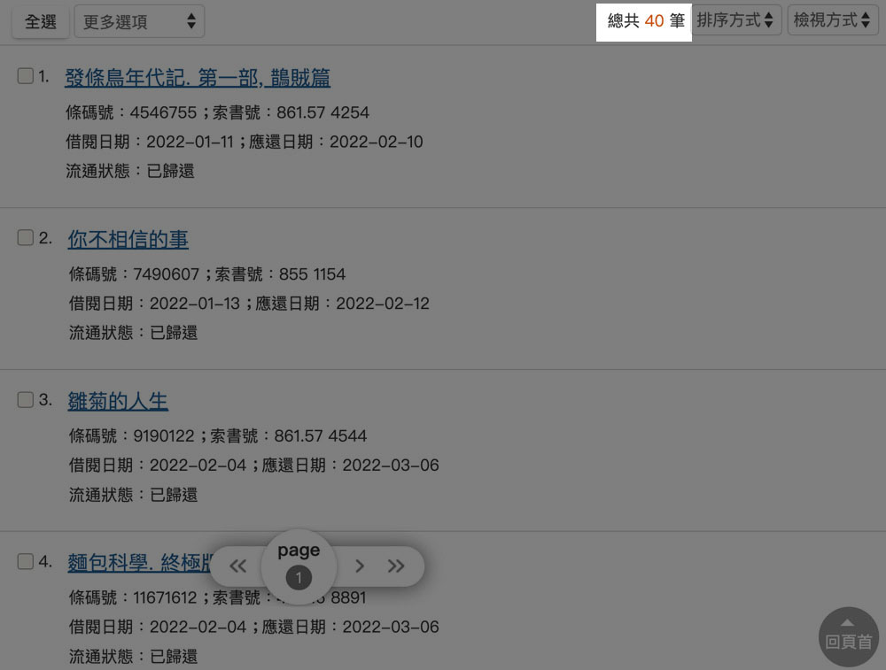




料理風景







我很喜歡用無糖豆漿煮火鍋，應該可以算是拿手好鍋吧。
\
用無糖豆漿當鍋底，再加入幾大匙的味噌，就可以輕鬆獲得無添加物的天然好味鍋底！原料簡單好取得，健康又懶人。









終於久違的在市場看到栗子南瓜！








---

### 2022閱讀紀錄

老實說我不太買書，因為買回來後幾乎不會拿起來閱讀，反而喜歡在書店、圖書館等被書叢圍繞的空間，才會有讓我想閱讀的動力，很喜歡邊逛邊找書的氛圍。

畢竟書要讀了才有用對吧。

[延伸閱讀：讀書的樂趣——讀書共和國podcast與郭怡美書店](../../../../blog/podcast/note/book-republic-dihua-street-shops-01/#%E8%AE%80%E6%9B%B8%E7%9A%84%E6%A8%82%E8%B6%A3)


年末了，上網查看2022年的借閱紀錄，居然有40本！

當然不是每一本都從頭到尾看完，Notion上有做筆記的紀錄是32本，平均一個月至少有讀2~3本書。

我喜歡與自然有關係的書，喜歡文筆樸實優美、畫面立體的書。
\
心靈勵志類型的書沒有錯，但需要在對的時間閱讀才不會變成毒雞湯。
\
看越多越發感受自己的不足。

有做紀錄真是太好了，回頭看，一步一步也累積了一些小小的成就。

2023年也請繼續努力喔。









---
