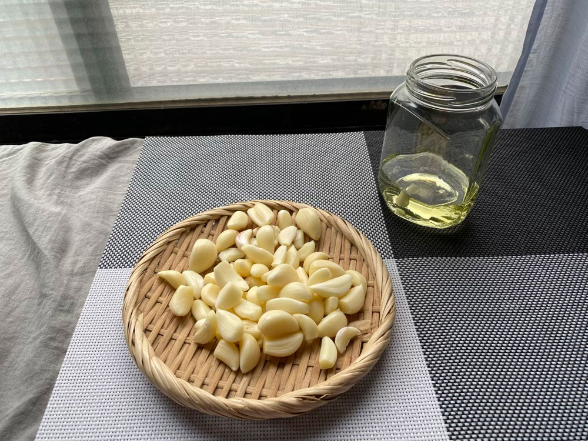

20220516 Mon



番茄肉醬義大利麵，市場買的花。



上週上市場買菜時看到一束束半開的繡球花，順手帶了一把回家，
\
經過一個週末花苞已漸漸綻放。
\
有鮮花的家感覺很棒。




---

20220517 Tue


清炒麻油雞、龍鬚菜、腐竹炒皇帝豆

三顆蒜球剝皮，放進玻璃瓶，
\
倒入淹沒過大蒜的食用油，
\
進烤箱以100度低溫烘烤一小時，


放冷後就是常備料理的大蒜油了。
\
爆香快速，不用再切蒜，也是保存大蒜的一個好方法。



從剝蒜頭開始整個廚房就飄著淡淡的蒜香味，
\
從一開始較刺激的生蒜味漸漸轉為溫和的蒜油味，
\
很淡很淡，不是剛吃完蒜頭炒飯時嘴裡那種熏死人的氣味。



剝蒜需要點時間與細心，腦袋很自然的漸漸開始放空，
\
曾看過一個日本主婦分享，她覺得做家事的過程，也像是一種禪，
\
你會很專注於眼前的事，不會胡思亂想，幫助大腦排除混亂的思緒。




---

20220518 Wed


洋蔥炒蛋、大黃瓜炒貢丸、鯖魚炒飯、芭樂




---

20220519 Thu


黑胡椒豬肉、清炒大黃瓜、炒小白菜、香炒咖哩馬鈴薯塊



去市場買了點菜。
\
自己帶盒子，用到的塑膠袋也是重複使用的。




---

20220520 Fri


煙燻豆包絲、蒜炒青江菜、照燒肉絲

