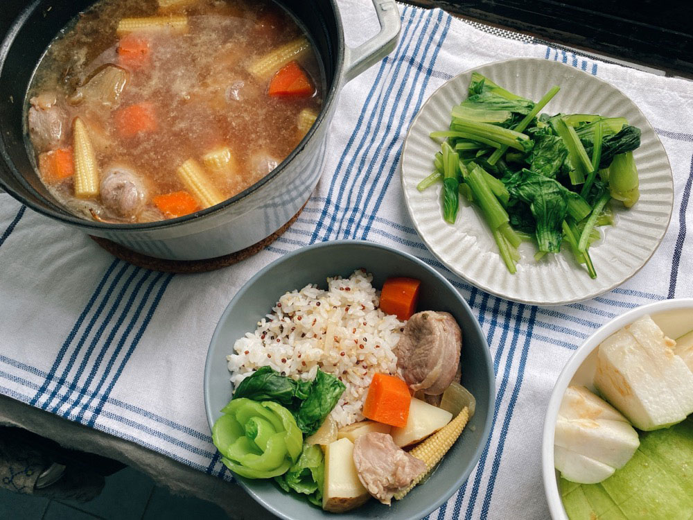
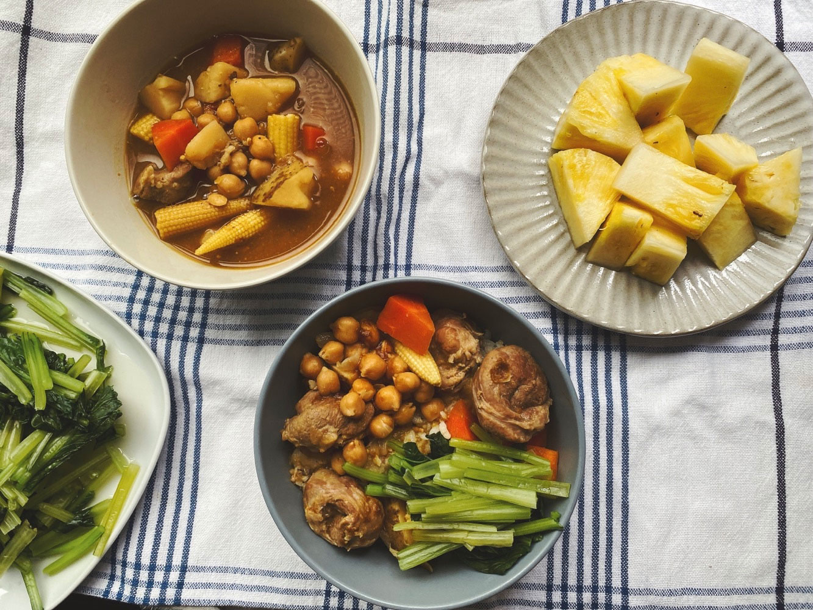
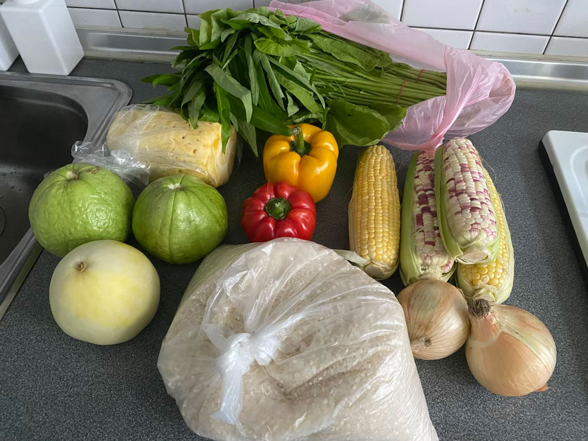
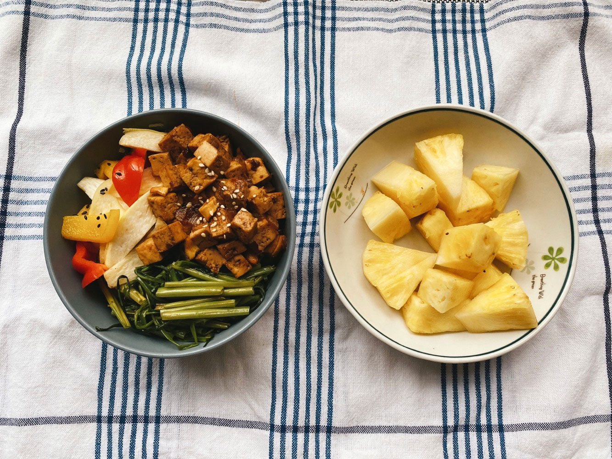
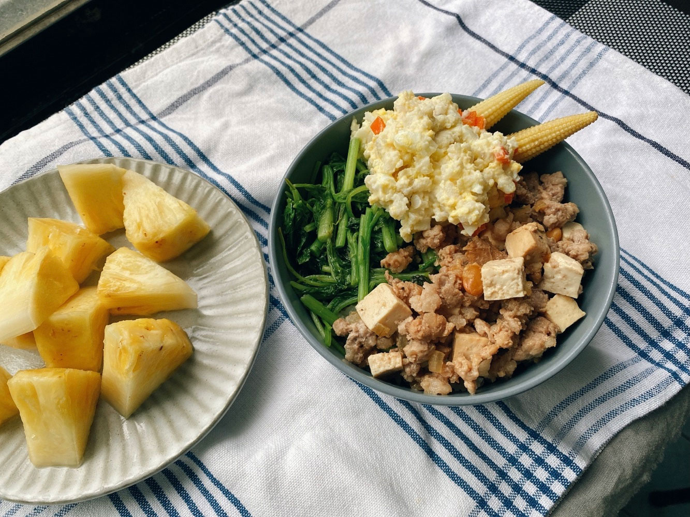




20220523 Mon



味噌馬鈴薯燉肉、芭樂

之前很愛用梅花豬，這次改用豬腱肉的部位，很耐煮。




---

20220524 Tue


鷹嘴豆咖哩、清炒小松菜、鳳梨

昨天沒吃完的馬鈴薯燉肉，今天加咖哩塊就又變一道新菜了。
\
另外加入鷹嘴豆補充蛋白質。

家樂福的鷹嘴豆罐頭是初次嘗試鷹嘴豆料理的好朋友，
\
無需燉煮即可直接食用，也可用叉子壓成泥，與板豆腐一起捏成漢堡排，
\
或者壓成泥後加入檸檬等香料調味，直接沾烤餅吃。


.

接下來幾天會連續降雨，趁著今天到市場補貨。
\
一樣的，塑膠袋自己準備，少拿好幾個。
\
最近是芭樂斷貨季節，量少、價高也不漂亮，嗚嗚，只能先找其他水果替代了。

鳳梨正當季，市場都能幫忙削皮，很方便！




---

20220526 Thu


蒜炒空心菜、甜椒炒皎白筍、腰果醬炒板豆腐、鳳梨

今天是沒有肉品的蔬食便當。

某次在素食便當店吃到堅果與切丁的板豆腐炒在一起的菜色，
\
軟中帶硬的菜色，豐富了口感層次，覺得很不錯，
\
剛好今天不知道要煮什麼主菜，便試試看全素食菜色。

要注意的是堅果起鍋前再下就好，不然跟著菜一起悶久就軟了不好吃。




---

20220527 Fri


炒莧菜、馬鈴薯泥蛋沙拉、味噌豆腐炒肉末、鳳梨。

同一塊豆腐昨天沒吃完，剩下的另一半今天拿來炒肉末。
\
用差不多的食材變出不同料理，是餐桌人口少的主婦料理必備技能。
