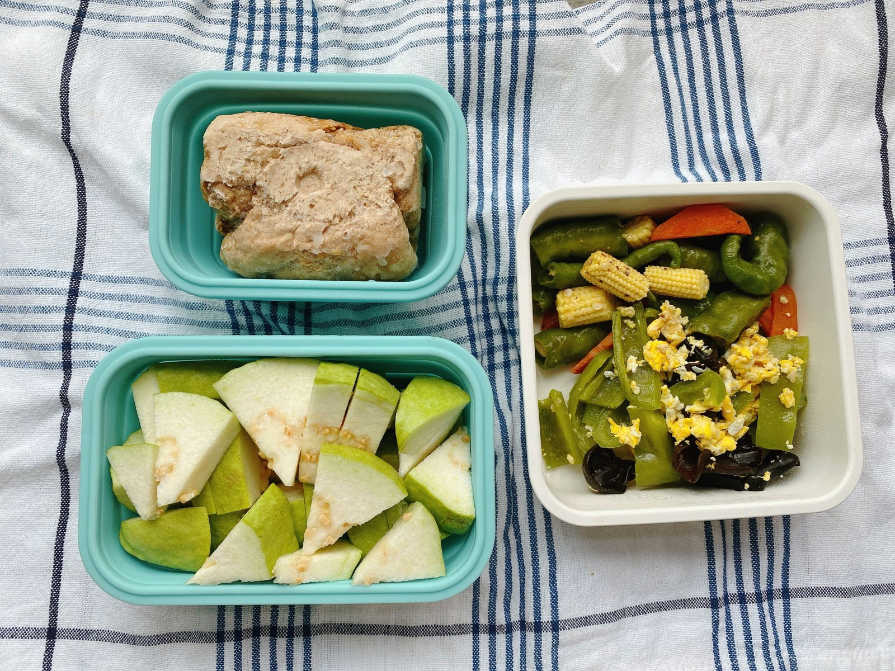
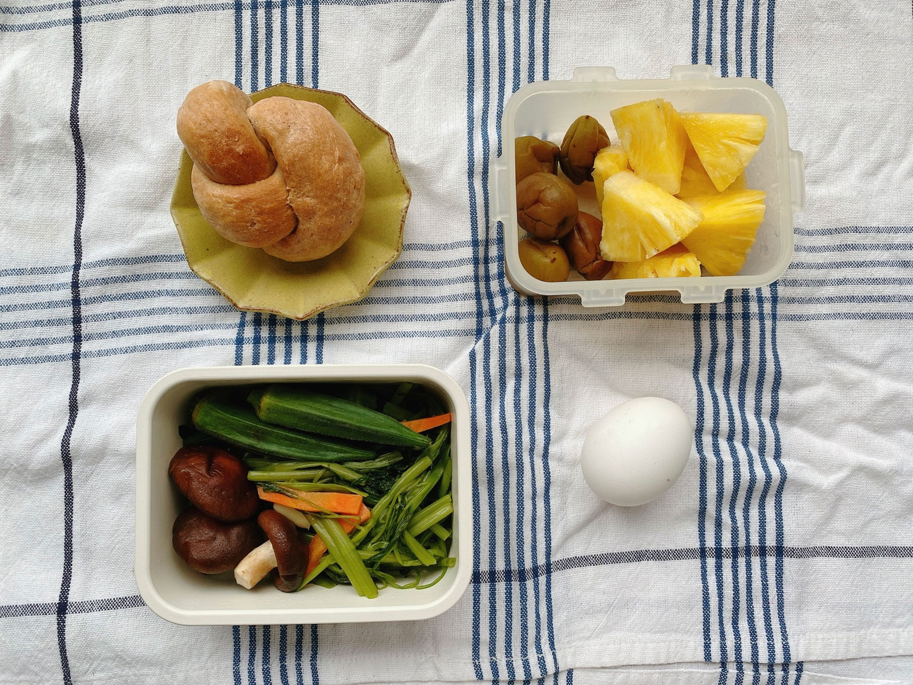
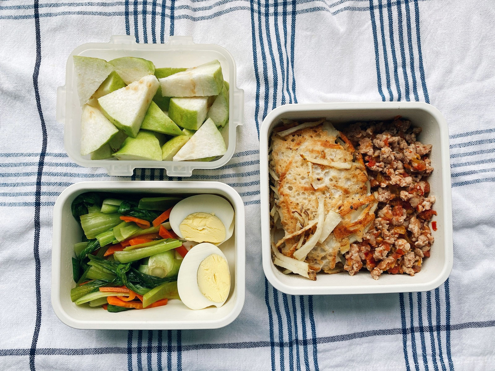
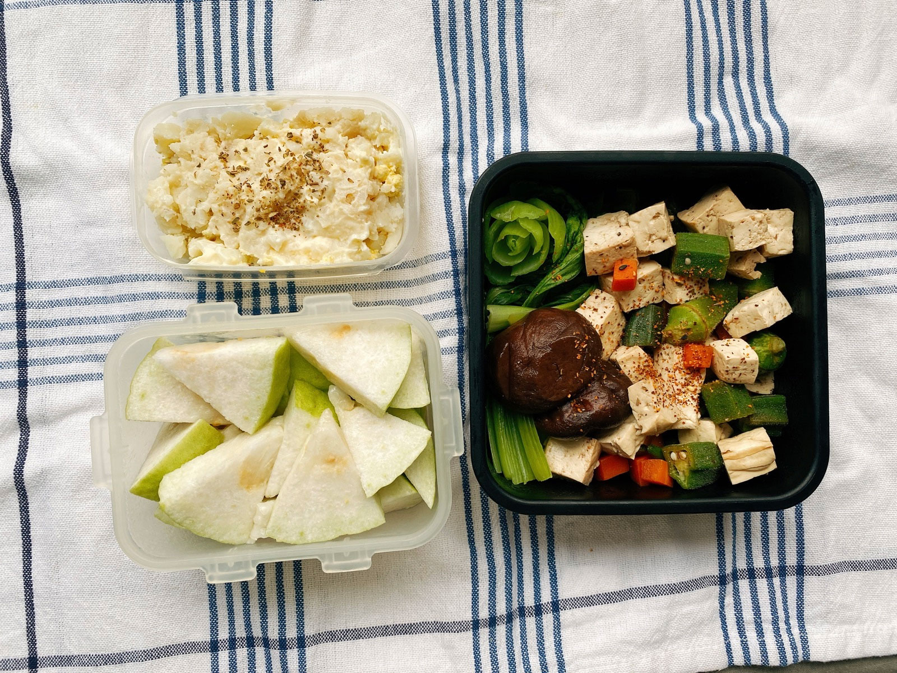
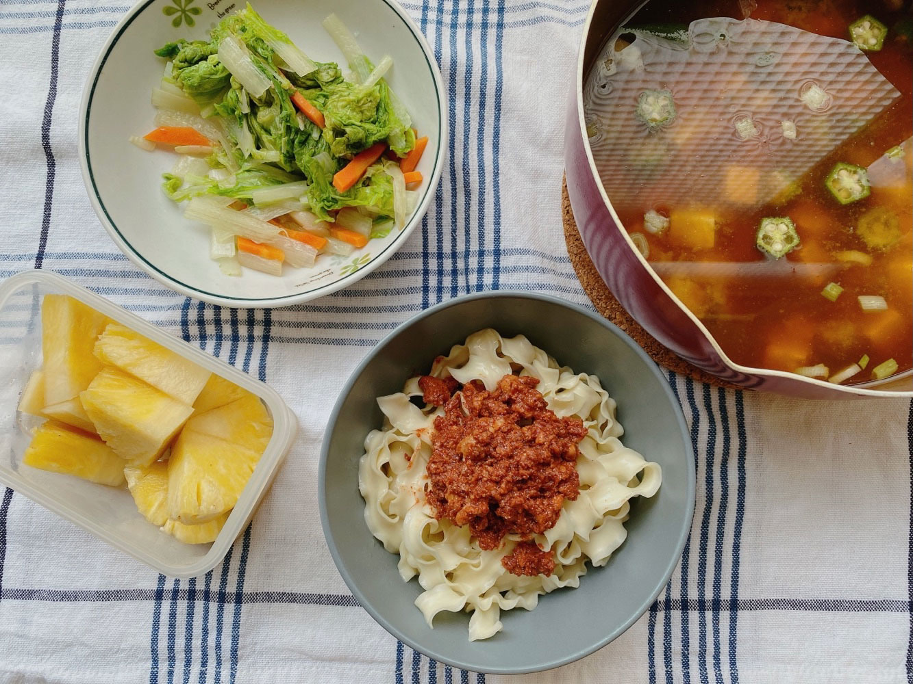




20220710 Sun











---

20220712 Tue



全麥麵包、青椒炒蛋、玉米筍炒糯米椒、芭樂

回辦公室上班了(;´༎ຶД༎ຶ`)

所謂的開學指的就是這件事(;´༎ຶД༎ຶ`)

嗚嗚嗚嗚嗚嗚嗚，便當都失去靈魂了




---

20220713 Wed


全麥優格餐包、鳳梨、水煮蛋、燙秋葵香菇

失去靈魂的第二天，我的生活沒有心得。

上週末開封了一瓶今年釀的梅酒，wow真讚，
\
剩下的酒梅帶到辦公室，當午餐的涼拌小菜，合情合理合法適度攝取微量酒精。




---

20220714 Thu


馬鈴薯煎餅與自製蕃茄肉醬、燙青菜、水煮蛋、芭樂

用自己熬的蕃茄糊製作番茄肉醬，取代搭配馬鈴薯煎餅的番茄醬，
\
美味直接上升一個層次，完全不是現成醬汁可以比較的。




---

20220715 Fri


薯泥蛋沙拉、和風涼拌秋葵豆腐丁、芭樂




---

20220716 Sat


肉醬拌麵、秋葵豆腐味噌湯、清燙小白菜、鳳梨

這一週高溫持續維持在難受的37度，坐著都會流汗的程度，
\
進廚房的意願與氣溫成反比，只想趕快打發解決，所以幾乎都只吃水果、清燙類。





圓點星海棠開花了！



