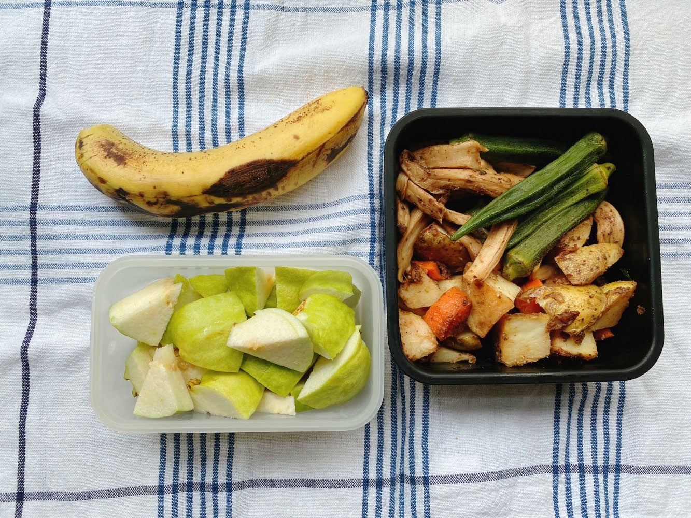
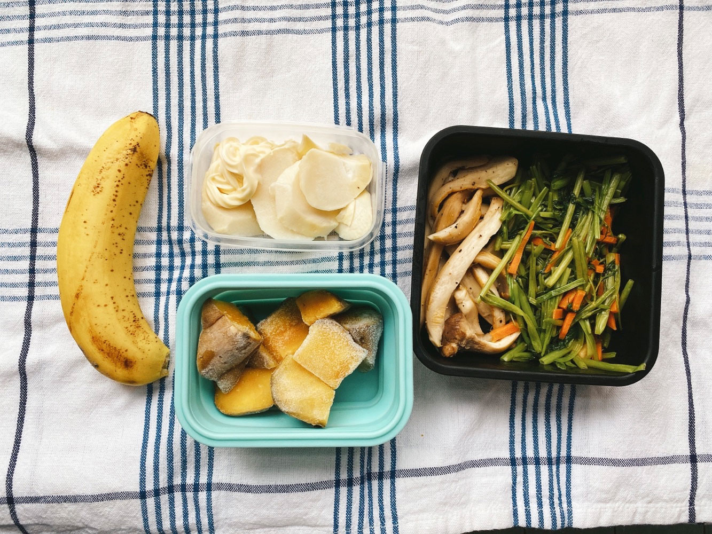
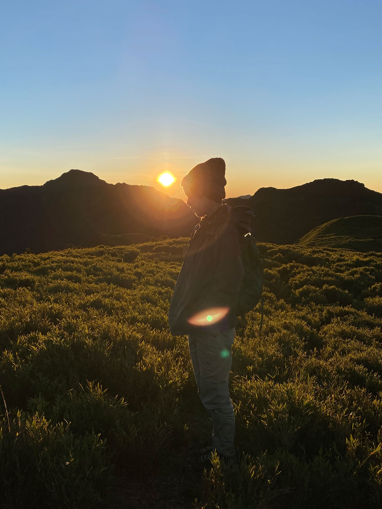




20220718 Mon



香料馬鈴薯塊、手撕杏鮑菇、清燙秋葵、芭樂、香蕉




---

20220719 Tue



手撕杏鮑菇、蒜炒空心菜、地瓜、涼拌綠竹筍、香蕉

七月中以後整個城市都被壓縮機的熱季籠罩著，
\
即便是晚間也是令人感到窒息的悶熱，洗完澡後立刻又出汗了，
\
再一個月，至少還要再熱一個月。




---

20220722 Fri








我去爬了奇萊南華！
\
週三晚上先到登山口附近民宿住一晚，7/21週四開爬，7/22週五下山。











這是我今年初爬完加羅湖後的最大願望，很幸運能抽到營地。

奇萊南華的金色草原非常有名，出發前我早已被youtuber們拍攝的影片感動到幾乎落淚，懷疑當我真的看到草原本人會不會真的哭出來。
\
可惜沒有😂


我猜是因為在山頂時只想著拍照，沒有空閒享受當下，一邊驚歎山的巍峨壯闊，一邊想著什麼角度能避開背景的人。

我最喜歡看遠方山脈稜線與表面植被隨日出光線的變化。










日出的過程很短暫，光線變化很快，幾分鐘內大地就從冷冽的藍黑色變成朝氣的亮黃色，
\
什麼登頂過程的痛苦、肌肉痠痛、沒什麼睡就要凌晨起床（那時還有滿天星斗！），都不算什麼了。



爬山的人常常提起那句充滿禪意的話：

> [因為山在那裡](https://zh.wikipedia.org/zh-tw/%E4%B9%94%E6%B2%BB%C2%B7%E9%A9%AC%E6%B4%9B%E9%87%8C)

我還只是爬山菜鳥，因為交通工具的限制，大部分時間只能探索城市周圍的郊山，大山爬得很少很少。

以前不是有流傳過心理測驗嗎？記得有一題問題是：喜歡山還是海？
\
小時候的我選海，因為爬山好累，而且好多蟲，我不知道樂趣在哪裡，

但現在我會不假思索地選擇山。

為什麼呢也說不上來，好像突然看懂山的迷人之處，幾百幾千年來它總是安靜的一直在那邊，突然想了解它。

爬山的過程很長、很疲倦，除了調整呼吸和步伐外不太能做太多事，許多打擾的事情屏除在外，手機啊網路啊通知啊工作啊。






我覺得爬山的沿路就是一直在累積，累積各種想法和疑惑，然後慢慢對話思辨，探索可能的解答。
\
可能最後什麼結論都得不出來，甚至產生更多問題，但沒關係，有問題，下山就去找書找人找資源。
\
這個過程會有很多無形的累積，智慧和哲學就是在這些糾結或討論中慢慢獲取的吧。



一直待在城市很少有機會像這樣以天為單位，長時間投入在一件事的過程中。

我覺得蠻好的。

爬山好快樂喔。




