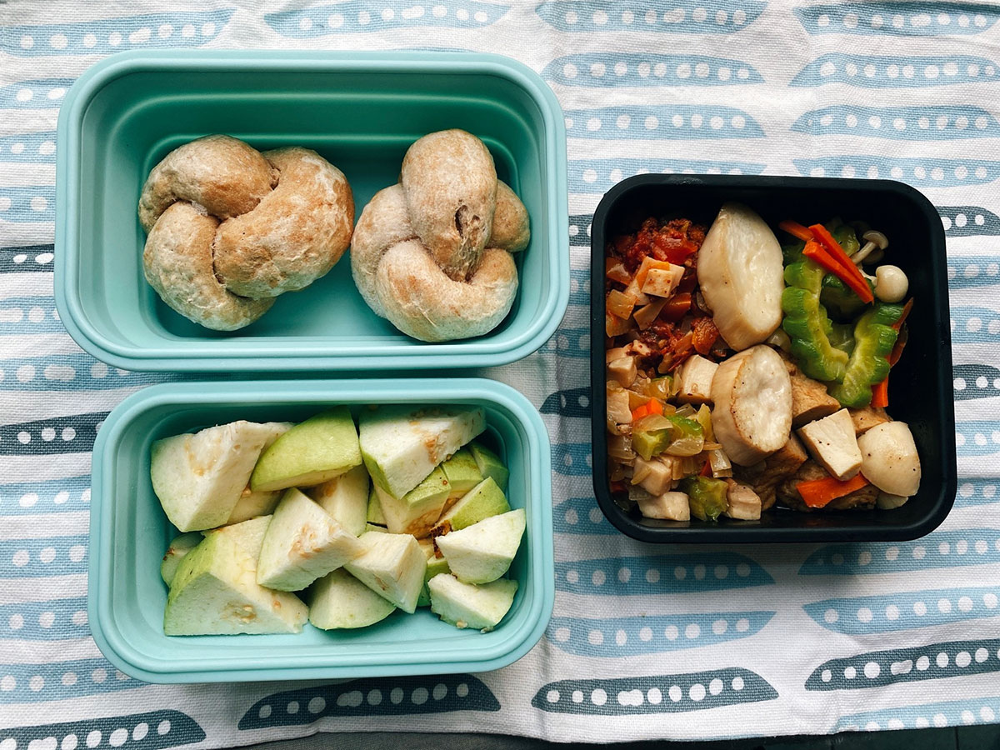
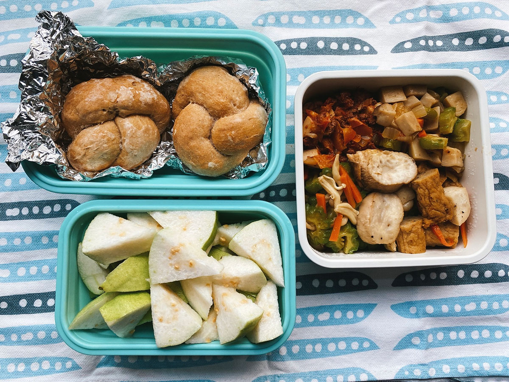
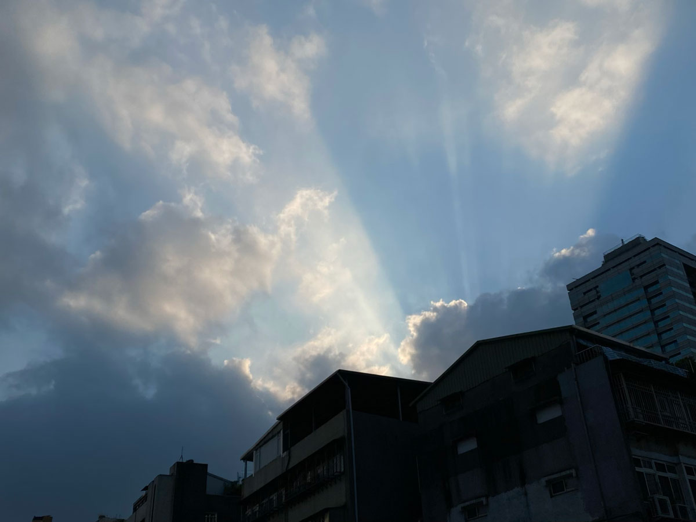
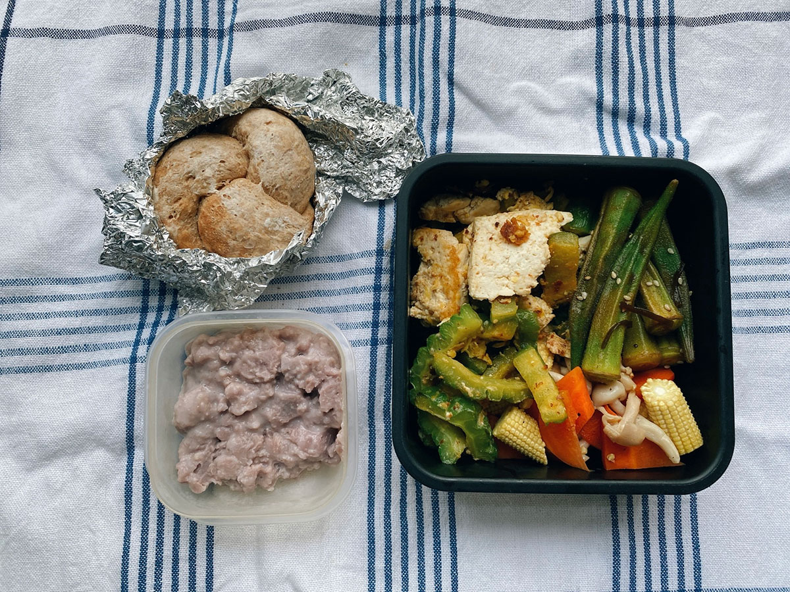
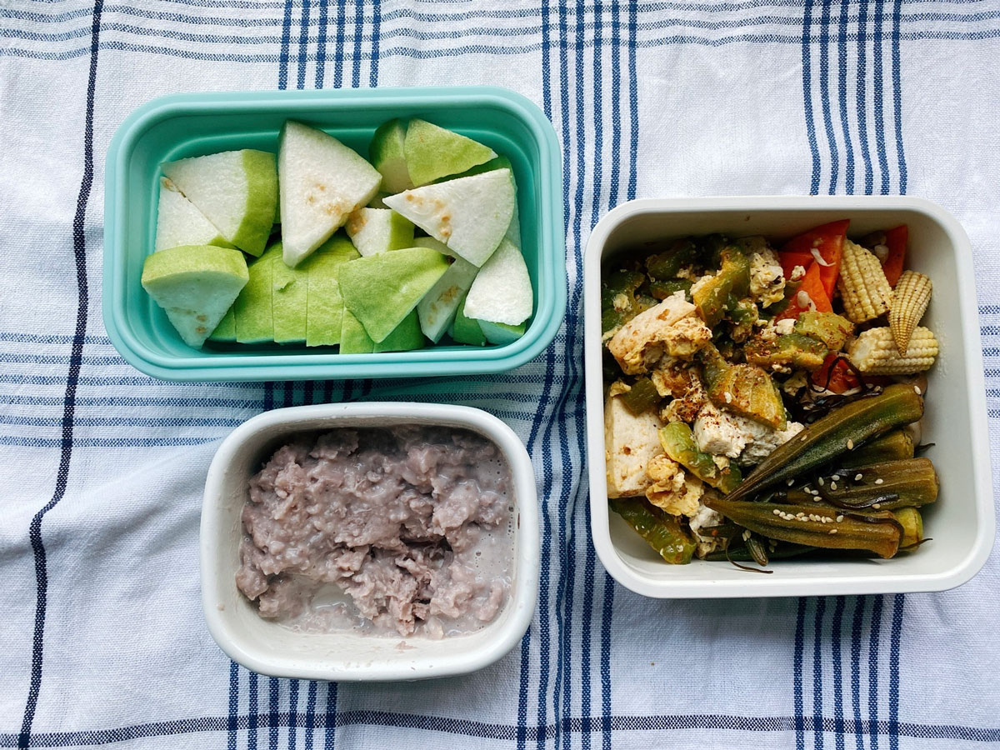
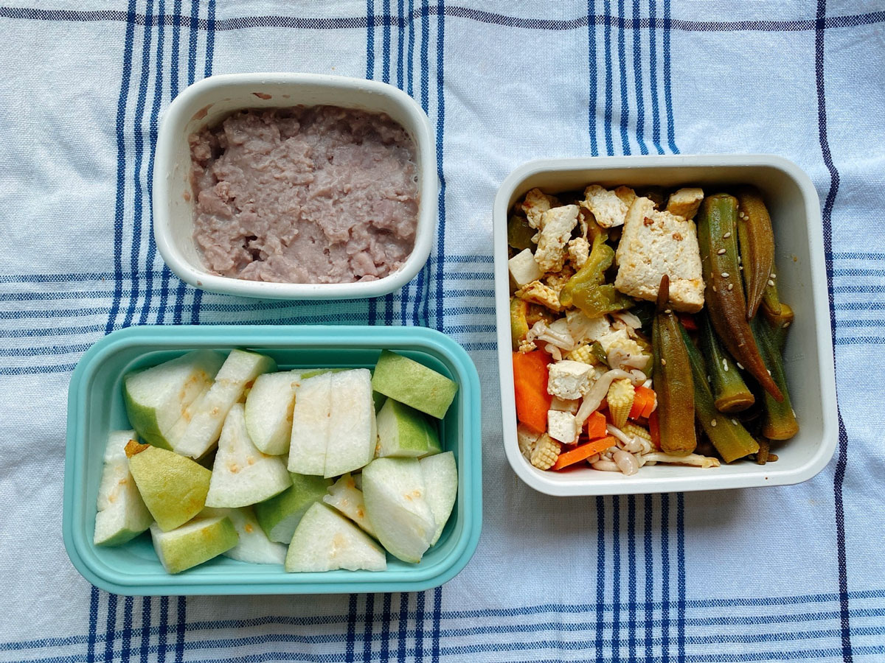
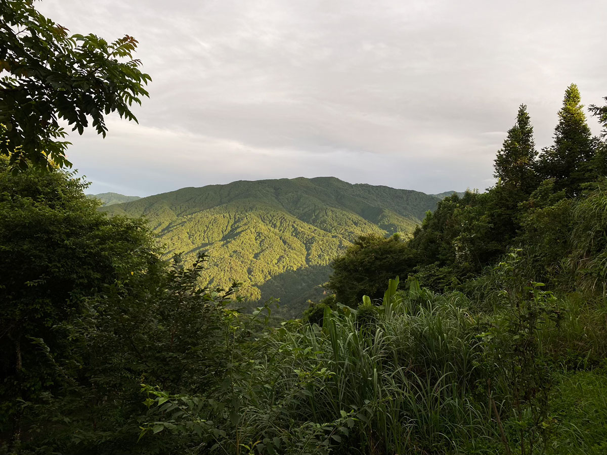
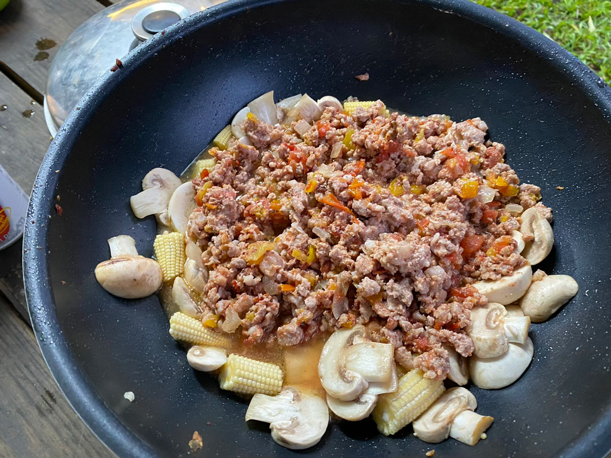




20220725 Mon



優格小餐包、清炒山苦瓜、番茄肉醬、洋蔥杏鮑菇丁、芭樂

哈！這次下山回來沒有跍落去徛袂起來（khû lo̍h-khì khiā buē khí-lâi）了。

五月左右因為天氣漸漸變熱的關係，跑步的習慣從那時就停擺好久，出發前很擔心肌肉會非常疲憊，幸好還有撐住。日常的鍛鍊還是得繼續啊。




---

20220726 Tue



優格餐包、甜不辣炒杏鮑菇、番茄肉醬、清炒山苦瓜、芭樂

便當一次準備大約是兩天分量，連著兩天都吃差不多的東西。

芭樂的價格終於降回來了。
\
身為芭樂狂熱者，一年四季冰箱裡隨時備著一兩顆是很正常的事，每年大約到五月左右會有一個芭樂斷貨期，市場難尋。即便有，價格也高且不好吃，但我還是會硬著頭皮挑一兩顆解解癮，搭配火龍果、鳳梨、荔枝。

喜歡芭樂是因為他不用去皮吐籽，一整顆可以完整消化乾淨。
\
我現在更懶，洗乾淨後，僅去除屁股部分在結果過程留下的萼片和雄蕊，黑黑的那一圈切塊後我也會直接吃掉，太懶了，不想處理任何渣渣廚餘。

其實連奇異果、蘋果、水梨等我也會連皮一起吃。皮最營養啊，去掉多可惜，而且我懶，哈哈哈。地瓜跟馬鈴薯如果沒有打算作成泥，多數時間我也是會連皮一起吃，少處理一個廚餘就是清爽，懶婦做家事的最高原則就是事情越少、越精簡越好。


我常常會被下班時的陽光吸引。

上班族的下班時間固定，但日落時間會因季節變換，以致走出辦公室時看到的夕陽位置皆不同。
\
夏日白天長，冬天天色暗的快。大概在十一二月左右，五點多的時候天空會被染成粉紅色的，那段時間我常常為了看橙色粉色的天空跑到辦公室的另一頭。

在台中工作時，下班騎機車回家的方向正好會面向夕陽，有一次我看到好美好美的魔幻時刻，大概就像上面這張照片，太陽躲在雲層後面，但光還是很強，因此從雲的邊緣透出很明顯的光束，時序會比現在再晚一些些，整片天空被染成橘黃色。
\
我像是追光者一樣，快速但小心的鑽進小巷子，想找到一個視線位置最好、不會被建物擋住的地點，因為太陽下山的速度和日出一樣，過程很短暫。
\
最後我拿起手機時發現完全拍不出來那種感動，那個純粹的氛圍也無法被記錄，果然動人的景色永遠是親眼欣賞最美麗。




---

20220727 Wed



優格餐包、芋泥、山苦瓜炒豆腐、和風涼拌秋葵、玉米筍炒紅蘿蔔

應該看得出來煮飯創作力用罄了🥲

今天讀到一個新聞，太平山翠峰湖環山步道獲得國際寧靜組織認證，成為全球第一條「[寧靜步道](https://edition.cnn.com/travel/article/taiwan-cuifeng-lake-circular-trail-intl-hnk)」。

翠峰湖環山步道位於海拔1900至2000公尺，全長約4公里，是台灣面積最大的高山湖泊。周圍是森林，且被苔蘚覆蓋，就像天然的吸音棉一樣，最低測得音量不到25分貝。

與羅東林管處合作的野地錄音師范欽慧說：寂靜並不是沒有聲音，而是萬物皆備的狀態，只是我們不曾注意。

>我希望人們帶著謙虛走進這條步道，並且打開他們的五感認真聆聽，一旦你安靜下來，你可以聽到很多生命。

身為一個剛從高山回來的都市女子，靈魂還沒完全歸位，看到這則新聞只想立刻奔去山上。




---

20220728 Thu



芋泥、和風涼拌秋葵、山苦瓜炒豆腐、芭樂

氣溫還是很高，但今早在等紅綠燈時一陣風吹來，覺得好像有涼一點點了。




---

20220729 Fri



芋泥、和風涼拌秋葵、板豆腐炒紅蘿蔔、芭樂

咻咻咻地一週又要結束。

這禮拜有三天是利用早晨快速料理便當菜，比平常再提早半個小時起床，因為晚上太悶了，不想待在廚房。

早晨煮飯特別安靜享受，即便只是簡單燙個秋葵、炒個豆腐，卻能給心靈帶來踏實的滿足感。這週在工作上有很多紛亂的思想，為此煩憂了好多天，進行簡單家事的早晨，讓我確定我還是很喜歡做菜的。




---

20220730-0731 Sat-Sun



露營晚餐：番茄肉醬義大利麵

週末和朋友到海拔大約1200公尺左右的山上露營，才剛抵達營地，立刻就下起爆裂的午後雷陣雨，山上已比平地低了大約七度，這陣雨再把30度左右的夏日感受帶離更遠，太陽還沒下山就有微微涼意。

傍晚看著放晴後的遠山準備晚餐，飽滿的金色陽光灑在對面山坡的小樹頂端，太享受了。

第一次準備七人份正餐，份量抓的不是很好，且是在設備不太方便的戶外，導致最後調味有點差，有失日常水準。可惡，如果有下次我要努力雪恥。
