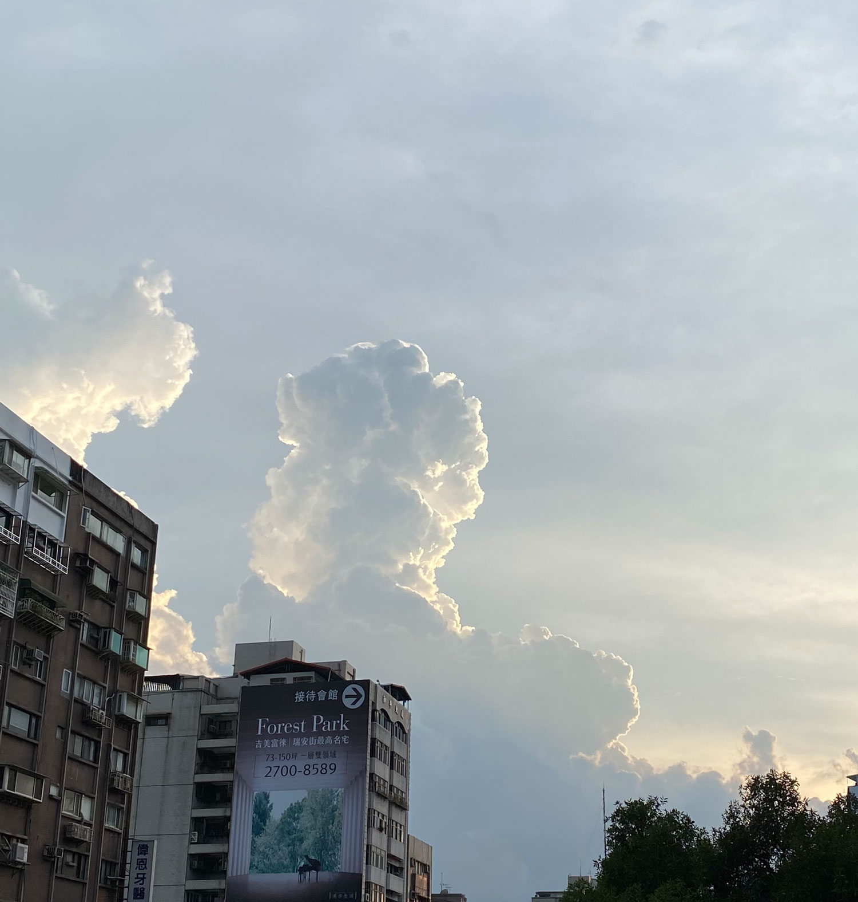
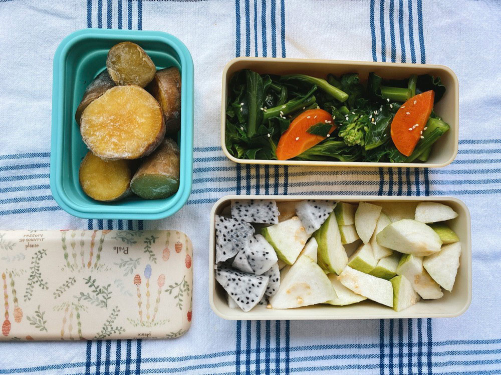
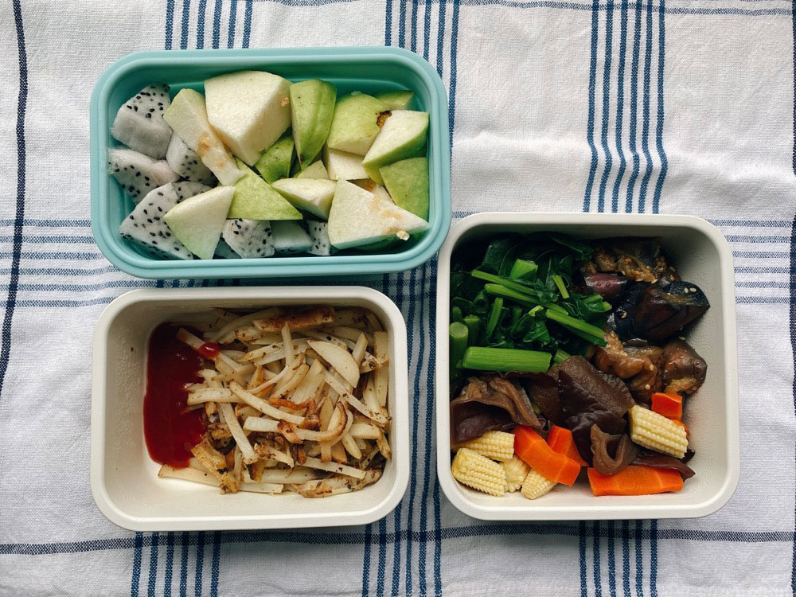
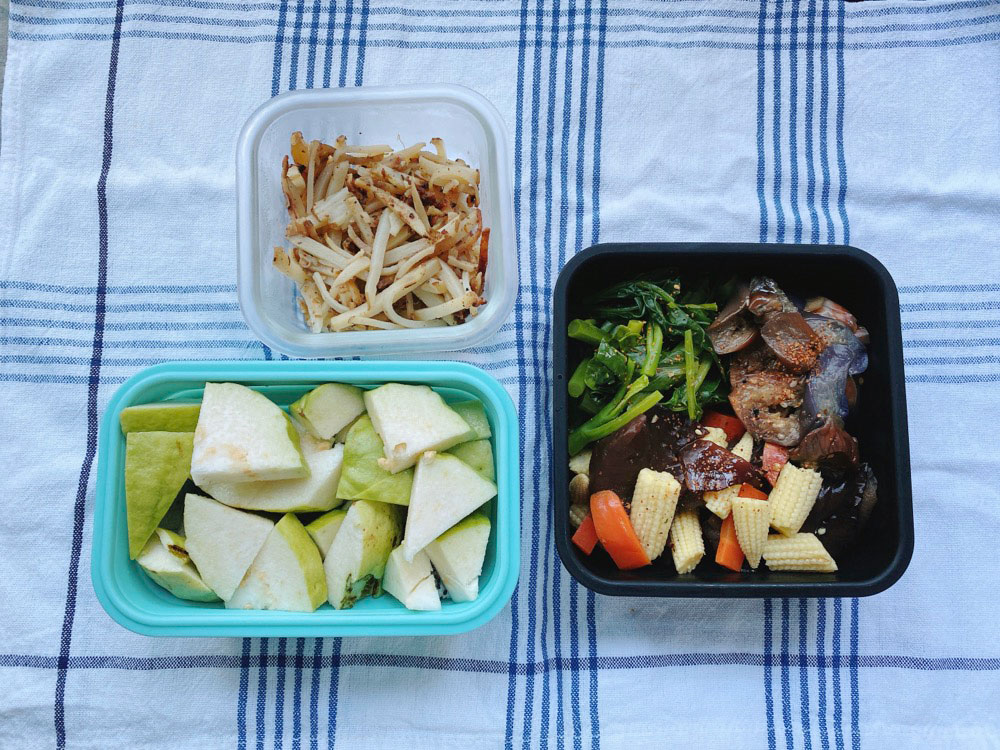
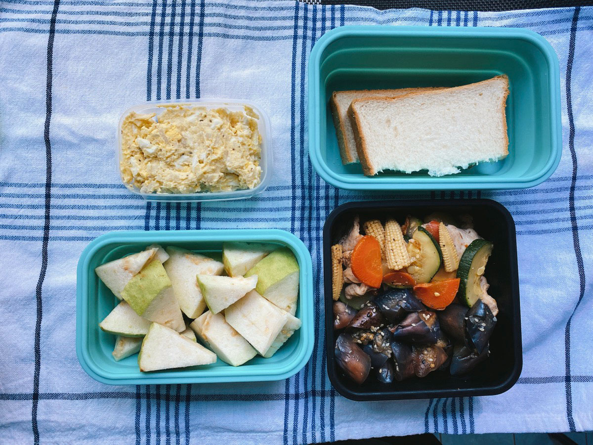
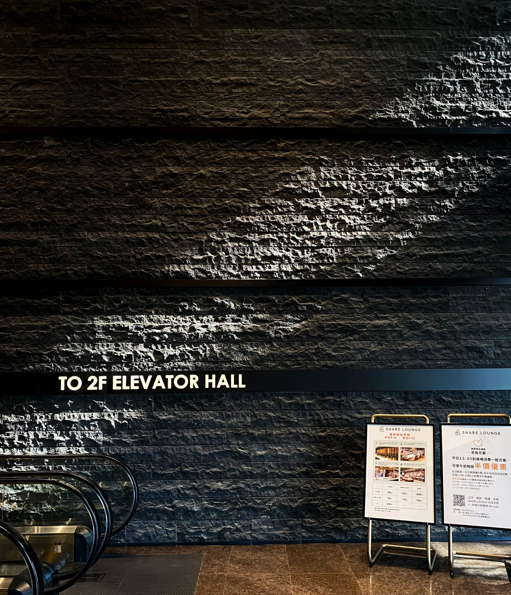
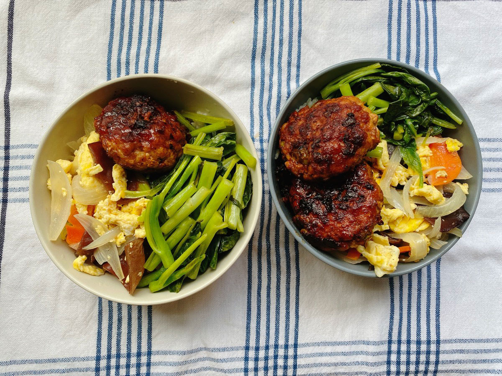
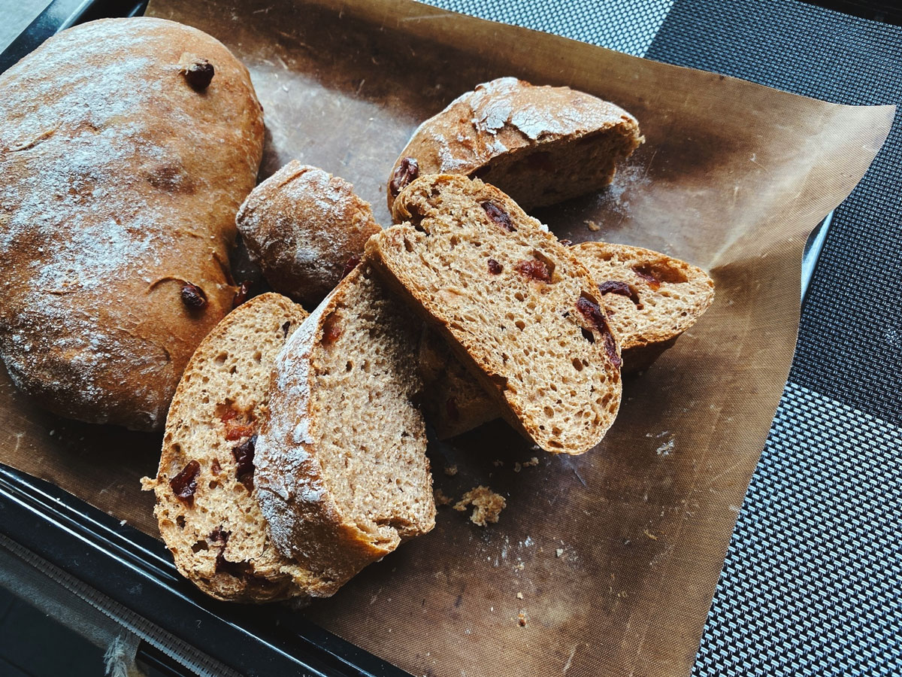




20220731 Sun






---

20220801 Mon



冷凍烤地瓜、清炒芥蘭花、火龍果、芭樂




---

20220802 Tue



香煎馬鈴薯、和風涼拌茄子、玉米筍炒木耳、炒芥蘭菜、芭樂、火龍果




---

20220803 Wed



香煎馬鈴薯、和風涼拌茄子、玉米筍炒木耳、炒芥蘭菜、芭樂、火龍果

與昨天吃的一樣。



今天在整理書上看到的句子。

閱讀時如果看到喜歡的句子，文筆生動的、用字美麗的、具有啟發的等等，我會先用N次貼貼起來，等閱讀到一個段落的時候，再一次整理起來。

最近在讀小川洋子的《總之，去散步吧》，是一本收錄了四十六篇短篇的散文集。書中提到一個有趣的計畫，是保羅・奧斯特（Paul Auster）的《全國/故事/計畫》。這是一個廣播節目集結的書，由全美國的聽眾寄信，寫下自己人生中最難忘的體驗或故事，保羅選出後在節目中朗讀。（搜尋後發現台灣集結出版的書名叫《[週末小故事](https://www.books.com.tw/products/0010198412?sloc=main)》）

[時報悅讀網](http://www.readingtimes.com.tw/ReadingTimes/ProductPage.aspx?gp=productdetail&cid=rtai(SellItems)&id=AI0070&p=excerpt&exid=30231)有刊出由保羅撰寫的序，其中我最喜歡他說的這一段：

> 如果你對事物不能確定，如果你的思想還能開放得對你所見到的產生疑問，那麼你就會更小心地來看這個世界，而由這份警覺，你就可能看到別人以前不曾看到的東西。你必須要願意承認你沒有所有的答案，否則你就永遠沒有什麼重要的話可說。



第二個讓我印象深刻的文章，小川洋子在其中提到了她最喜歡的書名。

因為無法回答「最喜歡的書」的問題，從豐富的閱讀經驗中另外選出了「最喜歡的書名」。她最喜歡的書名是喬恩・麥格雷戈（Jon McGregot）著，真野泰譯的《奇蹟如果沒有人說出》（If Nonody Speaks of Remarkable Things）。

> 出場人物之一指著樑上整排齊飛的鴿子對著女兒問道，你看到了鳥兒不會撞在一起的樣子了吧？如不仔細停下來想，就這麼輕描淡寫結束了，但其實意有所指。奇蹟如果沒有人道出，如何能稱它是奇蹟呢。

雖然只是平淡的日常畫面，但這段文字，彷彿森林中一顆顆因為陽光照射兒閃耀的石頭般發著淡淡的光芒，心像是被廣袤草原上的風輕輕吹過一樣溫柔地撫摸，讓人從business is everything的工作中稍微抽離。

這些不重要的片段畫面讓我覺得生活好美好。









---

20220804 Thu



馬鈴薯蛋沙拉+烤土司、涼拌茄子、櫛瓜炒雞肉片、芭樂

同事上週訂了一大箱酸種麵包，把麵包工作室的所有口味全都訂一顆回家試吃，每天都會切一小塊與大家分享，多虧她的大方熱情，最近我每天都有高級的酸種麵包可以吃。

使用酵種做的麵包香氣真的太難以抗拒了。




---

20220805 Fri



蒜炒芥蘭菜、洋蔥木耳炒蛋、照燒漢堡排






在家工作的日子，當然要好好把握時間烤麵包。

參考一個免揉的做法，果然沒有揉過的麵團，一點嚼勁也沒有，光在切片的時候就可以明顯感受到組織的鬆散，幾乎不需費力就能切斷。下次還是認份點乖乖揉麵吧。




---

20220806 Sat



週六午餐時光和許久不見的高中朋友吃飯，和他一起看顧兒子三小時。

小孩正處於學習認識物品的年紀，手指會到處指著物品，發出差不多的狀聲詞：茶茶（tê tê）、車車、燈等等，發音不是很標準，聽起來都很像😂

但這個動作讓我想起前幾天小川洋子提到的《奇蹟如果沒有人說出》。

物品跟畫面、事件一樣，如果沒有指出來，沒有人提起，它的存在就會一直理所當然的存在於生活的背景中。指著它、把視線移到它身上，就會在今天的記憶中留下一個位置。



