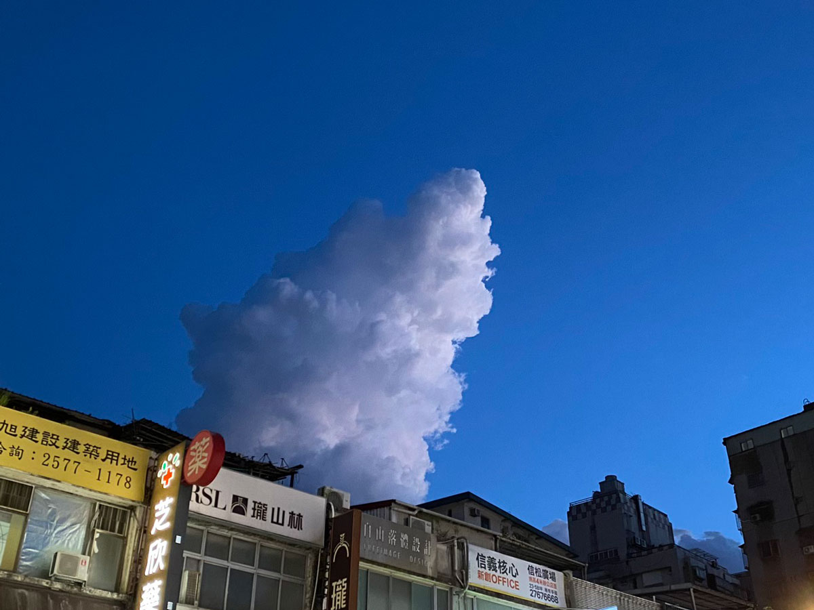




20220807 Sun



早起爬了個小山，六點出門。

這次從陽明山二子坪出發，繞了面天山、向天山、大屯南峰、大屯西峰，再走回二子坪。原本只打算走完面天山和向天山就要結束，仍覺得不夠過癮，沒有運動到的感覺，臨時決定再繞一段，多走了台北大縱走第二段的一小部分。

不到七點二子坪停車場就客滿，晚到的小客車只能在入口處排隊。



天氣很好，能見度很遠。在面天山能清楚看到八里、淡水、三芝，海平面上有點點作業中的漁船。大屯西峰與南峰這一邊，則幾乎可將整個台北市盡收眼底，關渡大橋、淡水河，指標性的圓山飯店、台北101都清晰可見。

從面天坪轉往大屯西峰，一直到大屯南峰的這段路有蠻多陡上陡下的地形，得雙手拉繩攀爬，比起前面的階梯步道更具挑戰，走起來也比較有趣味。






---

20220808 Mon



薯泥蛋沙拉、糖醋彩椒、蒜炒小松菜、香煎櫛瓜玉米筍、芭樂、火龍果

晚上如果不在密集的住宅區的話，戶外會比室內涼很多，我總會特地為此出門散步。




Youtube今天推薦這部影片給我。

以前在公司午休吃飯，我也是習慣搭配娛樂型youtube節目，例如美食開箱評分、外景節目、料理教學，「你不知道的OO景點」，「國外家人吃台灣小吃」等這類型的內容，但我發現吃飯時看這種節目，會讓我很想快轉或分心。開頭兩分鐘覺得不夠有趣，就找找其他有興趣的題目，然後又是只有兩三分鐘。或是跳著看，都覺得不夠吸引我，最後整個午休就在跳轉、重來、換一個的過程中結束，什麼也沒看到，我才發現我選擇影片的時候，心情是處於非常焦躁的狀態，這樣不行，沒有休息到。

後來我改看沒有人說話，連旁白也沒有的紀錄型影片，畫面上只有適度的文字說明，搭配舒服的襯樂，總算能讓我放鬆，好好看完十幾分鐘的影片。

最近演算法大概看透我，開始推薦大量這類型的節目，介紹家中的植物、紀錄家事整理、麵包職人凌晨開始的工作側拍、DIY敲出一個咖啡桌的過程、一人獨自露營的vlog等，其中共通點就是「不要教學、不要大量資訊、不要華麗的剪輯或畫面、不要賣東西、不要取悅我，單純紀錄分享」，反而這種類型對我來說，才有放鬆、娛樂的作用。





總覺得越是資訊豐富、唾手可得的當代，越需要刻意留白，才能察覺自己的情緒變化。這麼大量的資訊湧來，不堅定一點的話，就只能被推著走。哪裡有促銷、哪裡有新開的網美店、哪裡有排隊美食就往哪裡去，但真的適合或需要嗎？


---

20220809 Tue



親子丼、糖醋彩椒、蒜炒小松菜、火龍果、芭樂

鬧鐘響之前二十分鐘先被膀胱叫醒了。

今天要做的早晨料理只有一項，這麼早起，時間留太多了。但尷尬的二十分鐘，要再睡也睡不著了，索性起身開始作業。



今早搭配的podcast是聲東擊西ep.221的[自由和糖不可兼得](https://podcasts.apple.com/tw/podcast/221-%E8%87%AA%E7%94%B1%E5%92%8C%E7%B3%96%E4%B8%8D%E5%8F%AF%E5%85%BC%E5%BE%97/id1183662640?i=1000569886152)。

聲東擊西我訂閱好一段時間，一直沒有排上收聽佇列。這次是因為聽了星箭廣播[ep.167-Podcast基本教義派](https://podcasts.apple.com/tw/podcast/167-podcast-%E5%9F%BA%E6%9C%AC%E6%95%99%E7%BE%A9%E6%B4%BE-%E6%88%91%E6%89%8D%E4%B8%8D%E8%AA%BF%E5%85%A9%E5%80%8D%E9%80%9F-ft-%E8%B1%AC%E5%B0%8F%E8%8D%89/id1459758276?i=1000569715127)中，豬小草的推薦，才再次想起有這麼一黨節目。剛好最近播放清單消化的差不多，便選了這集，在早晨比較專注沒有旁騖的時間收聽。

這集節目的來賓，一位是生活在鄉村，帶領瑜伽愛好者靜心進修的玉冰，另一位是疫情前剛辭職，與夫婿兩人跑到拉美開車公路旅遊的Summer。他們兩人的生活樣貌都不是典型商業社會朝九晚五的上班族，居住的地區也不在大城市裡，反而跑到便利性相對較弱的鄉村，更甚是成為沒有固定居住地的「數位遊牧者」。

很多人看到這類夢想成真的生活實踐者，都搶著問「為什麼」、「怎麼辦到的」。但就如同為什麼我們是今天的我們一樣，都不是單一個選擇、一次的改變就會抵達今天的位置，必須經歷過一些事情，加上對人生的想法、對價值觀的想法，同時也無法一次規劃到位的寫出完美計畫表，先踏出那一步，之後邊走邊調整。因為過程中人會改變，故事會累積，或許一個月後的想法，就與出發當時的想法有所不同。




有一個很重要的觀念是「抓猴人」。



32:08處玉冰提到，她在丹津·葩默的演講中聽到一個故事。在東南亞一帶有一種抓猴子的方式，捕猴人會在樹洞裡放糖吸引猴子，當猴子聞到糖的味道，手伸進樹洞，抓住糖，卻發現手拔不出來，因為當握住糖的時候，拳頭的大小會比樹洞的入口還大。受到驚嚇的聲音，告訴抓猴人可以捕猴了。但其實只要放開那顆糖，便能獲得自由。

安穩的狀態，固定有收入的生活，就像樹洞裡的糖，抓住之後，就無法體會較彈性的生活。而自己現在的狀態就像選擇放下那顆糖，收入雖然時有時無，說不上穩定，卻擁有更彈性靈活的自由時間。兩者之間還是蠻難兼得的。雖然稱為人生的另一種選擇，但畢竟只是眾多選擇中的一種，還是得做選擇，重要的是想清楚自己想要自由還是糖。



<iframe title="podcast聲東擊西-自由和糖不可兼得" allow="autoplay *; encrypted-media *; fullscreen *; clipboard-write" frameborder="0" height="175" style="width:100%;max-width:660px;overflow:hidden;background:transparent;" sandbox="allow-forms allow-popups allow-same-origin allow-scripts allow-storage-access-by-user-activation allow-top-navigation-by-user-activation" src="https://embed.podcasts.apple.com/tw/podcast/221-自由和糖不可兼得/id1183662640?i=1000569886152"></iframe>

<iframe title="星箭廣播ep.167-Podcast基本教義派" allow="autoplay *; encrypted-media *; fullscreen *; clipboard-write" frameborder="0" height="175" style="width:100%;max-width:660px;overflow:hidden;background:transparent;" sandbox="allow-forms allow-popups allow-same-origin allow-scripts allow-storage-access-by-user-activation allow-top-navigation-by-user-activation" src="https://embed.podcasts.apple.com/tw/podcast/167-podcast-基本教義派-我才不調兩倍速-ft-豬小草/id1459758276?i=1000569715127"></iframe>




---

20220810 Wed



味噌親子丼、蒜炒小松菜、香菇丁炒豆腐

Workshop Day 1

從今天開始，一連三日的下半天都在參加工作坊，極燒腦，需要補充澱粉。




---

20220811 Thu



雙色丼飯（雞蛋鬆、豬絞肉）、彩椒炒花椰菜

Workshop Day 2

早上烤了一瓶大蒜油。



越來越習慣早起做便當的作息了，六點前起來，花一小時料理，選好podcast節目，時間很快就過去，充實且有精神。

煮完便當後還有時間打理其他角落，晾衣服、收衣服、摺衣服、擦地、澆花，利用上班前的時段把家維持乾淨整潔，感覺時間運用效率很高！




---

20220812 Fri



番茄肉醬義大利麵（自製蕃茄糊）清燙時蔬

Workshop Day 3

最近買了一個新的買菜的袋子。之後也會在[療癒廚房3]()的後半部心得提到，我現在蠻懂的欣賞這種老東西。

小時候不懂事，覺得越現代越新潮的東西才是美，確實第一眼總會被吸引住，但未必耐看。經過多年的品味練習，漸漸明白這種傳統工藝的好。使用天然的材料，取之於在地，與土地有連結感，外觀低調樸實，不高調，讓人越看越覺得可愛。



其實我很喜歡原本的提袋，連把手都是藤編的，可是就是這個藤編，只要買了稍重的水果或肉類，超出他的負荷太多，就會導致提把處斷裂。我已經用膠帶補了好多回，最後真的沒辦法，只剩一條細細的籐皮連結，幾乎裝不了任何東西，現在只能擺在家中當裝飾。









---

20220813 Sat



傍晚搭車回台中，在車上遇上魔幻時刻。往後奔去的樹叢們，在側邊接近底下的部分，都鑲了一層飽滿的金黃色，看著這樣的畫面，覺得什麼紛爭衝突都不那麼重要了。



有看到嗎有看到嗎？在淡藍色的天空畫布上清晰地畫出一道粉橘色暖光。夏天的每一天傍晚，幾乎都能看到這麼精彩的色彩變化，在海邊的話應該可以看得更明顯吧。



