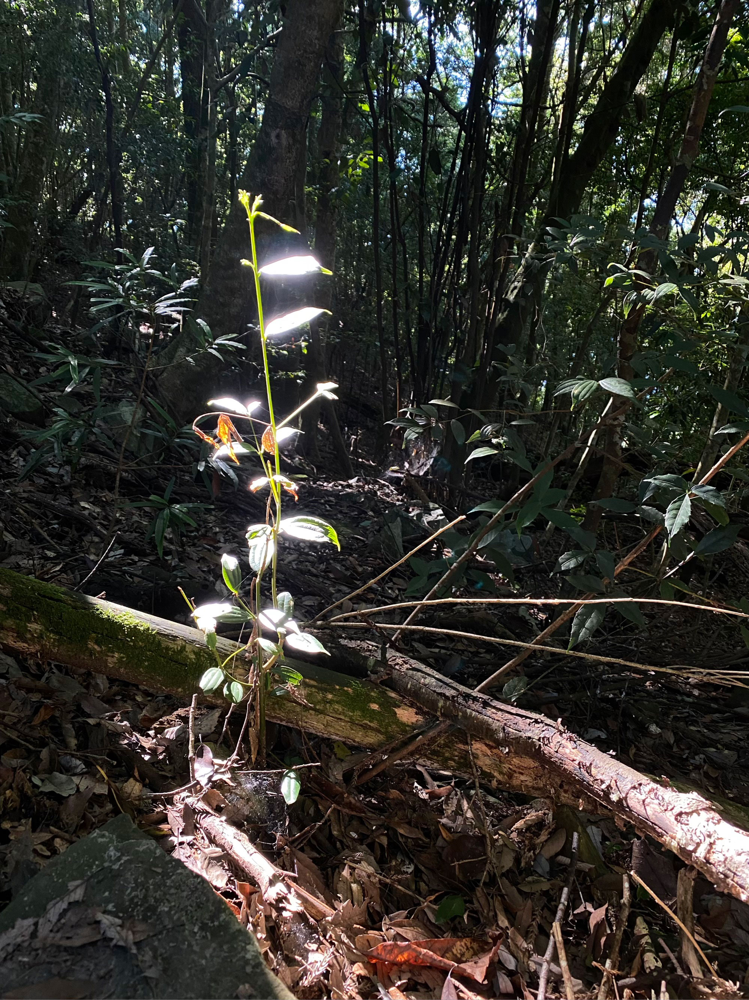
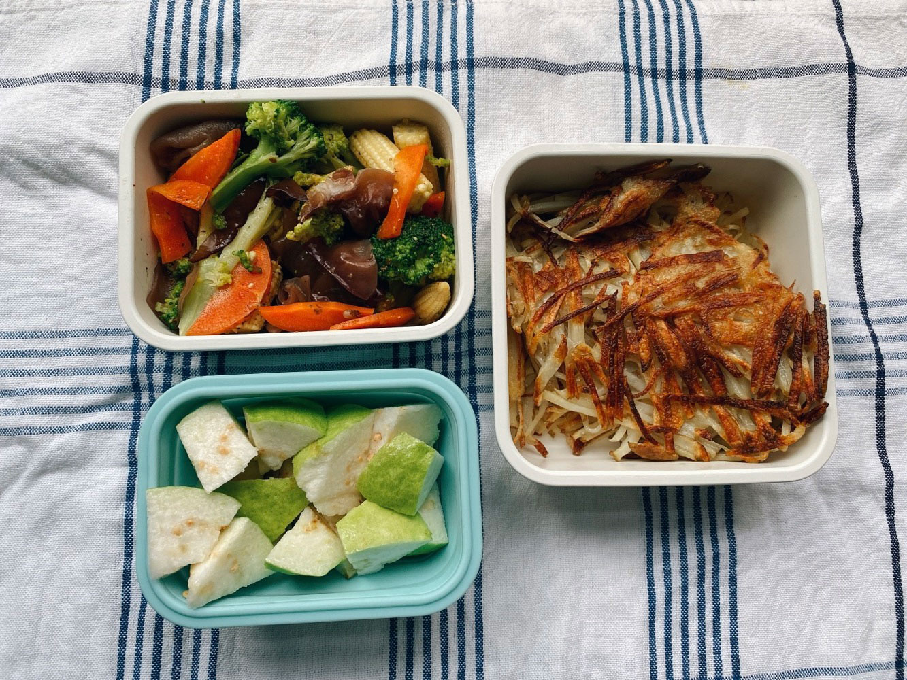
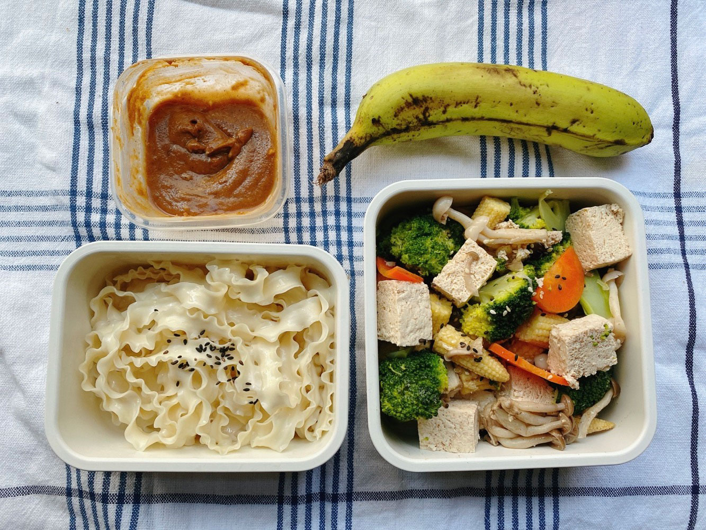
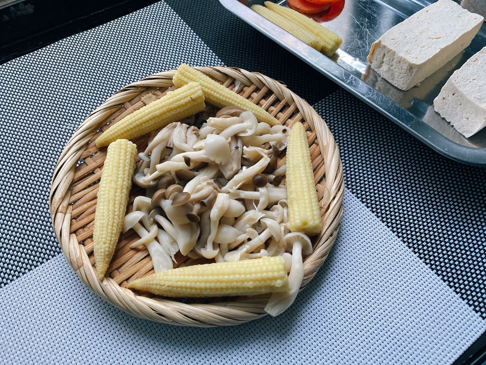
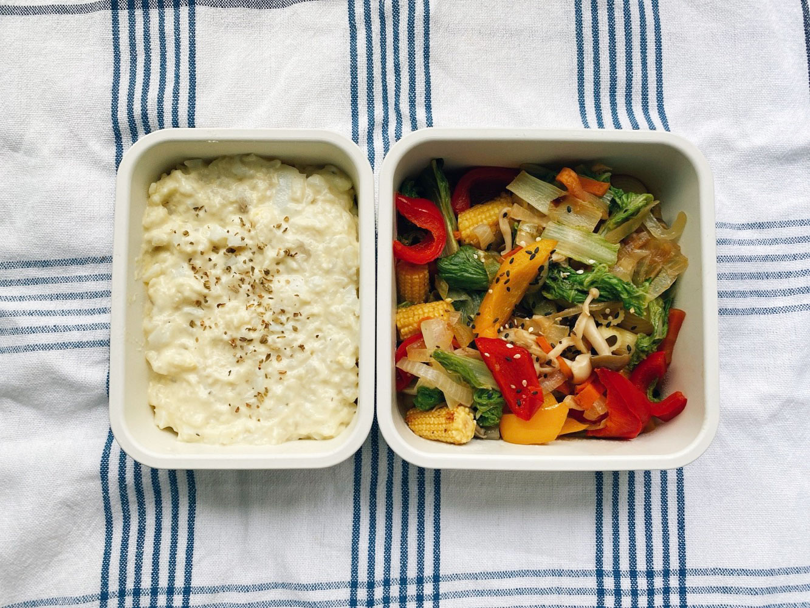
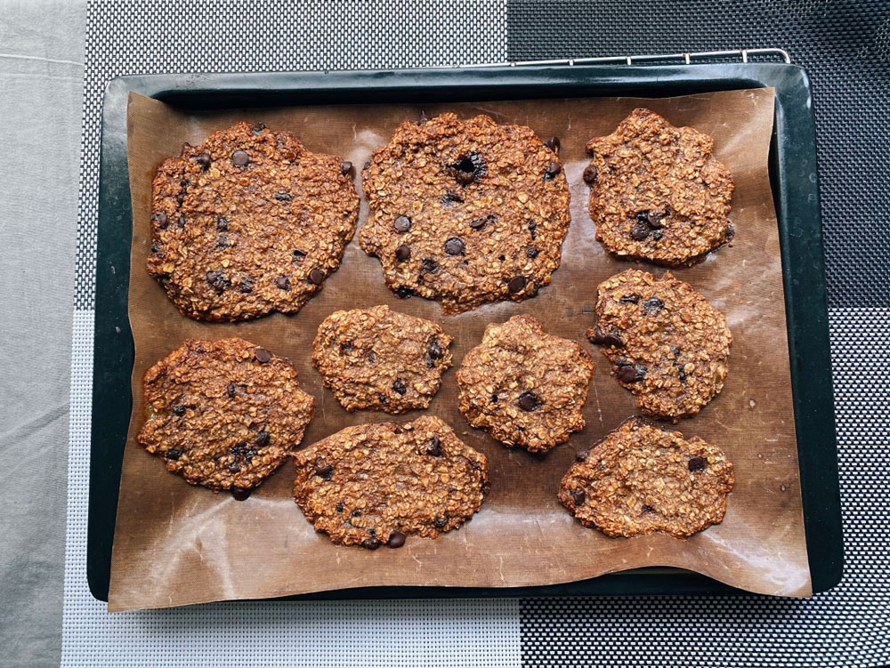
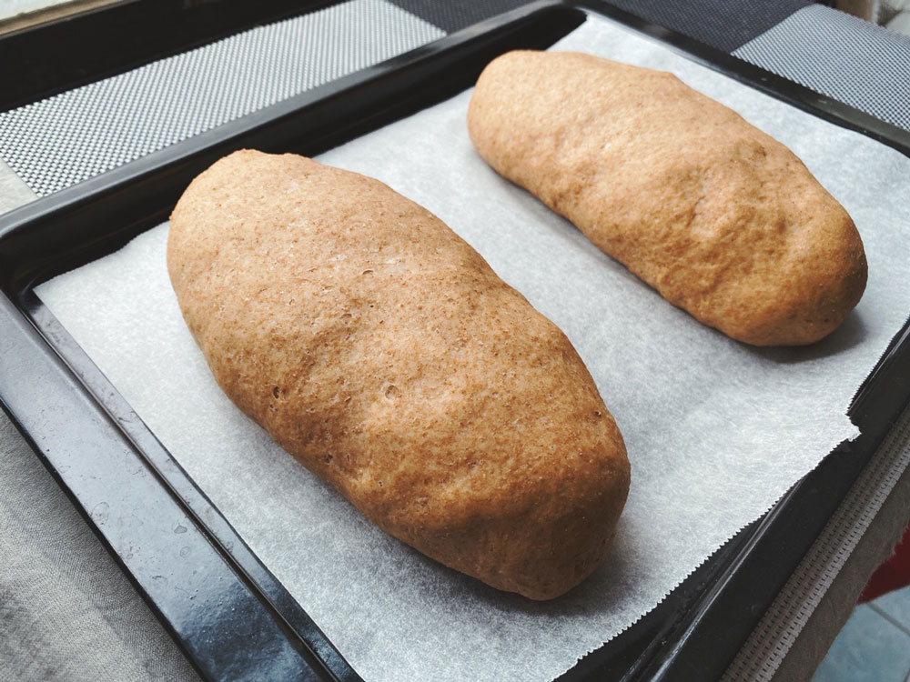




20220814 Sun



其實不是植物發光，是陽光照在植物上的光。

這半年以來只要回台中，就會問爸媽有沒有想去的地方，大部分是爬山，不爬山的話郊區散步也可以。原因之一是夏天太熱，在家只會坐著看電視、吃零食，不如上山避暑。之二則是盡量多把握住和爸媽的相處時光。畢竟一兩個月才回家一次，整日窩在室內太無趣，爸媽年紀大了，開長途山路耗體力，我也可以藉機多練習並保持開車的感覺。

這次去谷關七雄之一的屋我尾山，選擇最親民的北登山口，大部分是下坡路線，針闊葉混合林蔭遮蔽，非常涼爽。而回程時的輕鬆來時路全都轉為痛苦的上坡，多為樹根盤錯的地形，腳步必須小心踩踏，沒踩穩的話容易滑倒，千萬要小心。大部分的路況清晰好辨別，但還是強烈建議下載離線地圖，有些路段與周邊地勢太過相近，若沒留意可能會不小心走錯。最好是結伴一起行動，沒有把握的話也可等到有人經過時一起前進，該路線非常熱門，一定可以遇到山友。但也因為他的知名度，清晨七點左右停車位就將近全滿。從東勢過來一路上有不少登山路線，例如鳶嘴山，馬路邊不少前一晚就提早來過夜的九人座休旅車，若有意假日攀登附近的路線，請務必注意出發時間。









---

20220816 Tue



馬鈴薯煎餅、木耳炒花椰菜、芭樂




---

20220817 Wed



麻醬麵、鹽水蔬菜、香蕉

嘗試使用[療癒廚房]()中提到的方法，用竹篩盛裝燙好的香菇與玉米筍，可能我木舌，還吃不出因竹篩保留的食物鮮味。

可能這些食材本身就夠優秀？(◔౪◔)




---

20220818 Thu



馬鈴薯蛋沙拉、炒烏龍麵的配料

原本打算做炒烏龍的，結果冰箱沒有烏龍麵😂只好請出薯泥沙拉緊急救援。



昨日去市場的時候被送了兩把菜，今天的青菜就是其中之一。
\
是否表示我的歐巴桑採買等級有顯著的提升？




---

20220819 Fri



週四下午到週五這一天半的時間，參加了Meta 舉辦的 Hackathon的活動，在極短的時間內想好一個提案，並用有限的軟體技術製作出prototype。成果發表時看到別組的idea深感佩服，不僅創意吸睛，且內容也很完整，我覺得學到了很多。而且這是我難得能與其他部門共同合作的機會，很喜歡跟大家一起討論分享想法。




---

20220820 Sat



這是我近來難得沒有安排外出行程的週末假日，我想了想，最後還是選擇了烤餅乾烤麵包、打掃整理、重新收納一些角落。原來沒事做的時候我真的會主動做更多家事，奇妙的興趣😅

同事家裡有種香蕉，上週她送了一大串給我，那時還是綠色的。但夏天香蕉熟的快，而且一熟就會集體迅速軟化，比翻臉還快。我們家人口少，沒辦法短時間內消化掉十來根香蕉，往往我的做法都是把過熟的香蕉先去皮冷藏保存，等到週末再來加工製作，這回選擇的是超簡單速成的香蕉燕麥餅乾。

材料份量全部憑直覺，大約三根熟香蕉壓成泥，然後加入燕麥片、少許黑糖、肉桂粉、巧克力豆，均勻混合後鋪於烤盤上，以170度烤15-20分鐘即可。

香蕉燕麥餅乾我做過很多回，每次成果口感不一，這回有點誤打誤撞，烤出難得滿意的成果！好吃到我每次晃去廚房都要拿一片來吃，總共也才六、七片左右。我留了一片要帶給提供我香蕉的同事，請他下次如果還有吃不完的香蕉，記得可以給我，我能幫忙處理ᕕ ( ᐛ ) ᕗ

我不愛香蕉本人，大家喜歡的巧克力香蕉無敵組合我也很難接受，但香蕉真的是烘焙料理好夥伴。切片鋪在優格當早餐、做泰式煎餅，壓成泥則可以加工成餅乾、磅蛋糕、鬆餅等，香蕉泥的質地就像天然的麵糊，很適合發展成各種甜點。



第二個產出是全麥蔓越莓麵包。使用[上次的食譜]()用豆漿取代水和雞蛋，並且加入手揉的步驟，但就是完全不同的結果。上回液體比例高，製程偏向天然歐包，這次水分比較低，麵包體比較乾。








第三件事情，我買了十幾件收納物品，把冰箱的東西分類。

不做此整理日子是能繼續過，但放整齊心情就是舒暢。但我們家的冰箱其實很小，大部分食物我已經習慣用保鮮盒分裝，並不是很需要再做分類收納，但還是試試看吧，畢竟日本家事達人家的冰箱打開來就是乾乾淨淨，我得先為了擁有大冰鄉的那天練習練習（´◔∀◔`) 假如真用不順手，這些空盒子也可以拿來收拾其他角落。

收納盒是我買了絕不會找不到用處的商品。



