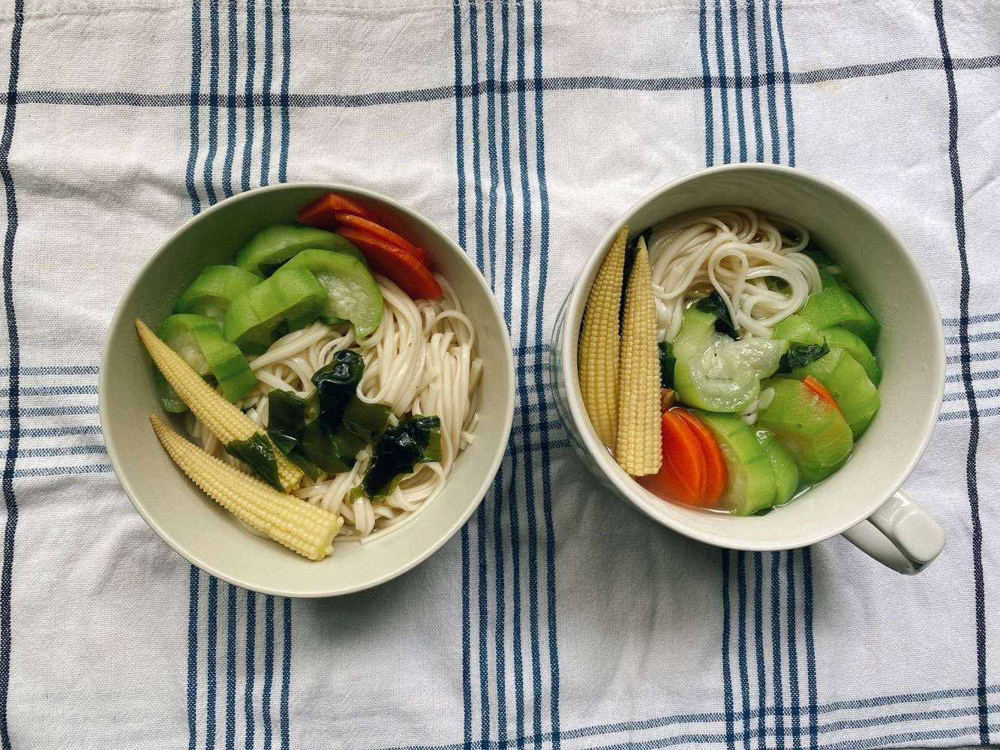
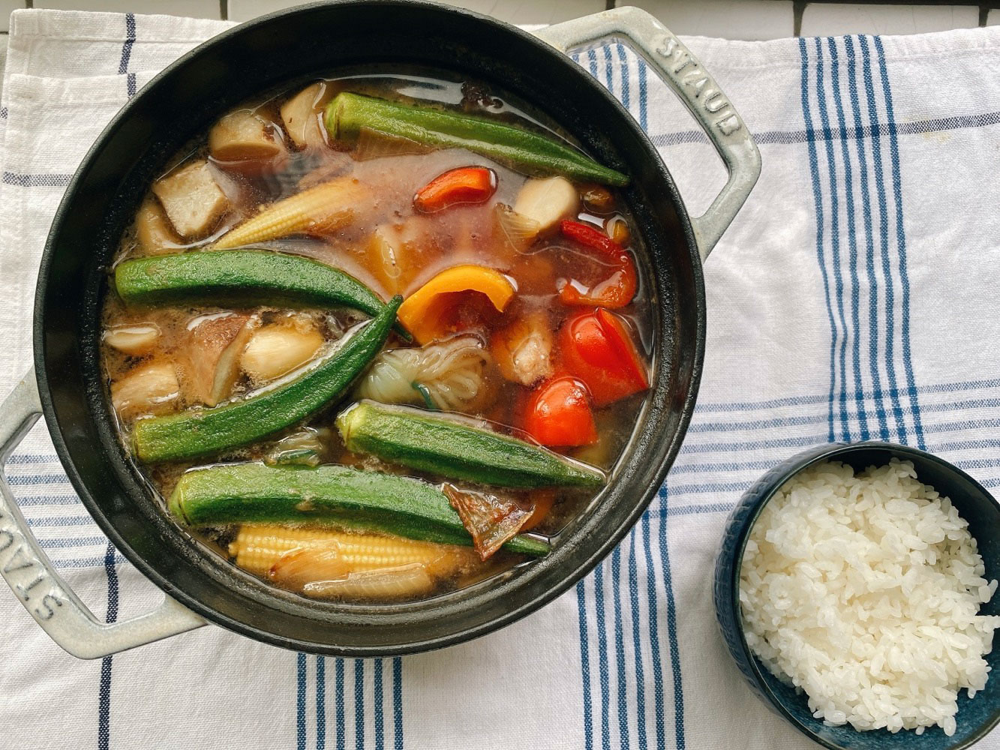
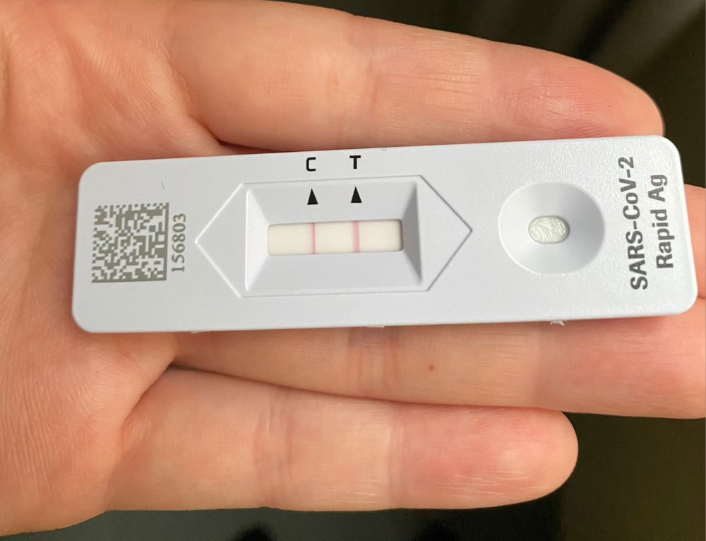
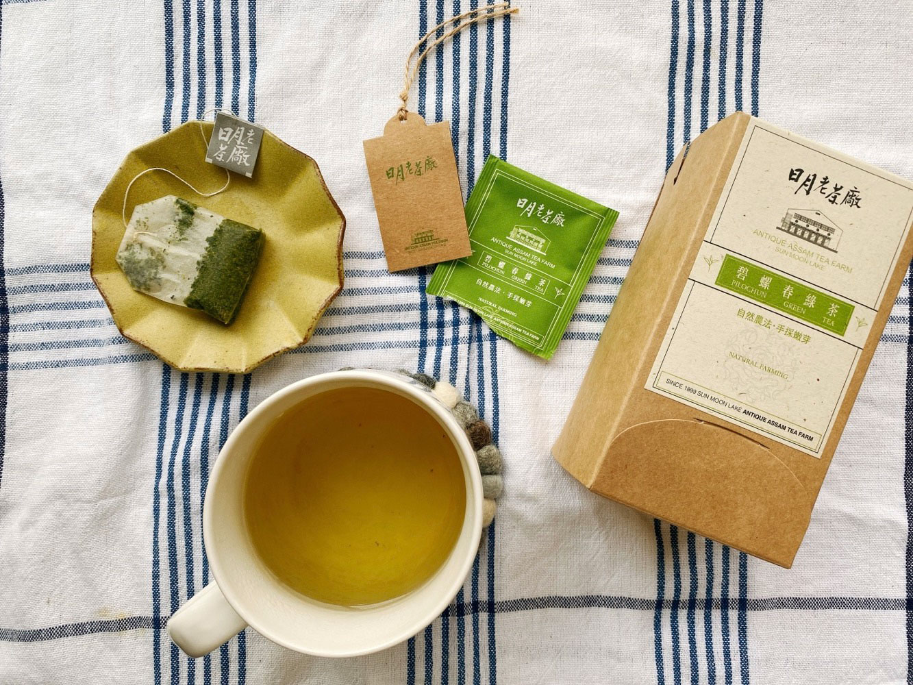
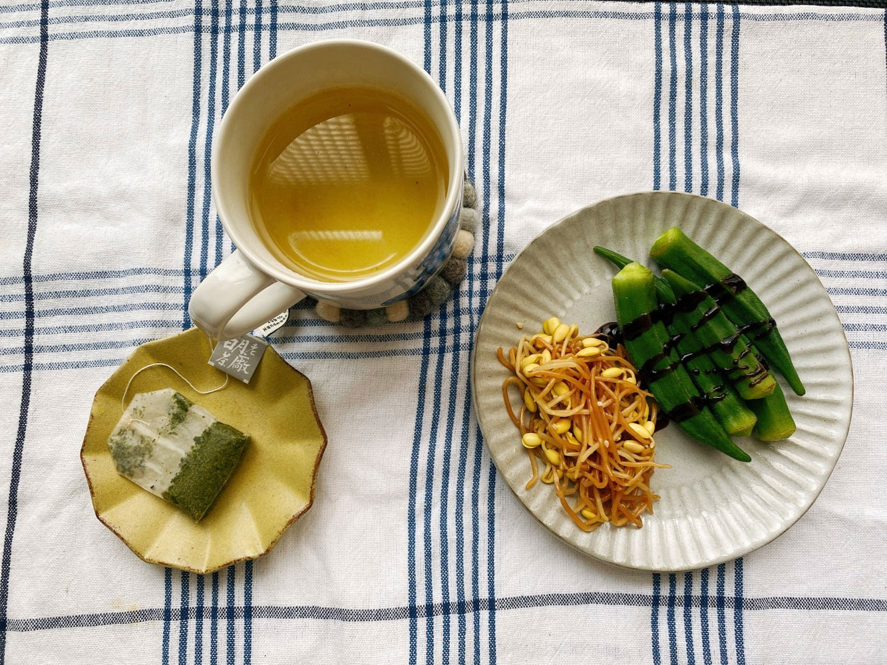
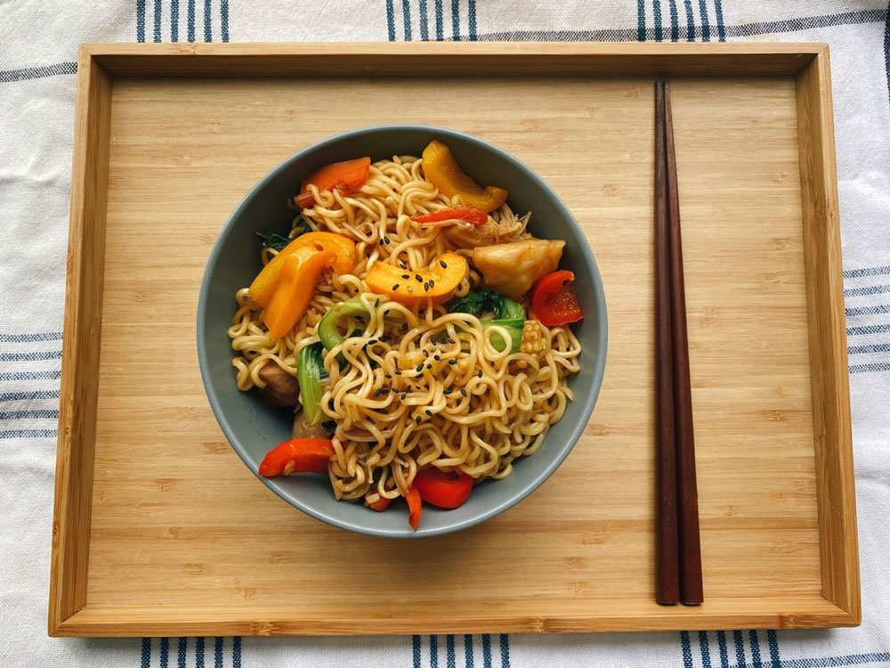




20220904 Sun



開始有症狀是星期天，發燒至38度，頭痛劇烈，但快篩還是陽性，週末的診所也不多，我也只能躺在床上休息。

真的是很久沒有發燒頭暈的感覺，可以一直睡覺，某種角度來說也是蠻幸福的。



---

20220905 Mon



週一早上，診所一開門就去掛號。

醫生聽完我的病症後，他說應該七八成就是確診了，告訴我晚一點再篩，如果是陽性就幫忙通報。
\
果然在中午吃完午餐後，就得到兩條線了，正式開始隔離的日子。

幸好我在開始發燒前就先把冰箱補滿，簡單的青菜水果，三餐不需要太煩惱。



---

20220906 Tue


收到確診隔離通知書了。

半夜的時候喉嚨開始變得很乾，每吞一下口水都是地獄，症狀完全就像大家說的一樣。

要被關七天，活動力大大減少，如果還是吃滿三餐，等出關的時候一定會胖得不成人形，我決定如果肚子不餓的話就不吃飯，不能時間到就機械性的進食，餓了再吃就好。

今天先後接到昨天看診醫生以及行政區關懷中心的電話。醫生親自打電話給我詢問症狀及感受，他說喉嚨痛大概會在症狀出現兩天半後慢慢好轉，並提醒我多休息、多喝水。

這是額外的服務吧！沒有人規定醫生得在看診後繼續追蹤病患的後續，讓我覺得這間診所評分會那麼高不是沒有原因，謝謝醫生。

關懷中心也是問我感受及症狀，關心我用藥情形，告知我萬一出現嚴重症狀要記得撥打119。聽到我說喉嚨痛，對方告訴我綠茶或蜂蜜檸檬會有幫助，最後祝我早日康復。

至今每日新冠確診數還是維持在五位數，且似乎有一點點上升的跡象，很感謝第一線人員的關心，效率非常高，通報後二十四小時內就收到相關的行政文件和電話（而且我還是在晚上六點後通報的個案）。

只是我好想收到關懷箱啊😂


---

20220908 Thu



當確診第二天喉嚨開始痛之後，其實對於任何食物就失去興趣了。

連吞口水都是折磨的時候，不要說吃飯了，連喝水都很抗拒，因此一整天下來，我幾乎只有吃到一餐的份量，分兩三次完食。除了吃芭樂補充維他命C以外，我幾乎很少吃其他東西，能減少喉嚨的負擔就不要吃。

但也奇怪，吃這麼少，肚子也沒什麼飢餓的感覺。只希望疼痛的症狀趕快緩解。



隔離七天，我不希望什麼事也沒做到。既然追不了劇，至少可以來個大掃除。

趁著颱風稍微遠離，天空放晴，一早我先洗了沙發布套，接著用過碳酸鈉把洗衣機洗過一遍，真的飄出好多海苔😂

我聽了三、四個小時的podcast，很投入在身體的勞動之中，聽了好多節目，覺得非常充實。

我想起剛看完的《禪的廚房》，覺得我就是透過打掃在做心靈的修行。用實際的清掃，達到洗滌心靈的目的，不斷練習不斷整理，不知不覺練就了不容易被雜訊影響的心，讓我知道我什麼可以讓我平靜快樂。













---

20220909 Fri



綠茶、清燙秋葵、涼拌黃豆芽

這幾天幾乎完全沒有食慾，可能是因為喉嚨痛的關係，每次吞嚥的痛苦，讓我對進食完全提不起勁。

昨天晚上吵了盤青菜，吃沒幾口就放下筷子，連我最愛吃的鹽糖，幾乎也只能感受到其中的苦味。

我連馬斯洛需求金字塔的第一層都滿足不了( ´•̥̥̥ω•̥̥̥` )



---

20220910 Sat



炒泡麵

喉嚨的疼痛總算是有點緩解，中午做了炒泡麵，雖然吃不多，但有正常進食的感覺真好。

連續好多天連「吃」都做不到，加上被隔離在家，失去自由（尤其這禮拜是中秋節，剛好天氣很涼爽！），連最近的巷口都到不了，真的會讓人失去積極求生的意志。除了喝水、休息外什麼事都提不起勁，我幾乎把所有訂閱的youtube頻道看過一輪，沒訂閱的也看，手機滑到螢幕都快滑穿了。老實說，這麼多影片可以選擇，但我一點也沒有滿足的感覺，只覺得是在打發時間，等待七天過去。
\
一直躺著也不是辦法，看不了劇、不想聽podcast。原本打算隔離期間可以盡情烤麵包做料理，但因為食不下嚥，做了也沒意義。我覺得這是最讓我感到最難過的原因。

最後三天的隔離，我好想打破規則出去散心，即便是附近的公園也好，我只想擁有能選擇出門的自由。

明明才經歷四天，我就明顯察覺自己的心理狀態垂直崩落。頭兩天還能跟朋友分享心情與身體狀態，後面開始變得枯燥、無力、受限制，尤其連吞口水都痛苦的時候，特別覺得自己好沒價值。

當有選擇的時候，待在家並不是多困難的事。可以看整天的影片、滑手機、躺著休息。但當沒有選擇，只能被迫限制在家時，突然就感覺到「自由」的重要，有選擇好重要。




---
