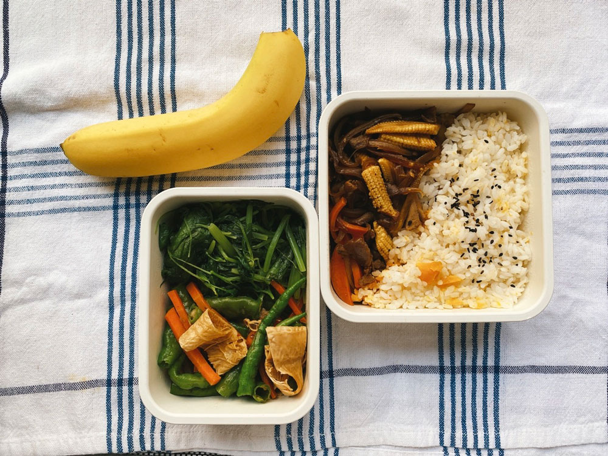
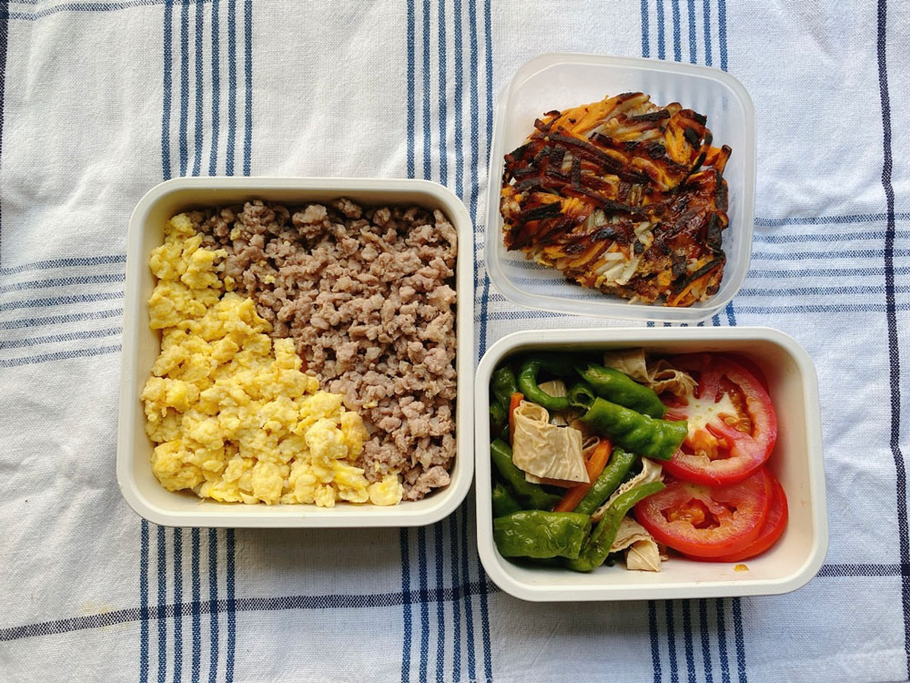
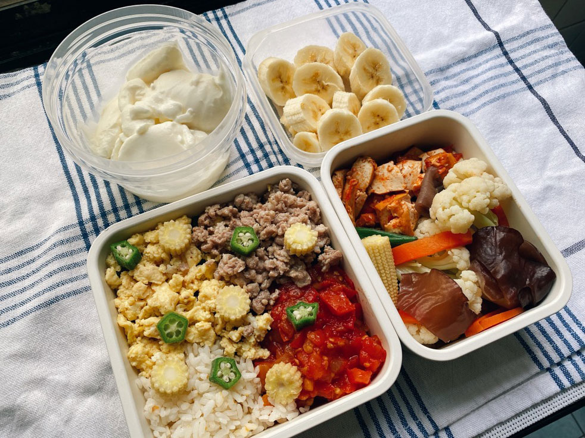
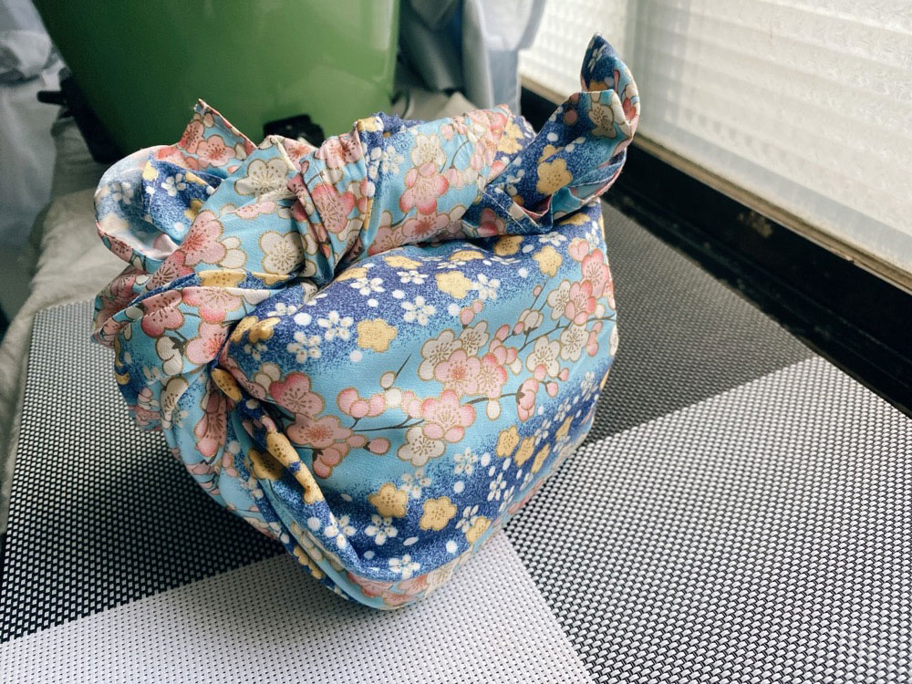
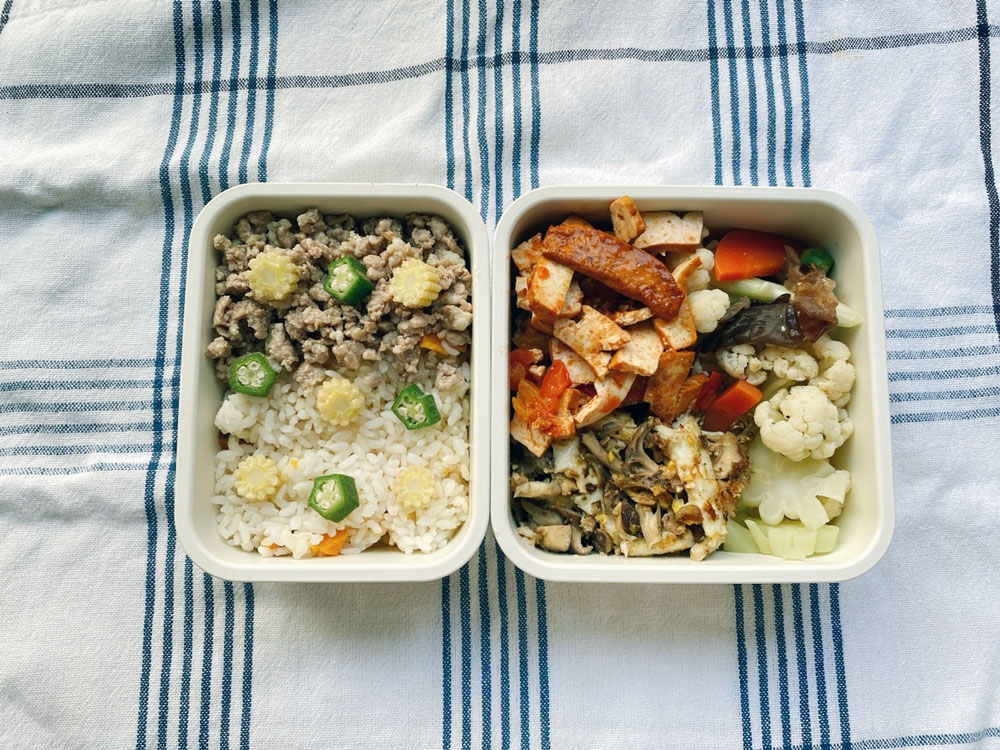
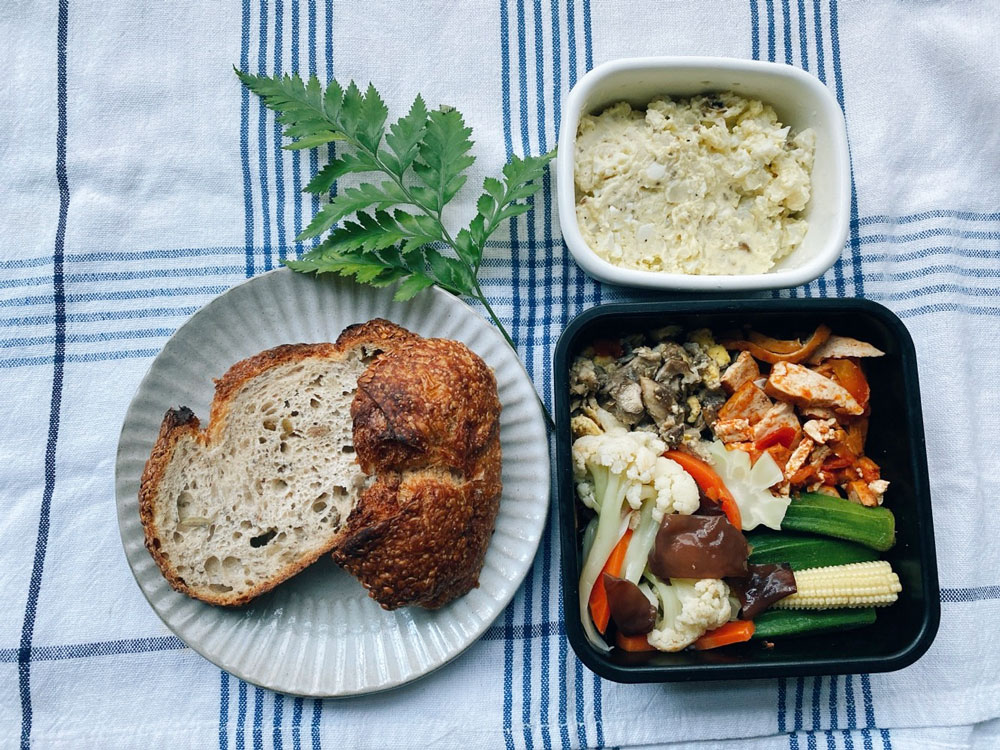




20220918 Sun



在Ptt上把用不到的東西送出去，面交完的感覺好舒暢！

.

聽蔣勳老師講[中秋節](https://podcasts.apple.com/tw/podcast/ep47-%E8%AB%87%E5%9C%93%E6%BB%BF-%E4%B8%AD%E7%A7%8B%E7%AF%80/id1587317578?i=1000579081749)的podcast節目，他說每年炎熱的夏天總讓人期盼著秋天的到來，而台灣因為地理位置的關係，夏天特別潮濕燠熱，容易令人感到煩躁。雖然國曆八月多就進入處暑——表示夏天正要漸漸離開——但台灣大概要到九月中左右，中秋節前後，大約是白露的時候才真的開始感受到秋意。

詩經裡也寫到：蒹葭蒼蒼，白露為霜。到了這個時節，只要不是待在都市裡，都能感覺到季節的轉換：清晨的植物葉子上會開始出現露水，早晚的氣溫低了很多，大概在21-23度左右，非常舒服的溫度。

夏天時的大自然感覺太熱鬧，因而人不容易靜下來，也不容易反省，很像人生中青少年的階段。然而進入秋天後，生命開始變得比較沈穩、安靜，可以跟自己對話，也很適合一個人獨自走在山路上。

還有光線。

秋天的光線比較安靜——這是我喜歡自然光的原因之一。秋天的陽光比較斜、比較長，物體的影子在地上拉得長，有讓人沉靜的力量。

光線的角度、季節的個性等，老師所提到的這些季節改變，都是我深有共感的。站在戶外還不需要披件外套的此時，我會為了光線出門散步，未必要到特殊的景點，純粹沒有目的隨興亂走，小巷子也行。我最喜歡的時段是太陽下山的前兩個小時左右，當日照角度傾斜，飽和度、攻擊性都減了一層，光線裡的金黃色顯得特別突出，這時候光照在任何物體上，都像是罩上柔焦的濾鏡一般，心也隨之變得柔軟，進而讓人的思考、思緒變得溫柔，彷彿任何事都可以原諒、等待，對事物的包容力好像也更大了。








---

20220919 Mon



地瓜飯、舞姑蓋飯、蒜炒莧菜、腐皮炒糯米椒、香蕉

週末接連好幾個有感的地震，提醒了我們台灣這塊土地的存在正是是來自於板塊活動。

台北的最大震度只有四級。
\
才四級，但已經讓我緊張的衝去把大門打開，並盤算是不是要逃難了。周圍的狗也因為地震開始咆叫，好難想像地震發生當下位於震央附近的感受程度。



這次地震的強度又引發九二一的討論，尤其日期上是這麼的相近。

那時候我在台中，對當時地震本身的印象一片模糊，我是被媽媽叫醒的。起床之後一片黑暗，什麼光線也沒有，只能摸黑下樓。有幾晚我們是睡在車上，遠離建築物，後面幾天則是在客廳打地鋪。

我記得第一晚爸爸媽媽帶我們前往不遠的爺爺奶奶家，所有人都跑到路上，強烈的餘震再度襲來，但我們只能彼此抱在一起。
\
我們家從不擁抱的。

那一刻的我們，實在好渺小。


918強震之後，公視獨立特派員很快就推出初步的影音報導，報導者也在921滿23週年的這天，上架了追蹤三年、調查九個月的地震專題與podcast，推薦有興趣的人可以參考這兩個優質媒體的內容。

<iframe title="" allow="autoplay *; encrypted-media *; fullscreen *; clipboard-write" frameborder="0" height="175" style="width:100%;max-width:660px;overflow:hidden;background:transparent;" sandbox="allow-forms allow-popups allow-same-origin allow-scripts allow-storage-access-by-user-activation allow-top-navigation-by-user-activation" src="https://embed.podcasts.apple.com/tw/podcast/%E8%B7%9F%E8%A8%98%E8%80%85%E5%88%B0%E4%B8%8D%E4%B8%80%E6%A8%A3%E7%9A%84%E5%9C%B0%E9%9C%87-%E7%8F%BE%E5%A0%B4-%E5%BE%9E%E6%96%B7%E5%B1%A4%E5%B8%B6-%E9%91%BD%E5%B2%A9%E8%8A%AF%E8%88%87%E5%9C%B0%E7%90%83x%E5%85%89-%E6%8F%AD%E9%96%8B%E6%94%BF%E5%BA%9C%E4%B8%8D%E9%9D%A2%E5%B0%8D%E7%9A%84%E5%9C%B0%E5%BA%95%E7%A5%95%E5%AF%86/id1525816185?i=1000580171174"></iframe>


--


因為英女王逝世的緣故，使得這一週左右到處都可以看到英國王室的相關報導。9/19葬禮的那一天，我一邊看直播，一邊看ptt的討論串，完全不認識王室的我，也會被那氣勢滂薄的場面、嚴肅有秩序的儀式，以及沿途風景保存完好的歷史建築等所感動，這種無形的資產與力量，就是文化的力量吧。鄉民們都說，即使是電影等級都很難拍出這種氣勢。



回到女王逝世消息傳出的那天，我就在ptt上看到轉角國際的[這篇文章](https://global.udn.com/global_vision/story/8662/6599504)被轉貼，下面居然出現八卦版少見的、一面倒的正面肯定，稱讚在最即時的時刻產出如此有質感的文章。後來轉角的編輯群們還錄了一集[podcast](https://podcasts.apple.com/tw/podcast/%E6%9F%A5%E9%96%B1%E7%B7%A8%E8%BC%AF%E7%B4%80%E9%8C%84-ep-04-%E8%8B%B1%E5%9C%8B%E5%A5%B3%E7%8E%8B%E8%A8%83%E8%81%9E-%E6%88%91%E5%80%91%E7%95%B6%E6%99%82%E6%80%8E%E9%BA%BC%E5%81%9A/id1202558455?i=1000579912840)，分享那晚來不及處理情緒的同時還得手忙腳亂整理大量資料的過程。

轉角國際是我固定收聽的節目之一，從每天的daily podcast到專題的重磅廣播，內容很優質。很喜歡七號的無厘頭、很少獻聲的賴昀的吐槽、慧儀與牧宜療癒聲音。

--


平時我就有關注國際新聞的習慣，受到這些版面大肆報導與討論的影響，我也特地找一些相關的podcast來聽，補足我對王室認識的不足：


- 王室存在與否的討論是一直都存在的熱門議題
<iframe title="轉角國際・重磅廣播｜EP. 275－不要王冠好不好？#NotMyKing 的英國王室存廢論" allow="autoplay *; encrypted-media *; fullscreen *; clipboard-write" frameborder="0" height="175" style="width:100%;max-width:660px;overflow:hidden;background:transparent;" sandbox="allow-forms allow-popups allow-same-origin allow-scripts allow-storage-access-by-user-activation allow-top-navigation-by-user-activation" src="https://embed.podcasts.apple.com/tw/podcast/ep-275-%E4%B8%8D%E8%A6%81%E7%8E%8B%E5%86%A0%E5%A5%BD%E4%B8%8D%E5%A5%BD-notmyking-%E7%9A%84%E8%8B%B1%E5%9C%8B%E7%8E%8B%E5%AE%A4%E5%AD%98%E5%BB%A2%E8%AB%96/id1202558455?i=1000579912860"></iframe>


- 從比較行銷、宣傳面的角度來說明女王在王室扮演的角色
<iframe title="声动早咖啡｜在古老君主和现代经济之间，英国女王如何为王室代言？" allow="autoplay *; encrypted-media *; fullscreen *; clipboard-write" frameborder="0" height="175" style="width:100%;max-width:660px;overflow:hidden;background:transparent;" sandbox="allow-forms allow-popups allow-same-origin allow-scripts allow-storage-access-by-user-activation allow-top-navigation-by-user-activation" src="https://embed.podcasts.apple.com/tw/podcast/%E5%9C%A8%E5%8F%A4%E8%80%81%E5%90%9B%E4%B8%BB%E5%92%8C%E7%8E%B0%E4%BB%A3%E7%BB%8F%E6%B5%8E%E4%B9%8B%E9%97%B4-%E8%8B%B1%E5%9B%BD%E5%A5%B3%E7%8E%8B%E5%A6%82%E4%BD%95%E4%B8%BA%E7%8E%8B%E5%AE%A4%E4%BB%A3%E8%A8%80/id1573189055?i=1000579390221"></iframe>


- 時間的女兒當然也不會錯過這個西方歷史上的重大事件，後續還會有系列內容，非常期待
<iframe title="時間的女兒：八卦歷史｜#087再見，人民的奶奶！為什麼伊莉莎白二世令人緬懷：公主時代｜天佑女王01" allow="autoplay *; encrypted-media *; fullscreen *; clipboard-write" frameborder="0" height="175" style="width:100%;max-width:660px;overflow:hidden;background:transparent;" sandbox="allow-forms allow-popups allow-same-origin allow-scripts allow-storage-access-by-user-activation allow-top-navigation-by-user-activation" src="https://embed.podcasts.apple.com/tw/podcast/087%E5%86%8D%E8%A6%8B-%E4%BA%BA%E6%B0%91%E7%9A%84%E5%A5%B6%E5%A5%B6-%E7%82%BA%E4%BB%80%E9%BA%BC%E4%BC%8A%E8%8E%89%E8%8E%8E%E7%99%BD%E4%BA%8C%E4%B8%96%E4%BB%A4%E4%BA%BA%E7%B7%AC%E6%87%B7-%E5%85%AC%E4%B8%BB%E6%99%82%E4%BB%A3-%E5%A4%A9%E4%BD%91%E5%A5%B3%E7%8E%8B01/id1549521834?i=1000579901217"></iframe>

<iframe allow="autoplay *; encrypted-media *; fullscreen *; clipboard-write" frameborder="0" height="175" style="width:100%;max-width:660px;overflow:hidden;background:transparent;" sandbox="allow-forms allow-popups allow-same-origin allow-scripts allow-storage-access-by-user-activation allow-top-navigation-by-user-activation" src="https://embed.podcasts.apple.com/tw/podcast/088%E7%95%B6%E6%88%B0%E7%81%AB%E5%85%AC%E4%B8%BB%E8%B5%B0%E5%85%A5%E6%84%9B%E6%83%85%E7%AB%A5%E8%A9%B1-%E8%8B%B1%E5%9C%8B%E7%9A%84%E5%A5%B3%E5%85%92%E9%81%87%E8%A6%8B%E9%82%A3%E8%A2%AB%E5%AB%8C%E6%A3%84%E7%9A%84%E7%99%BD%E9%A6%AC%E7%8E%8B%E5%AD%90-%E6%88%90%E7%8E%8B%E5%A4%A7%E9%81%93-%E5%A4%A9%E4%BD%91%E5%A5%B3%E7%8E%8B02/id1549521834?i=1000580631639"></iframe>


---

20220920 Tue



雙色丼飯（地瓜飯）、腐皮炒糯米椒、馬鈴薯煎餅








---

20220921 Wed



三色丼飯、茄汁豆乾、白花椰菜、香蕉優格

同事分享的喜餅外由一塊日式的布包裹，我將他拿來包便當，剛剛好！

.

朋友的朋友最近陷入與伴侶在金錢價值觀上有極大落差的拉扯中。

會有拉扯是因為，主角認為自己放不下追求好還要更好的物慾生活，使得伴侶被迫加入這場不見盡頭的比較競賽裡。理性上知道比較不會有終點，但這卻是她自己能清楚感覺到工作有持續進步、有所突破的方法，處於一種想和伴侶長久走下去，但又非常難改變自己長久以來的價值觀的狀態。



如果單就金錢與物質這個題目來說，我認為金錢是用來獲取理想生活的工具。換言之金錢不是目的，理想生活才是。

但每個人對於「理想生活」的定義不盡相同，因而造成每個人對金錢的需求與渴望也不一樣。

我對於理想生活的核心目標就是心靈上的舒適與平靜，植物、花、自然、光線、整齊的家、料理、好看且有質感的物品、知道為何而買的消費行為、以永續環保為前提的飲食選擇等，都是讓我能感受平靜的方式，因此只要是與這些相關的商品、食物、或者體驗等，就會是我願意花錢的地方。podcast節目《世代登出》在[〈EP9｜如果金錢是個人，你與他的關係是什麼？〉](https://podcasts.apple.com/tw/podcast/ep9-%E5%A6%82%E6%9E%9C%E9%87%91%E9%8C%A2%E6%98%AF%E5%80%8B%E4%BA%BA-%E4%BD%A0%E8%88%87%E4%BB%96%E7%9A%84%E9%97%9C%E4%BF%82%E6%98%AF%E4%BB%80%E9%BA%BC/id1491104125?i=1000554832129)這一集中，對「金錢」也有深入的討論。其中我很贊同他們對於「極簡主義」的解釋。

他們認為極簡生活並不等於白牆加上一張桌子這麼表面的體現，重點是能說出自己和家中每個物品的關係、為何而買，不是「因為便宜」、「在特價」這種賣方為了將商品賣出去的原因。比如一位很喜歡古著的人，今年已經買了五件好看的單品，此時看到一件「知道這件穿在自己身上很適合」而且也負擔得起的單品，但因為已經買了五件，足夠了，所以選擇不買。這種知道何時該停止的選擇，是成熟且對自己負責的消費行為。

<iframe title="世代登出︰情緒篇 EP9｜如果金錢是個人，你與他的關係是什麼？" allow="autoplay *; encrypted-media *; fullscreen *; clipboard-write" frameborder="0" height="175" style="width:100%;max-width:660px;overflow:hidden;background:transparent;" sandbox="allow-forms allow-popups allow-same-origin allow-scripts allow-storage-access-by-user-activation allow-top-navigation-by-user-activation" src="https://embed.podcasts.apple.com/tw/podcast/ep9-%E5%A6%82%E6%9E%9C%E9%87%91%E9%8C%A2%E6%98%AF%E5%80%8B%E4%BA%BA-%E4%BD%A0%E8%88%87%E4%BB%96%E7%9A%84%E9%97%9C%E4%BF%82%E6%98%AF%E4%BB%80%E9%BA%BC/id1491104125?i=1000554832129"></iframe>



---

20220922 Thu



日式炒肉末、茄汁豆乾、白花椰菜、舞菇炒蛋






年初左右買過一次福祿桐，後來因為澆水太頻繁導致爛根死亡，這一次我決定等到他有變化再行動。缺水了再澆、有異狀再應對。
採取小心翼翼的最保守方法，應該會慢慢熟練的（吧？）



---

20220923 Fri



薯泥蛋沙拉佐酸種麵包、茄汁豆乾、白花椰菜、清燙秋葵






上週插花課剩餘的花材，放在水瓶裡一週還是很挺拔，除了葉子有一些地方漸漸變黃，整體的姿態依然優美。







今早澆水才發現龜背芋又有一片新葉子準備展開，居然已經長這麼大了，什麼時候！
\
因為他已經停止長葉子好一段時間，我以為就這樣了，沒想到這個盆子讓他覺得還有生長的空間，原來這就是新生命帶來的喜悅。




---
