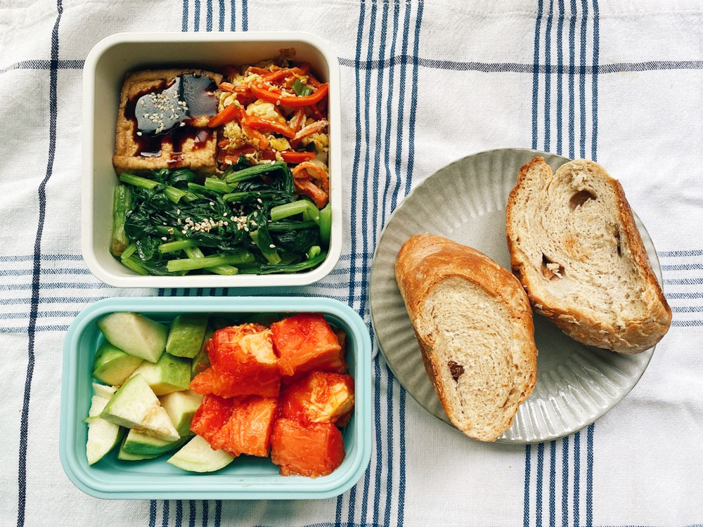
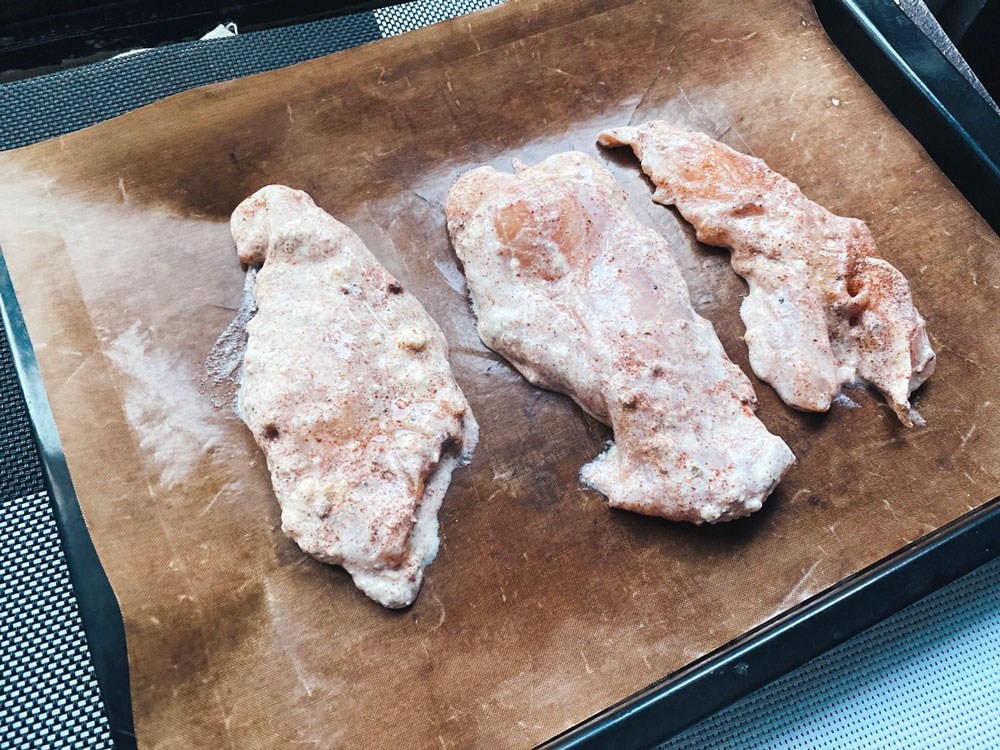




20221009 Sun



然後我們就出發了。

可能是連假第二天的關係，前往花蓮的客運完全沒有人，整台車都被我們包了，好尊榮的享受啊！

這條北花線在2020年的時候開始營運，那時看到新聞就很期待。量身打造的主視覺、全新的車廂非常很有質感，決定趁著這次不趕時間、沒有計畫，捨棄以往習慣的台鐵改搭客運。

這條路線由首都客運和統聯客運聯營，每日只有往返各一個班次，兩個客運加起來一日來回共有四個班次。走的是新的蘇花改，司機先生說走蘇花改比以前穩定安全，之前只要遇上大雨、颱風等天氣，蘇花公路經常有落石阻擋公路，小型車還可以迴轉改道，但大型的物流、客運等，就只能待在原地等待工程人員把倒木落石移走，在車上等待十幾個小時是很常見的事情。






抵達花蓮轉運站差不多十二點，車程約三個小時，原本預期花蓮的雨勢應該比北部來得大，很幸運的，我們剛好錯開早上的大雨，剩下零星的短暫小雨。






一到花蓮，視線裡沒有密集的高樓、住宅，每個紅綠燈只有少少的三五台車，沒有人趕著要去哪上班赴約談生意，車速慢慢地就像行版一樣，心的快樂面積直接乘以五十。






抵達民宿放好行李後，參考老闆提供的在地攻略手冊，決定以鯉魚潭為目標，騎著民宿的腳踏車慢慢晃。






我捨棄google map推薦的主要幹道路線，選擇旁邊平行的小路，沒有車水馬龍，視野裡盡是稻田以及連綿山脈，座落在田野間的零星小房子都是特別建造的，共通點是他們都會保留一塊不小的院子，對都市以外的人來說，有空間、有距離、有植物相伴是很基本需求吧。



在花蓮最幸福的是，不論走到哪，一直都在山的身旁。






民宿沒有冷氣，主人說花蓮不需要，由於地勢空曠，離海邊很近，建物不高也不多，太平洋的風可以直接抵達，房子通風非常好。很多旅客聽到沒有冷氣都覺得不可思議、無法接受，但其實所有的熱氣都是人為製造的，車輛活動、電器運轉，再加上密集的住宅空間，活動產生的熱氣無法散去，聚集在都市中，使得體感溫度不斷創新高。從四季的角度來看，夏天的平均溫度本來就比其他季節高，會流一點汗也是合理，只要停下動作稍微休息，熱感會慢慢淡去，但人好像變得一點熱度都不能接受，立刻就要進到舒適的環境，立刻就要停止流汗，於是開更強的冷氣、製造更多的熱氣、室外變得更不能散熱⋯⋯

剛好我們在秋天來，白天平均大概25、26度，高溫甚至還能到30度。晚上民宿主人説東北季風靠近，怕我們晚上著涼，拿了冬被出來給我們備用，沒想到還真的用得上，夜裡聽見風自由地在空間來去，好不忙碌。



---

20221010 Mon




第二天起床便立刻感受到東北季風的來訪，最明顯感的是聽覺。耳朵裡滿是風吹過葉子的沙沙聲，還有一些蟲鳴鳥叫，既熱鬧又清淨。



今天的行程是帶腳踏車搭台鐵前往大農大富，能上腳踏車的區間車班次中午以前只有兩班，第一班在清晨五點鐘，接下來就接近十二點了。五點我起不來，中午出發又太晚，中間的空擋不曉得可以做什麼，我想了想，決定乾脆先自己往南騎吧！以火車站為節點，能騎到哪就到哪。






我們從吉安出發，騎了兩個多小時到達壽豐。

兩年前曾經來過壽豐的小和好點吃肉桂捲，很喜歡他們離群索居的選址，這次又繞過來看看這個被山環抱的小店。











從壽豐搭台鐵，於光復下車，大約再騎二十分鐘就能到達大農大富。後來才知道從大富站出發會更近，可以節省一半的時間。






從路口意象進去後，還有一小段距離才真正抵達園區。這段路就像是長長的迎賓道路，讓來訪旅客漸漸沈澱心情，放下紊亂的思緒，準備迎接位於山間的自然平原。






大農大富佔地非常遼闊，用走的太慢太累，園內有自行車租借服務（有電動的），非常推薦用騎單車的方式參觀，速度剛剛好，隨時停下拍照也很方便。園區南北各有腳踏車步道，都是很詩意的林道，十一、十二月的時候葉子轉紅應該會更美麗。






這裡什麼也沒有，就是一大片的草地和植物和一些裝置藝術，但很值得花一天的時間走走。遊客中心的志工姊姊們都很熱情，主動熱心介紹園區特色。她們說這裡沒有標準的走法，也沒有必去地點，旅客可以自己決定如何認識、探索這裡，可以找一棵樹跟他說說話、隨意亂走，或者單純坐在草地上享受自由的風。






騎了一整天的腳踏車，身心俱疲，我們提早回到大富車站，看到地圖上有間擂茶店，打算回程前喝個茶休息一下。我們不知道的是，這間店採預約制，沒有事先打電話就不會營業。搞不清楚狀況的我們只見店家大門深鎖，但門上的牌子卻顯示著「營業中」，覺得很疑惑。看到我們在門口探頭探腦，一位熱心的路人叔叔直接帶我們走到老闆的家門口，朝裏頭大喊老闆的名字。太熱情了啊叔叔！沒有營業就表示在忙，老闆可能連假也想休息，何況我們根本沒有預約，是我們資訊沒有查清楚啊！

正當我們準備離開店家另尋他處休息時，老闆娘從店裡走了出來，看到我們騎著腳踏車來到這裡，又另外打了一通電話，把在附近串門子的先生給叫了回來。劇情到這邊我已經覺得太多太多了，別吧阿姨，你就讓先生去走走晃晃吧！但阿姨一直說沒關係沒關係，她剛好在後面烘咖啡豆所以沒聽到呼喊，沒什麼大事。沒兩分鐘，先生就回來了，此時老闆娘指著我們停在門口的兩台腳踏車，說我們專程從花蓮市區來，應該讓我們體驗一下。哎呀我真的是徹底體會到花蓮人的熱情了。



就像電視節目那樣，我們用木杵擣碎花生和芝麻，堅果的香味撲鼻而來，隨後老闆娘熱情的端出兩盤餅乾和一盤乳酪蛋糕。

老闆夫妻都是當地人，開這間店主要只是為了交朋友，所以才選擇預約制。從都市來的我很好奇鄉下的日常，便問「這裡的日常生活是什麼樣子？」老闆娘說這邊生活很單純啊，人口不多，大部分的居民都已經退休，地方的國中國小學生加起來不到十人，社區裡幾乎都是客家人。他們夫妻在先生退休後來到這邊開了這間店，以茶會友，並非以此為主要收入來源。雖沒特別打廣告做行銷，透過口碑，也建立起一定的知名度，環島的人也會將這裡列入停留點之一。



「錢夠用就好。」老闆娘說。

我想這就是鄉下生活最重要的精神，只要日子過得下去，不用賺太多的錢，剩下的時間拿來享受生活。










---

20221011 Tue



為了避開連假的收假車潮，我們多停留了一晚，中午過後就要搭車，因此也是一個沒有計畫的日子。

在走去吃早餐的路邊看到很多香蕉樹，還有斑馬。在花蓮，農業、蔬果是很具體存在身邊的日常。











我晃到吉安的海邊，之前只知道七星潭，但我覺得整個沿太平洋海岸都一樣美，如果不喜歡太多遊客的話，可以到七星潭以外的沿岸探險，很有機會享受包場的滋味。








回程之前，幫民宿主人摘了幾顆木瓜，產量太大，他們家已經連吃好幾天木瓜，周圍鄰居也常常收到，熱情的他送了一顆給我。

超、大、的。

市場上沒看過這種尺寸，他說這還算小的。後來我回家秤，2.4公斤，恰恰好四斤。一路上我就抱著這顆木瓜坐火車，第一次帶這麼新鮮的伴手禮回來。







乖狗狗～



---

20221012 Wed



核桃手作麵包、紅蘿蔔炒蛋、蒜炒油菜、涼拌油豆腐、芭樂、木瓜



---

20221013 Thu



麻醬麵、優格手撕雞、油豆腐、蒜炒四季豆、芭樂、木瓜








---

20221014 Fri



手作全麥蔓越莓麵包、優格手撕雞、蒜炒四季豆、芭樂



---

20221015 Sat










六月底釀的荔枝酒今日開封，兩斤的荔枝收成只有少少400-500ml左右，太少太少。

由過去的經驗判斷濃度應該有比啤酒高，直接喝會有點嗆，套點氣泡水、加冰塊順口很多。是真的好喝欸！哎呀真是佩服我自己(ㆆᴗㆆ)

明年可以勇敢收單釀更多了！






全麥蔓越莓麵包。

幾乎變成冰箱常備，為了週間來不及準備的早餐或午餐澱粉擔當，先烤起來冷凍保存，要吃的時候再回烤一下就可以了。


