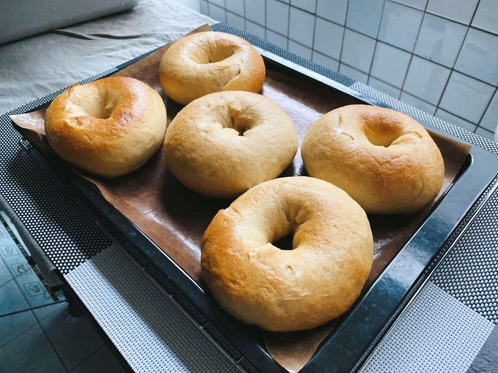
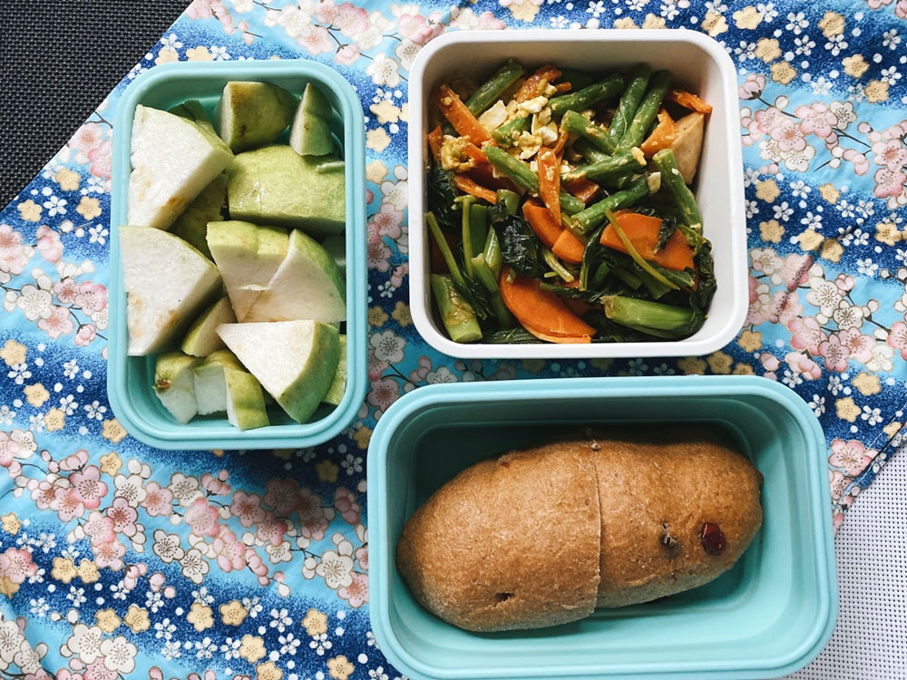
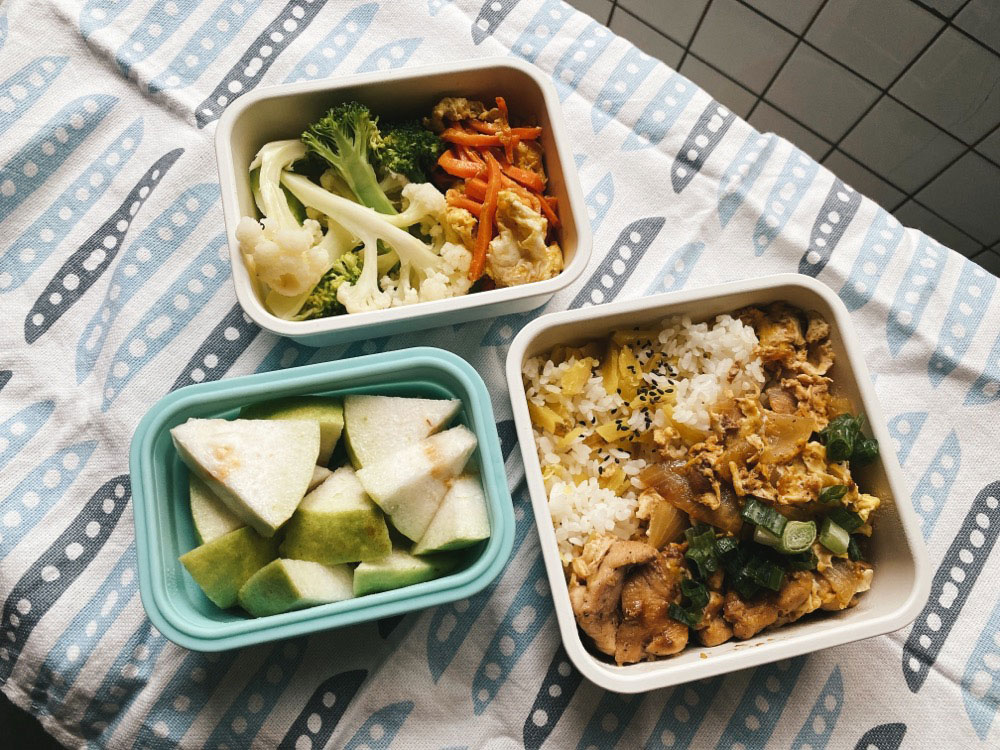
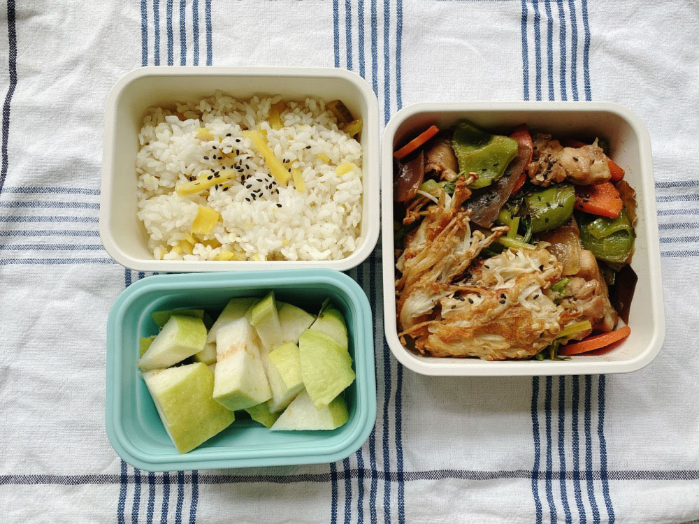
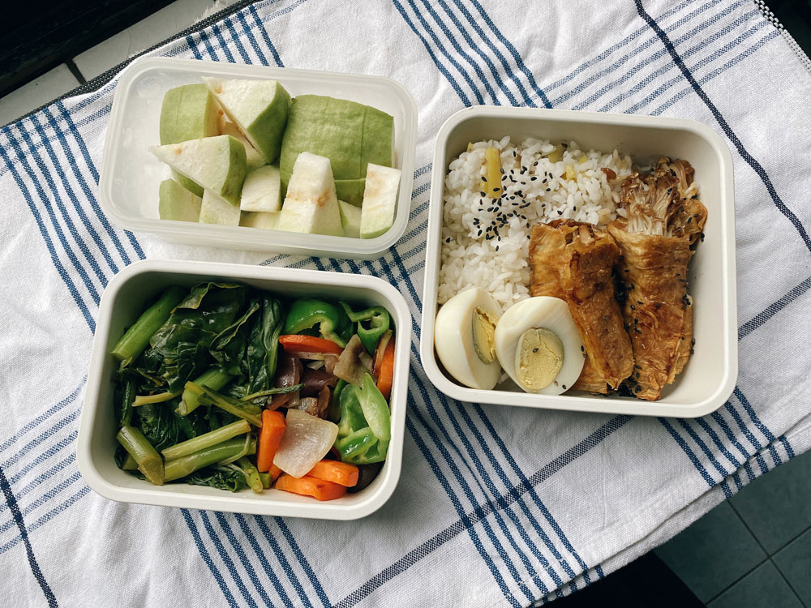
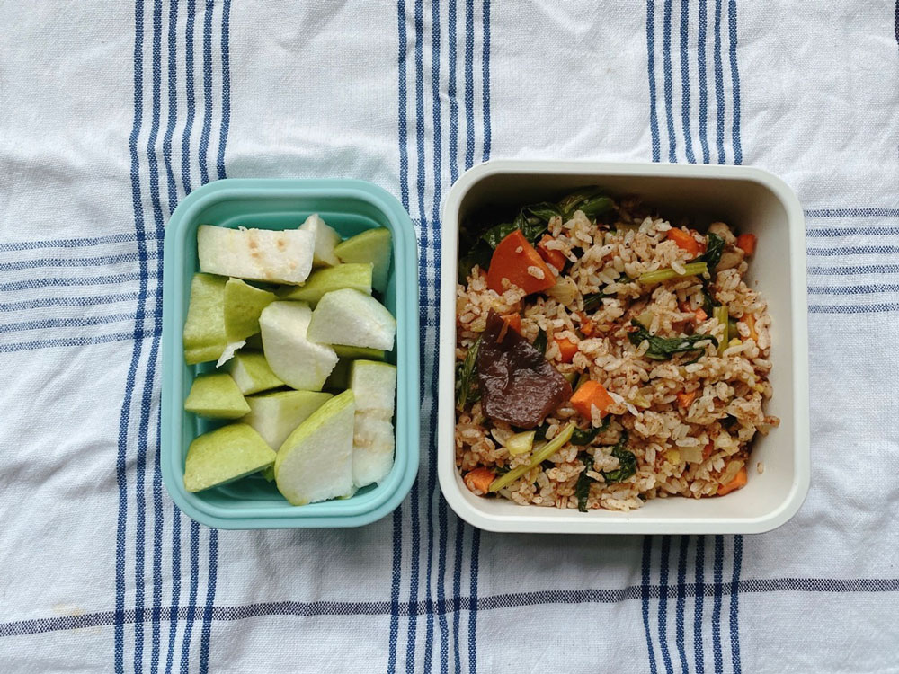




20221016 Sun



手作優格貝果













---

20221017 Mon



全麥蔓越莓麵包、金沙四季豆、炒芥蘭菜、芭樂

金沙四季豆的鹹蛋也是民宿老闆送的，雞蛋富翁的他也自己做鹹雞蛋！



我覺得去花蓮充的電已經使用完畢了，對於拒絕溝通的人我沒辦法再耐著性子嘗試接觸。

一週才剛開始就散發滿滿的負能量(╯‵□′)╯︵┴─┴




捷運站月台上有提醒大家走路不要滑手機的LED小動畫，但我覺得最需要提醒的人頭不會抬起來，應該看不到這個警告吧。



---

20221018 Tue



親子丼飯、雙色花椰菜、紅蘿蔔炒蛋、芭樂



---

20221019 Wed



地瓜飯、青椒炒雞丁、香煎金針菇、地瓜飯、芭樂



---

20221020 Thu



照燒豆皮金針卷、水煮蛋、蒜炒芥蘭菜、和風炒青椒、芭樂



---

20221021 Fri



清冰箱香料炒飯、芭樂



---

20221022 Sat



最近開始上ESG的相關課程，上課地點在台科大。

出社會工作幾年後再回到母校上課，感覺好新鮮啊！最明顯的心得是：學餐好便宜！

一張菜單裡大概只有10%的品項達到三位數，雖然菜色表現較為粗糙，沒有外面店家精緻，但我覺得以果腹來說足夠了。（何況有些外面的店表現也沒有比較好，量少，還要收更貴的價格）






早上搭公車的時候戴著耳機，車子行進間的噪音也蠻大的，我倚靠車廂牆壁站著，除然間司機回頭大喊，當眾喝斥我倚靠的位置壓到下車鈴，害車鈴一直響。

我漲紅著臉，完全不知道自己有壓到東西，按鈕位於大概臀部的高度，但我是靠著腰間的扶手，推測是寬褲惹的禍（還是我屁股太大？），意識到我的無心造成他的困擾後向他說了聲抱歉。過了兩三分鐘後我準備下車，我其實可以直接從後門下車，但我還是決定走到前方，再次向司機致歉。原以為他會冷漠不理我，或者再酸我幾句，但他卻說沒關係，他平靜地說他知道我不是故意的。



我對公車司機的印象是脾氣很差、不耐煩，想想也合理啦，他們也不喜歡成天掛著臭臉。每天要面對混亂恐怖的交通路況，除了注意車潮、鑽縫隙的機車外，還要留意上下車的乘客，一點小訊號沒注意到都可能被客訴，再加上出車趟數的壓力、被綁在駕駛座上神經緊繃一整天，進食喝水上廁所都非常受限，客運司機幾乎是瘋狂接收負面能量的一種職業。

如果我是電視新聞世界裡的人，我一定在被罵的當下就立刻上網發文發動態抱怨，並且給一星評論，撂句狠話：「我又不是故意的，有話不能好好說嗎？司機態度有夠惡劣！」但一來我沒有這個臉皮，二來我知道是我有錯在先，況且這樣做並不能解決問題，只是把一件可以很快結束的情緒帶給更多人（有可能引來不清楚脈絡網友的謾罵，或使誰想起他不愉快的公車經驗開始大肆抱怨，變成負能量交換大會）最重要的是，當事者我和司機只能彼此帶著未處理的負面能量繼續一天的行程，一定會影響接下來的心情吧。很簡單就可以把事情完結，不管他的回答是什麼，至少我要讓自己的心情有個落地，所以我決定那樣做。

那時我才明白，沒有人是故意對其他人兇狠的，主動表達正確的感謝、抱歉，多數人都能理解，且態度都會軟化。還好我沒有羞愧地逃走，還好我有把我能做的事情處理完，光是把自己能做的事情做好，我覺得今天的我就很棒了。






離開學生身份後重新上一堂有系統的課，我感覺自己對於資訊的掌握度比較好了。

過去在課堂上做筆記，總是為了寫而寫，因為大家都寫、因為老師要求所以寫，怎麼寫、怎麼條列、怎麼歸納不是很清楚。可能因為有持續保持看新聞、閱讀的習慣，這回一邊聽課，一邊可以同步在腦中組織資訊，分別哪些是需要被寫下、哪些是已經知道、哪些資訊要放在一起、什麼時候要換段落換大標等等，原來這就是有在學習的感覺嗎！

但一天滿滿七小時的課程要一直坐在教室裡，其實蠻傷神的，要想盡辦法讓自己不打瞌睡也是一個挑戰啊（尤其年紀又比學生時期大了一點）


