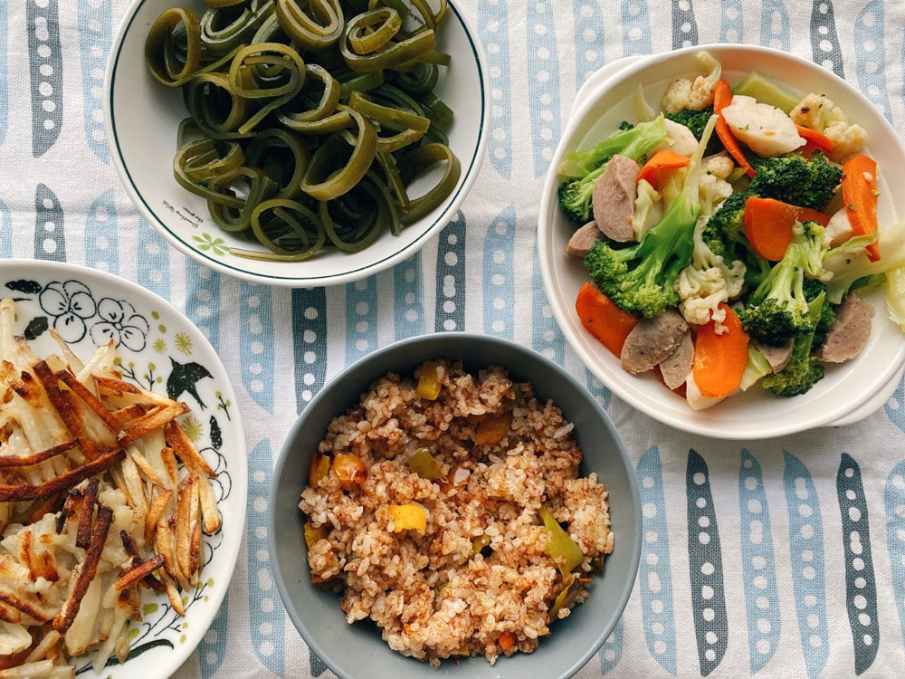
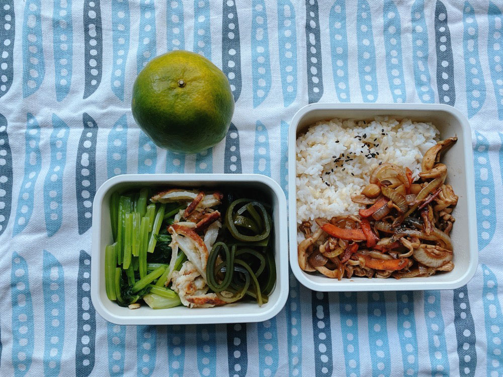
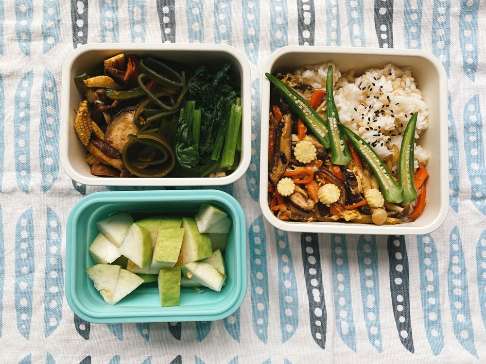
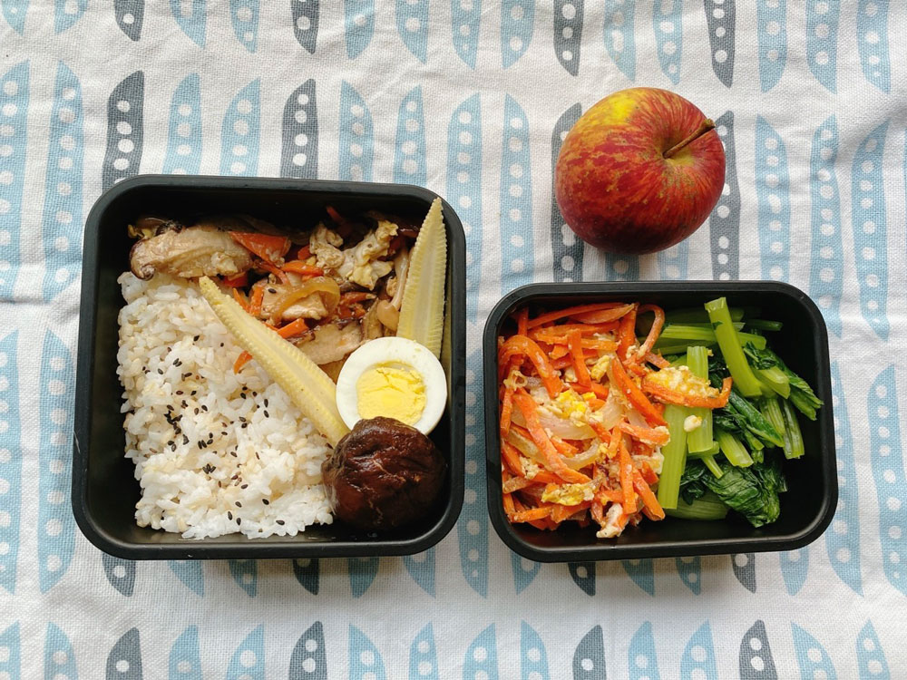
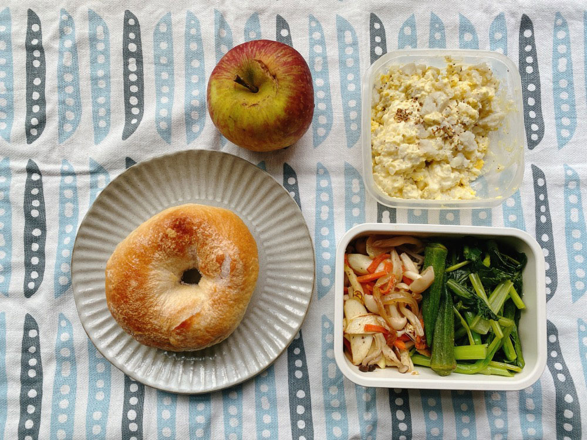




20221113 Sun



之前報名了這個[活動](https://2022mountain.weebly.com/)，覺得內容非常不錯。

早上休息時間有當地小農材料製作的精緻茶點，有苦茶油製作的奶油捲蛋糕、洛神花奶油泡芙、土肉桂卷、樹豆雪球餅乾、蕈菇南瓜鹹派、馬告檸檬瑪德蓮，每一個都很美味！












活動前幾天，主辦單位的通知信中就有提醒要自備環保餐具和水杯，原來是因為午餐特別找了使用環保餐盒的廠商。









---

20221114 Mon


彩椒炒飯、涼拌海帶、貢丸炒花椰菜、馬鈴薯煎餅

最近剛看完一本書，在網路搜尋相關資料的時候，發現了這個[部落格](https://abbymoment.blogspot.com/)。

作者是一個喜歡自然、爬山的設計師，她的自我介紹寫著「喜歡山。設計。努力感受生活 用自己的角度紀錄生活、設計跟山之間，期望能永遠保持熱情。」網站自2016年開始經營，一直到2020年都有文章，且每年都有爬大山的紀錄，還有長達七天的縱走，此外也有一些些烹飪料理的版面。文章內容都不長，清清淡淡的，但完全可以感受到她對生活、山脈森林、平面設計的熱愛。


順便分享書裡的一句話，非常有畫面感：
> 初夏，忙完羔羊的接生期以後，會有一段比較恬靜的時光，祖母和祖父會「帶著牧羊犬去散步」。所謂的散步，其實到他們居住的丘陵下方，沿著小徑走約一哩路，欣賞夏日牧場的豐饒景象。這時母羊和羔羊滿足地啃食青草，丘陵在暮光下閃著紅、橙、藍色的光芒。下方的乾草地看起來像一片片的紫色補丁，遍地開花的青草昂起頭來。你幾乎可以嚐到乾草的甘美、空氣中的花粉，山谷中隨時迴盪著母羊呼叫羔羊的聲音。









---

20221115 Tue



洋蔥炒菇、涼拌海帶、馬鈴薯煎餅、炒油菜、椪柑




---

20221116 Wed


野菇滑蛋蓋飯、炒油菜、玉米筍炒菇、涼拌海帶、芭樂




### 促咪的選舉文化

今年我還蠻享受在觀察平面的選舉文化中（宣傳車、大聲公退散！）。

幾乎每個競選團隊都要用候選人的姓名展開的一句藏頭口號，讓選名有記憶點的同時，又能認識候選人的特質。



#### 選里長——親和力很重要
過往只有比較大的層級候選人會特別拍攝宣傳照，用來印在文宣品或競選小物上，不知道是不是受到部分地區出現年輕參選人的影響，今年連里長也開始感受到競爭的氣氛了。

儘管預算有限，至少也要在選辦附近、里民的生活圈擺幾個旗幟，或者親自出馬，帶著簡單的文宣，出來與里民打招呼，跟小時候對選舉的印象完全不同。

里長的特色是與選民距離感更接近，觀察里長的選情文化時，特別能感受到親和力。文案使用的常是「伯伯」、「媽媽」、「阿姨」等親近關係的詞，不太宣揚過往政見，比較會主打「已經連續服務20年」這種，強調時間長度，營造出「我一直都在你身邊喔，是熱心的好鄰居」的形象。

不知道這個現象會不會有南北差異，但以台北地區來說，只要走到巷弄間，幾乎可以看到主流參選人以外更多元的選舉風景。

觀察這些宣傳照的專業度、質感、文宣製作設計細節是我對在今年度選舉的一大樂趣😂








---

20221117 Thu



和風炒香菇、紅蘿蔔炒蛋、炒油菜、蜜蘋果









---

20221118 Fri



優格貝果、薯泥蛋沙拉、涼拌秋葵、皎白筍炒菇、蜜蘋果










---

20221119 Sat



ESG課程Week 5。


本週的ESG課程主題是社會創新與永續，課程一開始，老師先讓我們思考「企業倫理」、「企業社會責任」與「永續」的定義及彼此的關係。



簡單說，企業倫理是一切的根本。但企業倫理與個人的道德倫理標準不同，兩者之間有可能會面臨衝突。比如身為一位會計，當發現公司做假帳的時候，要舉發嗎？會不會影響到個人的工作發展性甚至是會被處理掉？因此良好的企業，應該有一份透明的資訊，告訴員工當遇到類似上述的兩難情況時，他應該怎麼做、可以怎麼做，由此可判斷企業對於自身的倫理重視程度以及標準在哪裡。

企業社會責任是企業對於自己與社會關係的表現，除了賺錢以外，是不是能多貢獻、回饋些什麼？

永續則是企業要怎麼做才能長遠地經營下去。



仔細思考，會發現三者之間是有關係的。倫理具有普世標準，是可以被記錄、寫下來的，但企業社會責任和永續，則可能因產業別有不同的表現。企業有社會責任感，就會有所行動，從中可觀察出他的企業倫理。為了永續經營，不能只看自己的收益財報，可能得考量到利害關係人等。


