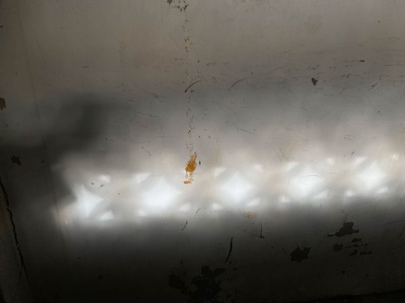




料理風景








回台北第一件事就是上市場。

又看到栗子南瓜，買！



---

### 洗衣精

經過與家人一起過的假日時光後返回租屋處，有一種淡淡的惆悵感。


啊，又要自己養自己了。

衣服三餐都得自己料理了，冰箱不會有自動補齊的蔬果，桌上不會出現不是自己上超市買的零食，不會有熱騰騰的飯菜味道提醒我三餐時間。

這樣的生活只要過兩三天，我的行為模式就會切到都市模式——對路人生氣，等上九十秒，冷漠的穿越一道又一道不息的車流，被成群的建築包圍而喪失生命力，連半小時捷運可抵達的地點都嫌遠（過年開三小時的車都不是問題，太近的行程還會有點不以為然ฅ●ω●ฅ）


有一樣東西會讓我隱隱記得家鄉的舒坦闊達，那就是洗衣精的味道。

台中家裡媽媽用的洗衣精跟我在台北用的不一樣，回到台北之後，那股味道變成提醒我別那麼快變冷漠的唯一聯繫。


最多一個禮拜吧，當這些衣服再被洗過一次後，家的味道就消失了，同時我又會變回易怒易爆炸體質。



---

### 過年紀錄





走中橫去花蓮，武嶺上的植物都結霜了。

從平地出發，翻越三千公尺的高山，在一天內體驗了春天與寒冬。






左：畫面前方的兩塊木頭是切菜備料的砧板，前方是清澈的溪流與綠意，這幅做菜的風景有夠詩意。
右：花蓮玉里臭豆腐對面公園裡，有一間黑熊教育館，裡面的可愛黑熊木雕。





左：台東金崙海灘。
右：高雄總圖的窗邊閱讀區。

---
