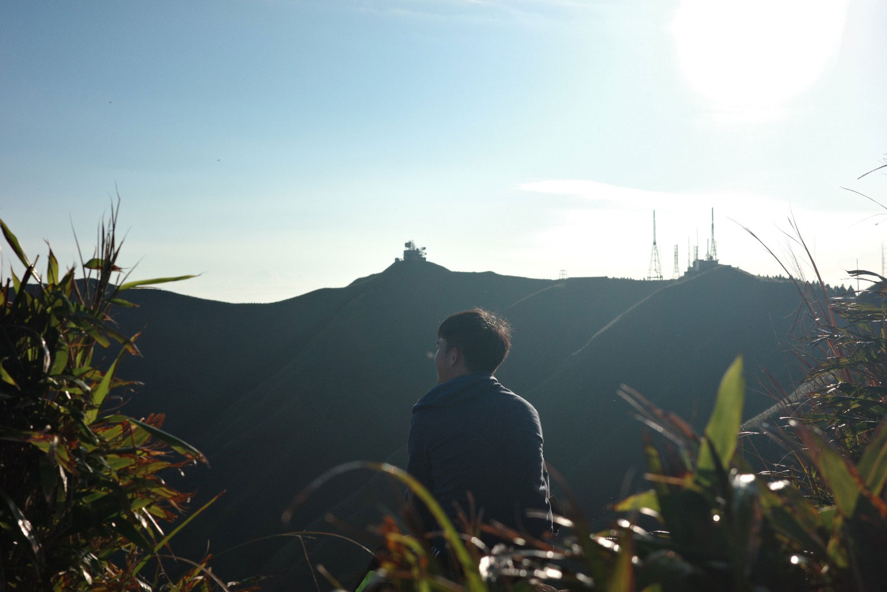



### 料理風景












[里仁食譜：花生醬豆漿餅乾](https://www.leezen.com.tw/article_organic.php?id=1392)












朋友贈送了一尾安永的冷凍金鯧魚，退冰後發現長得很美，拍個照。






煎魚技巧太低，怕壞了完整外表，改用蒸的。
\
魚尾太長，剁成兩段後，放點薑蒜去腥味，電鍋外鍋放一杯水，清蒸。

熱鍋，炒洋蔥，紅黃兩色彩椒、玉米筍、木耳，皆炒熟後調味，做糖醋。
\
另川燙數枚荷蘭豆以增添色彩。

從電鍋取出魚，淋上調好的彩椒糖醋調味，放上荷蘭豆即可。



吃的兩人肚皮緊繃，快樂週末。

懶婦嫌麻煩，甚少購買魚肉，多虧朋友大方分享才有少數好好料理的機會。



---

### 台北抹茶山——小觀音山

- 路線會經過生態保育區，要事先[上網申請](https://applyweb.ymsnp.gov.tw/members/index.php?mode=sign_in)
- 怕髒者建議著雨鞋前往。
- 出發前二至三天要注意山上天氣，若有下雨可考慮改期，因為地勢很多林木，即使出太陽也不見得能照到地面。
- 陡上陡下路線不短，請一定要準備手套才安全。
- 如果平時沒有運動習慣的人可以以自己到西西峰的狀況判斷，評估是否能繼續往小O大O前進。
- 路徑多泥石道路，沒有太多人為整理痕跡，路上有些綁繩可辨識，但還是自己準備GPX比較安全。
- 鞍部停車場停車位有限，建議早到比較有位置。可使用悠遊卡。


















網路上查到的資訊都說路線多泥濘，最好不要在雨天之後爬，我們等待至少一天的晴天才上山，但還是有不少泥巴路段。

從陽明山鞍部停車場旁的路口進入，剛起登約半小時左右就抵達視野遼闊的西西峰，看到出發的鞍部停車場，以及不遠處的二子坪停車場，左手邊可以看到台北盆地都在一片雲海底下，只有101的尖塔處露出來。山上天氣晴朗，山下是陰天。



小O路線有幾段令人印象深刻的陡上陡下。西西峰後的路線，就是一段走到懷疑人生的陡下路線，兩旁為箭竹林，即便是晴天，路徑也很難曬到陽光，因此路況多為潮濕的泥巴，很難找到踩點，判斷失誤還會屁股著地。這就算了，有些踩點落差很大，對於腳短的我實在很不友善，雙手又沒有好的施力點，腳又不夠長，只能放棄整潔，用坐著的方式往下走。



不好走就算了，有在爬山的人一定知道，現在下坡多少，等等大概就要往上爬多少。

喔對，一定要戴手套，即便沒有下雨也要。兩旁的繩子是維持理智線的最後精神陪伴。
\
這段陡下我們走了四十分鐘。



朋友說，為什麼要在星期日七八點的時候在陽明山上而不是躺在家裡打人中之龍呢？

對啊，為什麼咧




---
