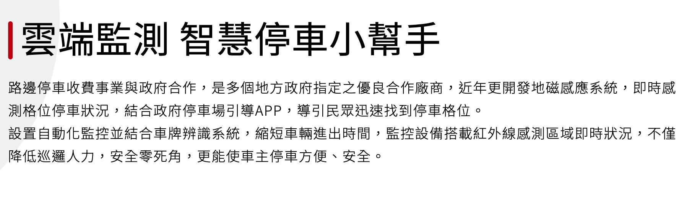




### 料理風景













---



### 日常筆記






撿到兩個有趣的機車觀察，左邊的機車防塵布，造型應該是⋯⋯大象？

另一個則是藝術作品，將報廢的機車拿來種植物，有機物與無機物的結合。
\
在池上的時候，也看到許多居民會廢物再利用，壞掉的電子鍋、用不上的馬桶都拿來種植物。






在路邊停車格地上發現這個東西，拍照起來回家搜尋，才知道這是智慧停車裝置。

但我沒有車子，不知道實際會如何運作。

反倒是因此認識到原來中保集團旗下有這麼多子公司和業務，大部分都是B2B的業務，幫建築場館做防災管理、分析道路車流量的變化、車站港口等重要交通節點的數據監測與掌控等，涵蓋智慧城市、智慧生活的面向，是身為一般消費者的我很少有機會認識到社會的領域。







我喜歡買菜回來後，把他們好好整理歸位的過程。






又做了兩次饅頭，這次多試了紫米口味！

我把食譜和過程記錄在另外一篇[文章]()



