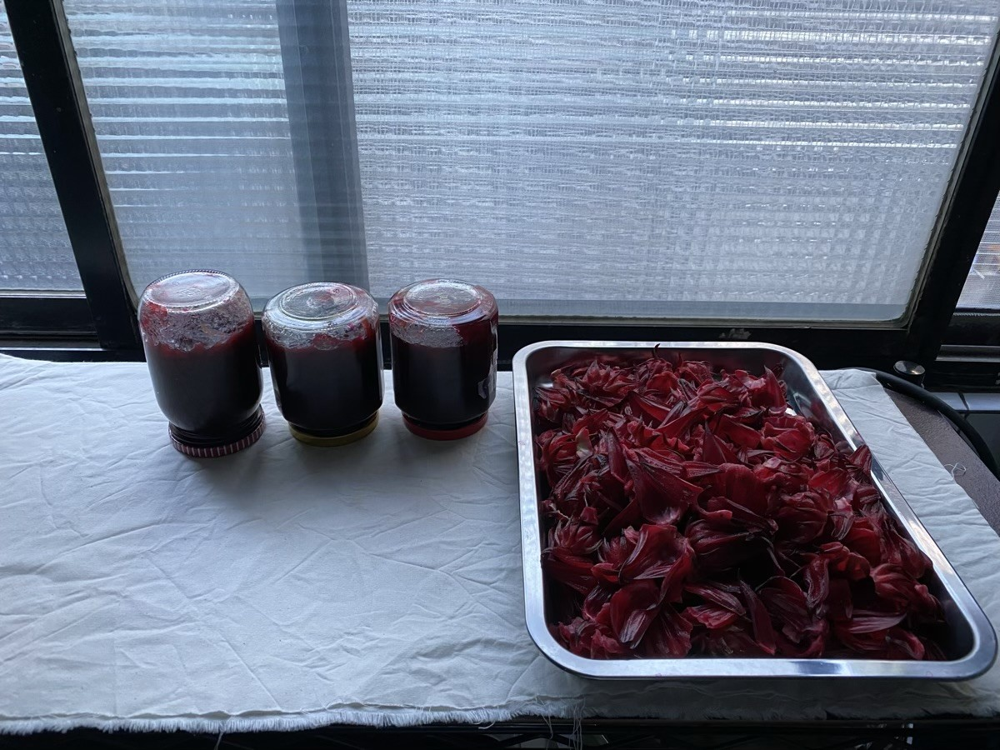
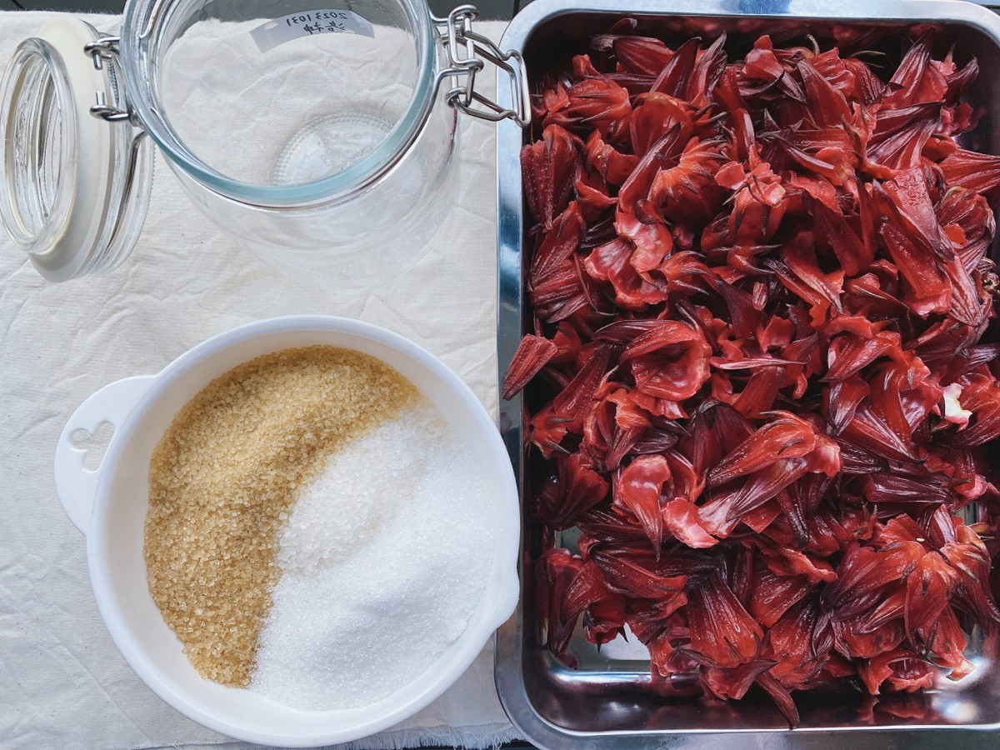
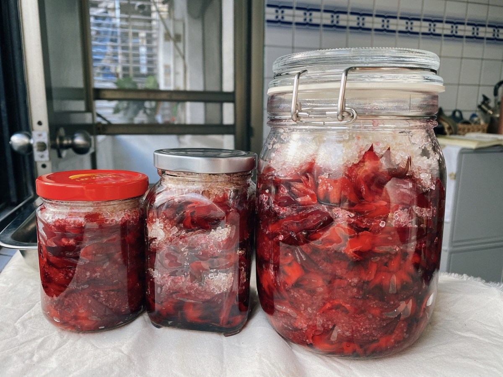
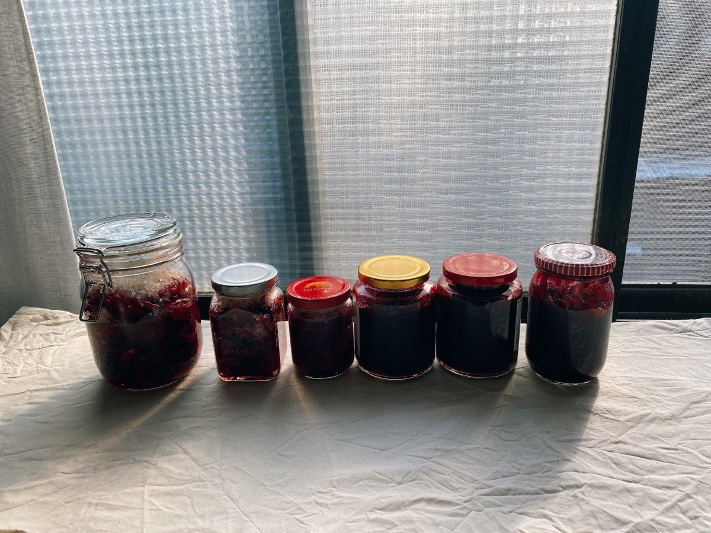




### 料理風景










買回了一點栗子，打算自己烤熟當零嘴吃，沒想到敗在去膜這一關。

去殼沒問題，按照網路上找到的方法：先在表皮畫十字，用電鍋蒸熱就可以輕鬆去除，難的是裡面那層膜啊。

試過水煮、浸熱水、電鍋蒸、烤箱烤，也嘗試布巾在表皮用力摩擦搓去，確實可以慢慢去除，但先前已在表皮畫上十字，這個搓揉的力道容易讓栗子沿著十字裂掉；如果直接用手剝，則是很難完整去除，多少會將一些果肉一起剝下，每剝一次，都僅能剝去一小片一小片的薄膜。但是一顆栗子剝下來，指縫受盡了折磨與委屈，我努力奮鬥了兩個早上，還未將區區二十顆栗子處理完。

只是想吃個栗子，怎麼這麼困難(;´༎ຶД༎ຶ`)

算了，我就連那層毛毛的魔一起吃下去吧（自暴自棄）








之前因為好奇買的越南河粉，料理之前要先泡水 15 分鐘。

我加了豆芽菜、豆腐、檸檬汁和少許花生醬，做成清爽的泰式風味，






那包 500 克重的河粉，可以吃三天沒有問題！






趁週末有空，把剩下的南瓜蒸熟壓成泥後，加入適量燕麥片，板豆腐一起捏成丸子，冰在冰箱就是很快速好用的常備菜，便當少一味時，就是很好的即刻救援軍。




---



### 日常筆記



這週花了很多時間在廚房內，除了上述定番的便當菜以外，因為從朋友那獲得了四斤多的洛神花，得趁新鮮處理。除了再次重現上次獲得一至好評的[洛神蜜餞](../../../recipe/candied-roselle/)，這次也嘗試了[洛神果醬](../../../recipe/roselle-jam/)。

一起來看圖說故事吧：

前一晚與果醬奮鬥到十一點，剩下一半的花萼先過熱水殺青，放置一晚風乾，這是隔天一早廚房窗邊的風景。有收成精華的三罐果醬，還有一大盤的花萼，沐浴在清晨的淡藍色微光中。



上一次做的蜜餞有點太甜，這次降低糖分比例，大約為花萼淨重的七成，並加上一顆檸檬汁，希望這次甜度稍為低一點。

這次我一樣使用了冰糖、二砂糖和細砂糖三種糖，詳細可參考上次製作的筆記[洛神蜜餞食譜](../../../recipe/candied-roselle/)。






一層洛神、一層糖，慢慢鋪上去。






第一罐。






第二罐、第三罐。

每一層都仔細壓密，把一整季的嫣紅都裝進玻璃瓶。



最後一共做成三瓶，一大兩小，好期待這次的滋味。

可以看到裝完第三瓶時，第一瓶下層的糖就已經開始溶解了。



與前一晚的三罐果醬一起合照，這是四斤多洛神的成果。

好累，但是好開心啊 (⁎⁍̴̛ᴗ⁍̴̛⁎)




---

不只洛神，這週還做了兩個麵包。

為期六天的烘焙班即將迎來最後一堂課，每人必須選一項上課教的食譜回家練習，並在當天發表。

雖然我們小組已經約好在前一天到教室一起團練製作，但我還是用家裡的烤箱練習了一項麵包。






原食譜在麵團中加入了紅麴米，家中沒有常備紅麴米，也不想為此特地購買，便以同份量的熟紫米替代。






加入紫米






基礎發酵一小時後，分割、滾圓，再發酵 20 分鐘，然後包入乳酪丁。






後發一小時，撒粉、割線，進烤箱。






家裡的烤箱太小，烤完之後麵包都黏在一起。烤溫也稍微偏高，或者烤的時間太長，表皮有點微焦，口感偏乾。

做一款麵包，要花上半天的時間，從揉麵開始到出爐，加上中間發酵、製作等步驟，至少需要四到五個小時的時間，做完一項力氣都沒了。




---

另一款麵包是自己想應景練習的肉桂聖誕花圈麵包。

我參考了 Carol 的[聖誕花圈麵包](https://caroleasylife.blogspot.com/2013/12/blog-post_17.html)作為麵包體，是款偏乾的麵包組織。

內餡的部分，我不想用肉桂捲的抹醬做為餡料，於是參考烘焙課老師分享的肉桂醬比例，是款沒有使用奶油，只有肉桂、黑糖和細砂糖的乾餡料。

造型手法則是參考[這篇文章](https://hostessatheart.com/sweet-nut-holiday-bread-wreath/)






前一天先將麵團放置冰箱冷藏，低溫發酵一晚。

分割成兩份，並分別桿成長矩形，在上面撒上肉桂餡料，捲起來。






每一捲從中間用刀子切開，最上端先不要切斷。

兩瓣交叉纏繞，盡量讓剖面朝上，最後尾部繞回起點，與頭部相黏。

我繞得好醜，判斷是捲起來的時候捲得不夠漂亮，有粗有細，不夠均勻。






後發前後的對比。

一點都沒有花圈感啊(=´ᴥ`)






烤完更不像花圈了，胖得不成圓形，哈哈哈哈哈。

但是肉桂餡料味道是很好的！




---

這週過度認真，產值比平均高太多，也為自己製造了好多待消耗的熱量。

不過裝入瓶中的美味，值得花上一整個冬天，甚至到明年春天，找朋友一起慢慢品嚐。



