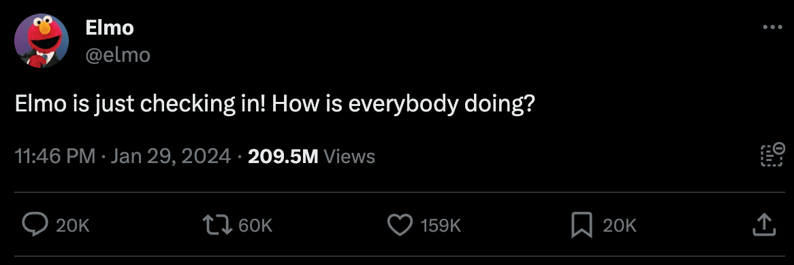
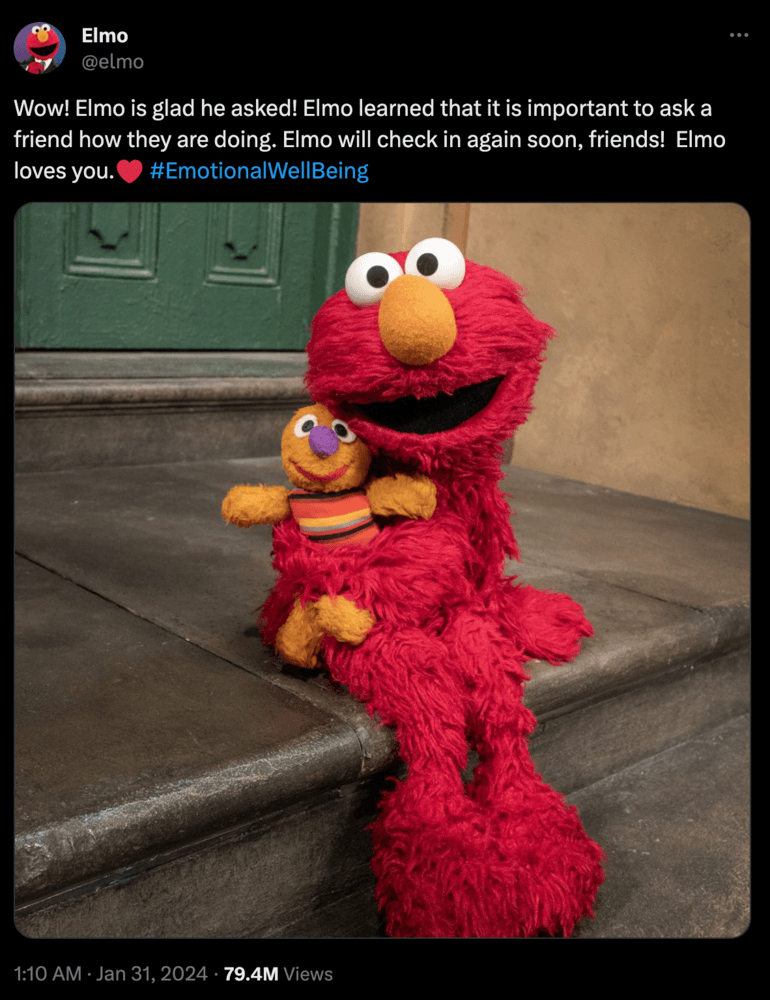




### 料理風景






冬天蘿蔔便宜，每每看到都想到可以做蘿蔔糕。

自己剉籤、炒香、調粉，基本版的，不加蝦米或香菇，

白白淨淨，可以吃一週。






即便加了很多油，煎的時候蘿蔔糕還是容易碎的四散，

奇妙的是，吃的人又說口感紮實？

是我該練習。








...

#### 馬鈴薯片

冰箱有一些馬鈴薯泥，原本打算加入水煮蛋做成薯泥沙拉，

突然想起[上週](../0121-0127/)做的薯片餅乾，不如拿來試試看前置作業可以省到什麼地步吧。






吾家自己食用的蔬果，處理的原則就是減少製造廚餘量、盡量保留營養價值，

要處理丟棄的垃圾少了，前置作業步驟也少了，懶婦追求的就是工作事項越少越好。

因此只要是能吃的、不會過度影響口感的，就不會去皮，

舉凡紅蘿蔔、馬鈴薯、蘋果、番茄、南瓜、奇異果、葡萄等，

懶婦沒有心力的時候，就會選擇保留原型。

（南瓜的囊我也會留著，煎餅的時候可以加一點點，以不影響口感為主）



開始動作前我都有查過，很多蔬果的皮確實含有營養成分。

有科學上的理由真是太棒了（´◔​∀◔`)



因此這份原本打算做成沙拉的馬鈴薯泥帶有一些些皮，還有沒有完全磨細的顆粒，

就是想實驗沒那麼細緻的薯泥烤成薯片，是否還是可以及格入口？






看起來，可以呢，

可以偷懶ヽ(́◕◞౪◟◕‵)ﾉ



...

#### 起司鮮奶饅頭






再來是短期內屬於穩定出產的起司鮮奶饅頭捲。

蒸籠上場了！

（好好工作啊）

電鍋從一層變成兩層，且地坪面積變大，一次可以蒸的量變多了。

以往要分兩次蒸，有蒸籠的幫忙後，一次就可以蒸完，效率推進，可喜可賀。



不知是不是蒸籠的幫忙，這回的口感回饋說「饅頭變得鬆軟了」！




---



### 日常筆記



#### Elmo 問候大家

<iframe title="《轉角國際新聞 Daily Podcast》2024.02.01 美國「大型科技公司和網路兒童性剝削危機」聽證會／芝麻街Elmo問候貼文引發心理健康問題反思" allow="autoplay *; encrypted-media *; fullscreen *; clipboard-write" frameborder="0" height="175" style="width:100%;max-width:660px;overflow:hidden;border-radius:10px;" sandbox="allow-forms allow-popups allow-same-origin allow-scripts allow-storage-access-by-user-activation allow-top-navigation-by-user-activation" src="https://embed.podcasts.apple.com/tw/podcast/2024-02-01-%E7%BE%8E%E5%9C%8B-%E5%A4%A7%E5%9E%8B%E7%A7%91%E6%8A%80%E5%85%AC%E5%8F%B8%E5%92%8C%E7%B6%B2%E8%B7%AF%E5%85%92%E7%AB%A5%E6%80%A7%E5%89%9D%E5%89%8A%E5%8D%B1%E6%A9%9F-%E8%81%BD%E8%AD%89%E6%9C%83-%E8%8A%9D%E9%BA%BB%E8%A1%97elmo%E5%95%8F%E5%80%99%E8%B2%BC%E6%96%87%E5%BC%95%E7%99%BC%E5%BF%83%E7%90%86%E5%81%A5%E5%BA%B7%E5%95%8F%E9%A1%8C%E5%8F%8D%E6%80%9D/id1469553043?i=1000643763601"></iframe>



在 2/1 的轉角國際 Daily Podcast 中，編輯分享了一則 1/29，來自 X 上的[推文內容](https://x.com/elmo/status/1751995117366296904?s=20)，是來自芝麻街角色 Elmo 的發文：

> 「Elmo 問候一下，大家過得好嗎？］
>
> （Elmo is just checking in! How is everybody doing?）>



這句簡單的問候，在短短三日內就累積了 13 萬個讚、1 萬 6 千則回應與超過 1 億 9 千次瀏覽量，

到我動筆紀錄的今天(2024/02/08)，已經有 15 萬個讚、2 萬則回應與超過 6 萬次的轉發。

簡單的一句問候，居然會引發這麼大的迴響。



仔細看下方網友的回覆，有人表示自己累了（we are tired.），有人說現正處於低潮，有人說他的婚姻失敗、小孩不願意與他相處，並對於工作感到失望；也有網友說自己對 2024 年大選感到焦慮，或擔心全球氣候變遷之下地球和人類即將毀滅等等。此外，也有網友以按讚的方式來表達共鳴，例如「Elmo，我說實話，我已經到達了自己的極限」「我不想對你說謊，我真的累了」，回覆皆獲得超過 50 萬個讚。

從大部分誠實的回應看起來（而不是社群上那種只分享快樂與成功時刻的文化現象），每個人或多或少都有一些內心的不安與自卑，這股力量也促成了「#EmotionalWellBeing」的標籤產生，呼籲身心健康的重要。

我們理性上永遠知道，社群中朋友分享的照片、限時動態，大部分只會呈現美好的一面，滑久了會感到自己不如人——這是很正常的。但其實每個人都和自己一樣，生活大多數是平凡的時刻，總有日復一日的固定任務，然後有一些不那麼愉快、不那麼順遂的壓力或情緒，當然快樂的時刻總是有，只是比較少，所以特別會想分享出來。

理性上知道，但總是很難不受影響啊。

Hey，我們要知道社群對自己的影響，當滑手機滑出對自己的批判時，你要做的不是檢討自己，而是放下手機，立刻走出門，去與人對話，去買瓶飲料，跟店員說說話，去與朋友見面、與同事聊天，都好，去看看「真正的」人們；去散步，去看看一棵樹，走進真實的環境。螢幕上的東西很棒，我明白，但踩在土地上的你的生活，其實更棒，走出去你就會知道。



在一波偏負面的情緒宣洩之中，美國太空總署（NASA）引用了美國天文學家卡爾薩根（Carl Sagan）「人類由星塵而生」，表示：

> 「Elmo 謝謝你的問候，提醒大家，我們都是這顆星球上生命重要的一份子。」
>
> （Thanks for checking in Elmo. Reminding you all that you are made of star stuff. ）




我自己如果待在家一整天，對著電腦工作太久或是無意識地滑太多手機，會感覺到自己的心越來越小，腦中總是在處理眼睛接收到的新聞片段、網友議論、社群貼文（大部分是商業導向的叫我買東西）等，然而一旦我為了買雞蛋踏出門，剛剛那些在腦中雜亂無章的紊亂資訊，立刻一點都不那麼重要了。

腦袋處理的東西從一堆螢幕文字變成要前往目的的路線，要注意人車、注意交通號誌，要想著要買什麼，然後我可以開始注意到鄰居的花、路邊停的車、街邊的人等等，剛剛覺得煩躁的我，就不見了。

所以現在，只要我開始覺察到自己今天過得一是無成，就會逼自己出門散步，繞著公園走都好，光是這樣，就會好很多了。




兩天後(2024/01/31)，Elmo 的官方帳號也發出了新的貼文，表示很高興大家對於前一則問候都表達了自己的快樂與難過，也顯示關心朋友的重要性。

在自己狀態好的時候，簡單的一句問候，說不定就能為別人的小小黑暗帶來一點光芒。



我們都是被愛的。

You are loved.

...


有興趣的人歡迎點擊文章連結，閱讀更完整的內容。
轉角國際「大家過得好嗎？」來自芝麻街 Elmo 的問候，引發美國網路的溫暖共鳴



新聞收聽連結：

Apple Podcast《轉角國際新聞 Daily Podcast》2024.02.01 美國「大型科技公司和網路兒童性剝削危機」聽證會／芝麻街 Elmo 問候貼文引發心理健康問題反思
Pocket Casts《轉角國際新聞 Daily Podcast》2024.02.01 美國「大型科技公司和網路兒童性剝削危機」聽證會／芝麻街 Elmo 問候貼文引發心理健康問題反思



