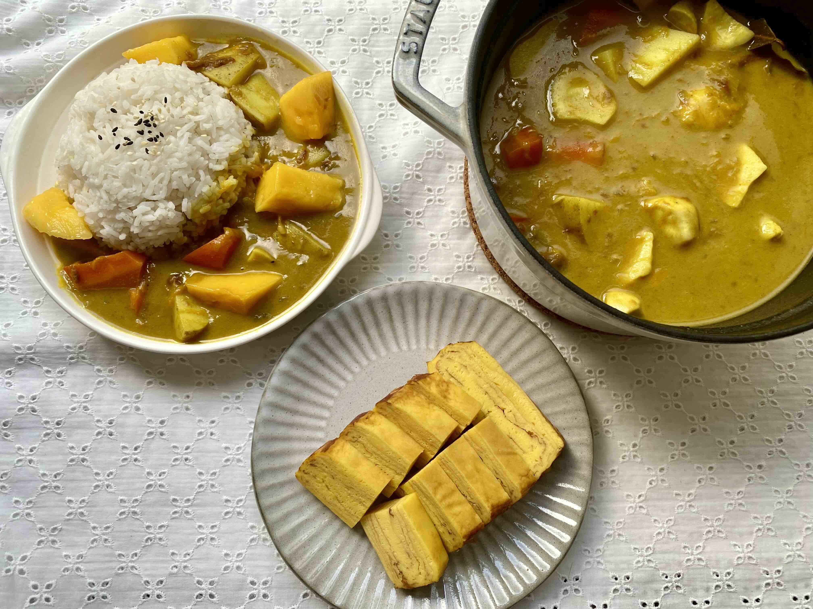
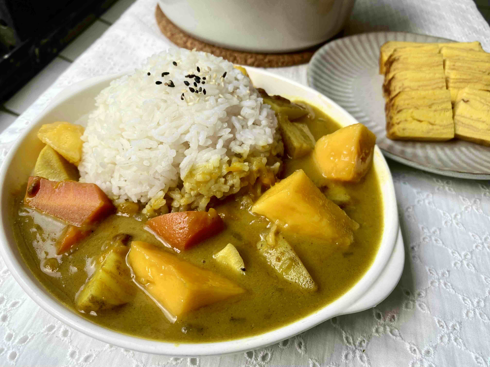
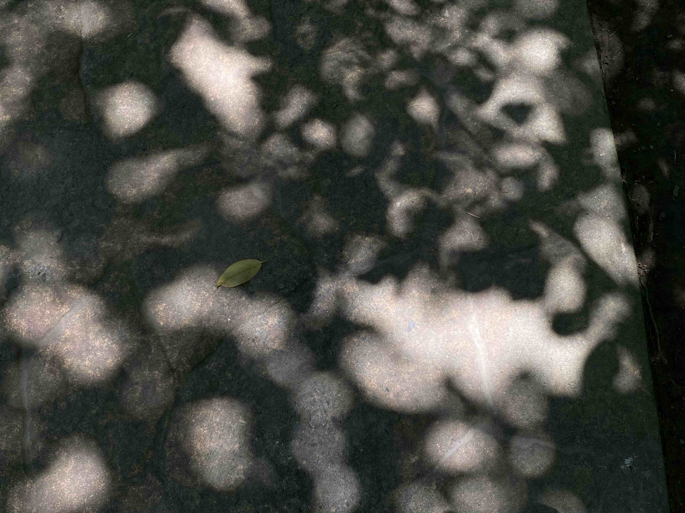
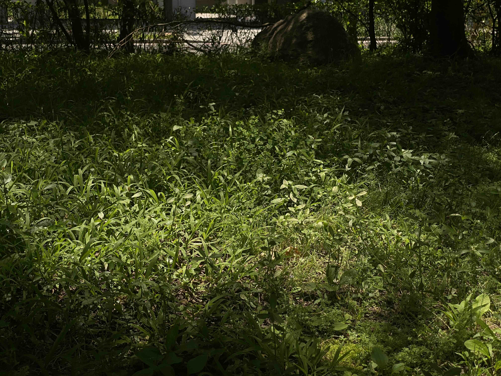
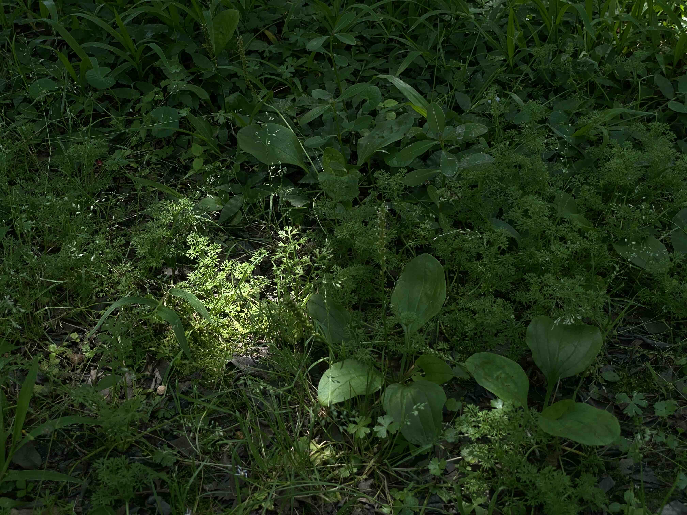
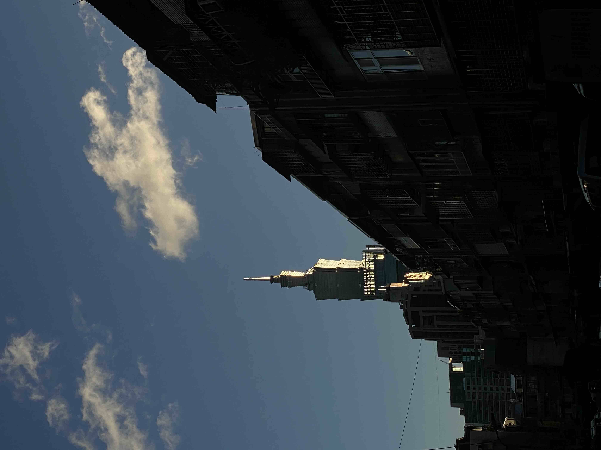
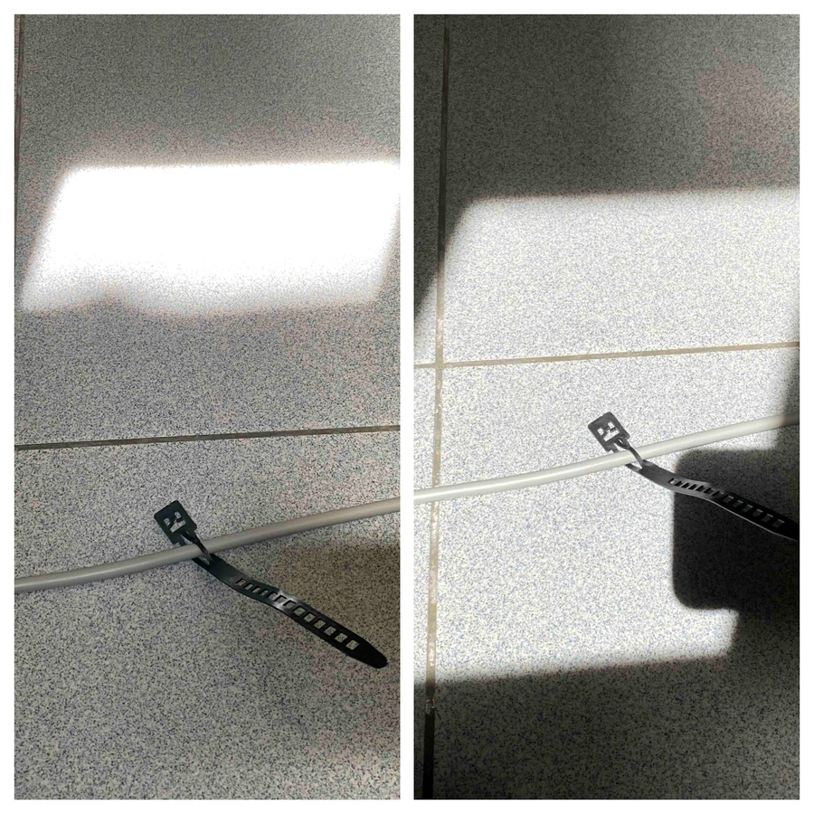

夏天如果是一個人，大概會被很多人討厭，因為很熱。
\
很熱如果是他的缺點，什麼是優點呢？

是很乾淨的，很清澈的天空。
\
每天傍晚，都有很精彩的風景。




### 料理風景

用夏天的水果做了咖哩，謝謝來自朋友們的禮贈。




--




### 光




光是十分鐘，太陽就移動了這麼多。
\
坐在窗邊看書時的發現。




<video width="100%" controls>
<source src="light.mov" type="video/webm">
</video>

有風

  <video width="100%" controls>
    <source src="shadow.mov" type="video/webm">
  </video>

<video width="100%" controls>
<source src="sunshine.mov" type="video/webm">
</video>

太陽經過玻璃的足跡




這個夏天，我活成一個安靜的植物，
\
順應氣溫，即便很熱也安靜坐著，繼續手邊工作，
\
要流汗就讓它流
\
盡量待在有樹、有風的地方。

我試著不與之抵抗，躲開最熾烈的時段，
\
等到太陽即將下山的時候，出門，看看天邊色彩的收束，夜色的降臨。



夏天是一個自由的季節，生命綻放，情緒奔騰。



