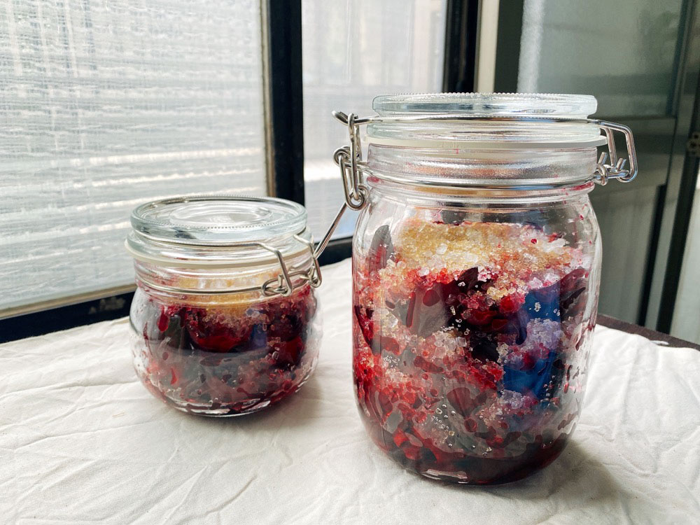

參考自知果堂的[食譜](https://www.ourtable.com.tw/zh-tw/live/detail.php?preid=2&catyid=2&tpid=32)，

在小農市集看到了新鮮的洛神花萼，手癢買了一些，農民說可以做果醬或蜜餞。

上網做了一些功課後，決定試試看步驟比較簡單的洛神蜜餞。

網路上有許多洛神蜜餞的食譜分享，大致上的流程都差不多：先去除花萼中的果實，接著清洗、殺青，只有一些細節上的差異。

[知果堂](https://www.ourtable.com.tw/zh-tw/live/detail.php?preid=2&catyid=2&tpid=32)的分享中，有人有殺青，也有人不殺青，看起來似乎沒有一定標準的做法，選擇自己最方便的就可以了。

> 我們經常食用的洛神「花」，其實是洛神花萼的部位。



---

### 【材料】

  <table>
    <tr>
      <td>洛神花萼*</td>
      <td>490g</td>
    </tr>
    <tr>
      <td>冰糖/砂糖</td>
      <td>490g</td>
    </tr>
    <tr>
      <td>檸檬汁（選）**</td>
      <td>1~2顆</td>
    </tr>
    <tr>
      <td>鹽巴（選）</td>
      <td>少許</td>
    </tr>
  </table>

\* 要用去除果實後的洛神來秤重喔。

\* 我看大部分的食譜花萼和糖的比例差不多是 1:1，怕太甜的話糖可以少一些。
\
至於要用什麼糖，就以依照個人喜好，冰糖、二砂糖、細砂糖都可以，
\
黑糖這種本身具有風味的糖盡量不要，可能會搶了洛神的香氣。

\*\* 檸檬汁和鹽巴都不是必備，但如果有，可以增加蜜餞的風味層次，不會只有單一的甜。



### 做法：

1. 清水先沖去洛神表面的灰塵。



2. 去除果實。

   花萼中一顆大大的是洛神的果實，表面有類似秋葵的細毛，建議可以戴手套，減少皮膚不適感。

   有人推薦用原子筆的筆管或是不鏽鋼吸管從屁股推，就可以去除果實，保留形狀完整的花萼，
   \
   我的手不巧，還是只能從旁邊撕開。






3. 加強清潔：可以用牙刷輕輕刷去洛神表裡的灰塵。



4. 滾水殺青

和做泡菜一樣，洛神也要先經過殺青的步驟。
\
 販售的農夫告訴我用滾水燙五秒，但網路上有人沒殺青，有人用鹽巴殺青，也有人既過滾水也用鹽巴。
\
 我查到[夢幻廚房在我家](https://dreamchefhome.com/%E6%B4%9B%E7%A5%9E%E8%8A%B1%E8%9C%9C%E9%A4%9E/)對殺青有比較詳細的說明，不論是滾水川燙或是鹽巴脫生都可以。
\
 我是選擇用滾水川燙。

從這裡開始都不要碰到生水喔，不然有可能失敗。



5. 風乾。

讓花萼表皮的水分稍微吹乾一下，比較不容易發霉。






6. 容器消毒

用酒精將要使用的容器和器具消毒擦拭過。



7. 開始製作

以一層洛神、一層糖的順序放入容器，讓糖平均分佈。最後要封蓋前，再鋪上一層糖。
\
我家的冰糖不夠，就混入了一些二砂糖和細砂糖。










8. 等待

接下來就是等待了。
\
大約放置 2-3 天即可，過程中可以搖晃瓶子，讓糖分盡量融化，之後就可以移入冰箱冷藏保存。

才剛封蓋沒多久，就觀察到罐中的洛神高度明顯下降。














---





大約放了三天後我就開蓋試吃，味道有一點偏甜，但是很不錯！清脆爽口。

單吃可能會有點膩，搭配吐司很剛好！

看來如果要直接吃，糖量可以再減少一些。
