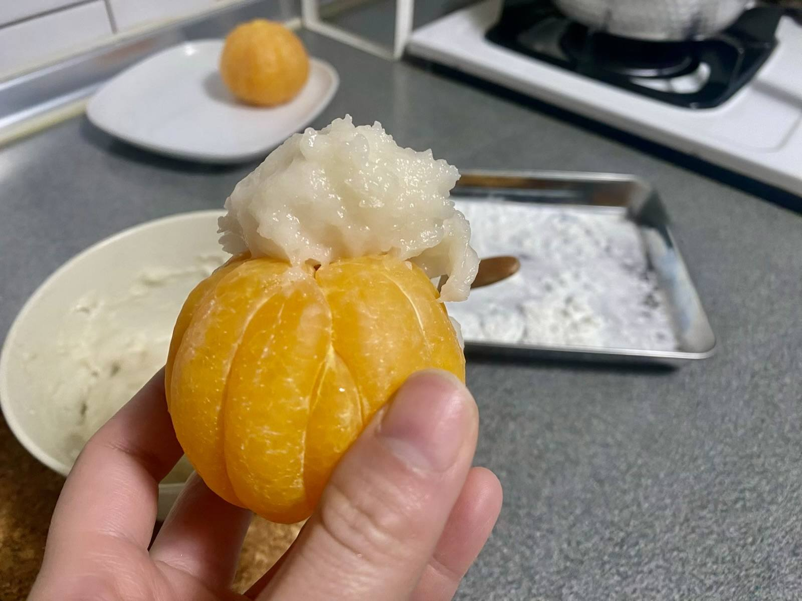
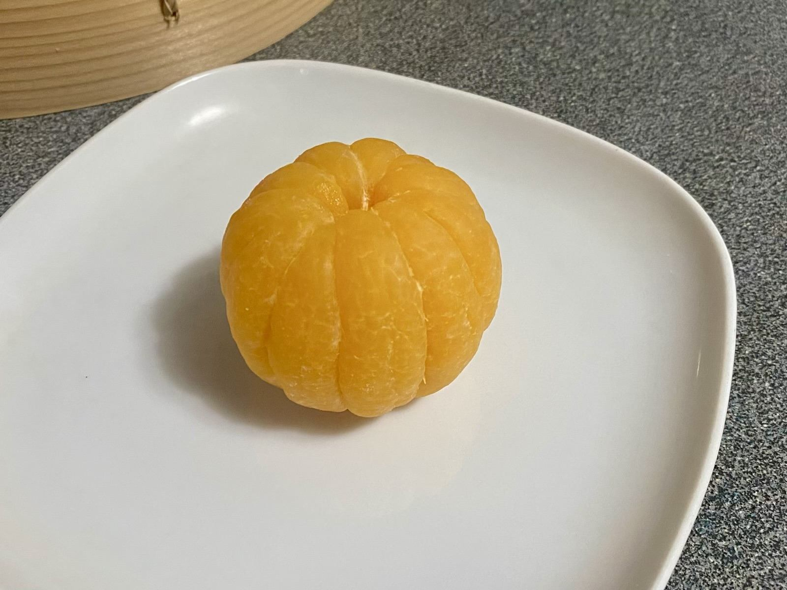
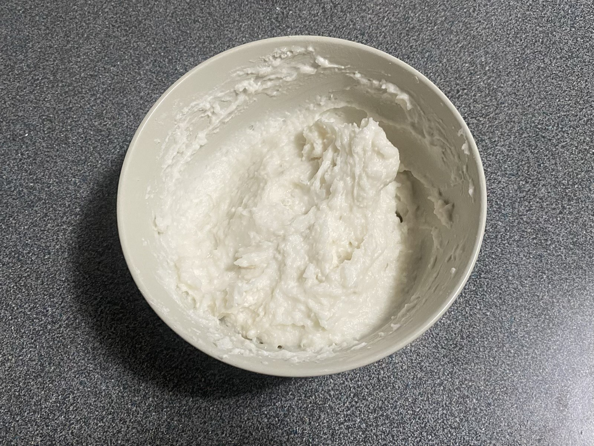
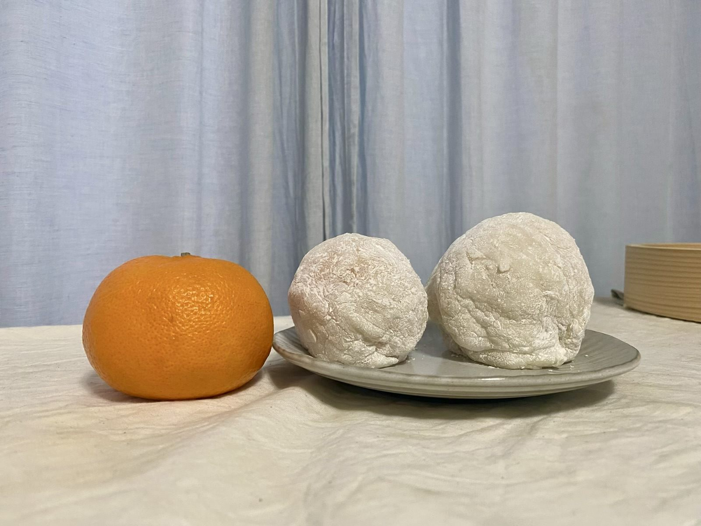
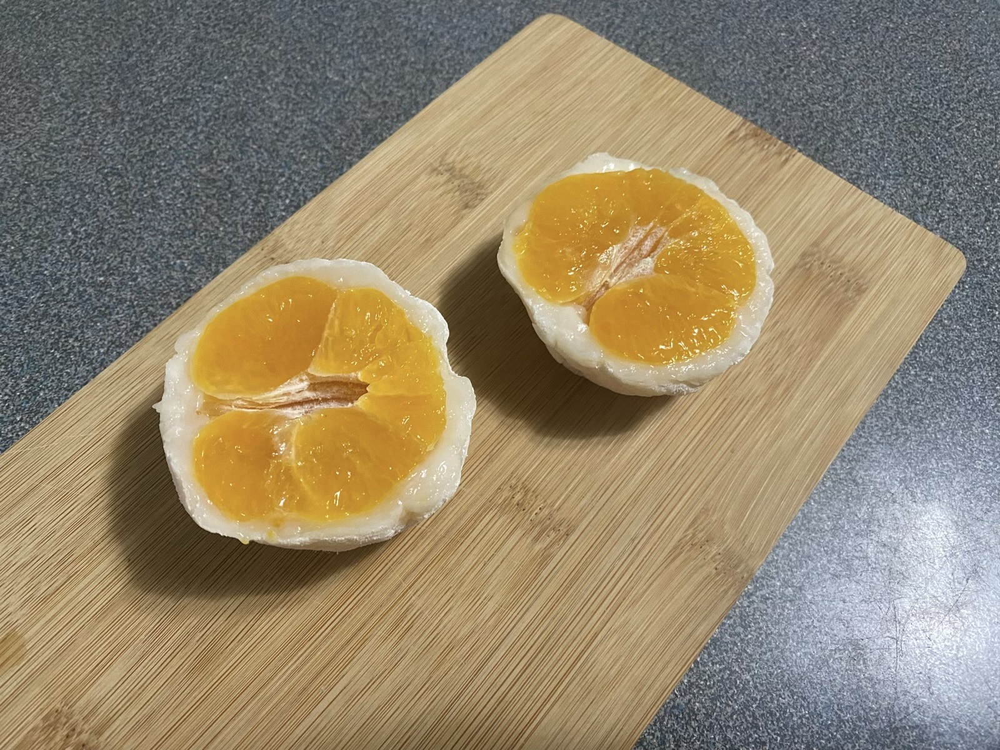
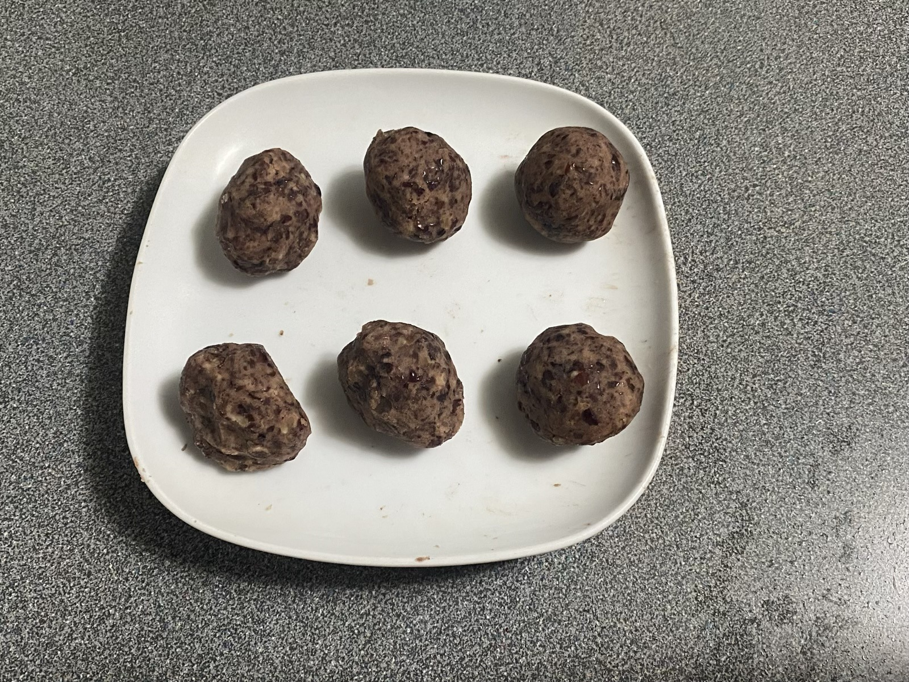
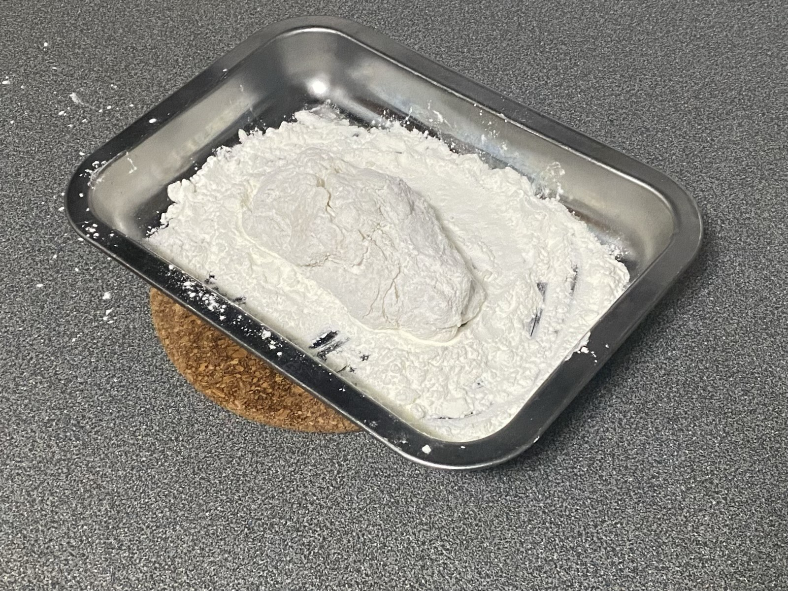
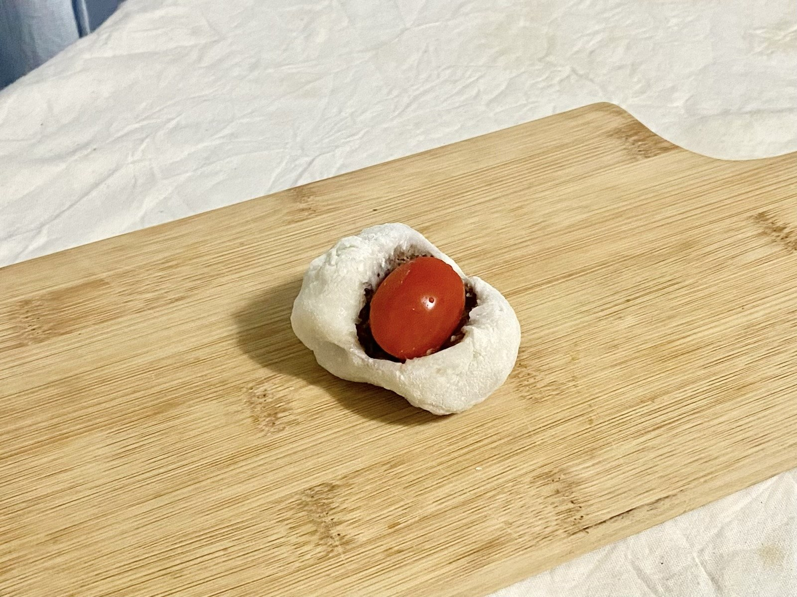
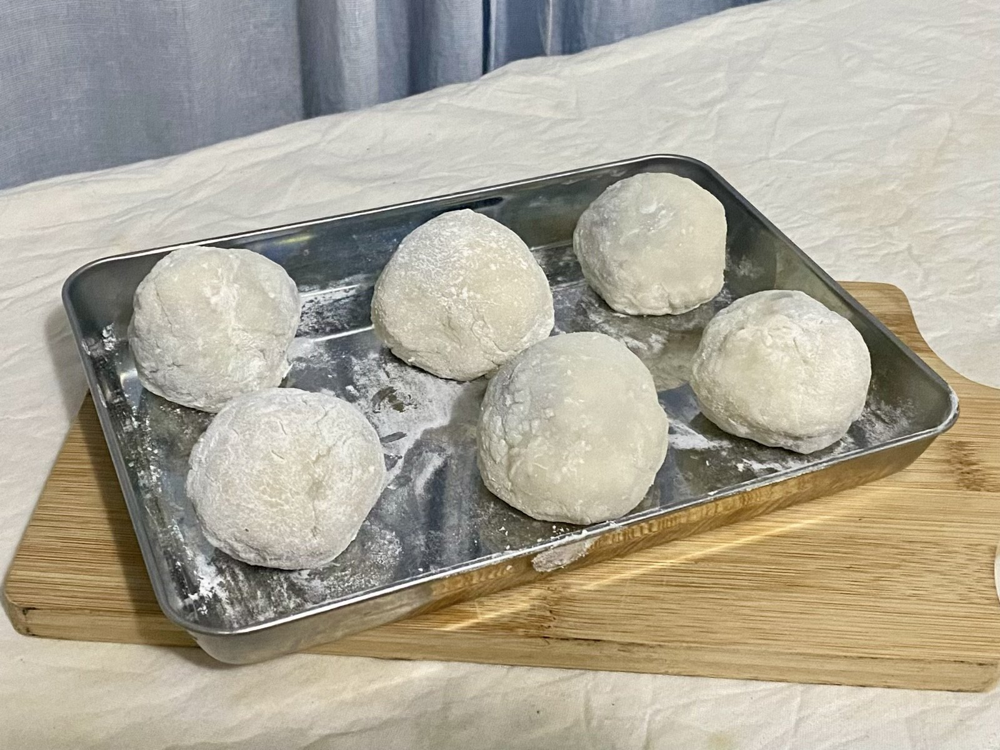

> 參考自[盧怡安的貼文分享](https://www.facebook.com/millio.lu/posts/pfbid02zJ1qdaqw3kBMeBCoyGyR1pma5QmNFTGHJUE741WDzSiG7rtVcgkAsF169tKcM8cgl)、[日本男子的日式家庭料理](https://www.youtube.com/watch?v=kh7fnQMfnT8&ab_channel=%E6%97%A5%E6%9C%AC%E7%94%B7%E5%AD%90%E7%9A%84%E6%97%A5%E5%BC%8F%E5%AE%B6%E5%BA%AD%E6%96%99%E7%90%86TASTYNOTE)

某天突然看到[盧怡安的貼文分享](https://www.facebook.com/millio.lu/posts/pfbid02zJ1qdaqw3kBMeBCoyGyR1pma5QmNFTGHJUE741WDzSiG7rtVcgkAsF169tKcM8cgl)，發現原來大福製作其實很簡單，心血來潮，拿家裡剛好有的橘子來試做看看。



---

#### 怡安的食譜做法



怡安的做法會先把橘子煮過，仔細去除纖維，同時把混合好的粉類原料拿去蒸熟後，再進行組裝。



#### 【材料】

  <table>
    <tr>
      <td>糯米粉</td>
      <td>85g</td>
    </tr>
    <tr>
      <td>熱水</td>
      <td>170g</td>
    </tr>
    <tr>
      <td>糖粉</td>
      <td>少許</td>
    </tr>
    <tr>
      <td>太白粉</td>
      <td>兩湯匙</td>
    </tr>
    <tr>
      <td>茂谷柑</td>
      <td>一顆</td>
    </tr>
  </table>



#### 做法：

1.  茂谷柑浸在滾水中五分鐘，再冰鎮五分鐘後，剝去外皮備用






2.  糯米粉與熱水拌勻，加入少許糖粉，大火蒸十分鐘後放涼
    

3.  太白粉或玉米粉進烤箱，一百度左右烤十分鐘，成為手粉
    \
    \* 因為太白粉或玉米粉是生的，需要先烤熟

4.  在砧板上鋪上手粉，將蒸好的糯米糰子舀一大湯匙出來，沾上手粉就能不黏
    

5.  用糯米糰子將整顆蜜柑包起來
    

6.  包好的蜜柑大福可以橫切（然後挑掉中心的種籽），就可以享用了
    



在用糯米團子將蜜柑包起的過程，手黏得到處都是，可能手粉準備的不夠充足，
\
以至於最後的大福表皮也皺皺的，不是很好看。



繼續搜集更多參考資料後，決定換個方式再嘗試一次。

這次趕緊到巷口超市買了現成蜜紅豆，沒有草莓或葡萄也沒關係，
\
熱愛紅豆的我，可以接受只有紅豆餡，
\
總之打鐵要趁熱，先做再說。

--



#### 日本男子的日式家庭料理的食譜做法


[日本男子的日式家庭料理](https://www.youtube.com/watch?v=kh7fnQMfnT8&ab_channel=%E6%97%A5%E6%9C%AC%E7%94%B7%E5%AD%90%E7%9A%84%E6%97%A5%E5%BC%8F%E5%AE%B6%E5%BA%AD%E6%96%99%E7%90%86TASTYNOTE)的做法則是直接在鍋子把粉和水拌勻、煮熟，不用經過蒸籠。



#### 【材料】

  <table>
    <tr>
      <td>草莓</td>
      <td>六個</td>
    </tr>
    <tr>
      <td>紅豆泥</td>
      <td>180g</td>
    </tr>
    <tr>
      <td>白玉粉(糯米粉)</td>
      <td>80g</td>
    </tr>
    <tr>
      <td>砂糖</td>
      <td>30g</td>
    </tr>
    <tr>
      <td>水</td>
      <td>100ml</td>
    </tr>
  </table>



#### 做法：

1. 先將紅豆泥平分成六份，分別搓圓
   \
    \*要包入水果的話，先把水果包入紅豆泥再搓圓
   

2. 太白粉先用低溫烤過或微波過
3. 在鍋子中倒入白玉粉、砂糖和水，開中小火，慢慢攪拌至成麻糬的狀態
   
   
   
   

4. 將麻糬放到裝有太白粉的盤子上，防沾黏，並分成六份
   

5. 開始包餡：
   \
    a. 方法一：麻糬壓平，放入紅豆泥，包起
   
   
   
   \
    b. 方法二：只包入紅豆泥，捏好後用剪刀在頂端開一刀，再放上草莓等水果

   





比較這兩種做法，我覺得都很簡單，
\
困難的部分是，如何不用太多手粉地把大福包得漂亮。

即使我在蜜柑版本後緊接著做了第二次，知道包裹步驟的困難，還是無法包得很漂亮 😅



無論哪一種做法，備料和製作過程都不需要花太多時間，只要家中有材料，甚至臨時起意都可以，
\
不過事後的清洗卻也花了與製作過程差不多一樣的時間，
\
原因是放置糯米糰子的容器實在是太黏了，需要花點時間洗刷整理。



總而言之，自己做的東西至少都有六十分！
\
下次再接再厲，要包得更漂亮。
