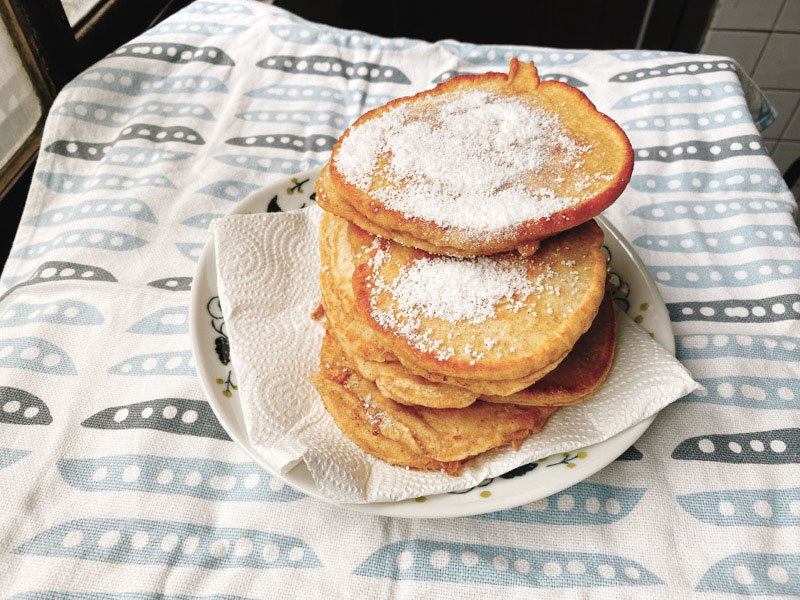

常見的鬆餅食譜，多是使用現成鬆餅粉和牛奶，香氣撲鼻，我也非常喜歡。
\
這次介紹的是自己使用麵粉和早餐常見的無糖五穀粉，加上無糖豆漿製作的無添加原味鬆餅，
\
製作出來的結果沒什麼味道，很仔細吃才會聞到淡淡的五穀粉香味，比一般原味的鬆餅還清淡（真的很淡喔！），要吃的時候可以再依個人口味淋上蜂蜜或者其他配料。

---

### 【材料】

  <table>
    <tr>
      <th></th><th>五穀粉豆漿鬆餅</th>
    </tr>
    <tr>
      <td>低筋麵粉</td>
      <td>300g</td>
    </tr>
    <tr>
      <td>無糖豆漿</td>
      <td>300g</td>
    </tr>
    <tr>
      <td>五穀粉</td>
      <td>30g</td>
    </tr>
    <tr>
      <td>雞蛋</td>
      <td>2顆</td>
    </tr>
    <tr>
      <td>砂糖</td>
      <td>少許</td>
    </tr>
    <tr>
      <td>奶油</td>
      <td>少許</td>
    </tr>
  </table>



做法：

1. 將低筋麵粉和五穀粉混合，加入無糖豆漿拌勻

2. 打入兩顆雞蛋攪拌均勻

3. 加入少許砂糖拌勻

4. 開小火，加入少許奶油，倒入適量麵糊，煎至兩面上色即可。
\
全程維持小火，避免燒焦。




