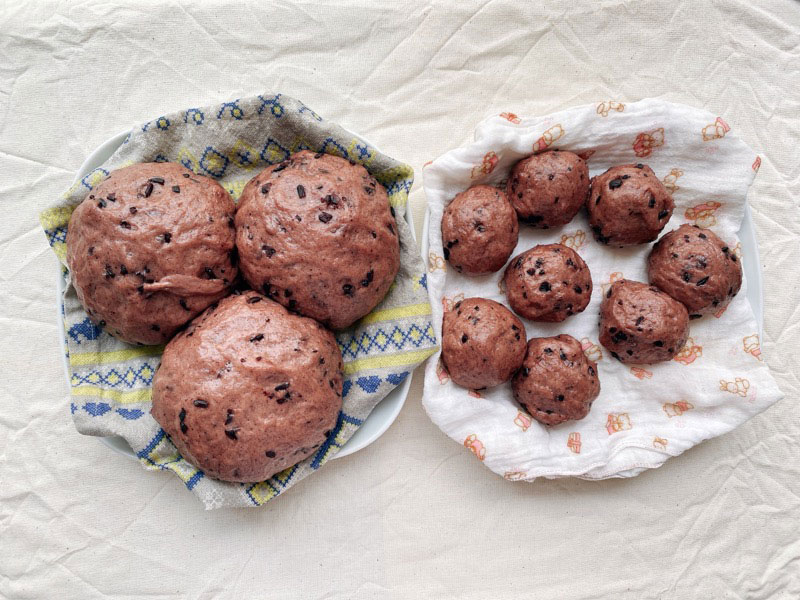

參考自Carol的[紫米桂圓食譜](https://caroleasylife.blogspot.com/2008/06/blog-post_14.html)，份量減半並移除不喜歡的桂圓(=´ᴥ`)

我們家只有大同電鍋，所以以下是使用大同電鍋的步驟分享。

---

份量：約做7個

### 【材料】（中種法）

  <table>
    <tr>
      <th>(A)中種麵糰</th><th></th>
    </tr>
    <tr>
      <td>中筋麵粉</td>
      <td>125g</td>
    </tr>
    <tr>
      <td>冷水</td>
      <td>75ml</td>
    </tr>
    <tr>
      <td>速發酵母</td>
      <td>1/2茶匙</td>
    </tr>
  </table>

  <table>
    <tr>
      <th>(B)主麵糰</th><th></th>
    </tr>
    <tr>
      <td>中筋麵粉</td>
      <td>130g</td>
    </tr>
    <tr>
      <td>煮熟紫米</td>
      <td>75g</td>
    </tr>
    <tr>
      <td>鹽巴</td>
      <td>1/16茶匙</td>
    </tr>
    <tr>
      <td>奶粉</td>
      <td>10g</td>
    </tr>
    <tr>
      <td>細砂糖</td>
      <td>15g</td>
    </tr>
    <tr>
      <td>泡紫米的水*</td>
      <td>20g</td>
  </table>

\* 因為我沒有加油，所以放了一點泡紫米的水調整濕度，可以是最後麵團濕度判斷是否使用。

\*\* 煮好的紫米本身就有一些濕度，建議依照實際操作狀態調整紫米或麵粉使用量，太黏手就增加麵粉量，太乾的話可以增加紫米或是加入紫米水。



### 預備動作
1. 紫米先沖洗乾淨並泡水靜置一晚，夏天氣溫高建議放冰箱冷藏
2. 紫米要煮得比一般使用偏乾一點，煮熟後放涼備用，此份量煮熟後大約可以做兩次饅頭
3. 最後一次泡紫米的水可以留著，後面麵團如果太乾可以視情況添加

### 做法：

(A) 中種麵糰
1. 將冷水倒入麵粉及乾酵母中，攪拌搓揉成為一個光滑不黏手的麵團

2. 放入盆中，蓋上濕布發酵至2倍大，發酵時間依氣溫略有不同，夏天大約2~3小時



(B) 主麵糰
1. 將已經發酵2倍大的中種麵團加入主麵團所有材料，攪拌搓揉8-10分鐘，成為有彈性又不黏手的麵團
\
 若是手揉麵團，可以先將材料混合至不見乾粉狀，蓋上濕布鬆弛10分鐘，再繼續揉麵，會比較省力

2. 桌上灑一些手粉將麵團移出，將麵團分成7個（每個約60g）

3. 每份小麵團由外往內折起壓揉，然後收口、搓圓搓高

4. 將滾圓的麵團底部墊不沾烤焙紙，整齊放入蒸籠或盤子

5. 二次發酵：蓋上濕布放置室溫等待30分鐘，若氣溫低，可以將麵團和一杯溫水一起放入不運作的烤箱或微波爐，製造發酵的環境。若烤箱有發酵功能當然可以直接使用。

6. 電鍋外鍋先倒水加熱，微微開始冒泡後再將麵團放入，蒸10~12分鐘。

7. 時間到就鬆開開關，停止繼續加熱，等待5分鐘後，再慢慢掀蓋子，讓鍋內鍋外的溫差慢慢平衡，可以減少皺皮的機會。






















