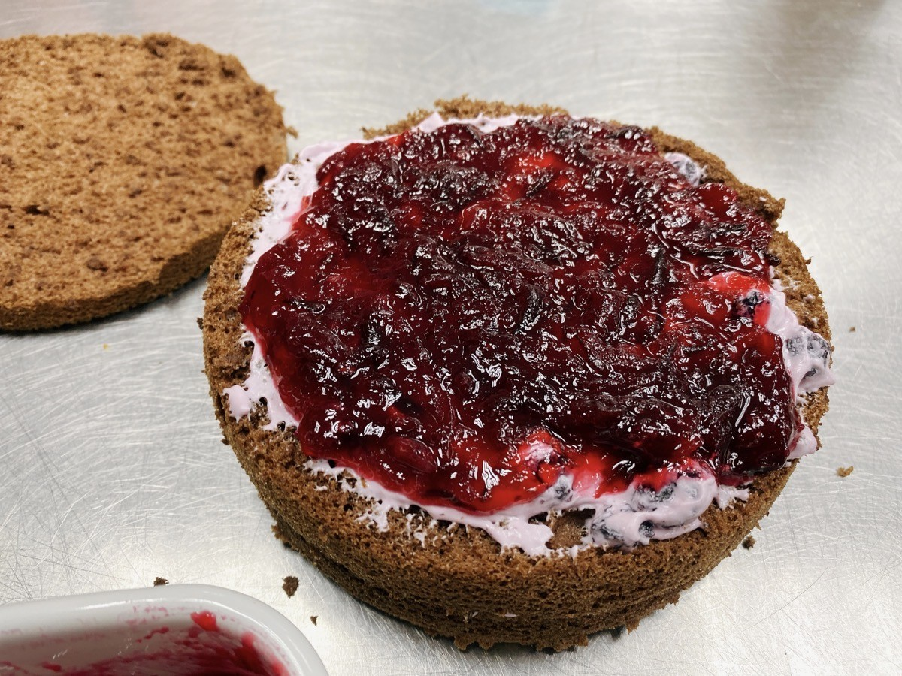

參考自[台灣好農部落格](https://blog.wonderfulfood.com.tw/2021/12/01/diy%E6%B4%9B%E7%A5%9E%E8%8A%B1%E6%9E%9C%E9%86%AC%EF%BC%8C3%E6%AC%BE%E6%96%B0%E9%AE%AE%E5%90%83%E6%B3%95/)，

從朋友那獲得了四斤多的洛神，冰箱太小無法保存，只好與時間賽跑，趁新鮮製作成果醬，延長保存與實用效期。

> 我們經常食用的洛神「花」，其實是洛神花萼的部位。



---

### 【材料】

  <table>
    <tr>
      <td>洛神花萼</td>
      <td>916g</td>
    </tr>
    <tr>
      <td>果實</td>
      <td>621g</td>
    </tr>
    <tr>
      <td>二砂糖*</td>
      <td>540g</td>
    </tr>
    <tr>
      <td>檸檬汁</td>
      <td>半顆</td>
    </tr>
  </table>

\* 研究了一些網路上的食譜，有人是用完整的洛神重量來計算糖的使用量，有人則是使用去除果實後花萼的淨重計算，無論哪一種都可以，記得看清楚就好了。
\
而我是參考去除果實後花萼淨重的六成左右為糖的使用量。
\
這個比例煮出來的果醬偏酸，沒有很明顯的甜味，但比較耐吃。



### 做法：

1. 清水先沖去洛神表面的灰塵。



2. 去除果實。

   花萼中一顆大大的是洛神的果實，表面有類似秋葵的細毛，建議可以戴手套，減少皮膚不適感。

3. 加強清潔：可以用牙刷輕輕刷去洛神表裡的灰塵。








4. 熬煮果實：果實含有膠質，可增加果醬濃稠度。
   \
   在鍋中倒入淹過果實高度的水，煮滾之後將果實瀝出。






有人建議將果實切半或拍裂後再煮，但我切一半就累了，剩下的部分直接放鍋裡煮。
\
感覺也是有將膠質煮出來，因為觀察到果實原本的皮變薄了，可以微微透光看到果實內部的種子。



5. 加入花萼

剛加入花萼時會覺得水分不夠，這時候請用左手按住右手，不要太衝動加水。

因為花萼會慢慢變軟，如果太早加水，會讓果醬變稀，增加熬煮的時間。

如果煮了一陣子還使覺的水分不夠再分次慢慢添加。

我就是太早加水了，害我煮好久，水分一直很難收乾，沒有達到夠理想的稠度。





6. 加入糖和檸檬汁



7. 容器消毒

用酒精將要使用的容器和器具消毒擦拭過。



8. 裝瓶

等果醬熬煮到理想的濃度後，就可以裝瓶。

裝滿之後，要轉緊蓋子並倒扣放涼，減少瓶中空氣，製造接近真空的狀態，

置於在陰涼處，在未開封狀態下可保存三個月左右。

之後每次食用，要記得用乾淨的湯匙挖取。





---





隔天我就開挖一小部分，抹在蛋糕中間當內餡，嚐起來偏酸，但是更耐吃。
