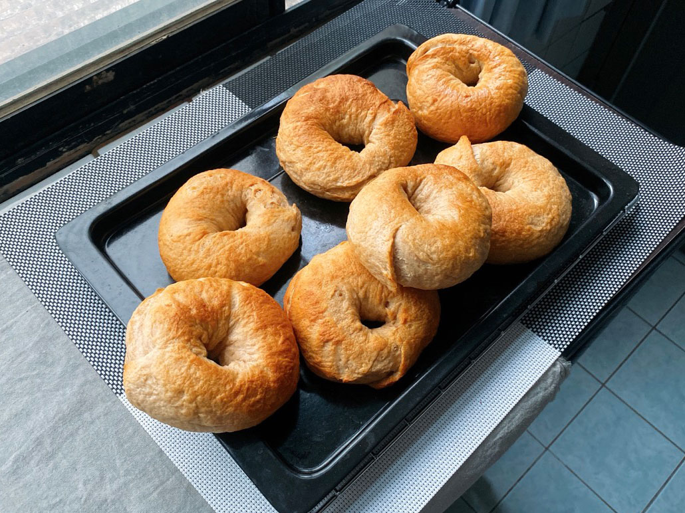
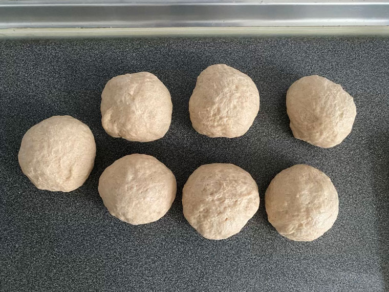
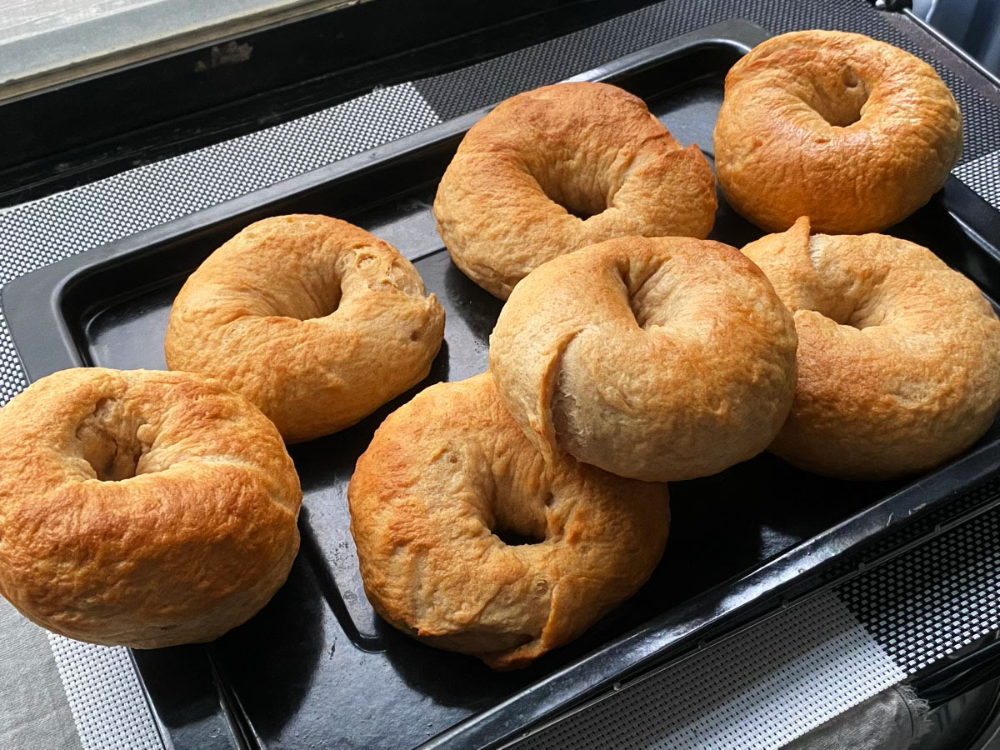

我的口味偏清淡、天然，都是參考網路上一些低油低糖的食譜，習慣把一部份高筋麵份以全麥取代，
\
可能與外面店家販賣的味道比較不一樣，習慣外食口味的人可能會不太習慣。

我蠻喜歡把食譜中的水替換成牛奶或豆漿，自己吃嘛，奢侈一點試試看。
\
但還是要注意濕性材料與乾性材料的比例，製作過程中觀察發酵變化及麵團濕度，
\
若濕度黏度不對，要適時調整比例。

---

【中種法】

  <table>
    <tr>
      <th></th><th>A.中種麵糰</th><th>B.主麵糰</th>
    </tr>
    <tr>
      <td>高筋麵粉</td>
      <td>50g</td>
      <td>325g</td>
    </tr>
    <tr>
      <td>全麥麵粉</td>
      <td>150g</td>
      <td>-</td>
    </tr>
    <tr>
      <td>細砂糖</td>
      <td>-</td>
      <td>40g</td>
    </tr>
    <tr>
      <td>鹽巴</td>
      <td>-</td>
      <td>8g</td>
    </tr>
    <tr>
      <td>原味無糖優格</td>
      <td>160g</td>
      <td>165g</td>
    </tr>
    <tr>
      <td>水</td>
      <td>-</td>
      <td>25g</td>
    </tr>
    <tr>
      <td>速發酵母</td>
      <td>5g</td>
      <td>-</td>
    </tr>
  </table>



做法：

1. 首先混合**A.中種麵糰**材料，揉捏成團後，蓋上濕布，靜置發酵2小時
   








2. 加入**B.主麵團**的材料，並且揉至出筋

3. 分割、滾圓，麵團蓋上濕布，鬆弛20分鐘

4. 每個小麵團桿成長條狀後，包入餡料，塑形
   




5. 煮一大鍋水，加入約15公克砂糖，煮沸後轉小火，將貝果放入，每面燙煮40秒。
   燙越久口感越有嚼勁。
   瀝乾水分起鍋，每顆貝果可以墊一片烘焙紙，防止沾黏。
   




6. 烤箱預熱220度，烤14~16分鐘，中途烤盤可掉頭。至表面金褐色即可出爐。
   




出爐啦～
\
我揉的很醜，但優格味很濃，可惜了全麥麵粉的角色。




